#  026：思维链方法 🧠

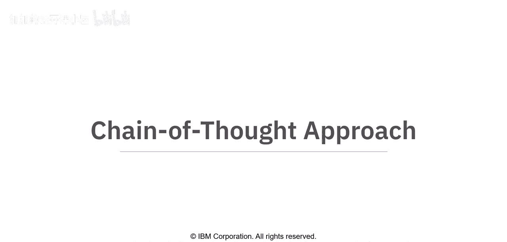

在本节课中，我们将要学习**思维链**方法。这是一种引导生成式AI模型进行复杂推理的技术。通过将问题分解为一系列小步骤，模型能够展示其思考过程，从而提高答案的准确性和可解释性。

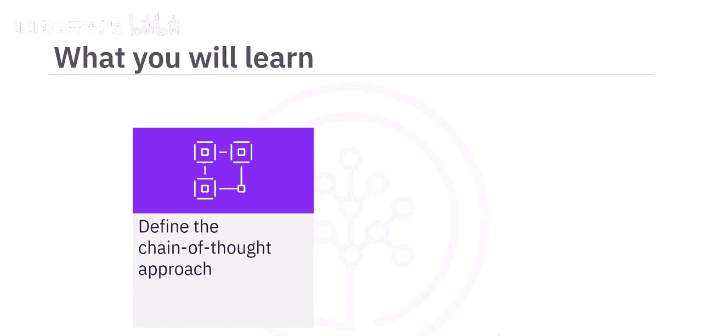

---

## 什么是思维链方法？

思维链方法是一种通过一系列提示或问题，将困难或复杂的任务分解为更小、更易管理的步骤的方法。

每个提示都建立在前一个提示的基础上，引导AI模型逐步思考问题，并生成期望的回应。这种方法使模型能够展示其推理过程，并提高其准确解决类似问题的能力。

通过向模型提供问题及其解决方案，思维链帮助模型以结构化和逻辑化的方式处理任务。

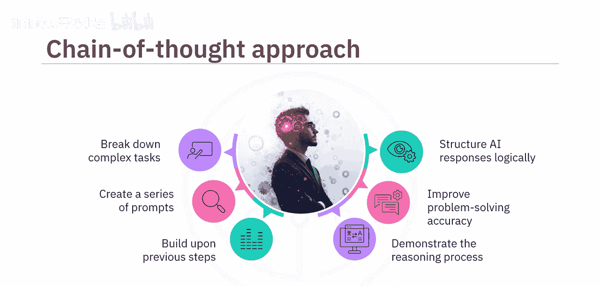

---

## 思维链方法的应用与优势

上一节我们介绍了思维链的基本概念，本节中我们来看看它为何在生成式AI中被广泛应用。

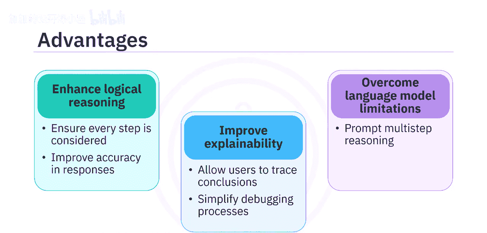

该方法之所以被广泛使用，是因为它能增强逻辑推理能力，并确保过程中的每一步都被考虑到，从而得到更准确的结果。它还能提高可解释性，允许用户追溯AI得出结论的过程，并简化调试。此外，它有助于克服语言模型的局限性，因为语言模型本身并非为多步推理而设计，除非被提示。

---

## 思维链的两种主要模型

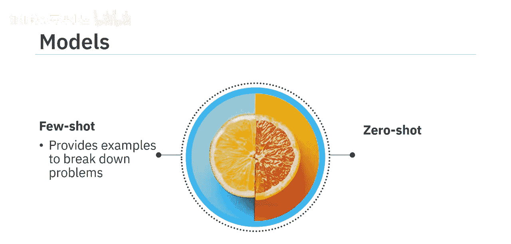

思维链建模中最常见的两种模型是**少样本思维链**和**零样本思维链**。

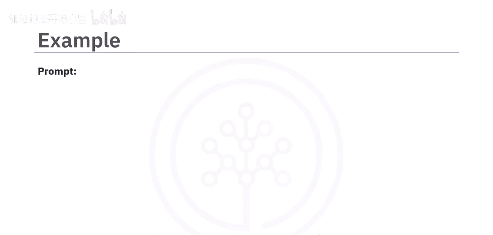

*   **少样本思维链**：提供示例来展示如何分解问题。
*   **零样本思维链**：鼓励模型独立地逐步思考问题。

---

## 示例解析：少样本思维链

以下是少样本思维链方法的应用示例。

我们从一个示例问题开始：一家商店以每个3美元的价格出售橙子，并提供“买二送一”的优惠。

解决方案通过以下步骤展开：
1.  认识到每第三个橙子是免费的，所以三个橙子的成本相当于支付两个的钱。
2.  扩展这个逻辑，六个橙子的成本相当于四个，即12美元。

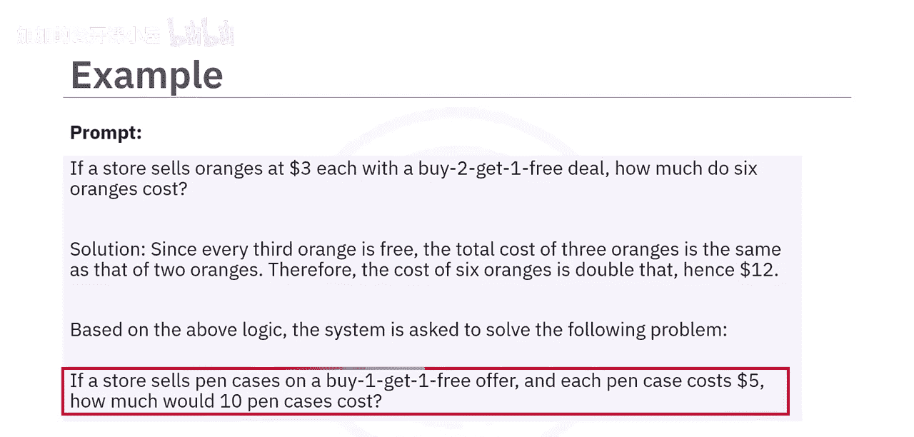

现在，系统被给予一个类似的问题。这次的问题是：一家商店以每个5美元的价格出售笔袋，并提供“买一送一”的优惠。使用相同的思维链推理，系统首先理解优惠结构，然后根据提示中提供的示例推理生成回应。因此，它能够得出正确答案：10个笔袋的成本将是25美元，因为其中只有5个需要付费。

---

## 示例解析：零样本思维链

上一节我们看了有示例引导的少样本方法，本节中我们来看看零样本方法如何运作。

在零样本方法中，不提供任何示例，而是鼓励系统独立找出答案。提示中会添加诸如“让我们一步步思考”或“让我们一步步解决这个问题以确保答案正确”等短语，以帮助系统独立推导出解决问题的方法。

让我们以同样的笔袋问题为例，看看如何使用零样本方法解决。

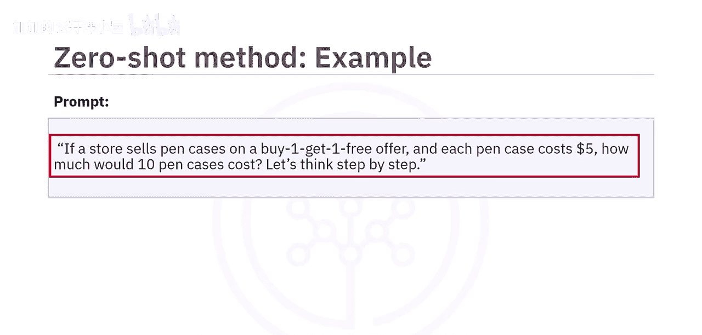

提示如下：“如果一家商店以‘买一送一’的优惠出售笔袋，每个笔袋5美元，那么10个笔袋要花多少钱？让我们一步步思考。”

在这种情况下，系统不依赖事先的样本或示例。相反，它尝试自己推理问题。它首先解释优惠，理解每两个笔袋，顾客只需支付一个的钱。

然后它将这种理解应用于问题。它将10个笔袋分成5个“付费+免费”的对，意识到只需要为5个笔袋付费，并计算出总价为25美元。

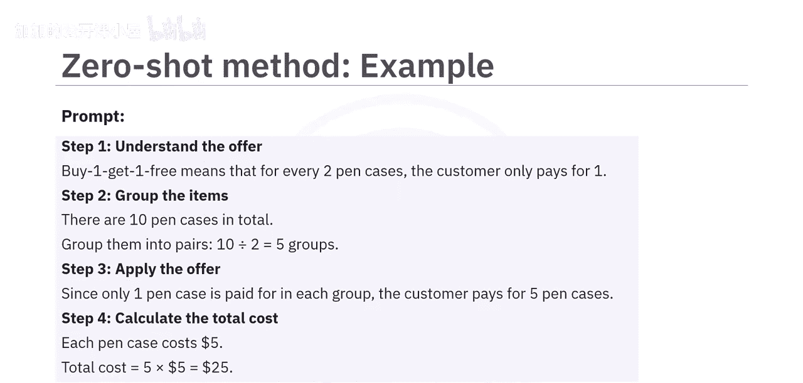

因此，即使没有先看到示例，系统也能够一步步地推演逻辑，并得出正确答案。

---

## 思维链方法的挑战

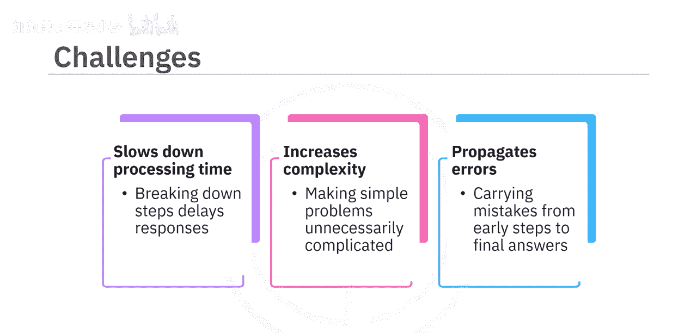

尽管思维链方法有诸多优势，但也存在一些挑战需要考虑。

将回应分解为步骤可能会减慢模型速度，这对于聊天机器人等需要快速响应的应用可能并不理想。此外，这种方法可能使简单问题变得不必要的复杂，让AI显得效率低下。早期步骤中的错误可能会延续下去，导致最终答案错误。

---

## 总结

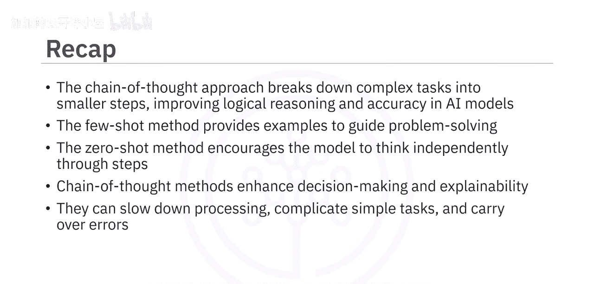

本节课中我们一起学习了思维链方法。我们了解到，思维链方法通过将复杂任务分解为更小的步骤，提高了AI模型的逻辑推理能力和准确性。两种主要的思维链方法是：提供示例以指导问题解决的**少样本思维链**，以及鼓励模型独立逐步思考的**零样本思维链**。虽然思维链增强了决策能力和可解释性，但它也可能减慢处理速度、使简单任务复杂化，并可能延续早期步骤的错误。