生成式AI提示工程：P27：思维树方法 🌳

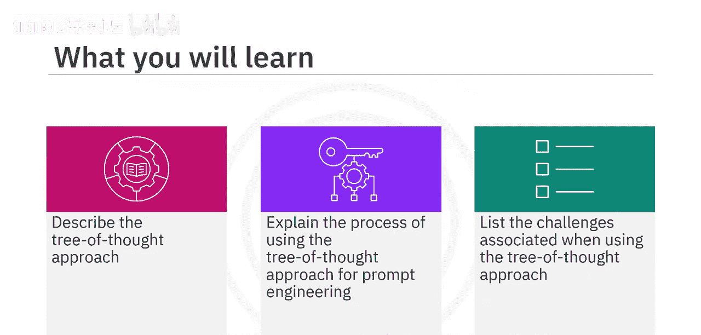

在本节课中，我们将要学习一种名为“思维树”的高级提示工程方法。这种方法通过结构化思考，帮助生成式AI模型更有效地解决复杂问题。我们将了解其核心概念、应用过程，并通过实例分析其优势与挑战。


## 思维树方法概述

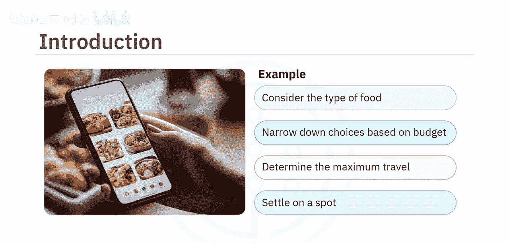

思维树方法通过将提示结构化为一个具有层级分支的树，来增强AI的推理能力。每个分支代表不同的思考路径。它允许AI同时评估多种可能性，权衡潜在结果，并聚焦于最有希望的选项。这项技术通过提供明确的指导和探索多种解决方案，对解决复杂问题非常有价值。


## 思维树方法的工作原理

上一节我们介绍了思维树方法的基本概念，本节中我们来看看它的工作原理。想象一下，你和朋友需要决定去哪里吃饭。首先，你们会考虑想吃什么类型的食物。然后，会根据预算和愿意出行的距离来缩小选择范围。最后，你们会选定一个符合口味和偏好的地点。这就是思维树方法在现实中的一个例子。

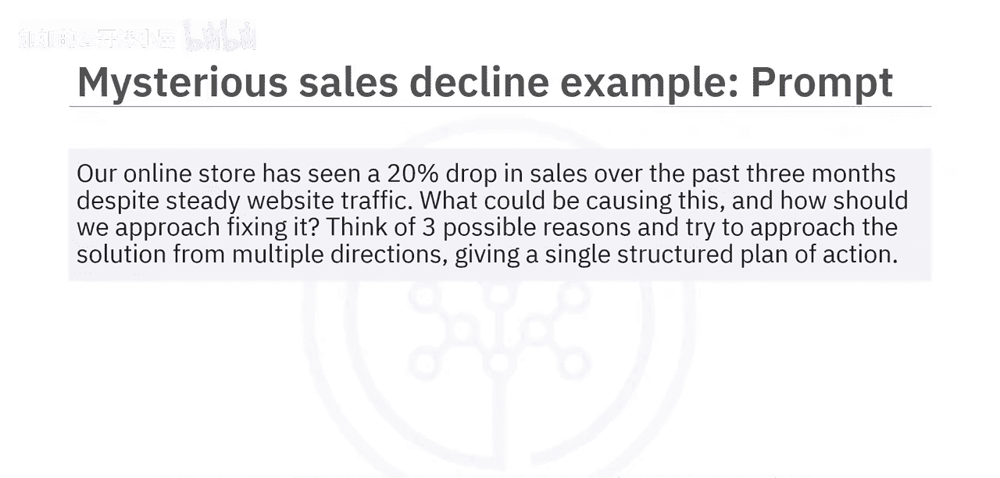

在AI提示工程中，这个过程被形式化。模型被引导去探索多个推理路径（即“分支”），并行评估它们，然后综合出一个结构化的行动计划。这模仿了人类专家处理复杂、多层面问题的方式：测试并行假设，排除较弱选项，并构建全面的解决方案。


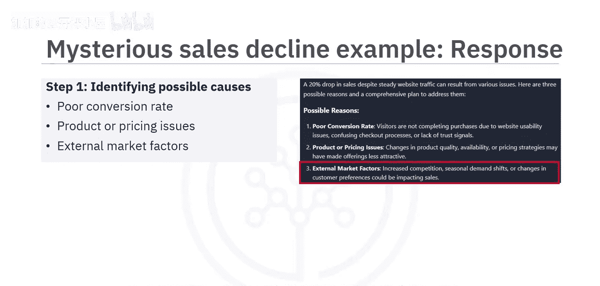

## 思维树方法应用实例

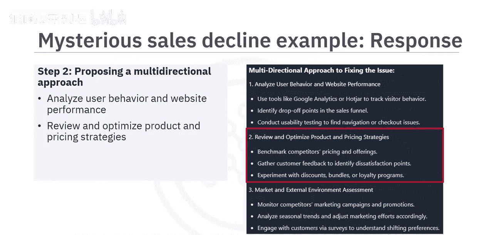

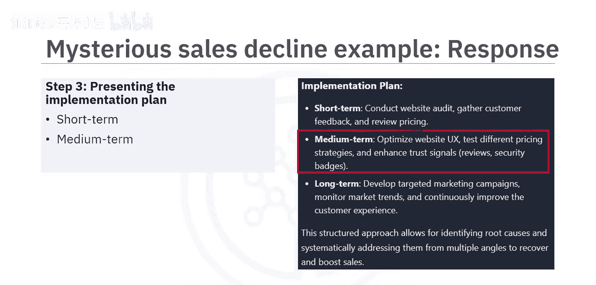

以下是思维树方法在实际问题中的应用示例，我们将通过两个场景来具体说明。

**场景一：在线商店销售下滑分析**

假设一个在线商店在过去三个月销售额神秘下降了20%，但网站流量保持稳定。我们可以使用以下提示来引导AI分析：

```
我们的在线商店在过去三个月销售额下降了20%，但网站流量保持稳定。可能是什么原因导致的？我们应该如何解决？请思考三种可能的原因，并从多个方向探讨解决方案，最终给出一个结构化的行动计划。
```

AI模型的响应会遵循思维树结构：
1.  **识别原因**：模型会首先列出三种最可能的原因，例如：转化率低、产品或定价问题、外部市场因素。
2.  **多方向策略**：针对每个主要原因，模型会提出相应的解决策略。
3.  **结构化计划**：模型会综合出一个分步实施的行动计划，涵盖短期、中期和长期的行动。

通过鼓励模型探索多条推理路径，提示引导其对相互关联的维度进行了更深入的分析。模型没有给出泛泛的回应，而是将问题分解为三个不同的原因，从用户体验、定价和市场趋势等不同功能角度评估纠正策略，并综合出一个循序渐进的行动计划。

**场景二：职业转型决策支持**

思维树方法同样适用于个人决策，例如规划职业转型。考虑以下提示：

```
我正在考虑转换职业，但感到不确定。请基于我当前的技能和兴趣，探索三条可能的路径：1) 在当前领域内提升技能；2) 转向相关领域；3) 进行彻底的改变。针对每条路径，请分解出需要做出的子决策和步骤，评估潜在的风险和收益，并帮助我确定在选择最佳方向时应考虑哪些因素。
```

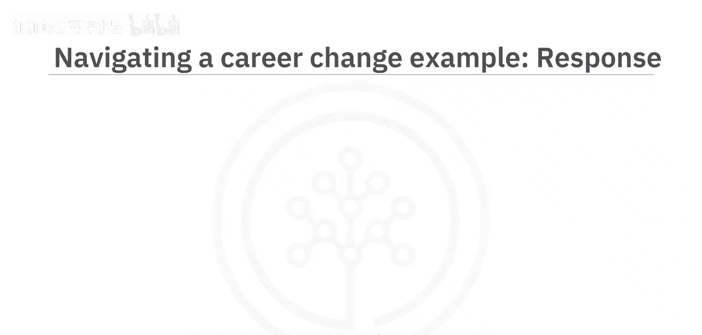

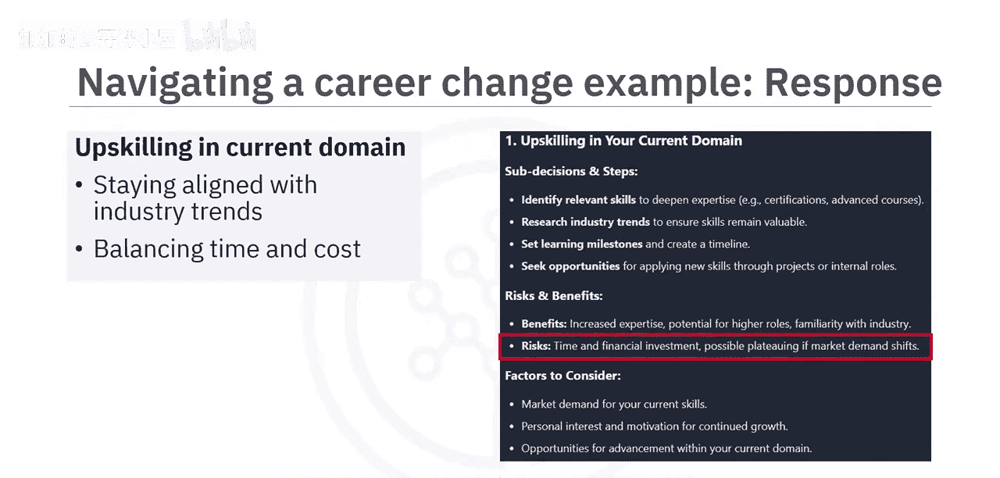

AI模型的响应会遍历每条思考路径：
1.  **路径分析**：模型会概述每条职业转换选项的优缺点。
    *   **在当前领域提升技能**：优势是与行业趋势保持一致；限制是需要时间和金钱投入。
    *   **转向相关领域**：优势是拓宽职业机会；限制是现有技能与新角色的兼容性问题。
    *   **进行彻底改变**：优势是可能获得更大的个人满足感；限制是财务风险和失败的可能性。
2.  **决策支持**：最终，模型会将最终决定权留给用户，并提供考量的要点，如个人兴趣、风险承受能力和市场需求。

这个例子展示了思维树方法如何支持在不确定性下的深思熟虑的决策。


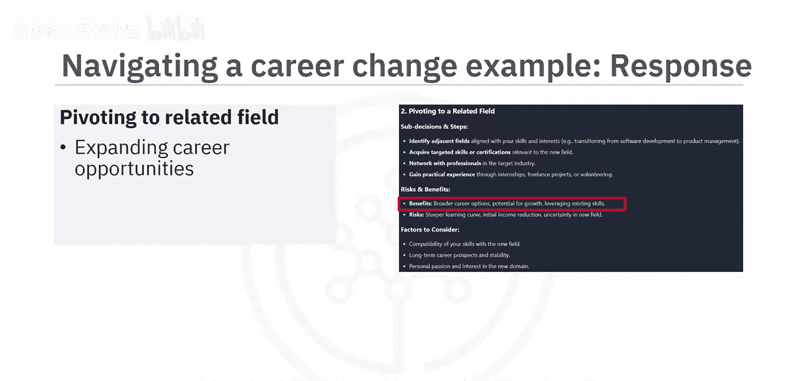

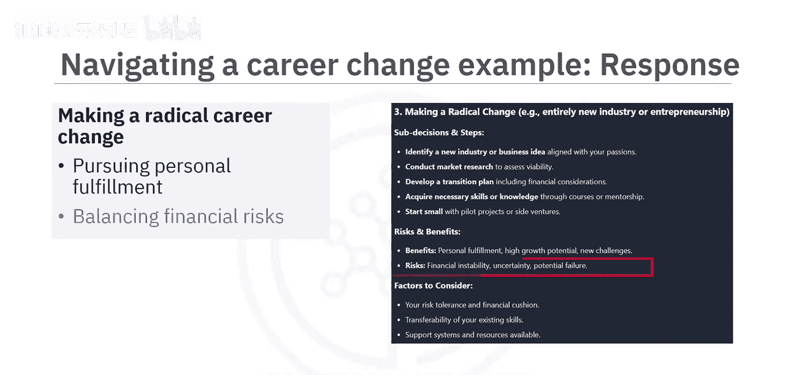

## 思维树方法的挑战与局限

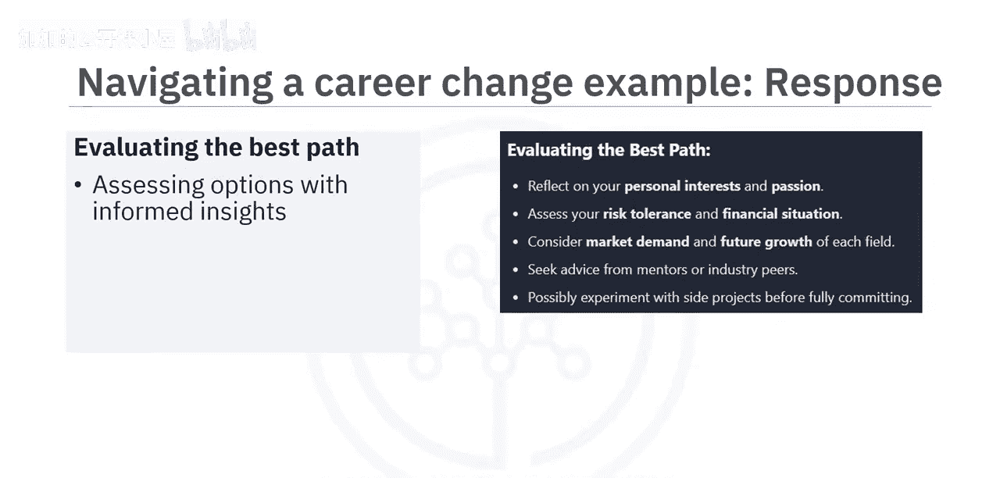

虽然思维树方法在结构化推理和处理复杂多步骤问题方面非常有效，但它也存在一些局限性。

以下是使用该方法时可能遇到的主要挑战：
*   **过度生成**：模型可能探索过多分支或偏离到不太相关的路径，导致回应冗长或重点被稀释。
*   **路径均等假设**：该方法可能默认所有推理路径都同等有效，但在高风险或时间敏感的场景中，优先级排序至关重要。
*   **错误自信风险**：如果模型围绕有缺陷的逻辑或不准确的事实创建了详细的推理链，可能会给薄弱的结论带来虚假的可信度，造成错误自信。

因此，用户需要仔细解读模型的输出，并在关键决策中结合自己的判断。


## 课程总结

本节课中我们一起学习了思维树方法。我们了解到，思维树方法是一种高级的提示工程技术，它通过引导生成式AI模型以结构化、分步的方式推理多种解决方案路径，来应对复杂问题。它鼓励模型探索不同的可能性，并行评估它们，并得出深思熟虑、有充分支持的结论。


这种方法对于需要分层决策的现实世界情况特别有用。同时，思维树方法也存在一些局限性，例如过度生成的风险、过度分支到低价值路径，以及需要用户仔细解读。如果使用得当，它能为在AI支持下应对模糊性和做出明智决策提供一个强大的框架。