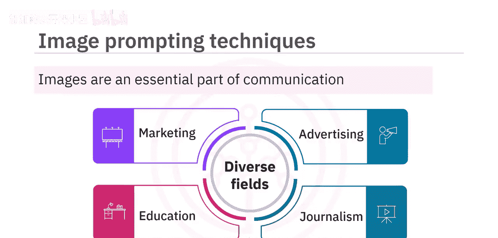
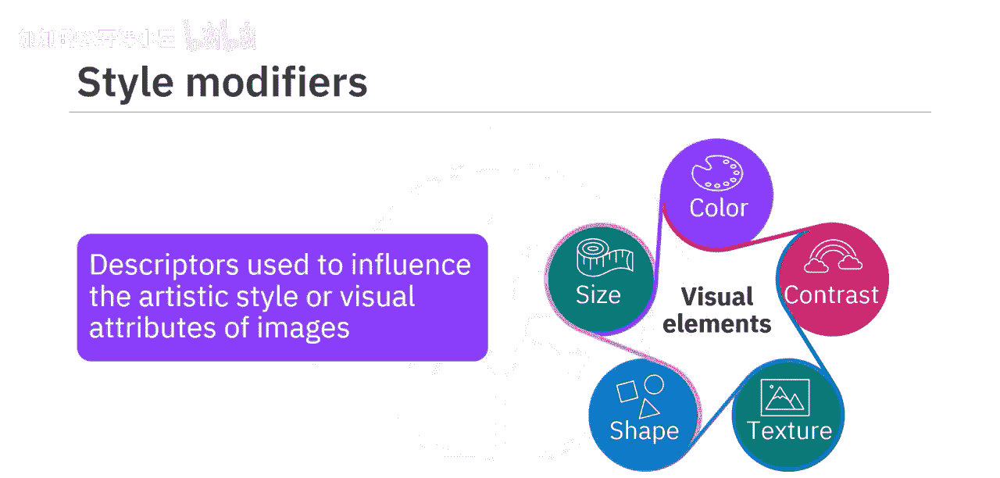
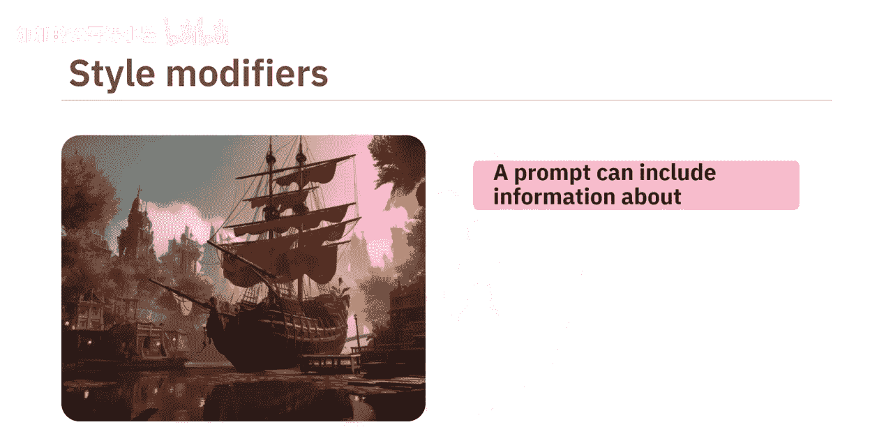
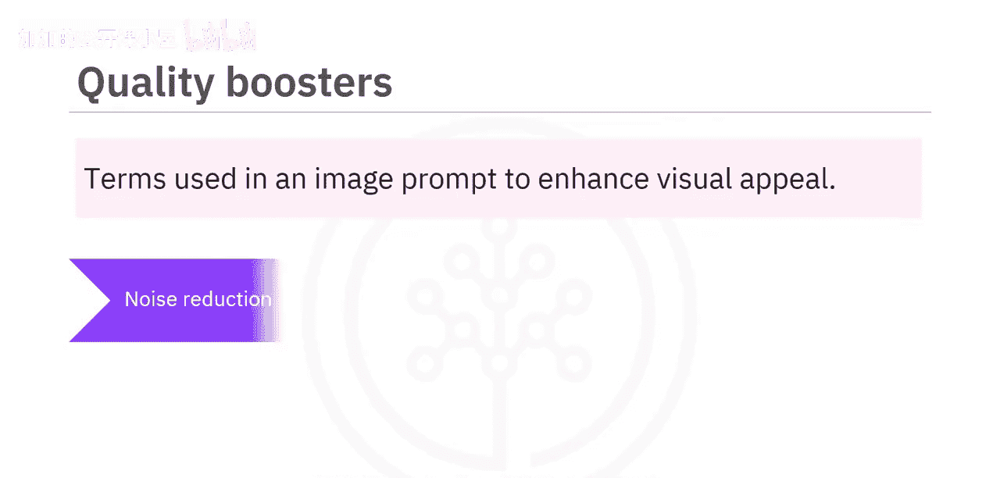
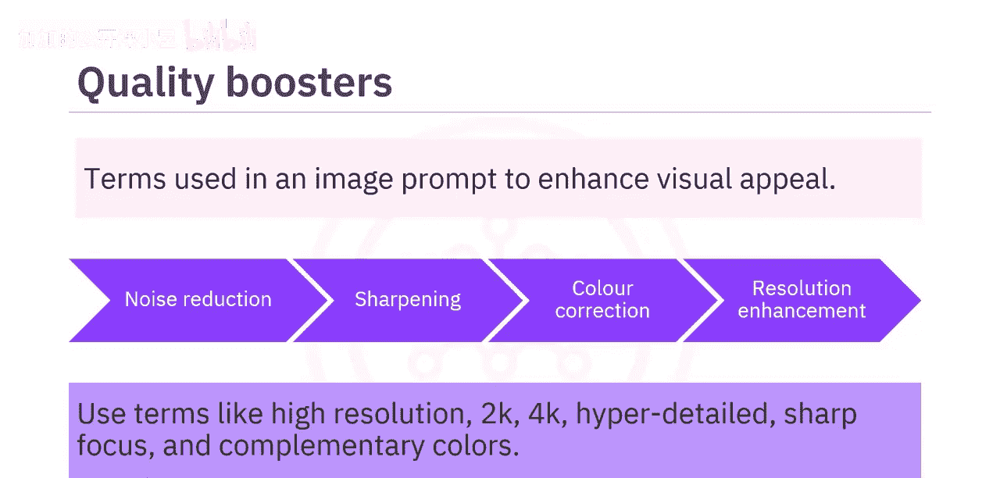
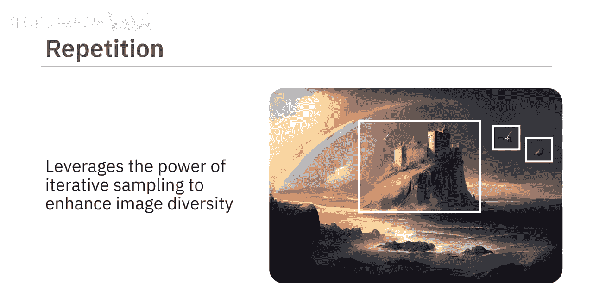
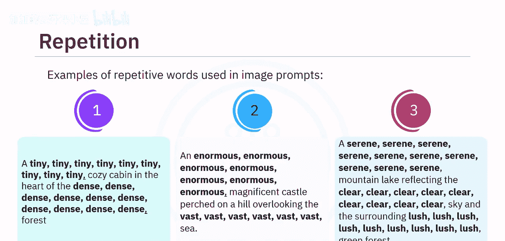
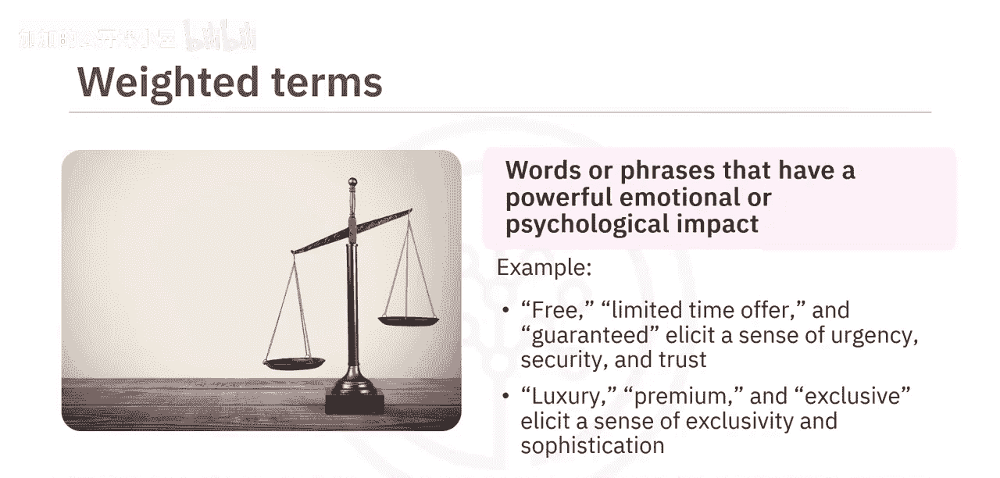

#  029：文本到图像提示技术 🎨

在本节课中，我们将要学习如何运用文本到图像提示技术，以提升生成式AI模型所创建图像的质量与影响力。掌握这些技巧，你将能够撰写出更有效的图像生成指令。

图像是沟通中不可或缺的一部分，广泛应用于市场营销、广告、教育、新闻等多个领域。然而，有些图像在传达情感方面比另一些更为出色。图像提示，即你想要生成的图像的文本描述，是影响结果的关键。它可以是简单的单词或短语，也可以是详细描述构图、色彩和氛围的句子。

为了增强通过生成式AI模型获得的图像的影响力，使其更具说服力和吸引力，我们可以使用图像提示技术。这些技术旨在提升生成图像的质量、多样性和相关性。

有多种图像提示技术可用于改善图像效果。接下来，我们将逐一了解这些技术。

## 风格修饰词 🖌️

上一节我们介绍了图像提示的基本概念，本节中我们来看看第一种技术：风格修饰词。风格修饰词是用于影响生成式AI模型所产生图像的艺术或视觉属性的描述符。这些描述符可以帮助模型在遵循输入提示结构和内容的同时，创造出具有创新风格的图像。

你可以通过提示词修改图像的色彩、对比度、纹理、形状和大小等各种视觉元素，从而生成具有美学吸引力、视觉愉悦的输出。你的提示词可以包含以下信息：

*   各种艺术风格（如印象派、超现实主义）。
*   历史上的艺术时期（如文艺复兴、巴洛克）。
*   摄影技术（如长曝光、微距摄影）。
*   使用的艺术材料类型（如水彩、油画、炭笔画）。
*   甚至是你希望模型模仿的知名品牌或艺术家的特质。

所有这些信息都能帮助生成模型理解期望的输出图像的外观或风格。

以下是图像提示中使用风格修饰词的几个例子（示例中的风格修饰词已高亮显示）：

> **提示词示例 1**: 一个宁静的湖泊，**采用莫奈的印象派风格**，有柔和的笔触和反射的光线。
>
> **提示词示例 2**: 一只猫坐在窗台上，**背景是模糊的，采用街头摄影风格**，色彩鲜艳。
>
> **提示词示例 3**: 未来城市景观，**赛博朋克美学**，霓虹灯，下雨的街道。

## 质量增强词 📈

我们已经了解了如何通过风格修饰词来塑造图像的艺术感。现在，让我们转向另一个关键方面：图像质量。高质量图像相比低质量图像通常更具说服力和可信度。低分辨率图像常常显得模糊且有像素感，使观看者难以辨别其中的细节。相反，高分辨率图像能保证基本的可见性和可读性。使用高质量的图形设计可以提升图像的感知价值。

质量增强词是在图像提示中用于增强视觉吸引力、提高整体保真度和清晰度的术语。这些特定术语可以指导生成式AI模型执行降噪、锐化、色彩校正和分辨率增强等步骤。

你可以在图像提示中使用诸如 **`high resolution`**（高分辨率）、**`hyperdetailed`**（超细节）、**`sharp focus`**（锐利对焦）、**`complementary colors`**（互补色）等术语作为质量增强词。它们可以增强图像的特定特征，从而产生更连贯的输出。

让我们看一些例子来理解如何在图像提示中使用质量增强词：

> **提示词示例 1**: 一片古老的森林，阳光透过树叶，**突出纹理，4K分辨率**。
>
> **提示词示例 2**: 一碗新鲜水果，**锐利、清晰**，水滴，**精细的线条**。
>
> **提示词示例 3**: 一位时尚模特，**互补色**，**模糊的背景**，让她**脱颖而出**。

在上述示例中，诸如“突出纹理”、“4K分辨率”、“锐利、清晰”、“精细的线条”、“互补色”、“模糊的背景”和“脱颖而出”等术语，都是在给定图像提示中使用的质量增强词。

## 重复强调法 🔁

接下来是第三种图像提示技术：重复。这种技术利用迭代采样的力量来增强模型生成图像的多样性。重复强调法涉及在图像中强调特定的视觉元素，为模型创造一种熟悉感，使其能够专注于你想要突出的特定想法或概念。

这可以通过在图像提示中重复相同的单词或相似的短语来实现。重复有助于强化通过图像传达的信息，并增加模型对关键元素的记忆。模型不会仅根据提示生成一张图像，而是生成多张具有细微差别的图像，从而产生一组多样化的潜在输出。当生成模型面对抽象或模糊的提示，且存在多种有效解释时，这种技术尤其有价值。

让我们看一些在图像提示中使用重复词汇的例子：

> **提示词示例 1**: **微小**、**微小**的花朵，**密集**、**密集**地覆盖在**巨大**、**巨大**的山坡上。
>
> **提示词示例 2**: **广阔**、**广阔**的沙漠，**宁静**、**宁静**的天空，**清澈**、**清澈**的夜空。
>
> **提示词示例 3**: **茂密**、**茂密**的丛林，**生机勃勃**、**生机勃勃**的绿色植物，**隐藏**、**隐藏**的瀑布。

在这些例子中，“微小”、“密集”、“巨大”、“广阔”、“宁静”、“清澈”和“茂密”等词汇被多次重复，以聚焦于特定的想法。

## 加权术语 ⚖️

在学会了通过重复来强调概念后，我们来看看如何更精确地控制提示词的影响力：加权术语。加权术语指的是使用那些能够产生强大情感或心理影响的词语或短语。

例如，“免费”、“限时优惠”和“保证”等词常用于广告中，以引发紧迫感、安全感和信任感。同样，“奢华”、“高端”和“独家”等词则用于营造排他性和精致感。生成式AI模型允许你为正负术语分配权重，以强调或弱化某种情感。

在图像提示中使用加权术语有助于创建令人难忘、有说服力的图像，并能引起观众的情感共鸣。

以下是一些在图像提示中使用加权术语的例子：

> **提示词示例 1**: 一个**温暖:10**、**噼啪作响:8**的壁炉，舒适的室内场景。
>
> **提示词示例 2**: 一个**闪烁:6**、**霓虹灯照明:8**的城市雨夜。
>
> **提示词示例 3**: 一只**色彩斑斓:-6**、**异国情调:10**的鹦鹉在热带雨林中。

如第一个例子所示，词语“温暖”被赋予了正权重10，而“噼啪作响”的权重是正8。这意味着生成模型必须更多地关注“温暖”一词，对“噼啪作响”的关注稍少一些。同样，在第二个例子中，“闪烁”一词的权重为正6，“霓虹灯照明”的权重为正8，因此模型应更关注“霓虹灯照明”。而在最后一个例子中，“色彩斑斓”被赋予了负权重6，“异国情调”被赋予了正权重10，这意味着模型必须强调“异国情调”一词，同时弱化“色彩斑斓”。

## 畸形修复提示 🛠️

最后，我们来探讨第五种图像提示技术：畸形修复生成。这种技术用于修改可能影响图像效果的畸形或异常。图像中的畸形可能包括扭曲（特别是在人体部位如手或脚上）、像素化或其他影响图像视觉吸引力和清晰度的质量问题。

通过使用恰当的负面提示词，可以在一定程度上缓解这些问题。负面提示词告诉模型**不要**在图像中包含什么。

以下是图像提示中使用的畸形修复提示技术示例：

> **提示词示例 1**: 一位宇航员在月球上行走，**没有畸形的手，没有模糊**。
>
> **提示词示例 2**: 一幅详细的城市景观画，**没有像素化，没有扭曲的透视**。
>
> **提示词示例 3**: 一只神话生物的特写，**没有多余的手指，没有模糊的纹理**。

你可以看到，在所有这些例子中，都使用了良好的负面提示词来缓解图像畸形的问题。

## 总结 📝

本节课中，我们一起学习了图像提示技术在提升生成式AI模型图像生成能力方面起着至关重要的作用。**风格修饰词**、**质量增强词**、**重复强调法**、**加权术语**和**畸形修复提示**是五种可用于改善生成图像影响力的技术。通过结合运用这些技术，可以创造出更令人难忘、更具吸引力和说服力的视觉内容，从而有效地传达预期信息。