#  030：课程总结 🎯

在本节课中，我们将回顾并总结整个“提示工程基础”课程的核心概念与技巧。你已经掌握了设计有效提示、使用生成式AI工具以及文本到文本、文本到图像等技术。现在，让我们系统地梳理所学知识，为未来的应用与实践打下坚实基础。

## 课程核心概念回顾

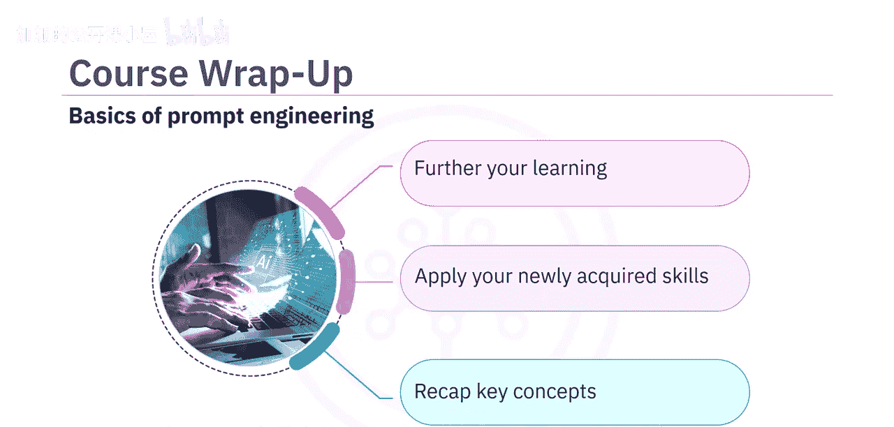

上一节我们完成了课程的学习，本节中我们来回顾贯穿整个课程的关键概念。

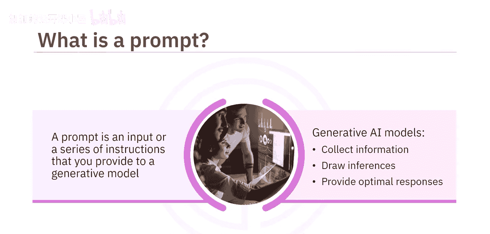

**提示** 是指你提供给生成式AI模型的任何输入或一系列指令，模型据此收集信息、进行推断并提供最佳响应。

一个结构良好的提示包含以下基本构建模块：
*   **指令**：明确告诉模型要做什么。
*   **上下文**：提供相关的背景信息。
*   **输入数据**：给出需要处理的具体内容。
*   **输出指示器**：规定期望的输出格式或类型。

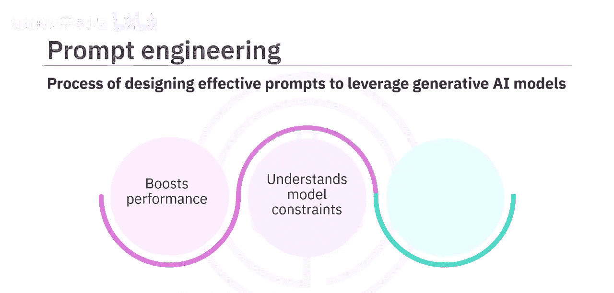

**提示工程** 是设计有效提示以充分利用生成式AI模型能力的过程。这个过程旨在提升模型性能、理解模型限制并增强模型安全性。

## 编写有效提示的最佳实践

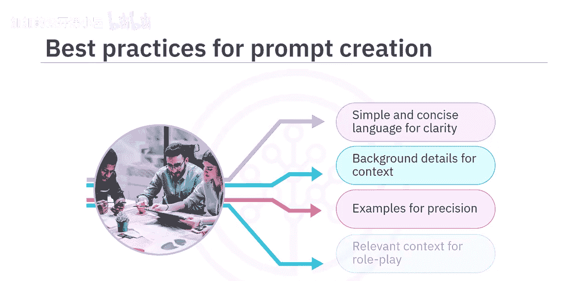

理解了提示的构成后，我们来看看如何编写它们。以下是经过验证的最佳实践：

*   **使用简洁清晰的语言**：确保指令易于理解。
*   **提供背景细节**：为模型补充完成任务所需的相关信息。
*   **具体并给出示例**：明确要求，并通过例子展示你期望的输出格式。
*   **提供相关上下文进行角色扮演**：通过设定角色（如“你是一位资深项目经理”）来引导模型的回答风格和专业性。

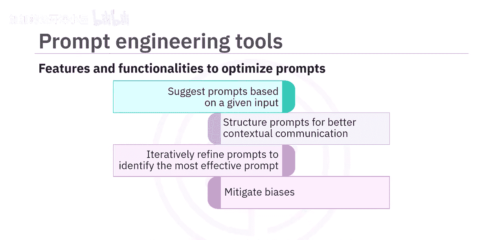

## 提示工程工具与高级技巧

除了基本原则，我们还学习了一些工具和高级技巧来优化提示。

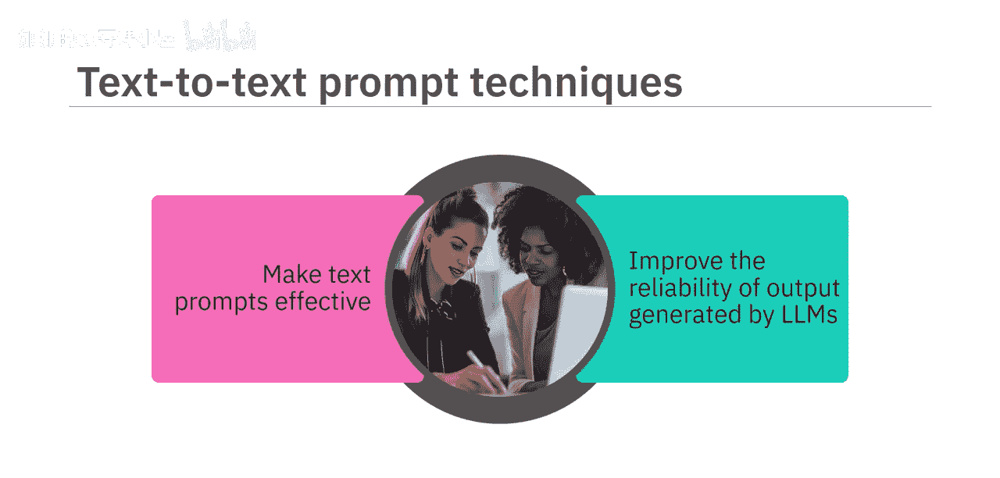

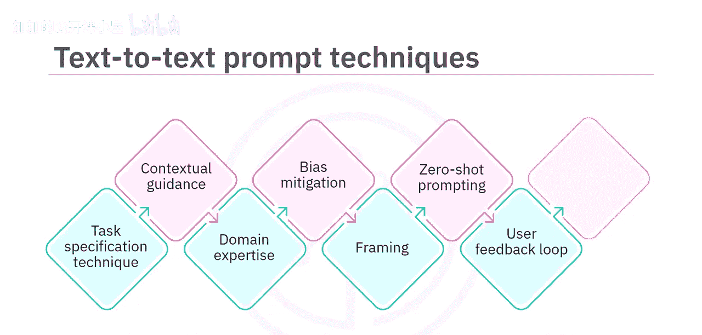

**提示工程工具** 提供了优化提示的功能。你可以利用这些工具：
*   根据给定输入建议提示。
*   结构化提示以实现更好的上下文沟通。
*   迭代优化提示，以找出最有效的版本、减少偏见并创建针对特定领域的提示。

在文本到文本提示技术方面，我们学习了几种提升大型语言模型输出可靠性的方法：

以下是核心的文本提示技术：
1.  **任务规范**：清晰定义任务。
2.  **上下文引导**：提供充足的背景信息。
3.  **领域专业知识**：引入专业知识和术语。
4.  **偏见缓解**：设计提示以减少模型输出中的偏见。
5.  **框架设定**：为回答设定一个角度或框架。
6.  **零样本提示**：在不提供示例的情况下直接要求模型完成任务。
7.  **用户反馈循环**：根据模型输出不断调整和优化提示。
8.  **少样本提示**：提供少量示例来引导模型理解任务模式。

## 结构化提示方法

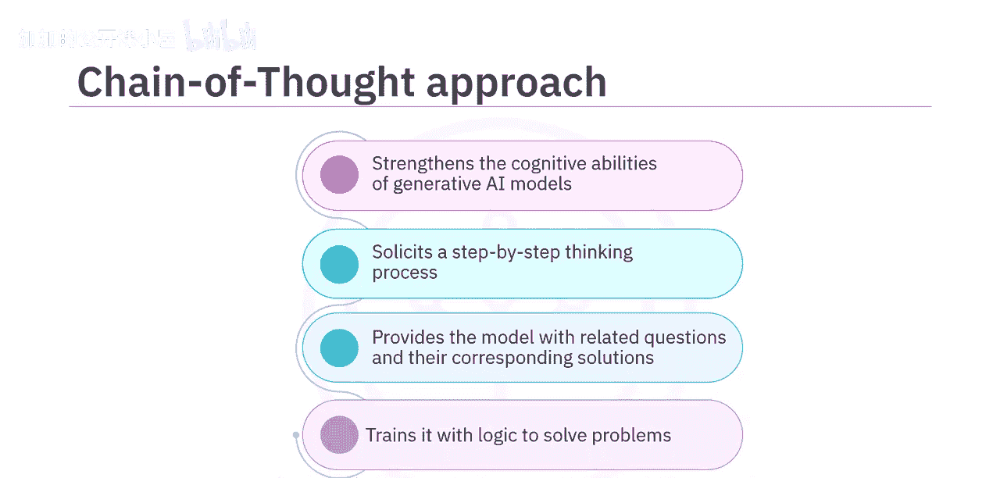

为了进行更复杂和深入的交互，我们探讨了几种结构化的提示方法。

**访谈模式** 允许与生成式AI模型进行动态、迭代的对话。这种方法不是提供单一的静态提示，而是涉及与模型进行一来一往的信息交换，有助于实时澄清问题并引导模型的回答。

**思维链** 方法旨在增强生成式AI模型的认知能力。它通过要求模型展示一步步的思考过程来工作。通常，通过给模型提供相关的问题及其解决方案来训练它理解解决问题的逻辑，从而使其能够解决其他类似问题。其核心是引导模型进行逐步推理。

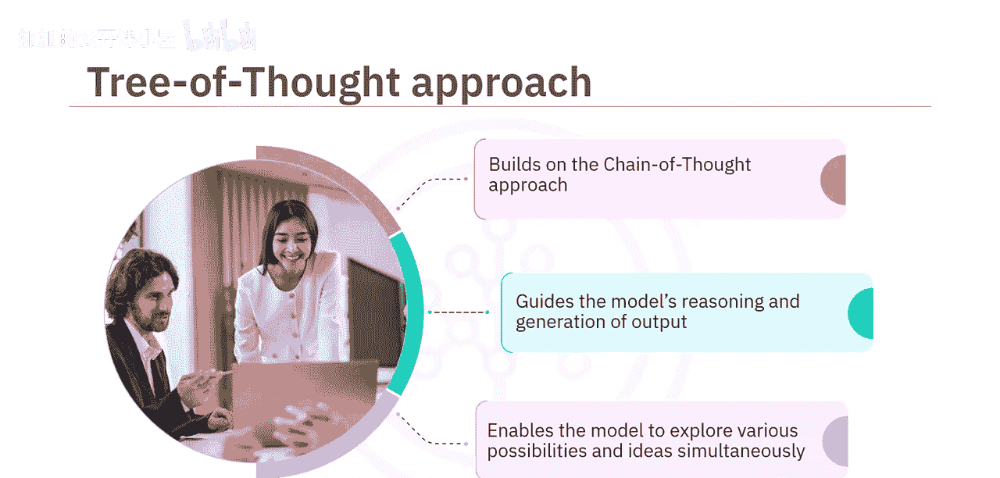

**思维树** 方法是一种创新技术，它建立在思维链方法之上。它涉及以分层结构组织提示，以指导模型的推理和输出生成。这种方法使模型能够同时探索多种可能性和想法，像决策树一样分支展开。

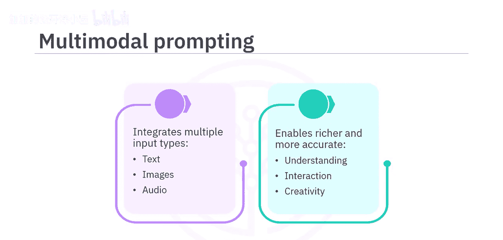

**多模态提示** 通过整合多种输入类型（如文本、图像、音频）来扩展生成式AI的能力，使其能够在多样化的场景中实现更丰富、更准确的理解、互动和创造。

**季后赛方法** 涉及生成多个“提示-响应”对，并根据清晰度、精确度和上下文相关性等标准对它们进行评估。这种迭代方法有助于持续优化提示设计。

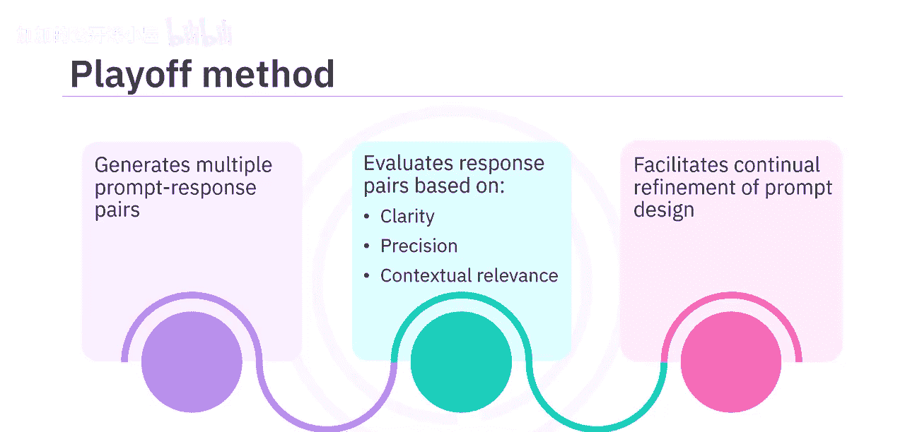

## 图像提示技术

最后，我们学习了专门用于图像生成的提示技术。

以下是一些常用的图像提示技术，它们能增强通过生成式AI模型获得的图像效果，使其更具说服力和吸引力：
*   **风格修饰符**：指定艺术风格（如“梵高风格”、“赛博朋克”）。
*   **质量提升器**：使用如“4K”、“高清”、“细节丰富”等词汇。
*   **重复**：重复关键词以增强其影响力（如“一个非常非常宁静的湖泊”）。
*   **加权术语**：使用语法 `(关键词:权重)` 来调整不同元素的重要性（例如 `(城堡:1.5)` 强调城堡）。
*   **固定形态生成**：使用特定参数或命令来保持人物或物体在不同生成结果中的一致性。

## 实践与总结

本课程包含了实践实验室和一个最终项目。通过完成实验，你获得了以下主题的实践经验：
*   熟悉我们的AI提示工具。
*   实验提示：基础提示和人物模式。
*   提示工程中的访谈提示方法。
*   提示工程中的思维链方法。
*   提示工程中的思维树方法。
*   多模态提示。
*   季后赛方法。
*   用于图像生成的有效文本提示。

我们建议你继续实践在本课程中学到的概念。希望这些原则能磨练你的技能，并帮助你在职业生涯中取得进步。

恭喜你完成本课程！感谢你参与这段学习旅程，并祝你一切顺利。

---

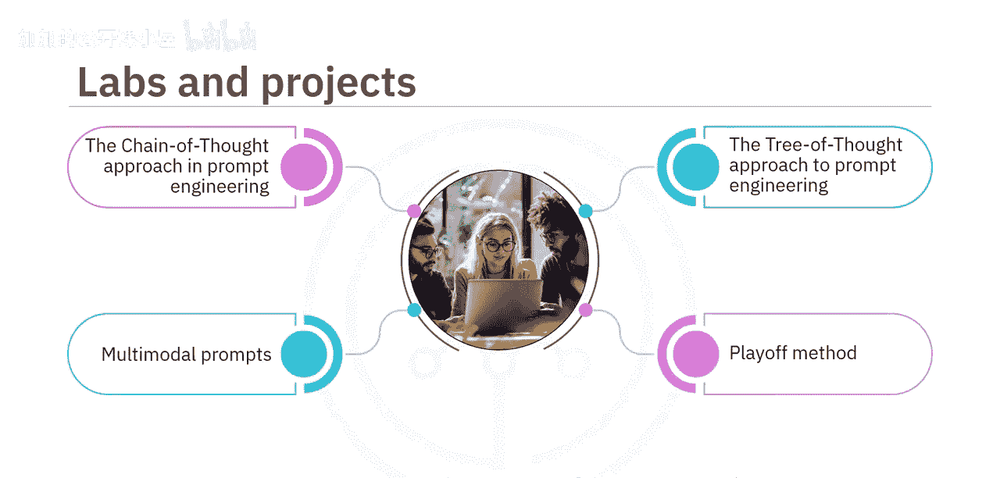

**本节课中，我们一起学习了提示工程的核心概念、最佳实践、多种高级提示技术（如思维链、思维树、多模态提示）以及图像生成技巧。掌握这些知识将使你能够更有效、更创造性地利用生成式AI工具，解决实际问题并提升工作效率。**