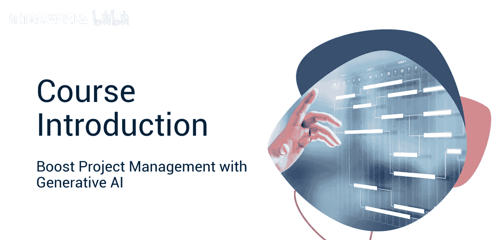
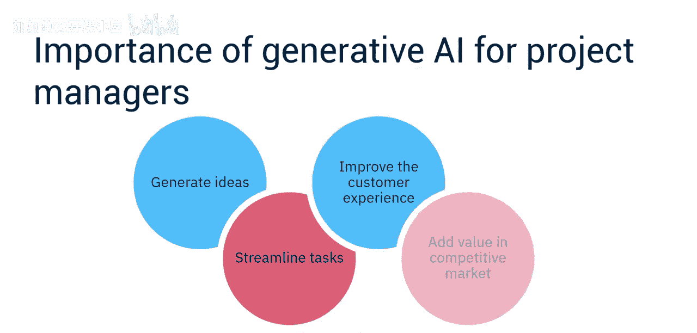
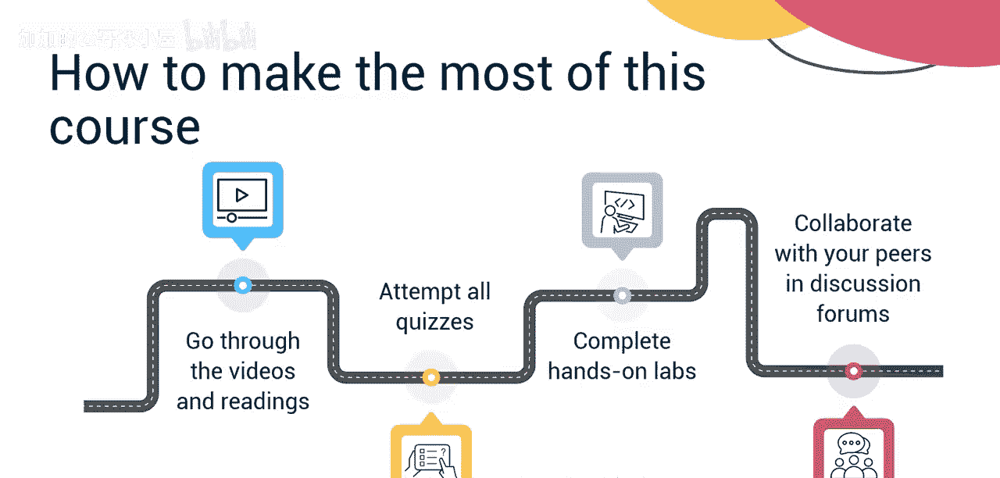

#  031：课程介绍

在本节课中，我们将要学习生成式AI如何显著提升项目经理的整体效能。课程将概述AI在项目管理领域的快速演变，并介绍如何利用相关工具来优化工作流程、激发创意并提升效率。

## 课程概述与讲师介绍

欢迎来到本课程，在这里你将学习如何使用生成式AI工具来显著提升或彻底释放你的整体项目管理效能。

我是Daniel Ymans，将是本课程的讲师。在我的职业生涯中，我扮演过多种角色，包括项目和项目经理、产品经理、Scrum主管和产品负责人。目前，我是一名大学教授、企业培训师，也是Skill Up Technologies公司的主题专家。

## 生成式AI的战略必要性

生成式AI正在重塑客户需求。对于项目经理而言，拥抱生成式AI不仅是一种趋势，更是一项战略必需。

生成式AI可以帮助你生成远超你现有数据范围的创意。它可以帮助你简化任务，使你能够专注于最关键的项目管理工作。此外，生成式AI有助于改善客户体验，并在竞争激烈的市场环境中增加价值。

我鼓励你访问项目管理协会的网站。生成式AI不仅仅是一个流行词，它是一个主题。AI是一个强大的工具，它使项目经理能够创新、个性化和优化。因此，请拥抱它，学习它，并为你的产品解锁新的可能性。

## 课程结构与学习目标

本课程是“面向项目经理的生成式AI”专项课程的一部分。它专为希望走在AI前沿的新手或资深项目经理设计。

学习者应熟悉项目管理生命周期和基本的项目管理概念。他们还应具备对生成式AI和提示工程的基本理解。

**模块1**将概述AI如何在项目管理领域快速发展。AI正在显著改变项目管理的格局，越来越多的项目经理正在使用AI来提高项目管理效能。你将学习AI工具和技术如何改进任务流线化、增强创意生成，并提高整体项目管理的效率和效果。

**模块2**中，你将学习如何应用生成式AI工具来提高绩效。通过一系列演示视频，我们还将讨论与生成式AI相关的伦理考量，并概述你可能遇到的挑战以及克服这些挑战的技巧。

在最后一个模块中，你将完成一个最终项目，并参加最终评估，以测试你对关键概念的理解。

## 学习建议与期望

本课程内容非常丰富。为了从本课程中获得最大收益，请观看所有视频和阅读材料，尝试所有测验，完成所有动手实验，并使用讨论论坛与你的同伴联系和协作。

如果你对课程材料有任何疑问，请不要犹豫，在讨论论坛中联系我们。

欢迎来到本课程，我们期待分享AI如何释放你的项目管理职业生涯，并确保你和你的公司在创造令客户满意、并为你的公司提供关键竞争优势的创新产品的竞赛中不被落下。

---

本节课中，我们一起学习了生成式AI对项目经理的战略重要性、本课程的结构与目标，以及如何有效地参与学习。我们了解到，AI不仅是工具，更是推动项目管理创新和效率的关键驱动力。