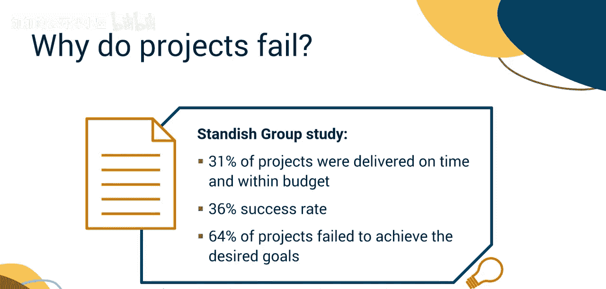
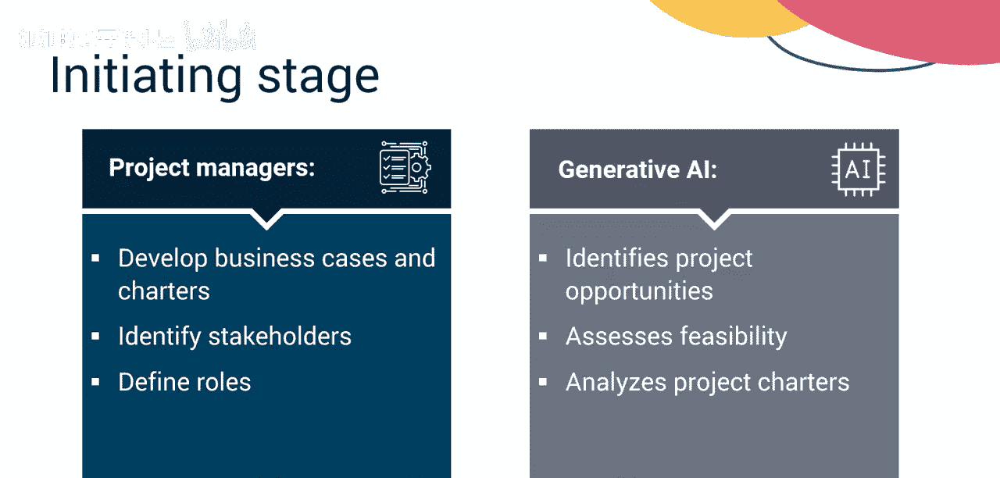
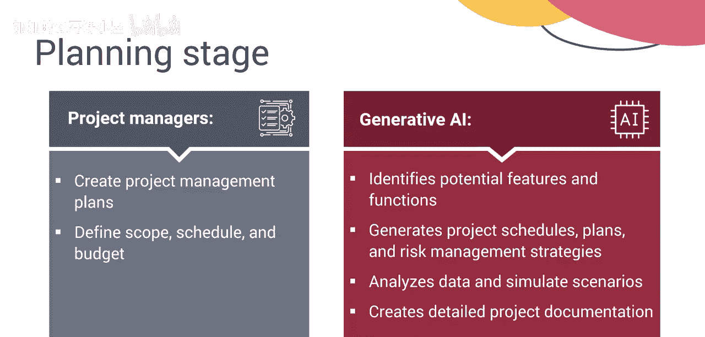
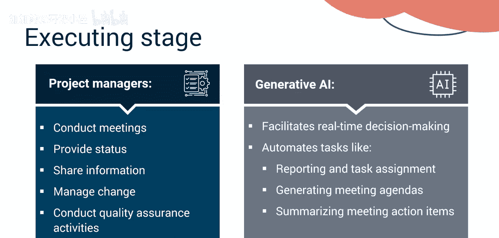
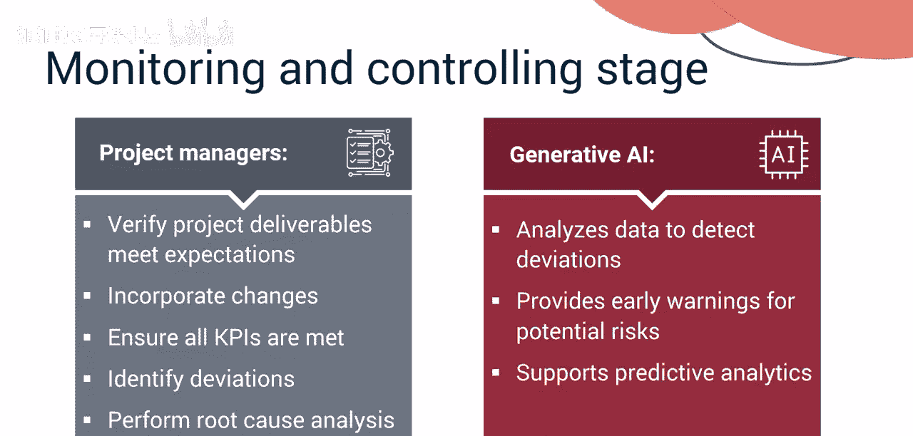
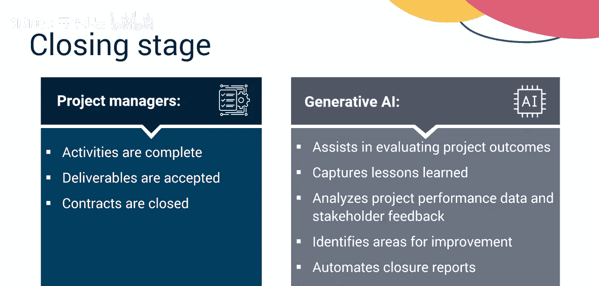
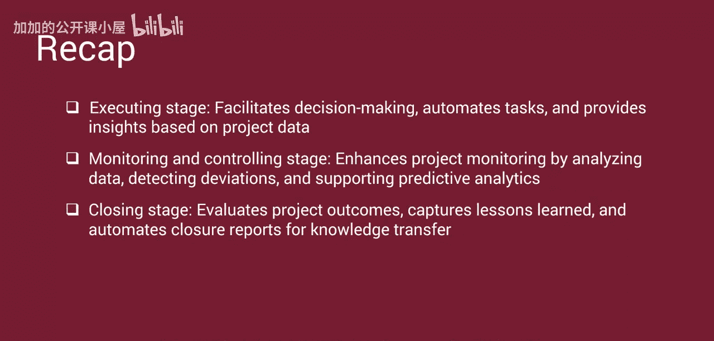

#  032：生成式人工智能在项目管理中的应用 🚀

在本节课中，我们将要学习项目经理的核心职责，并详细探讨生成式人工智能如何在整个项目管理生命周期中发挥重要作用，以提升项目成功率。

## 项目经理的角色

项目经理负责领导和管理从启动到收尾的整个项目管理生命周期。

在启动和规划阶段，项目经理专注于制定项目章程、吸引相关方参与，并创建全面的项目管理计划，为成功执行奠定基础。在执行、监控与控制以及收尾阶段，项目经理确保项目可交付成果的开发、测试、验证、验收和移交。

项目经理的职责是按时、在预算内交付项目，满足批准的要求并交付价值。然而，尽管项目经理付出了努力，项目的成功率仍然参差不齐，许多项目未能达成目标。

一项近期的Standish Group研究指出，只有31%的项目按时且在预算内交付，成功率仅为36%。这意味着64%的项目未能实现预期目标。

## 生成式AI如何革新项目管理

接下来，我们来看看生成式AI如何革新您作为项目经理的工作方法，并提高成功率。

生成式AI是项目经理强大且多功能的工具。它能简化任务、促进协作并激发创新，从而提升项目成功率。生成式AI可以生成报告、起草会议议程，甚至撰写电子邮件，让项目经理能够专注于战略规划和问题解决。此外，它还能分析项目数据以预测挑战并提供解决方案，使项目执行更加顺畅。

以下是生成式AI在项目管理各阶段的具体应用：

### 启动阶段

在启动阶段，项目经理通过制定商业论证和章程、识别相关方并定义其角色来启动项目。

生成式AI利用历史数据和预测分析，协助识别项目机会并评估可行性。它还能分析项目章程并建议关键角色。

### 规划阶段

在规划阶段，项目经理创建全面的项目管理计划，定义范围、进度和预算。

生成式AI通过识别潜在的特性和功能，以及生成项目进度计划、资源分配计划和风险管理策略来支持规划工作。它分析数据以识别依赖关系、优化资源利用，并模拟各种场景以确定有效的项目计划。它还能协助创建详细的项目文档，如**工作分解结构（WBS）** 和风险登记册，从而简化规划流程。

### 执行阶段

在执行阶段，项目经理召开会议、提供状态更新、共享信息并管理变更。他们执行质量保证活动，以确保流程、标准和质量得到遵守。

生成式AI通过基于项目数据提供洞察来促进实时决策，并自动化报告和任务分配等任务，生成会议议程并总结会议行动项。这使得项目团队能够专注于高价值的活动。

### 监控与控制阶段

在监控与控制阶段，项目经理验证项目可交付成果是否符合预期，确保所有关键绩效指标（KPI）得到满足，并在出现偏差时执行根本原因分析。

生成式AI通过分析数据以检测偏差、为潜在风险提供早期预警，并支持预测分析以优化决策和资源分配，从而增强项目监控与控制能力。

### 收尾阶段

在收尾阶段，项目经理确保所有活动完成、可交付成果被接受且合同已关闭。

生成式AI协助评估项目成果并为未来项目捕获经验教训。它可以分析项目绩效数据和相关方反馈，以评估项目成功与否并识别改进领域。生成式AI还能自动生成收尾报告，通过基于项目经验生成洞察和建议来促进知识转移。

## 总结

本节课中，我们一起学习了生成式AI如何为项目经理简化任务、促进协作并实现创新。

项目经理领导从启动到收尾的项目生命周期，制定章程、吸引相关方参与，并确保可交付成果在预算内按时满足要求。生成式AI革新了所有阶段的项目管理：
*   **启动阶段**：识别项目机会、评估可行性并建议关键角色。
*   **规划阶段**：识别特性、生成进度计划、资源分配计划和风险管理策略。
*   **执行阶段**：促进决策、自动化任务，并提供基于项目数据的洞察。
*   **监控与控制阶段**：通过分析数据、检测偏差和支持预测分析来增强项目监控。
*   **收尾阶段**：评估项目成果、捕获经验教训，并自动生成收尾报告以进行知识转移。