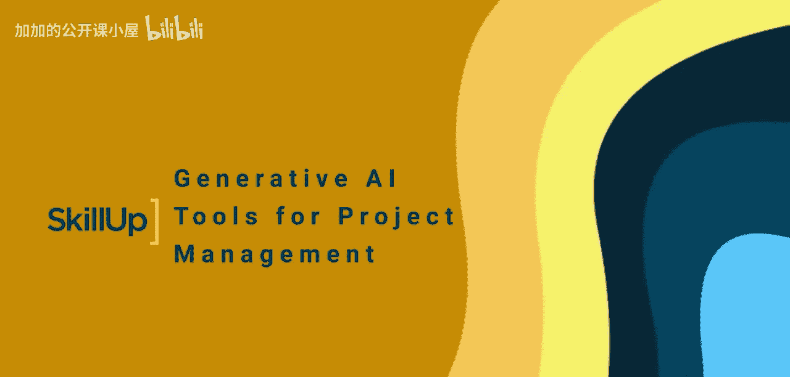
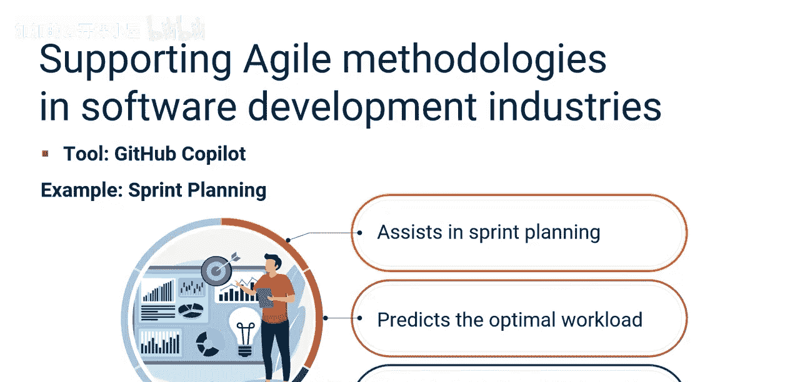
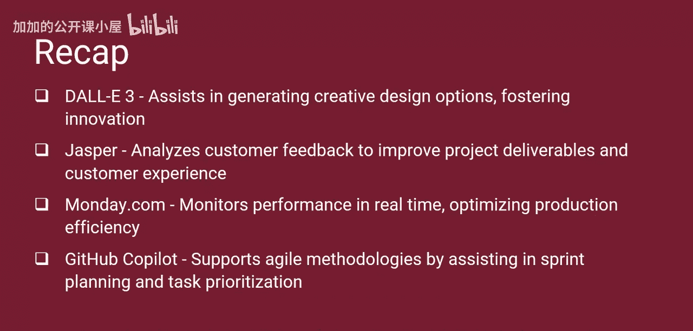

#  033：生成式人工智能项目管理工具 🛠️

在本节课中，我们将学习生成式AI如何应用于项目管理，并了解不同行业中具体的工具案例。通过学习，你将能够描述生成式AI如何提升项目管理效率，并回顾那些在项目管理中发挥重要作用的生成式AI工具实例。

## 生成式AI在项目管理中的应用概述

项目经理们正在利用各种生成式AI工具来获得优势。生成式AI既可用于规划和执行传统的瀑布式或预测型项目，也可用于敏捷或适应型项目。

接下来，我们来看看项目经理在项目管理任务中使用的一些生成式AI工具。

## 行业专用工具示例

以下是不同行业中生成式AI工具的具体应用案例。

*   **ClickUp**：项目经理使用ClickUp的AI功能来自动化创建施工进度表并开发项目网络图。该工具可以分析过去的项目时间线和当前资源可用性，并生成优化的进度表，从而节省时间并减少人工规划工作。
*   **Gemini**：其AI能力可以分析历史临床试验数据和外部健康趋势，预测潜在风险，制定风险登记册，并提出风险应对策略。这种分析使医疗保健项目经理能够做出明智的决策，并主动管理临床试验风险。
*   **Notion**：与ChatGPT等AI工具的集成可以实时转录和总结会议内容。这确保了所有团队成员都能获取关键决策和行动项。此外，通过提供清晰简洁的会议摘要，增强了团队协作和生产力。
*   **DALL·E 3**：根据设计团队提供的初始参数生成多种设计方案。这些AI生成的设计作为设计师进行细化的起点，从而带来更具创新性和多样性的产品成果。项目经理会在适用时，将潜在项目交付成果的可视化描述作为需求文档的一部分进行分享。
*   **Jasper**：使用AI分析各个渠道的客户反馈和情绪。这种分析有助于零售项目经理理解客户需求和偏好，使他们能够定制项目交付成果，提升客户满意度并增加价值。
*   **Monday.com**：其AI功能实时监控生产线性能，并在偏离计划时提供警报。这有助于制造业项目经理快速解决效率低下的问题并优化生产工作流程。

## 生成式AI在敏捷项目管理中的应用

许多项目是使用敏捷或混合框架完成的。敏捷属于适应性框架范畴，强调灵活性、协作、客户反馈和小型快速发布。

上一节我们介绍了在传统和特定行业中的应用，本节中我们来看看生成式AI如何支持敏捷方法论。

*   **GitHub Copilot**：通过预测最佳工作负载和识别最关键的任务来协助进行冲刺规划。这些见解有助于软件开发项目经理规划高效的冲刺，并使开发周期与项目目标保持一致。

## 课程总结 🎯

本节课中，我们一起学习了生成式AI在项目管理中的具体应用。你了解到，行业专用的应用可以提升项目管理效能并增加项目成功的机会。

*   **ClickUp**：自动化调度和资源分配，让项目经理专注于战略规划。
*   **Gemini**：分析临床试验数据以进行风险管理，帮助项目经理做出明智决策。
*   **Notion**：通过AI生成的会议摘要来增强沟通与协作。
*   **DALL·E 3**：协助生成创意设计方案，促进创新。
*   **Jasper**：分析客户反馈以改进项目交付成果和客户体验。
*   **Monday.com**：实时监控性能，优化生产效率。
*   **GitHub Copilot**：通过协助冲刺规划和任务优先级排序来支持敏捷方法论。