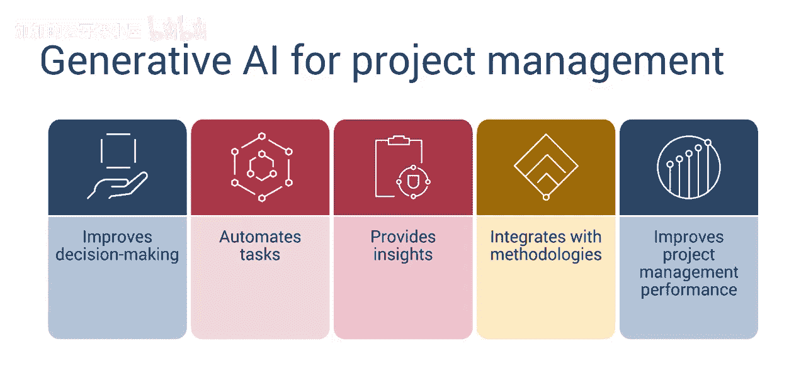
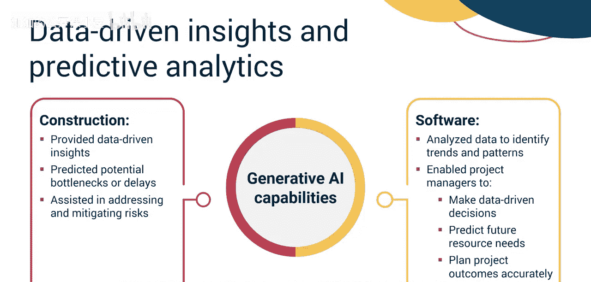
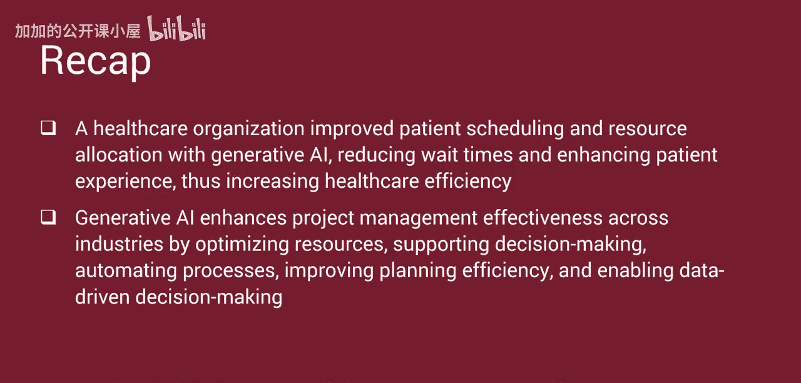

#  034：发挥生成式人工智能的强大力量 🚀

在本节课中，我们将通过几个实际案例，学习生成式人工智能如何成功应用于项目管理，并总结它如何提升项目管理的效能。

生成式人工智能正在通过改进决策、自动化任务、提供新见解以及与现有方法论无缝集成，彻底改变项目管理。采用这些先进技术的组织更有可能在项目中取得成功。

接下来，我们来看几个简短的案例研究，了解生成式人工智能如何帮助提升项目管理绩效。

以下是三个不同行业的应用案例：

*   **案例一：跨国建筑公司**
    *   该公司使用生成式AI算法来创建更优的项目进度计划。
    *   AI工具分析了历史项目数据、利益相关者偏好和可用资源。
    *   随后，它提出了能够**最小化项目周期**并**有效利用资源**的进度建议。
    *   这帮助该公司更快且在预算内完成项目，从而提升了客户满意度，并在行业内获得了竞争优势。

*   **案例二：软件开发公司**
    *   该公司在跨多个项目进行软件功能优先级排序和开发资源分配时遇到困难。
    *   他们使用生成式AI辅助决策；项目经理将项目需求、截止日期和资源可用性输入AI系统。
    *   AI随后提供了用于**优化功能优先级**和**资源分配**的计划。
    *   这使得公司能够按时且在预算内交付高质量的软件产品，从而提高了客户满意度和收入。

*   **案例三：医疗机构**
    *   该机构使用生成式AI来改善医院的患者排程和资源分配。
    *   AI系统分析了患者数据、医务人员可用性和设施限制。
    *   随后，它创建了个性化的患者预约排程，减少了等待时间，更好地利用了资源，并改善了患者体验。
    *   这形成了一种新的自动化流程，提高了医疗服务效率，并提升了员工生产力。

上一节我们介绍了三个具体的应用案例，本节中我们来总结一下从这些案例中学到了什么，以及生成式AI如何提升项目管理效能并创造价值。

以下是生成式AI提升项目管理效能的五个关键方面：

*   **优化资源分配**
    *   项目经理必须根据项目需求识别和分配资源，这是一项耗时、费力且经常需要修订的关键任务。
    *   生成式AI在上述两个案例中改进了资源分配：
        *   **建筑案例**：AI算法通过分析历史数据、利益相关者偏好和资源限制，优化了项目进度计划，减少了规划时间并提高了有效性。
        *   **软件案例**：AI系统基于项目需求、截止日期和资源可用性，协助进行功能优先级排序和跨项目开发资源分配，从而提升了产品质量、加快了进度并减少了资源消耗。

*   **支持决策制定**
    *   项目经理对项目交付成果负责，并期望提供效益和价值。
    *   生成式AI在两个案例中提供了决策支持：
        *   **建筑案例**：AI生成的进度计划在最小化项目周期和资源使用的同时，最大化效率，从而使项目得以提前并在预算内交付。
        *   **软件案例**：生成式AI提供了优化的功能优先级和资源分配策略，从而实现了高质量软件产品按时且在预算内交付。

*   **自动化与改进流程**
    *   医疗案例突出了流程开发与改进。
    *   生成式AI通过分析患者数据、医务人员可用性和设施限制，生成了个性化的患者预约排程。
    *   这最小化了等待时间，最大化了资源利用率，并改善了整体患者体验，从而提高了医疗服务效率并降低了运营成本。

*   **提升规划效率**
    *   项目管理依赖于完成各种耗时且相互关联的项目流程，这种规划需要时间、精力和专业知识。
    *   生成式AI在两个案例中提升了整体规划效率：
        *   **建筑案例**：生成式AI自动化了生成项目进度计划的过程，减少了人工工作量，并降低了人为错误的可能性，从而节省了时间和精力，使项目团队能专注于高优先级活动。
        *   **医疗案例**：AI驱动的患者排程系统自动化了生成个性化预约排程的过程，使行政人员能专注于其他任务，并减少了排程错误。这简化了流程，消除了高风险的手动步骤，并让客户满意。

*   **实现数据驱动决策**
    *   项目经理依赖准确的数据来识别和应对风险与问题，并做出数据驱动的决策。
    *   **建筑案例**：生成式AI提供了关于项目绩效的数据驱动见解，并预测了潜在的瓶颈或延迟，使项目经理能够主动解决问题并降低风险。
    *   **软件案例**：AI系统分析项目数据以识别趋势和模式，使项目经理能够做出数据驱动的决策，预测未来的资源需求，并更准确地规划项目成果。

本节课中我们一起学习了生成式人工智能如何赋能项目管理。

在本视频中，你了解到：
1.  生成式AI通过改进决策、任务自动化、生成见解以及与现有方法论集成，正在革新项目管理。
2.  一家建筑公司使用生成式AI优化项目进度计划，从而实现了更快完成、预算内交付并提升了客户满意度。
3.  一家软件开发公司利用生成式AI进行功能优先级排序和资源分配，从而实现了高质量软件的及时交付，并提高了客户满意度和收入。
4.  一家医疗机构使用生成式AI改善患者排程和资源分配，减少了等待时间并提升了患者体验，从而提高了医疗效率。

总而言之，生成式AI通过**优化资源**、**支持决策**、**自动化流程**、**提升规划效率**以及**实现数据驱动决策**，在各个行业中显著增强了项目管理的有效性。