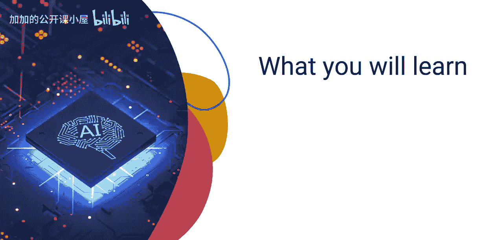
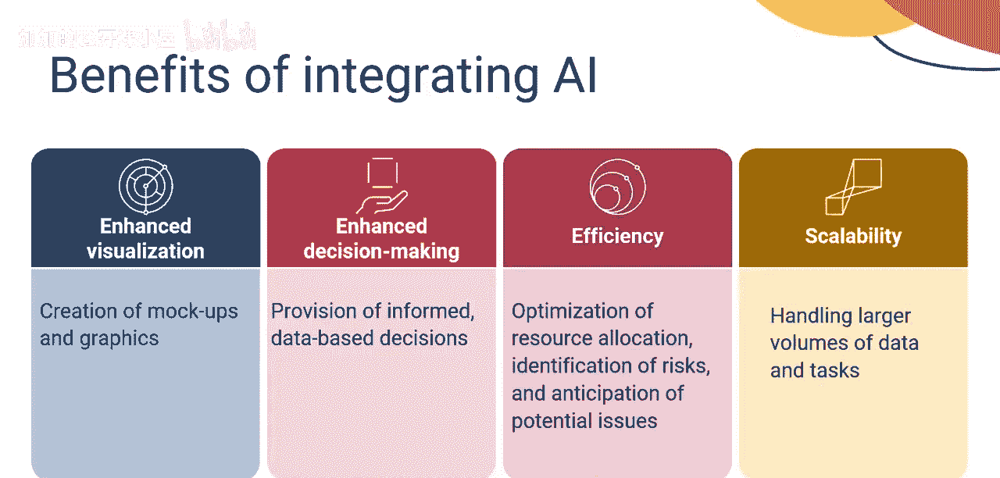
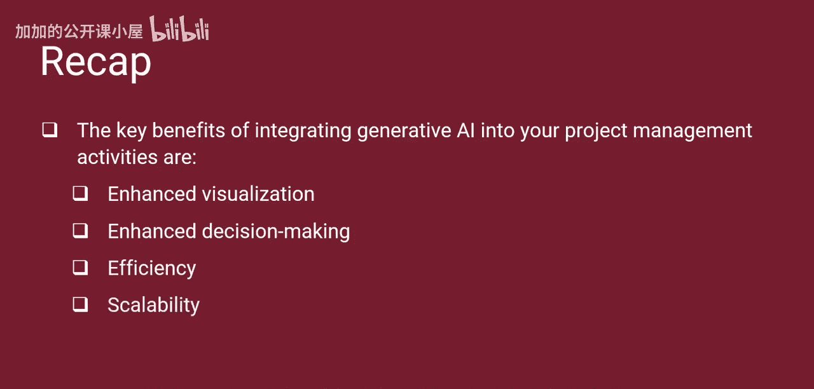

#  035：有效整合生成式人工智能

在本节课中，我们将学习如何将生成式人工智能有效地整合到项目管理者的日常工作中。我们将介绍一个分步方法，并探讨整合后带来的主要好处。

生成式人工智能是一股充满活力且正在崛起的力量，它拥有重塑项目规划与执行方式的潜力。项目管理者现在面临的挑战是理解并驾驭这个工具的力量。人工智能已成为所有项目管理者必须采纳的战略要务，以确保企业在客户对先进、高功能、技术驱动的解决方案需求日益增长时，能够提升竞争优势并满足客户期望。

接下来，让我们学习一个分步方法，以利用生成式人工智能的力量。

## 整合生成式AI的步骤

以下是有效整合生成式人工智能到项目管理活动中的关键步骤。

### 第一步：识别项目目标
审查启动项目的项目章程和商业论证。定义并量化项目的整体业务目标。与你的团队紧密合作，识别利用生成式人工智能的机会。例如，可能包括自动化某些任务、开发创造性的需求解决方案，或改善与利益相关者的内外部沟通。如果可能，招募具有生成式人工智能经验的团队成员。

### 第二步：开发用例
用例被定义为描述系统、产品或服务如何被其目标用户使用的特定场景或情境。它概述了步骤、交互和预期结果。用例可用于确定生成式人工智能可以应用于项目解决方案的哪些地方，以自动化流程、生成报告、促进头脑风暴会议或创建视觉资产。

### 第三步：分析工作流程
与你的团队紧密合作，分析项目的工作流程。工作分解结构定义了必须完成的工作包。项目网络图提供了所有工作包的端到端工作流程，并定义了项目的关键路径。识别关键活动、痛点、潜在瓶颈和风险。确定在哪里可以有效地使用生成式人工智能来简化和优化项目工作流程。

### 第四步：开发概念验证
采用迭代方法。选择一个单一用例并实施生成式人工智能解决方案。开发原型，评估性能，并从用户那里收集反馈。生成式人工智能是一段旅程，而非一个终点。

### 第五步：开发最小可行产品
最小可行产品被定义为具有刚好足够功能的产品版本，可供早期客户使用，然后他们可以为未来的产品开发提供反馈。MVP可以采取产品演示、落地页、原型或版本阶段可交付成果的形式。在使用自适应或敏捷框架时，开发MVP是每次迭代的目标。在预测性或瀑布式框架中，也可以通过分阶段或迭代的方法使用MVP。使用生成式人工智能系统开发MVP，评估影响，收集反馈并进行调整。

### 第六步：鼓励协作与反馈
鼓励团队成员之间持续的沟通和反馈。强调阿尔法和贝塔测试对于解决缺陷和征求客户反馈的重要性。持续优化你正在使用的生成式人工智能工具和模型，以获得额外的效率。

### 第七步：监控与控制
随时间监控你的生成式人工智能解决方案的有效性。跟踪关键指标，如生产力提升、错误率和用户满意度。强调记录和分享经验教训的重要性。经验教训对于与未来的项目管理者分享信息至关重要，这样他们可以从你当前项目中学到的东西中受益。

## 整合生成式AI的好处

将生成式人工智能整合到项目管理活动中可以获得多重好处。以下是主要优势列表：

*   **节省时间**：自动化重复性任务，如客户邮件、状态报告等。为项目管理者和团队腾出时间，专注于更关键的项目管理活动。
*   **改善沟通**：生成式人工智能可以提高沟通效率。这可能包括生成利益相关者信函、自动化信息共享或制定沟通管理计划。
*   **报告自动化**：生成式人工智能可以自动生成状态报告，使利益相关者保持知情和参与。这些报告可以被总结、组织和分发，无需人工干预。
*   **激发创造力**：生成式人工智能可用于头脑风暴需求和解决方案、生成用例等。它可以帮助在你的项目团队内促进创新。
*   **增强可视化**：生成式人工智能可以为演示和解决方案说明创建模型和图形。
*   **增强决策能力**：获取生成式人工智能的见解和建议，以提供更明智的、基于数据的决策。
*   **提高效率**：简化项目管理流程，以优化资源分配、识别风险并预测潜在问题。
*   **提升可扩展性**：扩展项目管理能力，以处理更大容量的数据和任务，而无需增加核心团队成员。

## 总结

本节课中，我们一起学习了生成式人工智能有潜力将项目管理推向卓越的新高度。项目管理者的角色是理解这种潜力，采取必要步骤有效利用这种力量，推动企业前进并为企业的客户增加价值。

有效整合生成式人工智能到日常项目管理活动所需的步骤包括：识别项目目标、开发用例、分析工作流程、开发概念验证、开发最小可行产品、鼓励协作与反馈、监控与控制。

将生成式人工智能整合到项目管理活动中的关键好处是：节省时间、改善沟通、报告自动化、激发创造力、增强可视化、增强决策能力、提高效率和提升可扩展性。