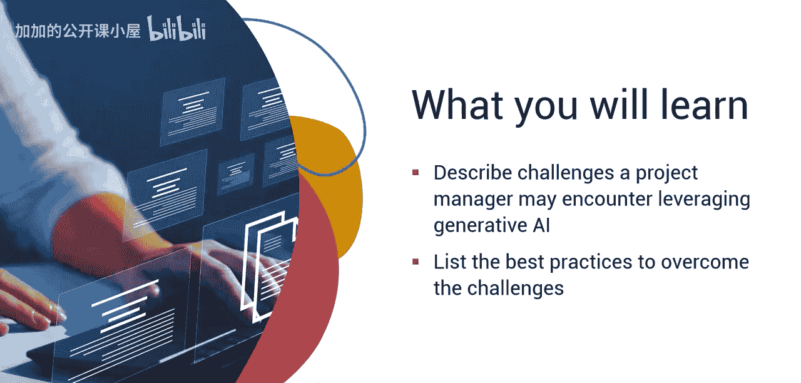
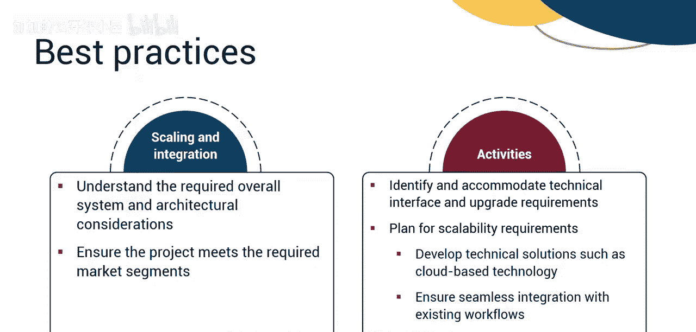
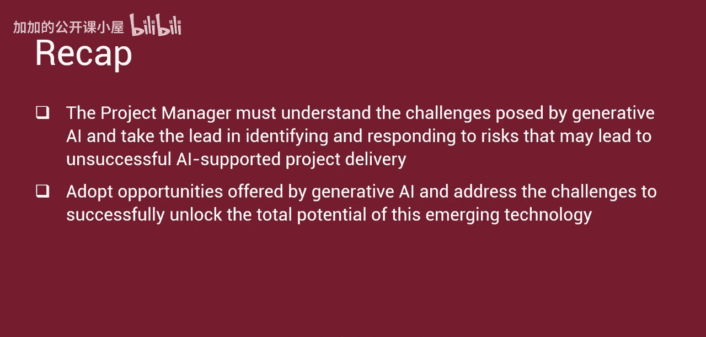

#  036：生成式人工智能的挑战 🚧

在本节课中，我们将学习项目经理在利用生成式人工智能时可能遇到的主要挑战，并探讨克服这些挑战的最佳实践。

生成式人工智能为项目经理带来了拥抱创新、规划和执行价值驱动型项目以及提升个人项目管理绩效的机遇。然而，在利用这一强大工具管理项目时，项目经理也必须意识到并解决一些挑战，这些挑战可能对项目的成功实施构成风险。

## 主要挑战

以下是项目经理需要关注的一些主要挑战。

*   **系统集成**：生成式人工智能系统通常需要与现有或遗留系统集成，以提供完整的功能和效益。某些遗留系统可能无法兼容人工智能技术，这可能导致计划功能的降级。项目经理必须识别系统依赖性并规划集成方案。
*   **治理与数据安全**：生成式人工智能算法通过访问可用数据来提供输出。项目经理必须与团队合作，确保敏感数据不会被无意中共享。数据共享可能导致安全漏洞、关键知识产权（IP）的意外泄露或违反隐私规定的信息披露。
*   **可扩展性**：AI扩展指的是扩大人工智能解决方案影响力和价值的过程。项目经理必须解决可能降低拟议AI能力可扩展性和覆盖范围的障碍。
*   **成本效益分析**：AI支持的项目需要充足的资源来规划、开发和完成。项目经理必须确保AI带来的效益超过其成本。所有公司的一个主要目标是确保其项目能增强公司的竞争力并提供投资回报率（ROI）。
*   **团队与人才**：利用AI增强项目需要一个技能多元化的专业团队协同工作以实现项目目标。目前，熟练的AI人才严重短缺，这可能导致项目范围缩减、进度延迟和资源成本高昂。
*   **伦理与偏见**：AI系统的优劣取决于其运行所访问的数据质量。AI偏见，也称为机器学习偏见或算法偏见，指的是由于人类偏见扭曲了原始训练数据或AI算法而导致的偏见性结果。这些偏见可能导致失真的输出和潜在的有害后果，引发客户不满、品牌受损、销售损失和项目失败。伦理指南同样复杂，必须被理解并遵守。AI领域的伦理违规可能产生深远影响，不仅波及公司，也影响个人和社会。

项目经理必须识别潜在挑战并减轻其可能带来的风险，以确保项目成功并实现价值驱动。

## 最佳实践

上一节我们介绍了主要挑战，本节中我们来看看克服这些挑战的一些实用建议。

*   **法规遵从**：确保了解公司关于数据共享的政策。如果政策有限或缺失，则起草一份政策，并将其纳入项目管理计划，同时在项目风险登记册中包含潜在风险。
*   **活动包含**：聘请法律和知识产权专家，确保管理数据共享的政策合法且可行。建立保障措施和检查机制，防止数据泄露或滥用。实施强大的数据管理系统，遵守隐私法规，保护敏感信息。
*   **伦理与偏见**：避免生成式AI模型中的偏见并应对法律复杂性，是AI产品成功的关键因素。与团队定期审核模型，确保关键利益相关者（具备识别和减少偏见的技能与意识）参与模型开发。理解版权和专利影响。理解并定义必须指导AI产品开发的伦理准则。实施质量控制措施，在问题对项目可交付成果产生负面影响之前识别并缓解问题。
*   **资源管理**：项目经理必须确保利用生成式AI模型所需的所有技能和能力都已到位并致力于追求卓越。分析每个项目章程，制定列出每个团队成员角色和职责的利益相关者登记册。进行技能评估，识别团队已具备的技能和所需的技能，将技能差距汇报给高级管理层，并制定解决方案以内部培养或外部获取所需技能。投资培训现有团队，将培训工作包添加到工作分解结构（WBS）中。生成式AI领域发展迅速，确保团队能够获取并了解当前和未来的趋势。与团队紧密合作，确定实现产品目标所需的所有人员和其他资源。制定资源管理计划，高效地分配资源。
*   **成本效益分析**：进行成本效益分析，量化产品概念的价值。优先考虑特性和功能，以确保满足最小可行产品（MVP）需求并最大化投资回报率（ROI）。
*   **沟通管理**：制定沟通管理计划，确保信息能够及时提供。沟通是维系项目的粘合剂。进行有效且频繁的沟通与协作。
*   **扩展与集成**：理解有效规划和执行AI支持项目所需的整体系统与架构考量。确保项目满足当前及扩展市场领域的需求，您的项目可交付成果必须支持这些需求。识别并满足技术接口需求和升级要求，以解决兼容性问题并弥合差距，创建统一无缝的系统。从一开始就为可扩展性做规划。识别需求并开发技术解决方案（例如基于云的技术）以满足可扩展性需求。确保与现有工作流程无缝集成。

## 总结

本节课中，我们一起学习了项目经理必须理解生成式人工智能带来的挑战，并带头识别和应对那些可能导致AI支持项目交付失败的风险。通过采纳生成式AI提供的机遇并应对其挑战，才能成功释放这一新兴技术的全部潜力。