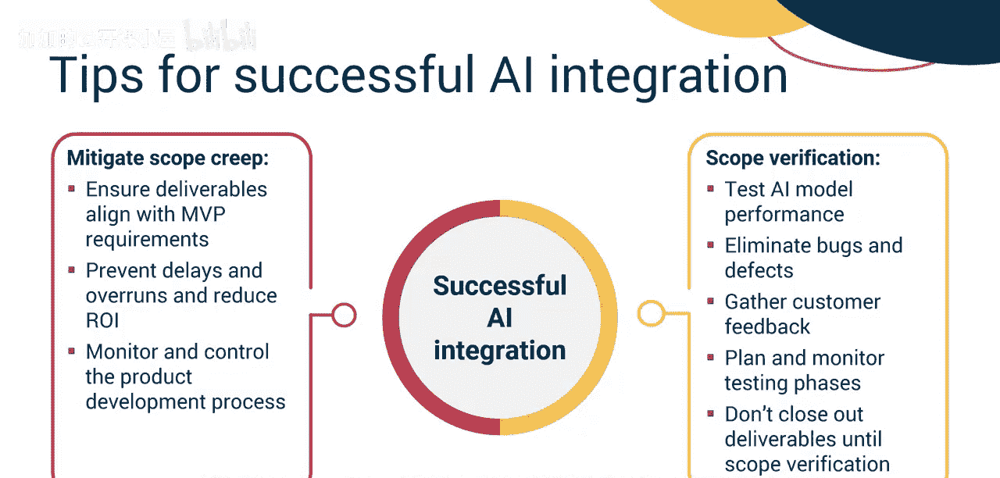
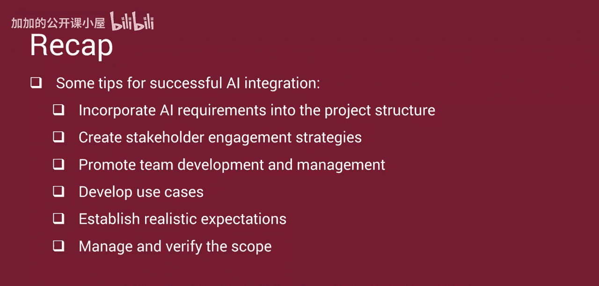

#  037：生成式人工智能流程成功

欢迎来到生成式AI流程成功课程。观看本视频后，你将能够定义生成式AI开发流程中的步骤，并识别确保生成式AI开发流程成功的要点。

项目经理负责确保用于支持项目的生成式AI系统被无缝集成并创造价值。成功的集成有助于做出明智的决策、提升项目质量、节省潜在的进度和资源，并为利益相关者改善价值。

## 集成生成式AI的步骤

上一节我们介绍了项目经理在生成式AI项目中的总体责任，本节中我们来看看将生成式AI集成到项目中的具体步骤。

项目经理从项目章程开始，该章程概述了项目的基本情况。他们审查项目目标，并确保在规划阶段，生成式AI被纳入项目的需求文档中。

接下来，项目经理必须评估组织的准备情况，方法是识别支持组织战略计划并解决客户痛点或机遇的机会。他们应评估在项目管理流程中实施生成式AI所需技术的可用性，并确保这些需求被包含在项目的需求文档中。

然后，项目经理应组建团队，识别将生成式AI集成到项目中的关键利益相关者。这些利益相关者应记录在初始的利益相关者登记册中，并明确界定角色和职责。

项目经理应与关键利益相关者协作，包括数据科学家、机器学习工程师、领域专家、设计师和开发团队。每个利益相关者都可以分享独特的视角和知识，以改进整体项目可交付成果。

在整个规划过程中，项目经理和利益相关者应持续审查和验证项目计划，以确保一致性和进展。

最后，为了在项目中利用生成式AI系统，项目经理应与主题专家密切合作，以收集和准备数据、选择合适的生成式AI模型、集成系统并训练模型。

模型选择是生成式AI集成的关键部分，因此项目经理必须与数据科学家合作，选择符合项目和组织目标的正确AI模型。项目经理还应制定质量管理计划来测试模型并收集用户反馈。由于项目经理通常不是生成式AI专家，识别并聘请专家以确保所选AI模型创造价值至关重要。项目经理应在执行和监控阶段继续与这些专家密切合作，以确保项目目标得以实现。

## 确保AI集成成功的要点

上一节我们介绍了集成生成式AI的具体步骤，接下来我们将探讨一些确保这种AI集成成功的要点。

以下是项目经理可以遵循的关键实践：

*   **将AI要求纳入项目结构**：项目经理应确保生成式AI集成要求被纳入项目工作分解结构（WBS）和项目网络图中。这意味着所有受生成式AI影响的活动都必须明确定义和分配。
*   **制定利益相关者参与策略**：项目经理应识别构成跨职能项目团队的各种角色。由于不能假设利益相关者的承诺，项目经理必须确定每个利益相关者所需的承诺水平。制定利益相关者参与策略对于确保所有利益相关者都达到所需的承诺水平非常重要。
*   **促进团队建设与管理**：项目经理必须通过团队发展的形成、震荡、规范和表现阶段来组建、发展和管理项目团队。建设一个成功的团队包括提供一个让团队成员相信他们能够为组织取得个人和集体成功的环境。你应该制定可衡量的绩效目标，提供及时反馈，并在问题出现时及时解决。由沟通管理计划促进的有效沟通有助于团队协作和生产力。
*   **开发用例**：为了做出明智的决策，项目经理与专家密切合作开发用例。这些用例有助于识别生成式AI可以增强项目规划、执行以及整体可交付成果质量和价值的机会。例如，一个用例可能详细描述用户如何与需要与用户体验（UX）团队协调的新产品交互，以确保无缝且令人满意的客户体验。
*   **建立现实的期望**：建立现实的项目期望至关重要。所有项目需求和可交付成果规格都应遵循SMART标准：**具体的、可衡量的、可实现的、相关的、有时限的**。这确保了清晰性和可行性，引导项目走向成功。
*   **管理与验证范围**：为了减轻范围蔓延的风险，必须确保所有项目可交付成果都符合最小可行产品（MVP）要求，并且不超过既定的功能和规格。范围蔓延可能导致进度延迟、成本超支并降低投资回报率（ROI）。因此，作为项目经理，你必须密切监控和控制微调过程，以确保最终产品满足MVP规格，没有不必要的添加。最后，验证可交付成果的范围至关重要。这涉及通过阿尔法测试来消除错误和缺陷，以及通过贝塔测试来收集关键的客户反馈，从而测试模型的性能。作为项目经理，你负责有效地规划和监控这些测试阶段。在范围验证完成之前，不得结束项目或移交可交付成果，这一点至关重要，以确保最终产品达到预期的标准和期望。

## 总结

在本节课中，我们一起学习了项目经理如何确保支持项目的生成式AI系统被无缝集成并创造价值。我们探讨了将生成式AI集成到项目中的步骤：使项目章程与目标保持一致、评估组织准备情况、规划利益相关者参与、选择并集成AI模型、鼓励持续协作。我们还介绍了一些确保AI集成成功的要点：将AI要求纳入项目结构、制定利益相关者参与策略、促进团队建设与管理、开发用例、建立现实的期望、管理与验证范围。

