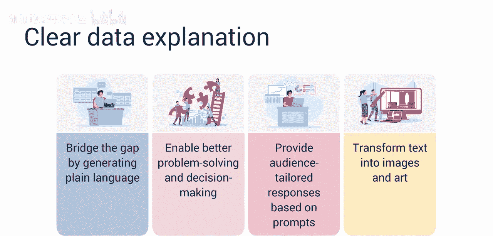
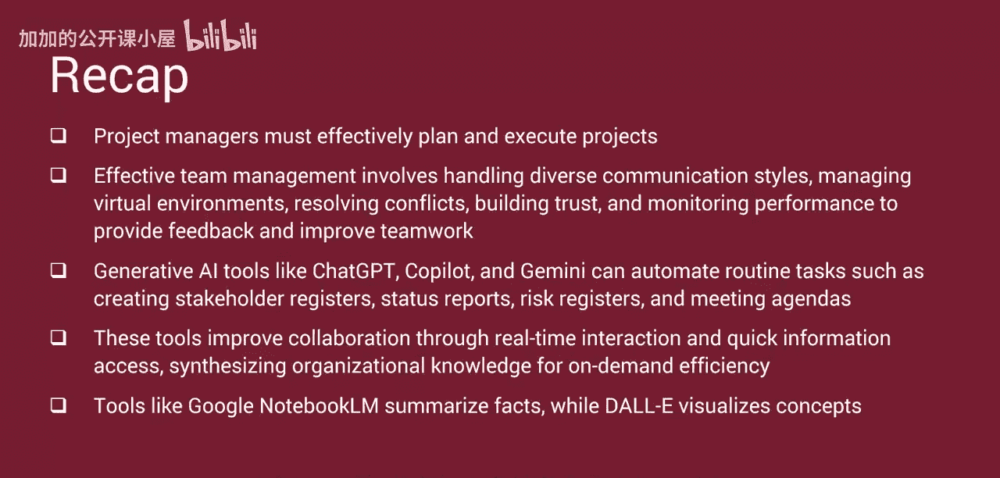

#  038：利用生成式人工智能提升沟通与协作效率

在本节课中，我们将学习如何利用生成式人工智能来改善项目中的沟通与协作。你将能够总结关键的沟通与协作要求，并说明生成式AI如何提升其有效性。

根据项目管理协会的数据，沟通是项目经理所需的最重要技能之一。沟通直接或间接地影响着项目经理必须执行的大约90%的任务。成功的项目经理明白，沟通与协作是将项目凝聚在一起的粘合剂。

上一节我们介绍了沟通的重要性，本节中我们来看看项目经理如何为项目成功管理端到端的沟通。

## 项目经理的核心职责

项目经理必须有效地规划并执行项目。这些广泛的职责包括准备面向高管的沟通材料和状态报告、高效地主持会议、制定和管理范围、进度及成本基线、管理风险、分享知识以及营造持续改进的环境。

### 识别与吸引相关方

识别相关方并吸引其参与至关重要。项目经理必须识别所有必要的相关方，并分配他们各自的角色与职责。他们必须制定策略来吸引相关方并获得其承诺。

### 团队建设与管理

有效的团队建设与管理对项目成功至关重要。项目经理必须管理具有不同沟通风格的团队、建立规范和基本规则，并管理虚拟环境。即使团队不使用共同语言，他们也必须确保有效沟通。项目经理还应向团队成员提供个性化的培训计划，以确保团队具备成功所需的技能。此外，项目经理必须能够解决团队内的冲突并建立信任。最后，项目经理必须监控团队绩效并提供反馈，以维持并改进绩效。他们还必须分析来自多方相关方的反馈。

## 生成式AI如何赋能沟通与协作

生成式AI工具具备增强项目管理中沟通与协作的能力，能够应对许多常见挑战。让我们探讨一些生成式AI如何提升整体项目管理有效性的例子。

### 自动化常规任务

生成式AI系统，如 **ChatGPT**、**Copilot** 和 **Gemini**，可以分析项目数据，生成全面的相关方登记册、明确定义角色与职责，并自动生成状态报告、风险登记册、会议议程和纪要。这种自动化减少了项目经理在常规任务上的时间，使他们能够专注于更关键的活动。

### 个性化沟通

生成式AI工具可以分析相关方偏好，并定制沟通内容以满足特定需求。它们还可以通过分析沟通模式来调整项目经理或相关方的沟通风格。例如，生成式AI可以分析某位相关方偏好简洁的更新，从而将项目摘要定制为简短的要点列表。它还可以将项目经理的正式风格调整为针对特定受众的更对话式的风格，并根据过去成功的互动经验建议谈判策略。

### 促进实时协作

生成式AI可以生成自然语言界面，利用向量化知识库，提供类人的响应，从而改善相关方协作。团队成员可以向AI工具提问并立即获得信息。这种按需访问减少了对项目经理的依赖。像 **Copilot**、**ChatGPT** 和 **Gemini** 这样的工具支持虚拟协作环境，团队成员无论身处何地都可以实时互动与协作。

### 整合与访问知识

生成式AI可以整合组织内的知识，使其易于访问，并减少获取关键信息所需的时间，从而提高效率和生产力。像 **Copilot**、**ChatGPT** 和 **Gemini** 这样的工具通过提供对整合知识的快速访问，使团队能够专注于完成基本任务。

### 简化流程与跨越障碍

生成式AI可以简化沟通过程，并实现跨地域边界和文化的无缝沟通。它可以为团队章程的制定建议相关的基本规则和规范，促进实时沟通与协作，同时降低误解风险。

### 辅助内容创作与可视化

AI写作和转述工具，如 **Google NotebookLM**，可以总结事实、解释复杂想法并组织信息。像 **DALL-E** 这样的工具可以提供项目概念和理解的视觉呈现。

### 模拟场景与决策支持

生成式AI可以模拟各种场景，并通过分析潜在结果和影响来提供决策支持。它可以跟踪沟通与协作指标以衡量进展、识别趋势并相应调整策略。

### 弥合技术鸿沟

生成式AI可以通过用通俗语言解释复杂数据，来弥合技术与非技术相关方之间的差距。这种清晰度增强了理解，从而实现更好的问题解决、决策制定和团队整体协作。像 **Copilot**、**Gemini** 和 **ChatGPT** 这样的工具可以根据提示提供针对受众的响应。**DALL-E 3** 可以将基本的文本想法转化为详细的图像和AI生成的艺术品，将项目概念生动地可视化。

## 总结

本节课中我们一起学习了项目经理必须有效规划并执行项目。有效的团队管理涉及处理不同的沟通风格、管理虚拟环境、解决冲突、建立信任以及监控绩效以提供反馈和改进团队合作。

生成式AI工具，如 **ChatGPT**、**Copilot** 和 **Gemini**，可以自动化创建相关方登记册、状态报告、风险登记册和会议议程等常规任务。这些工具通过实时互动和快速信息访问来改善协作，整合组织知识以实现按需高效访问。

像 **Google NotebookLM** 这样的工具可以总结事实，而 **DALL-E** 可以将概念可视化。AI通过通俗易懂的解释和视觉呈现，弥合了技术与非技术相关方之间的差距。

