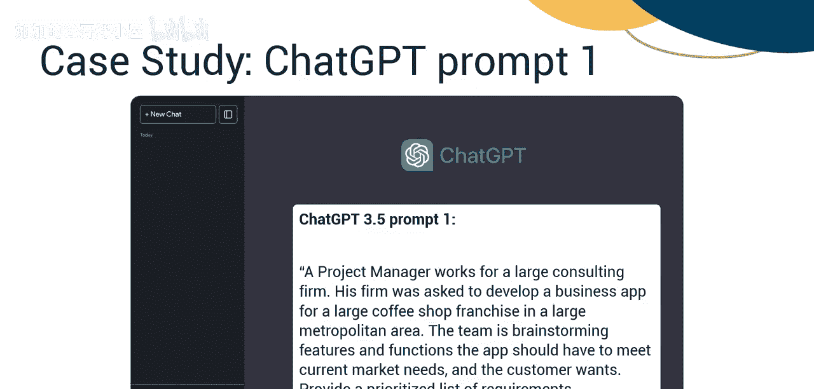
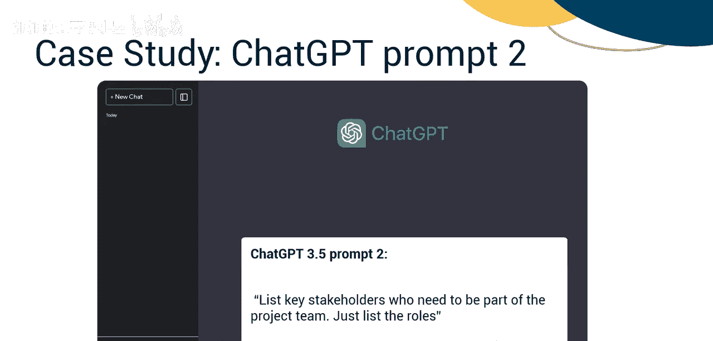
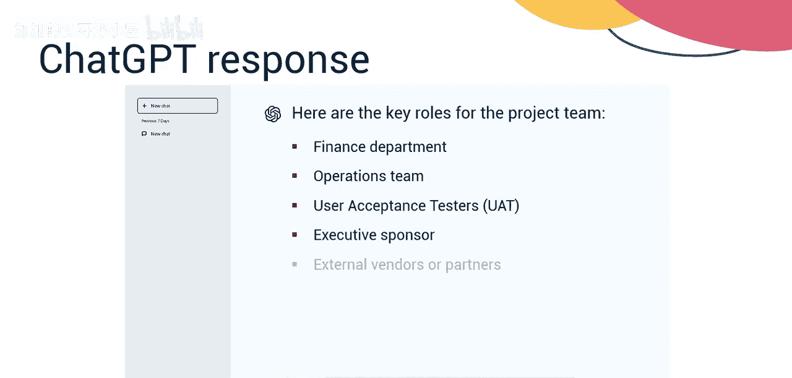
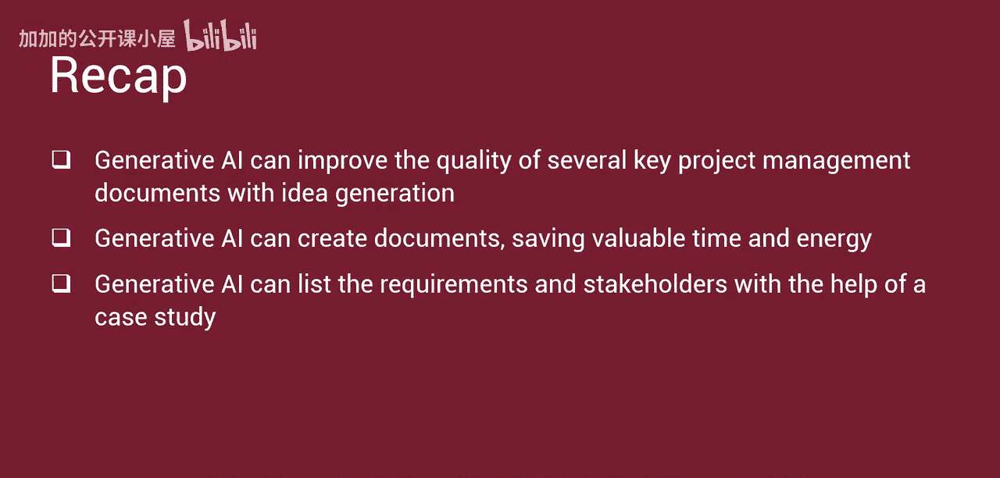

#  039：生成式AI在创意生成与需求识别中的应用 🚀


在本节课中，我们将学习生成式人工智能如何辅助项目经理进行创意生成和需求识别。我们将探讨哪些项目管理文档可以从中受益，并通过一个简短的案例研究来具体说明其有效应用。

## 概述

生成式AI能够帮助项目经理进行头脑风暴，为项目生成广泛的创意。通过向AI提供项目目标、约束条件和背景等相关信息，它可以产出关于方法、功能或解决方案的创造性建议。此外，生成式AI还能通过分析大量数据、用户反馈、市场趋势或现有项目文档来协助分析项目需求，帮助识别模式、提取关键见解，并基于分析数据提出需求建议。

## 项目管理文档的应用

上一节我们介绍了生成式AI的基本应用，本节中我们来看看它具体能优化哪些关键的项目管理文档。

以下是几类可以受益于生成式AI进行创意生成和内容创建的关键项目管理文档：

*   **项目章程**：生成式AI帮助项目经理构思并阐述项目章程中所需的项目愿景、目标、范围和成功标准。它协助生成清晰、简洁的陈述，以符合利益相关者的期望和项目目标。
*   **项目计划**：生成式AI通过生成**工作分解结构（WBS）**、网络图、项目预算和多种支持计划，来支持项目经理制定详细的项目计划。
*   **需求文档**：生成式AI通过生成用例、用户故事、功能规格和验收标准，支持项目经理进行需求获取、分析和记录。它有助于确保需求被明确定义、可追溯，并与利益相关者的需求和期望保持一致。
*   **风险管理计划**：生成式AI帮助项目经理识别潜在的项目风险、评估影响和概率，并制定风险应对策略。它可以基于历史数据、行业基准和专家知识，生成风险登记册、风险评估矩阵和应急计划。
*   **沟通计划**：生成式AI通过建议沟通事项、渠道、频率、利益相关者和关键信息，协助项目经理制定全面的沟通管理计划。它生成状态报告模板、会议议程和利益相关者更新，以促进项目生命周期内的有效沟通。
*   **变更管理计划**：生成式AI通过生成变更管理计划、影响评估和整体变更控制流程，帮助项目经理预测和管理变更。它建议评估变更请求、获得批准和实施变更的策略，同时最大限度地减少对项目活动的干扰。
*   **质量管理计划**：生成式AI通过生成质量标准、指标和保证流程，协助项目经理制定质量管理计划。它建议用于监控和评估项目可交付成果、识别缺陷和实施纠正措施以保持产品质量的技术。
*   **采购管理计划**：生成式AI通过生成采购文件、**建议邀请书（RFP）**、**工作说明书（SOW）** 和供应商评估标准来支持项目经理。它通过建议供应商选择标准、谈判策略和合同条款来帮助简化采购流程。

## 案例研究：咖啡店应用开发

了解了理论应用后，我们通过一个案例来具体看看生成式AI如何在实际项目中发挥作用。本案例使用ChatGPT 3.5进行演示。

**背景**：一位项目经理在一家大型咨询公司工作。他的公司被要求为一个大都市区的大型咖啡店连锁品牌开发一款商业应用。团队正在头脑风暴，思考该应用应具备哪些功能和特性以满足当前市场需求和客户期望。


**提示词1**：
```
一位项目经理在一家大型咨询公司工作。他的公司被要求为一个大都市区的大型咖啡店连锁品牌开发一款商业应用。团队正在头脑风暴，思考该应用应具备哪些功能和特性以满足当前市场需求和客户期望。请为此商业应用提供一个优先排序的需求推荐列表。
```



**ChatGPT 3.5 回复**：
以下是该咖啡店连锁品牌商业应用的优先需求列表：
1.  移动点单
2.  支付集成
3.  订单追踪
4.  菜单定制
5.  奖励与忠诚度计划
6.  推送通知
7.  门店定位与营业时间
8.  反馈与评分
9.  社交媒体集成
10. 无障碍功能
11. 个性化推荐
12. 多语言支持
13. 订单历史
14. 库存管理
15. 分析与报告

**后续提示词**：
```
列出需要成为项目团队成员的关键利益相关者。仅列出角色。
```




**ChatGPT 3.5 回复**：
以下是项目团队的关键角色：
*   客户代表
*   项目经理
*   开发团队
*   业务分析师
*   营销团队
*   法律与合规专家
*   客户服务代表
*   IT基础设施团队
*   财务部门
*   运营团队
*   用户验收测试员（UAT）
*   执行发起人
*   外部供应商或合作伙伴



## 总结




本节课中，我们一起学习了生成式AI在项目管理创意与需求阶段的强大辅助作用。你了解到，生成式AI可以通过创意生成来提高多份关键项目管理文档的质量，并能自动生成文档内容，节省宝贵的时间和精力。通过案例研究，我们看到生成式AI能够有效地列出项目需求和识别关键利益相关者角色，为项目启动和规划提供了扎实的基础。