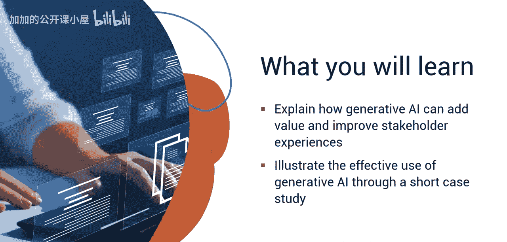
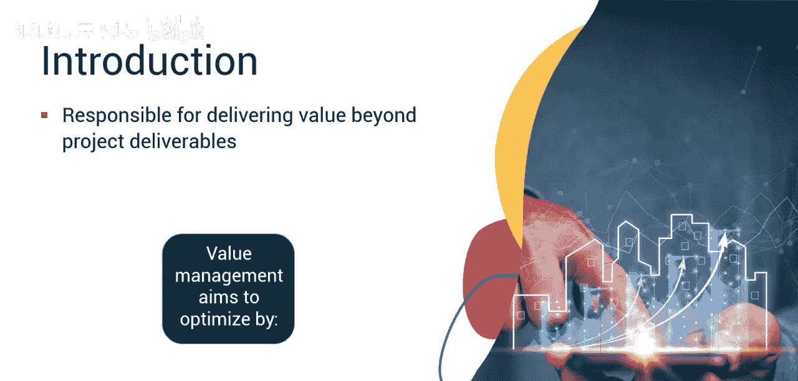
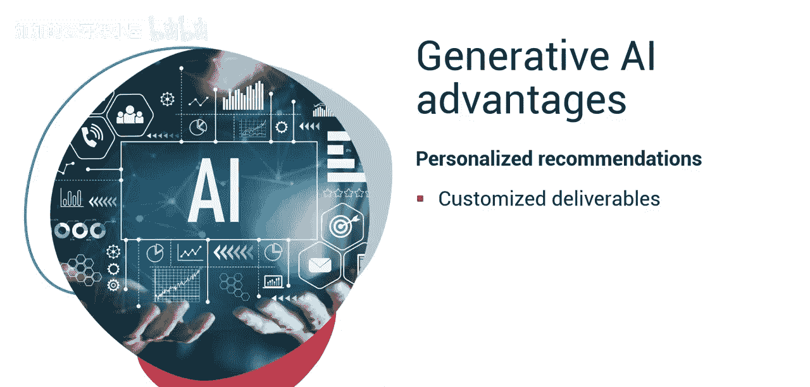
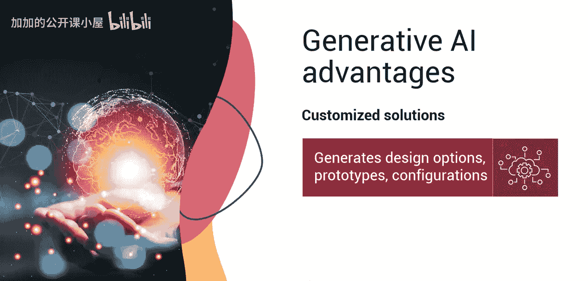
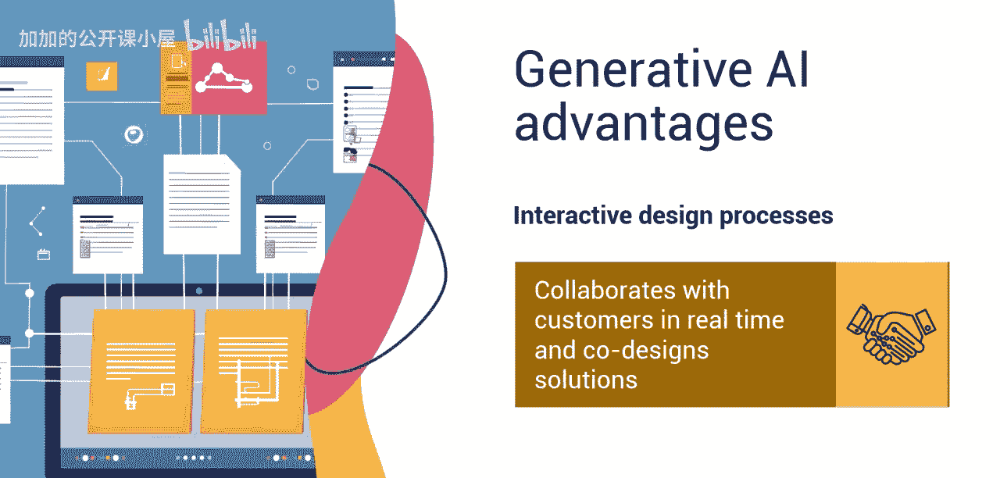
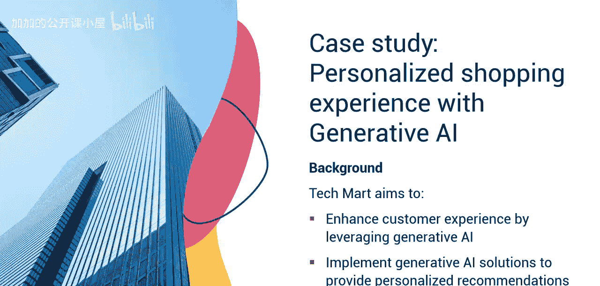
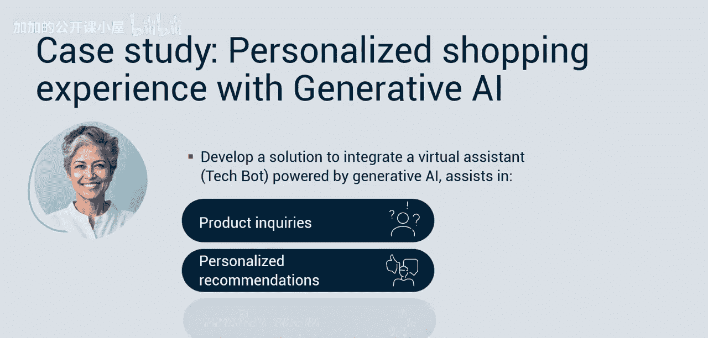
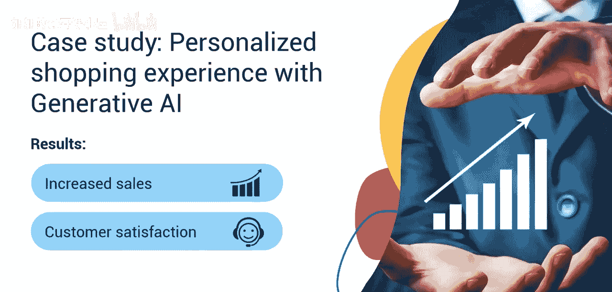
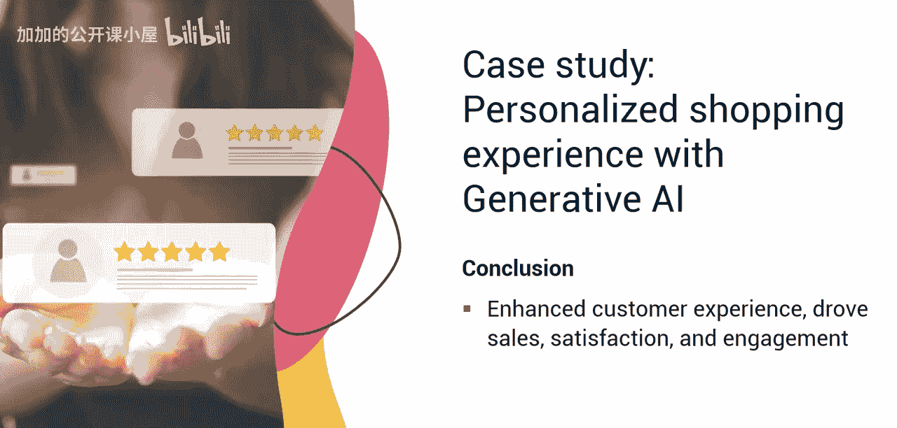
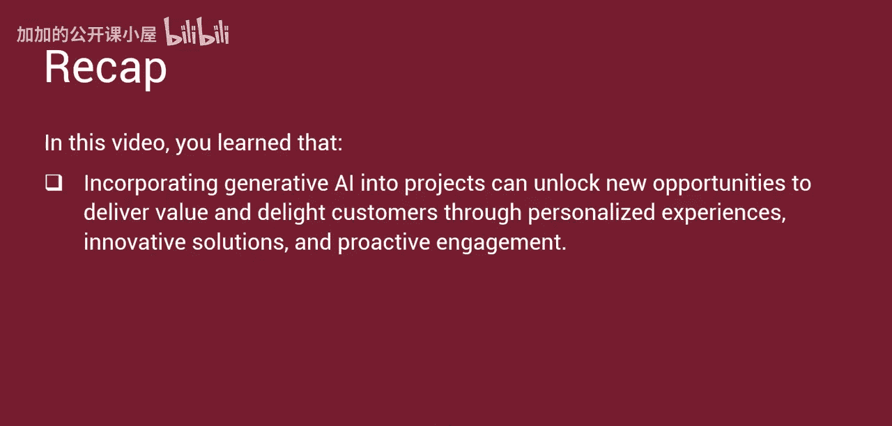

#  040：利用生成式人工智能提升利益相关者体验并创造价值 🚀

在本节课中，我们将要学习生成式人工智能如何为项目创造价值，并提升利益相关者的体验。我们将通过一个简短的案例研究，具体说明其有效应用。

## 项目经理的价值交付责任

上一节我们介绍了生成式AI的基础概念，本节中我们来看看它在项目管理中的核心应用场景——价值交付。

《项目管理知识体系指南》（PMBOK）第七版强调了项目经理交付价值的责任。价值不仅仅在于提供计划中的项目可交付成果。项目是交付价值的系统，专业人员必须考虑更广泛的效益和组织绩效背景。价值管理的目标是通过激励人员、发展技能、促进协同和鼓励创新来优化组织绩效。

## 生成式AI如何创造价值

将生成式人工智能融入项目，可以开辟交付价值的新机会。您可以通过个性化体验、创新解决方案和主动互动来取悦客户。生成式AI算法可以分析客户和利益相关者数据，以生成定制化的可交付成果并提高沟通效率。

以下是生成式AI创造价值的主要方式：

*   **个性化定制**：项目经理可以利用此功能，根据个人客户偏好定制可交付成果，从而提高满意度和价值。例如，如果利益相关者偏好简洁的电子邮件更新，项目经理可以相应地定制沟通方式。反之，如果另一位利益相关者偏好详细的进度报告，项目经理则可以提供更全面的文档。
*   **满足特定需求**：项目经理必须管理利益相关者的期望，并符合他们对价值的定义。一些项目可交付成果需要定制以满足特定的利益相关者需求。生成式AI可以生成与客户要求紧密契合的设计选项、原型或配置。
*   **促进协同设计**：在范围规划期间，项目经理必须与关键利益相关者密切合作。生成式AI可以促进互动式设计过程，让利益相关者积极参与产品或服务的创建。项目经理可以使用生成式AI工具与客户实时协作，共同设计出满足并超越期望的解决方案。

## 生成式AI的赋能应用

除了直接创造价值，生成式AI还能在多个方面赋能项目管理。

*   **自动化内容创建**：项目经理必须能够分享项目团队提出的价值主张。生成式AI可以自动化内容创建，包括项目愿景、最小可行产品（MVP）建议、产品和服务描述、营销材料和用户文档。
*   **预测分析与洞察**：生成式AI分析过去的项目数据和反馈，以预测未来趋势或客户行为。项目经理可以利用这些洞察来预测客户需求、降低风险，并在问题发生前主动解决。
*   **部署虚拟助手**：由生成式AI驱动的虚拟助手为客户提供个性化支持和指导。项目经理可以部署虚拟助手来回答查询、提供建议或提供故障排除协助。这提升了整体的客户体验和价值。

## 案例研究：Techmart的个性化电商体验

为了更具体地理解上述应用，我们来看一个案例。一家领先的电商公司Techmart，旨在利用生成式AI技术提升客户体验。项目经理Priya的任务是实施一个包含生成式AI解决方案的项目，以提供个性化推荐并提高客户满意度。

### 项目规划与实施

Priya启动了范围规划。她与公司的数据科学团队合作，开发了一个由生成式AI算法驱动的推荐引擎。该引擎将分析客户的浏览历史、购买行为和人口统计信息，以生成个性化的产品推荐。此外，Priya和她的团队计划开发一个解决方案，将生成式AI驱动的虚拟助手集成到公司的网站和移动应用中。这个名为Techbot的虚拟助手将协助客户进行产品查询、提供个性化推荐，并在整个购物旅程中提供实时支持。

### 项目成果与价值体现

该项目取得了成功并提供了客户价值。

*   **提升销售与转化**：由AI驱动的引擎生成的个性化产品推荐带来了销售额的显著增长。客户欣赏这些符合他们偏好的定制化建议。个性化的推荐为Techmart带来了更高的转化率和收入增长。
*   **提高满意度与忠诚度**：Techbot的主动协助和个性化指导让客户感到满意，提高了整体满意度和忠诚度。客户在整个购物体验中感到被重视和支持。个性化的指导带来了积极评价和口碑推荐。
*   **增强用户参与度**：Techbot的互动性鼓励客户积极参与平台互动。这种互动性带来了更长的会话时长和重复访问。虚拟助手理解和响应实时客户查询的能力，增强了用户参与度和留存率。
*   **提供未来洞察**：Priya利用来自推荐引擎和虚拟助手互动的数据，获得了关于客户偏好和行为的宝贵洞察。这些反馈通过提供营销策略、潜在的产品开发计划以及改进客户互动工作的最佳实践，帮助了未来的项目经理。

Techmart利用了生成式AI的力量，成功地提升了客户体验，并推动了销售、满意度和参与度。项目团队对个性化推荐和虚拟助手的战略实施，展示了生成式AI如何使项目经理在快速发展的电商领域中提供价值和客户满意度。

## 总结

本节课中我们一起学习了，将生成式人工智能融入项目可以开辟新的机会，通过个性化体验、创新解决方案和主动互动来交付价值并取悦客户。