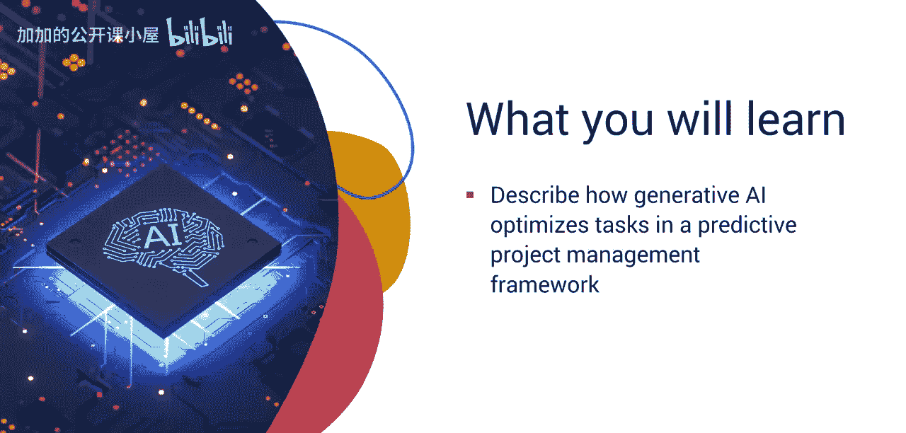
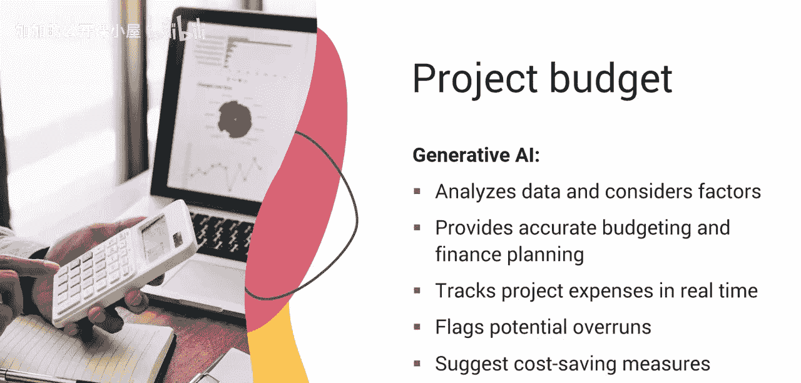
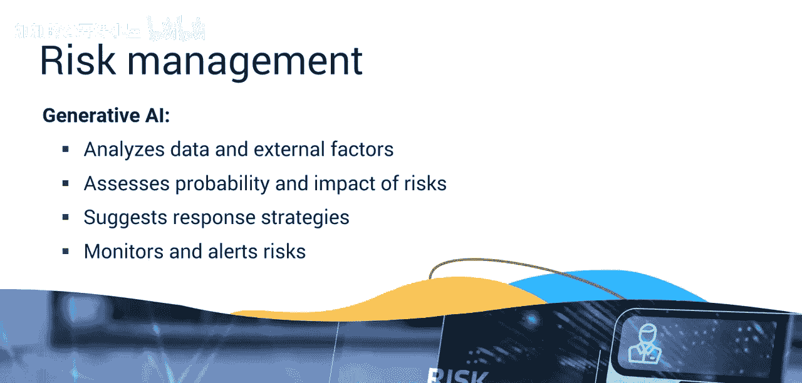
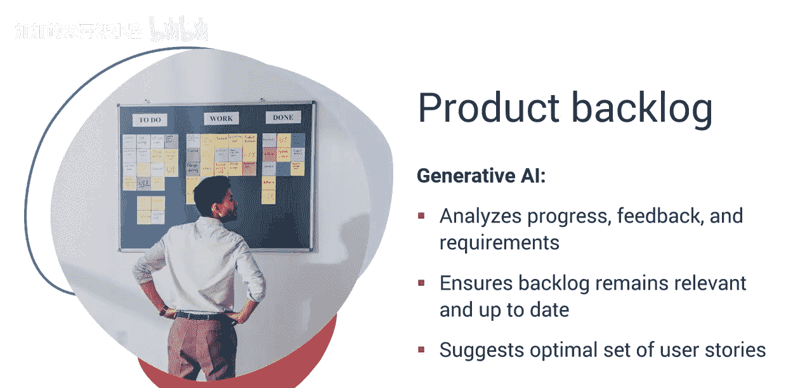
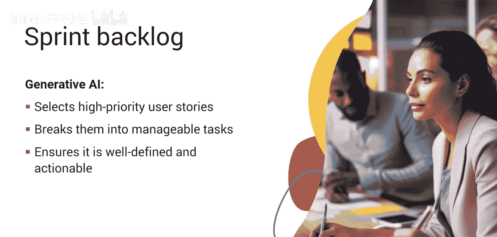
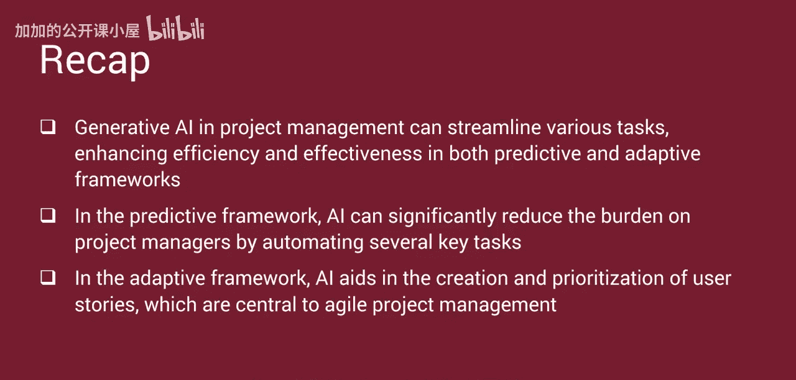

#  041：生成式AI助力任务高效处理 🚀

在本节课中，我们将学习生成式AI如何优化预测型和适应型项目管理框架中的任务，从而提升项目管理的效率与效果。

## 概述

项目经理需要执行大量的规划流程来准备项目执行。项目管理协会定义了49个确保项目成功必须完成的特定流程，其中26个发生在启动和规划流程组中。每个流程都至关重要，需要投入时间和精力以确保规划满足项目需求。此外，一些项目经理必须使用适应型或敏捷框架来管理项目。接下来，我们将探讨生成式AI如何在预测型和适应型框架中简化项目管理任务。

## 预测型框架中的任务优化

首先，我们来了解AI如何帮助简化预测型框架中的任务。

### 项目章程制定

项目章程提供了项目目标的高层概述，必须得到项目发起人的批准。生成式AI可以通过访问初始项目讨论、范围文件和组织目标的信息来起草项目章程。它能使项目章程符合组织标准，并通过突出利益相关者和决策者关注的关键领域来促进更快批准。

### 利益相关者识别与管理

识别关键利益相关者并分配角色和职责是关键的规划步骤。AI通过分析项目文档、组织架构图和以往项目数据来帮助识别相关利益相关者。它可以评估利益相关者的影响力、兴趣和对项目的影响。通过评估利益相关者的沟通偏好、过往互动和项目角色，AI可以建议量身定制的参与策略，确保有效且个性化的利益相关者管理。

### 工作分解结构创建

工作分解结构是规划的基石，为执行所有必需的项目活动或工作包提供了有条理的方法。生成式AI可以通过分析项目目标、范围文件和类似的历史项目，自动创建详细的WBS。这减少了手动开发所需的时间和精力。AI可以根据项目范围变更或新信息动态更新WBS，确保其始终准确且相关。

### 网络图与进度规划

在整个项目生命周期中，网络图利用工作包来制定端到端的项目进度。AI算法可以通过识别高效的活动顺序和依赖关系来生成网络图，从而更准确地可视化项目时间线和关键路径。生成式AI可以模拟不同的项目场景，帮助项目经理理解进度或资源变更的影响，并相应调整计划。

### 项目预算编制

项目预算确定了获取基本项目资源所需的资金。AI可以通过分析历史数据并考虑资源可用性、市场趋势和项目复杂性等因素来预测项目成本，从而实现更准确的预算和财务规划。生成式AI可以实时跟踪项目支出，标记潜在的超支，并建议节约成本的措施，以帮助维持预算。

### 沟通管理计划制定

沟通管理计划确保在正确的时间以有效的方式将正确的信息传达给正确的利益相关者。AI可以通过分析沟通偏好、过往互动和项目需求，为不同的利益相关者设计量身定制的沟通计划。这确保了信息分发的高效性。生成式AI可以自动生成定期的项目更新和报告，确保及时且一致的沟通，而不会给项目团队带来负担。

### 风险管理

项目经理必须主要通过风险登记册来识别和评估影响项目的风险。AI可以通过分析项目数据和外部因素来识别潜在风险，评估这些风险的概率和影响，并建议风险应对策略。它可以持续监控风险，提醒项目经理注意新出现的问题，并实现主动的风险管理。

## 适应型框架中的任务优化

接下来，我们看看适应型框架。许多项目是使用混合或适应型方法完成的。适应型框架包括各种敏捷方法，如Scrum。使用敏捷框架完成的项目也带来了挑战，AI同样可以提供支持。

### 用户故事生成与优化

用户故事按角色、需求和价值总结项目需求，通常由产品负责人创建。然而，许多组织要求项目经理执行这项工作。AI可以通过分析项目需求、用户反馈和类似的历史项目来生成用户故事，减少手动创建所需的时间，并确保一致性和全面性。AI帮助根据业务价值、用户影响和开发复杂性等因素对用户故事进行优先级排序，并通过建议改进和补充细节来优化它们。

### 产品待办列表管理

产品待办列表是用户故事的存储库，根据客户价值和期望的完成顺序进行优先级排序。生成式AI通过持续分析项目进展、利益相关者反馈和不断变化的需求，协助组织维护产品待办列表，确保其保持相关性和最新状态。AI可以考虑团队容量、依赖关系和优先级，为每个冲刺周期建议最优的用户故事集合，从而促进高效的冲刺周期。

### 冲刺待办列表与任务分配

冲刺待办列表列出了成功完成一个用户故事所需的所有任务。AI通过从产品待办列表中选择最高优先级的用户故事并将其分解为可管理的任务，来帮助生成冲刺待办列表，确保冲刺待办列表定义明确且可操作。AI根据团队成员的技能、过往表现和适合性，协助将任务分配给团队成员。

## 总结

本节课中，我们一起学习了生成式AI在项目管理中如何简化各种任务，从而在预测型和适应型框架中提升效率与效果。在预测型框架中，AI可以通过自动化多项关键任务，显著减轻项目经理的负担。在适应型框架中，AI有助于创建和优化用户故事，这是敏捷项目管理的核心。通过利用生成式AI，项目经理可以更专注于战略决策和团队领导，推动项目成功。