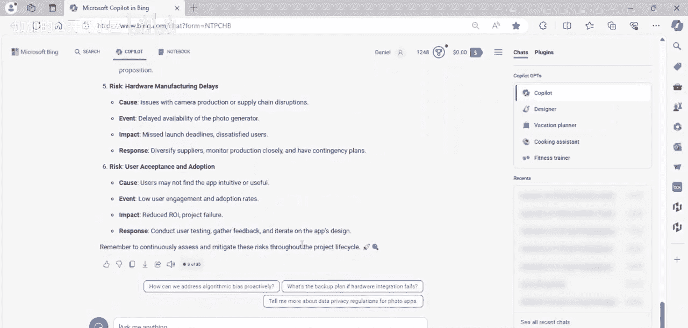
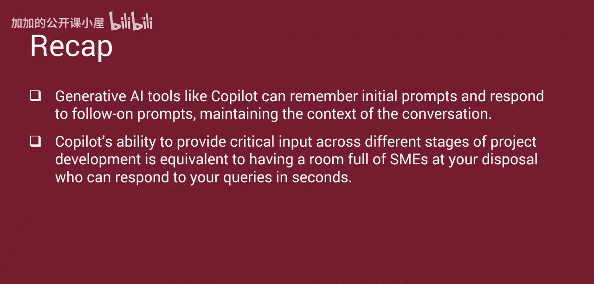

#  042：生成式AI在科研中的应用演示 🧪

在本节课中，我们将学习如何利用生成式人工智能工具Copilot辅助科研与项目管理。我们将通过一个具体的项目案例，演示Copilot如何帮助生成关键的项目启动与规划文档。

生成式人工智能通过自动化数据收集、分析和洞察生成等任务，在辅助项目经理方面扮演着关键角色。借助生成模型，项目经理可以提升决策效率。

## 生成式AI在项目管理中的应用示例

以下是生成式人工智能如何使项目管理受益的几个具体例子。

*   **自动化市场分析**：生成式AI可以扫描海量市场数据，识别趋势并生成详细报告，为项目经理节省数小时的手动研究时间。这有助于项目经理在项目启动和规划阶段，制定出满足所有利益相关者需求的、有说服力的价值主张。
*   **风险评估**：AI模型通过分析历史项目数据来预测潜在风险，并建议应对策略。生成式AI帮助项目经理主动规划并有效应对风险。
*   **资源分配**：生成式AI分析项目需求和员工技能组合，确保将正确的资源分配到正确的任务上，从而优化资源分配。
*   **利益相关者沟通**：生成式AI基于最新的项目数据提供定制化的报告和演示文稿，以促进与利益相关者的清晰沟通。项目经理可以更有效地传达项目进展、挑战和成就。
*   **竞争分析**：生成式AI可以比较竞争对手的项目、产品和策略，提供关于行业标准的见解。这有助于项目经理更战略性地定位自己的项目。

## Copilot工具演示

在本演示中，我们将展示Copilot如何用于研究目的。新用户可以通过下载Copilot应用程序并使用免费版本，在PC和移动设备上免费访问Copilot。免费版提供一系列供个人使用的AI驱动功能。

欢迎使用Copilot。Copilot是一个易于使用的生成式AI工具。正如你所见，Copilot希望成为你的日常助手。Copilot拥有多种功能，在本演示中，我们将使用Copilot来帮助我们完成一些关键的项目启动和规划文档。

首先，让我们回顾一下我们的项目概念：一家高科技公司计划开发一款新的、由生成式AI驱动的专业照片生成器。这款新的照片生成器将包括一个相机和一个配套的应用程序。目标是在六个月内内部开发所有项目交付成果。

我们将利用Copilot的力量提出三个问题。现在输入我们的第一个提示。

我们将提示词复制并粘贴到Copilot中，然后请求输出。

让我们回顾一下Copilot的推荐。它首先声明“开发一款生成式AI专业照片生成器是一个令人兴奋的项目”，然后“让我们为你的项目章程分解目标和价值主张”。它回应了我们的提示。

在目标方面，它提供了六个优先目标：研究与需求收集、算法开发、硬件集成、应用程序开发、测试与质量保证、部署与维护。我们提示词的第二部分要求提供价值主张。价值主张讨论了高质量照片、时间效率、成本节约、定制化、品牌提升和创新。

## 识别关键利益相关者

现在，我们将用第二个提示来跟进初始提示。这个提示将询问：“谁是规划和执行该项目所需的关键利益相关者及其角色？”

让我们给Copilot一点时间，然后查看它的建议。如你所见，Copilot识别了对此特定项目成功至关重要的一系列关键利益相关者，从项目发起人开始，当然还有项目经理、开发团队、UX设计师、质量保证团队、市场营销与销售、法律与合规、运营与支持团队、最终用户、以及有财务利益的投资者或利益相关者。

## 评估项目潜在风险

接下来，我们将跟进最后一个提示。在这个提示中，我们将要求Copilot以“原因-事件-影响-应对”的格式列出该项目的潜在风险。

Copilot识别了一系列风险，包括：算法偏见风险、技术挑战风险、数据隐私与安全漏洞风险、市场竞争风险、硬件制造延迟风险以及用户接受与采纳风险。

像Copilot这样的生成式AI工具可以记住初始提示并回应后续提示，保持对话的上下文。Copilot能够在项目开发的不同阶段提供关键输入，这相当于随时有一屋子主题专家供你差遣，并且能在几秒钟内回应你的查询。

## 课程总结

本节课中，我们一起学习了生成式AI在项目管理中的多种应用，并通过Copilot工具的实际演示，了解了它如何协助生成项目目标、价值主张、识别利益相关者以及评估项目风险。这展示了AI作为强大辅助工具，如何提升项目启动与规划阶段的效率与效果。