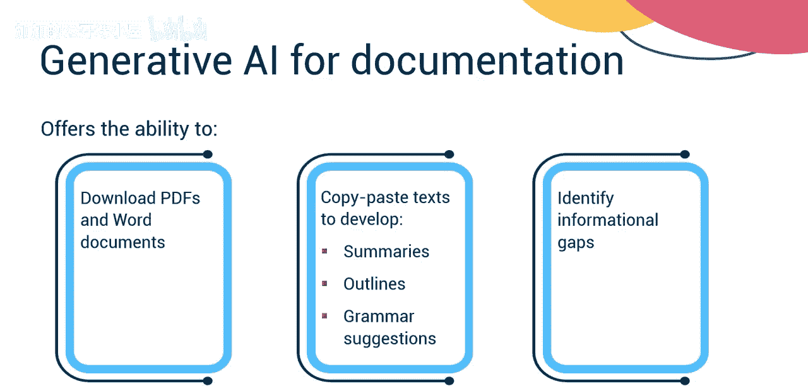
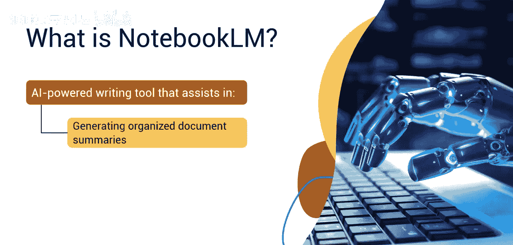
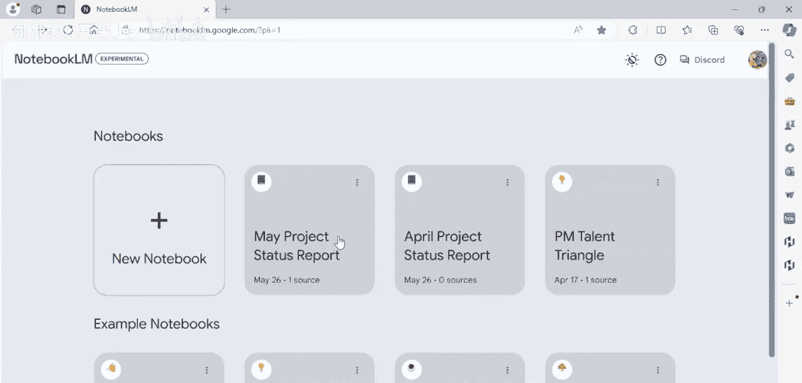
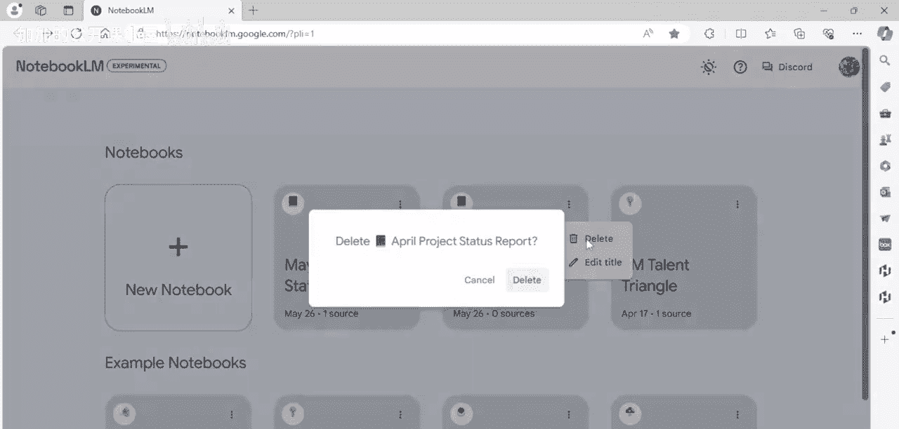
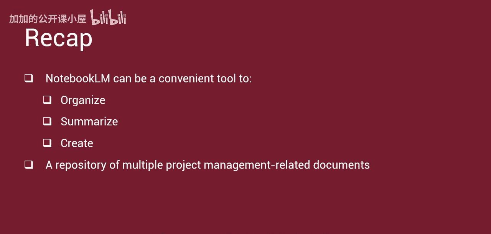

#  043：使用生成式AI总结文档的演示 🧠

在本节课中，我们将学习如何利用生成式AI工具来高效总结笔记和PDF文档。我们将通过一个具体的工具演示，展示如何将冗长的项目报告转化为清晰、有组织的摘要。

---

## 概述

项目经理常常需要处理大量文档，从项目启动到收尾，都需要创建全面的记录。生成式AI工具的普及，为快速生成摘要、大纲、语法建议以及识别信息缺口提供了可能。本节演示将重点介绍一款名为Notebook LM的AI辅助写作工具。

## Notebook LM简介

上一节我们提到了生成式AI的潜力，本节中我们来看看一个具体的工具。Notebook LM是一款AI驱动的写作工具，专为帮助用户生成有组织的文档摘要、创意内容、进行头脑风暴以及精炼写作技巧而设计。

## 注册与核心功能

使用Notebook LM的第一步是注册。过程非常简单，只需访问其官网，填写邮箱地址并设置密码即可。其基础功能可以免费使用。

该工具利用AI算法，主要提供以下几类核心功能：
*   **内容生成**：帮助用户轻松生成想法、大纲甚至完整的文章。
*   **写作辅助**：提供建议、增强语法、给出写作提示，从而提升整体写作质量。
*   **校对工具**：平台集成了语法检查、风格建议和校对工具，帮助用户润色文稿。

## 工具演示：总结月度项目报告

以下是使用Notebook LM总结一份项目月度状态报告的具体步骤。

**场景设定**：你是一名项目经理，负责开发一个新的AI驱动空气过滤系统。你刚刚完成了五月份的月度项目状态报告，并计划使用Notebook LM来生成一份易于理解、结构清晰的报告摘要。

1.  **创建新笔记本**：首先，点击界面上的“新建笔记本”（加号图标）。
2.  **上传文档**：系统会提示上传文本或其他类型的文档。我们将以PDF格式上传《五月状态报告》。选择该PDF文件并上传。
3.  **处理与概览**：将鼠标悬停在已上传的“源文件”上并右键点击，Notebook LM即开始处理。此时可以为笔记本添加标题，例如“五月项目状态报告”。工具会自动生成一个概览，并将输入内容分解并组织到不同的类别中。
4.  **查看分类摘要**：我们可以选择查看特定类别的内容。例如，选择“AI系统”类别，Notebook LM会提供关于新AI驱动空气过滤系统的概要。这些信息可以直接复制粘贴到其他文档或电子邮件中。
5.  **查看行动项**：接下来，查看“行动项”部分。此部分内容被分解为易于理解的要点陈述。
6.  **利用相关提示**：Notebook LM甚至会提供你可能想使用的其他相关提示，例如“总结项目状态”、“分析预算分配”等。
7.  **保存与管理**：点击返回箭头即可关闭笔记本，Notebook LM会自动保存。未来可以随时访问和查看这个笔记本。如需删除笔记本，只需点击笔记本右上角的三个点，然后选择“删除”即可，例如我们可以删除旧的“四月月度状态报告”。

## 总结

本节课中我们一起学习了如何使用Notebook LM这款生成式AI工具。它能够作为一个便捷的工具，来组织、总结并创建项目管理相关文档的知识库，从而帮助项目经理从繁杂的文档工作中解放出来，更专注于核心管理任务。

---