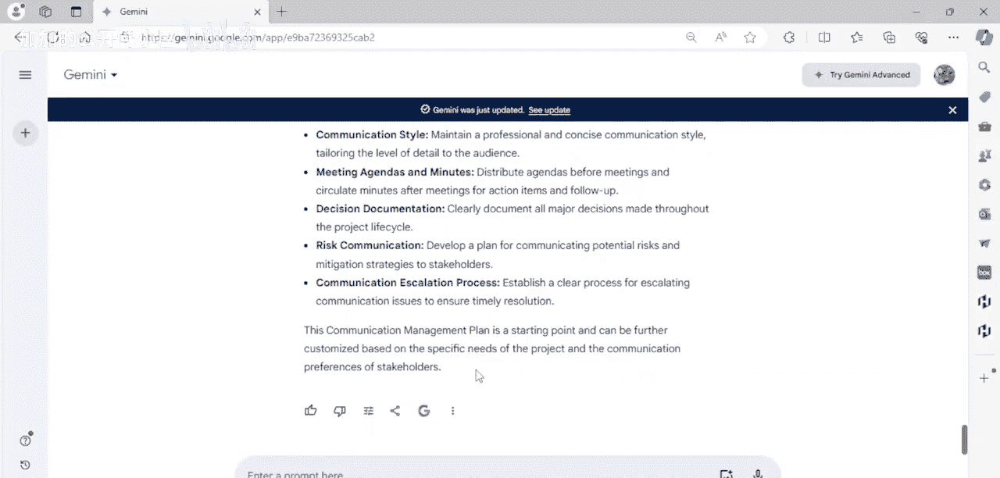
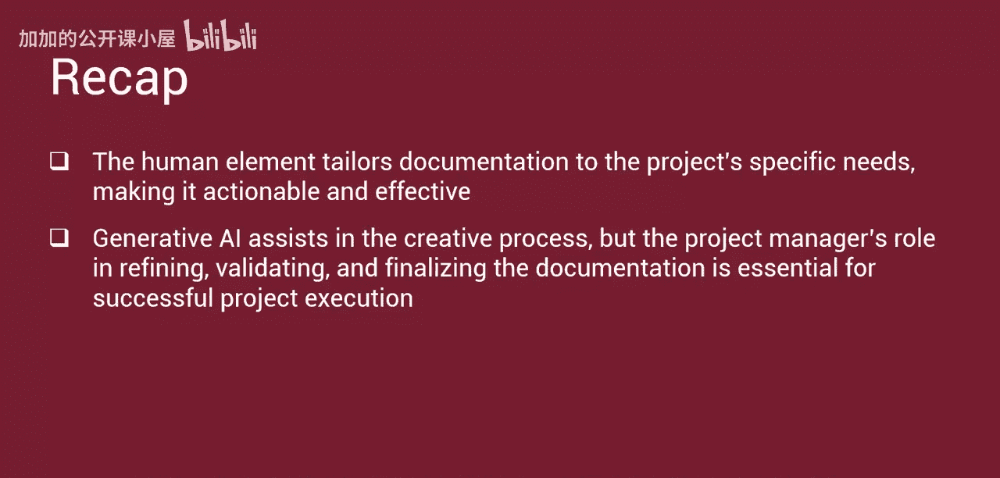

#  044：生成式AI在项目规划与创新中的应用演示

在本演示课程中，我们将学习如何利用生成式人工智能进行项目规划与创新。我们将以Gemini工具为例，展示生成式AI如何成为项目经理在规划与创新方面的得力助手。

生成式AI可以快速分析历史项目数据，从而提出现实的时间线、资源分配建议，并创建初步的工作分解结构。在创新方面，它能够针对问题集思广益，提出超越团队常规思维的广泛解决方案。这种分析能力为项目规划带来了更具创造性和启发性的方法。

接下来，让我们通过具体示例，探索生成式AI如何使传统的项目管理变得更高效、动态和智能。

## 生成式AI在项目规划中的应用场景

以下是生成式AI可以提升项目管理效率的几个关键领域：

*   **制定工作分解结构**：生成式AI可以根据项目总体目标的概述，提出项目计划的工作分解结构。
*   **生成网络图**：AI能够解读文本、原始数据和源代码，为网络图的绘制提供建议。
*   **推荐质量活动**：它可以推荐质量保证和质量控制活动。
*   **设定关键绩效指标**：此外，它还能推荐关键绩效指标，以确保项目符合要求并适用。
*   **革新沟通规划**：生成式AI通过实现快速决策和无与伦比的效率，革新了沟通规划。它有助于塑造沟通策略并制定全面的沟通管理计划。

总而言之，生成式AI工具可以分析信息、促进更有效的沟通、改进风险识别，并监控速度与质量。

## 使用Gemini进行项目规划演示

在本演示中，我们将展示Gemini如何增强并简化多项项目规划活动。

新用户可以通过创建谷歌账户访问Gemini。请访问 `gemini.google.com`，点击登录并使用您的谷歌账户凭证。

欢迎使用Gemini。它可以帮助您规划、组织和跟踪项目，简化任务并使一切按计划进行。Gemini提供多种功能来提升您的项目管理效率。

首先，让我们回顾一下我们的项目概念：一家高科技公司计划开发一款新的、由生成式AI驱动的专业照片生成器。这款新的照片生成器将包括一个相机和一个配套的应用程序。此外，项目还包含一项营销要求。目标是在六个月内内部完成所有项目可交付成果。团队计划将工作分为设计、开发、测试和启动四个阶段。

我们将利用Gemini的力量提出三个问题。现在输入我们的第一个提示。

**提示一：制定工作分解结构**

请输入如下所示的提示。

让我们来审视Gemini的推荐。我们要求Gemini制定一个工作分解结构。它制定了一个WBS，其中第一级是项目名称，第二级是我们提示中提供的信息：设计阶段、开发阶段、测试阶段和启动阶段。

现在，我们可以深入到第三级：
*   **设计阶段** 包括硬件设计、软件设计。
*   **开发阶段** 包括硬件开发、软件开发。
*   **测试阶段** 包括硬件测试、软件测试。
*   **启动阶段** 包括市场营销与推广、项目启动。

Gemini在最后提供了一个简要说明：此WBS提供了一个高层次的分解，每个子任务都可以根据项目需求进一步分解为更详细的活动。

让我们返回到提示页面，继续我们的对话，提出第二个提示。

**提示二：制定里程碑图和表格网络图**

第二个提示要求Gemini使用其创建的WBS中的编号，来制定一个里程碑图和表格网络图。

Gemini响应了我们的提示，并提供了一个表格形式的里程碑图。我们查看了各个里程碑，它包含了工作分解结构中的所有内容。

接着，它提供了一个表格网络图，为我们提供了完成-开始和完成-完成关系以及前置任务的关键信息。请注意，我们可以利用此输入来开发一个实际的视觉网络图，或将此网络图信息加载到Microsoft Project或Smartsheet等工具中。

它还提供了一些说明：该表格假设了标准的五天工作周以及任务之间的依赖关系，并且项目启动里程碑的持续时间为零周，因为它代表一个时间点而非一项活动。

让我们再次返回提示页面，向Gemini提出最后一个规划问题。

**提示三：制定沟通管理计划**

我们最后的提示是：制定一个表格形式的沟通管理计划来支持该项目。

应要求，Gemini以表格形式提供了“生成式AI专业照片生成器沟通管理计划”。它识别了关键利益相关者群体、信息需求、沟通方法、频率和负责人。

它甚至提供了一些额外的考虑因素，如沟通风格、会议议程和纪要、决策文档、风险沟通以及沟通升级流程说明。

该沟通管理计划是一个起点，可以根据项目的具体需求和利益相关者的沟通偏好进一步定制。

## 课程总结

在本节课中，我们一起学习了生成式AI如何作为项目经理的强大工具，提供建议、生成图表并自动化部分项目文档流程。

然而，必须记住，这些输出是起点或增强项，而非最终交付成果。项目经理的专业知识对于确保包含所有相关信息，并使文档符合项目目标和合规要求至关重要。

人类的因素，如专业判断、对团队动态的理解以及利益相关者沟通，是不可替代的。正是这种人为因素，使文档能够根据项目的具体需求进行定制，从而变得可操作且有效。

生成式AI辅助了创作过程，但项目经理在细化、验证和最终确定文档方面的角色，对于项目的成功执行至关重要。

