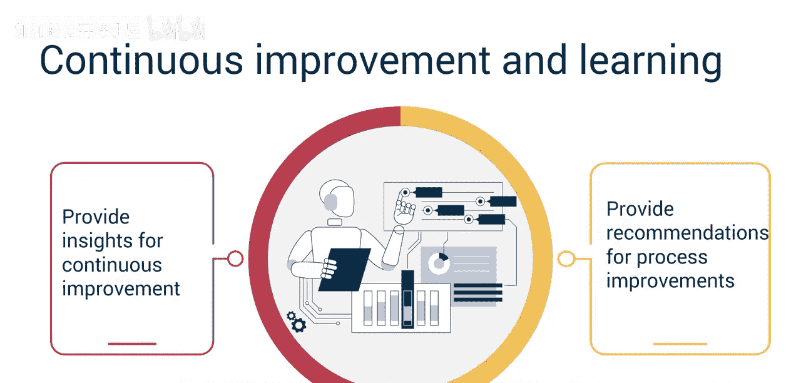
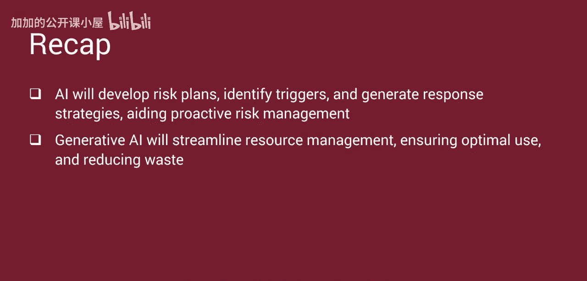

#  045：生成式AI的未来演进 🚀

在本节课中，我们将探讨生成式人工智能（Generative AI）未来的演进方向，并总结其对项目管理领域即将产生的深远影响。

## 概述

生成式AI已经对项目管理领域产生了深刻影响。随着技术的进步以及新工具和能力的出现，这种影响将持续扩大。企业正竞相理解和利用生成式AI的力量。2022年底ChatGPT的发布，让人们初步见识了其威力。对于任何希望保持竞争力的公司而言，拥抱生成式AI带来的机遇已成为一个关键成功因素。

麦肯锡的一份研究报告指出，利用生成式AI功能每年可为全球经济贡献高达**4.4万亿美元**。驱动生成式AI的先进机器学习技术正在快速发展。该报告还预测，专家预计在2040年之前，生成式AI在各种任务上的表现将达到人类的中位数水平，与完成这些任务的前25%的人竞争。生成式AI也将影响知识工作，许多涉及教育、法律、技术甚至艺术的工作将被自动化。此外，生成式AI将有能力自动化一些基本决策，并在最少人工干预的情况下进行有效协作。

生成式AI已经在创造新的、更高的客户期望，要求改进项目交付成果。项目章程和项目管理计划必须考虑利用生成式AI和人机交互能力的需求，以满足日益精通技术的市场对产品和服务的期望。

公司正开始训练生成式AI系统，使其包含企业特定的数据，而不再依赖于公共领域的数据。这种训练能够生成企业特定的AI战略、政策和标准，从而提升公司安全性并增强竞争优势。

上一节我们介绍了生成式AI的宏观发展趋势，本节中我们来看看它将如何具体影响项目管理实践。

## 生成式AI演进对项目管理的影响

生成式AI为项目经理提供了改进规划和执行交付成果能力的机会，同时也带来了必须意识到并成功应对的挑战。

以下是生成式AI将影响项目管理的关键方面：

*   **自动化项目规划**：AI驱动的工具将自动化创建详细的项目计划、进度表、预算和资源分配模型。这个过程将显著减少初始规划阶段所花费的时间，并提高整体规划的准确性。
*   **精准的范围规划**：生成式AI将通过分析客户反馈和市场趋势，使范围规划更加精确，从而使项目交付成果与要求更高的客户群的期望保持一致。这将确保项目设计能够满足或超越客户需求，增强满意度、竞争优势并增加价值。
*   **增强的协作工具**：AI驱动的协作工具将促进项目团队之间更好的沟通与协作。这些工具可以与现有工作流程无缝集成，实现实时更新，并促进跨地域和时区的更顺畅协作。
*   **自动化报告与文档**：生成式AI将自动化生成项目报告、文档和状态更新。这个自动化过程将为项目经理节省时间，并确保利益相关者获得准确、及时的信息。
*   **数据驱动的决策支持**：生成式AI将为项目经理提供先进的分析和洞察，实现更明智的、数据驱动的决策。这些洞察将有助于识别潜在的进度加速机会、最大化资源利用率、快速评估变更并确定解决问题的最佳策略。
*   **变革管理支持**：AI驱动的变革管理工具将帮助项目经理预测并有效规划、管理变更。生成式AI将通过提供实时影响分析和适应性策略，协助平稳地引导团队和利益相关者度过转型期，确保最小化干扰并保持项目势头。
*   **主动的风险管理**：AI将评估项目目标并制定全面的风险计划和登记册，以加速风险识别、评估和响应。风险触发因素将被实时识别，使团队能够快速预测和应对潜在问题，并实施有效的风险应对策略。项目经理可以主动应对风险，并保持在范围、进度和成本基线之内。
*   **优化的资源管理**：生成式AI将消除对大量资源分析和平衡活动的需求。它将通过分析项目需求和资源可用性来简化资源管理。这个简化过程将确保人力和物力资源得到最优利用，从而实现更好的工作负载平衡和容量规划，并减少资源浪费。
*   **持续的流程改进**：AI系统将持续从项目数据和结果中学习，并为持续改进提供洞察。项目经理将受益于AI驱动的流程改进建议，随着时间的推移，这将带来更成功的项目成果。

## 总结

本节课中我们一起学习了生成式AI正在显著改变项目管理，并且其持续发展预计将扩大其影响力。公司正在利用企业特定数据训练AI，以增强战略、政策、安全性和竞争优势。AI驱动的工具将自动化项目计划、进度、预算和资源分配，提高规划的准确性和效率。生成式AI将自动化项目报告、文档和状态更新，节省时间并确保信息及时交付。AI将协助制定风险计划、识别触发因素并生成应对策略，助力主动的风险管理。生成式AI还将简化资源管理，确保最优利用并减少浪费。