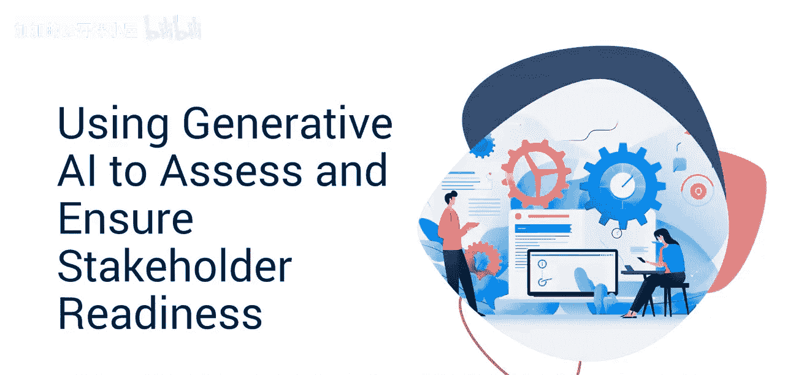
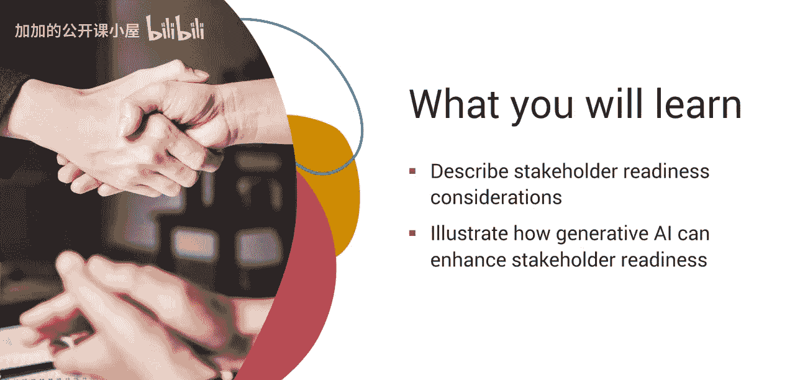
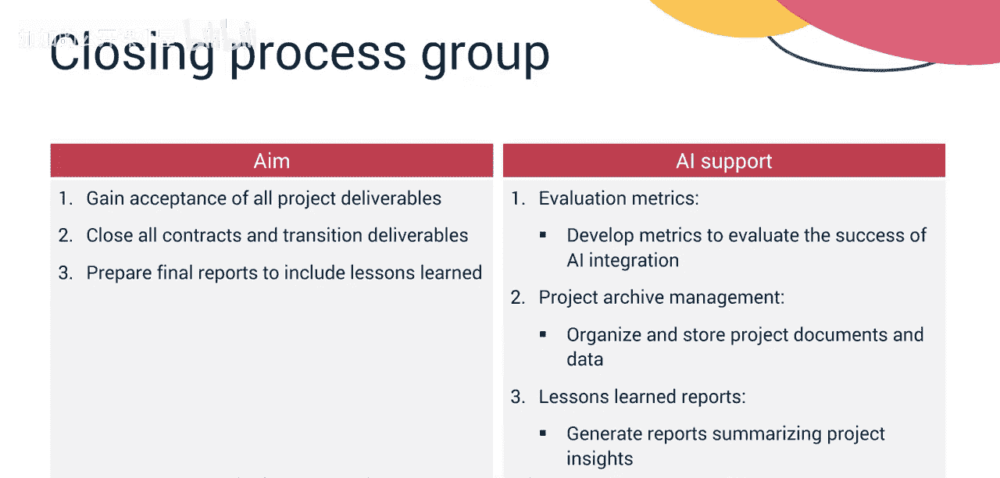
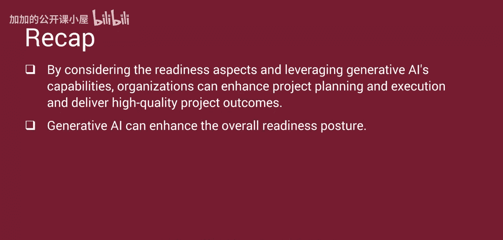

#  046：利用生成式AI评估利益相关者准备度 🧑‍💼

在本节课中，我们将学习如何利用生成式人工智能来评估和确保项目利益相关者的准备度。我们将探讨利益相关者准备度的关键考量，并说明生成式AI如何能在项目管理的各个阶段增强这种准备度。

许多组织正在使用生成式AI来规划和执行项目，并提供AI驱动的产品与服务。这种范式转变要求项目经理评估利益相关者的准备情况，并为他们接纳AI做好准备。

## 组织准备度的考量因素

首先，让我们分解一下组织准备度的考量因素，以及生成式AI如何支持项目管理协会（PMI）流程组中的各个目标。

许多团队可能对AI还很陌生。项目经理必须确保所有利益相关者都能理解生成式AI的能力与局限。AI系统的有效性取决于其所能访问的数据质量。历史项目数据对于AI学习至关重要。项目经理必须与团队紧密合作，识别适用的数据源。

项目经理必须让所有利益相关者为AI集成可能带来的工作流程转变做好准备。项目章程应将上述因素作为假设和约束条件纳入。项目管理规划过程组也应考虑他们使用生成式AI的准备情况。

项目经理和团队必须定义清晰的项目目标，以便AI能有效地定制计划。工作分解结构（WBS）是项目规划的基石。一致的WBS格式能增强AI学习和建议计划的能力。项目进度、预算和资源需求都基于WBS。规划期间的数据安全协议至关重要。

必须建立数据安全措施，以保护AI所使用的敏感项目信息。在项目执行期间，需要有效的沟通规划和管理，以确保团队专注于实现项目目标。

## 执行与监控中的准备度

上一节我们介绍了规划阶段的准备度，本节中我们来看看执行与监控阶段的关键考量。

以下是确保团队与AI有效协作的几个要点：
*   **确保团队成员与AI之间的有效沟通。**
*   **AI工具应易于访问和使用，以便团队采纳。**
*   **所有团队成员都应理解工具的能力和用途。**
*   **保持数据质量，以确保AI建议的准确性。**
*   **检查并验证输出结果，确保其准确且无偏见。**
*   **建立清晰的项目关键绩效指标（KPI）来衡量成功并指导AI监控。**
*   **所有团队成员必须对这些指标有共同的定义。**
*   **确保项目管理工具与AI之间的数据流畅传输，以实现实时监控。**
*   **制定变更管理计划，以处理AI建议可能带来的偏差。**

知识转移至关重要。需要制定计划，捕获从生成式AI中获得的经验教训，供未来项目使用。将AI生成的报告和见解整合到项目收尾文件中。评估AI实施对项目可交付成果的有效性，并识别改进领域。

## 生成式AI在各流程组中的应用

了解了每个流程组的准备度考量后，让我们看看生成式AI如何帮助你在每个流程组中确保利益相关者的准备度。

**启动过程组**旨在制定项目章程，明确项目目标、识别利益相关者、分配角色与职责，并获得发起人批准，使项目进入规划过程组。
*   AI可以分析过去项目成功的因素，为项目选择推荐合适的目标。
*   AI可以基于过往项目协助识别相关利益相关者。
*   它还可以推荐对项目成功至关重要的关键角色和职责。
*   AI可以基于类似项目生成包含风险评估的可行性报告，协助可行性研究并获得高管批准。

**规划过程组**的目标是制定一份全面的项目管理计划，并获得发起人批准和利益相关者接受。该计划将包括范围、进度、成本基准以及关键支持计划。
*   生成式AI将基于历史项目数据和行业最佳实践，建议详细的工作分解结构（WBS）。
*   AI将生成考虑依赖关系和资源可用性的项目时间线草案。
*   生成式AI将基于过往项目的资源和预算使用情况，推荐预算估算和资源分配计划。

**执行过程组**的目标是开发项目可交付成果、管理风险和变更、监控进度并分享知识。
*   生成式AI将基于项目优先级和团队技能监控任务和完成情况。
*   它建议调整资源分配以提高项目效率。
*   在风险管理方面，生成式AI基于实时项目数据管理潜在风险，并提出缓解策略。
*   它基于历史趋势和类似项目预测潜在的项目问题。
*   AI基于任务完成和资源利用数据自动生成进度跟踪报告。

**监控过程组**的目标是验证所有可交付成果是否符合项目管理计划中定义的规范，确认范围，并在进入项目收尾前确保资源的最佳利用。
*   生成式AI分析项目数据以监控绩效，识别偏差并建议预防和纠正措施。
*   生成式AI通过基于历史趋势和类似项目预测潜在项目问题来支持预测分析。
*   它通过AI支持的风险审计分析风险应对措施的有效性。风险审计审查风险应对措施，以确定其对已发生风险的处理效果，并建议后续行动。
*   为了优化资源，AI建议调整资源分配以提高效率。

**收尾过程组**的目标是获得对所有项目可交付成果的验收，关闭所有合同并移交可交付成果，以及准备包含经验教训的最终报告。
*   生成式AI制定指标来评估AI集成在项目管理中的成功程度。
*   AI支持项目归档管理，有效地组织和存储项目文档与数据，以供未来参考和AI学习。
*   AI生成报告，总结项目见解以及AI在实现成果中的作用。
*   它在整个企业内自动化分享经验教训。

## 总结

本节课中，我们一起学习了通过考量准备度各个方面并利用生成式AI的能力，组织可以增强项目规划与执行，并交付高质量的项目成果。生成式AI能够提升整体的准备状态。