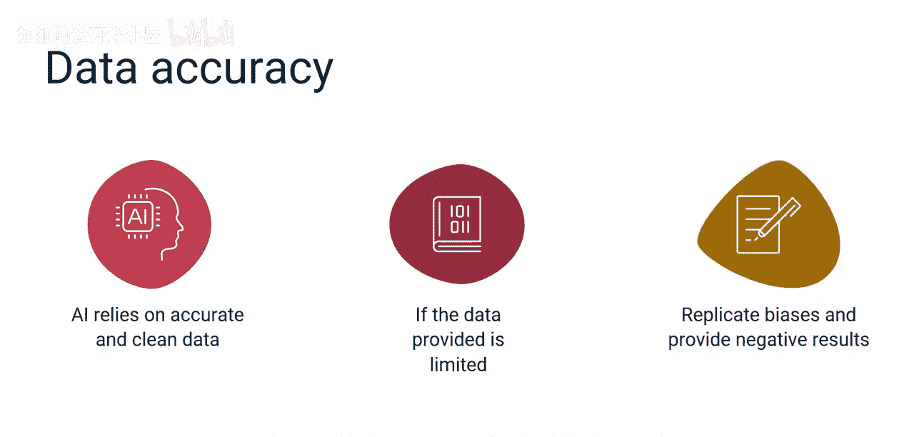
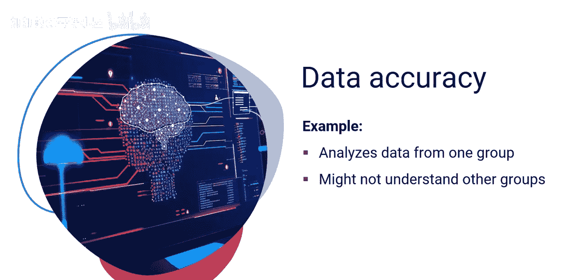
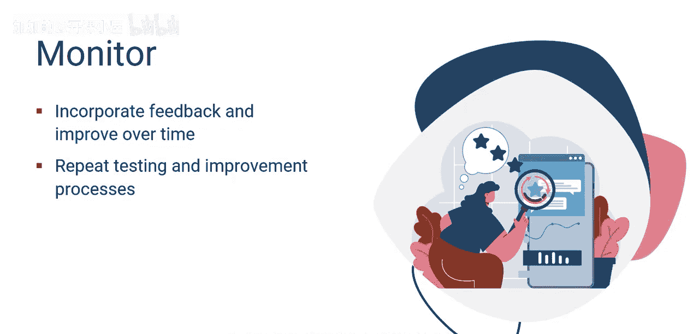
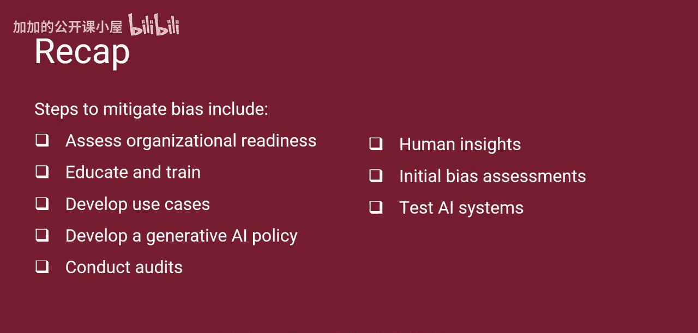

#  047：识别并克服生成式人工智能偏见 🎯

在本节课中，我们将学习生成式人工智能中偏见产生的主要原因，并掌握一套项目经理可以用来降低偏见风险的系统性步骤。

生成式人工智能系统的有效性，完全取决于识别和提供数据的人类。人类并不完美，可能会注入有意或无意的偏见，从而影响数据质量并可能扭曲结果。项目经理必须理解可能导致偏见的数据质量问题，并确保识别和降低相关风险。

上一节我们介绍了偏见存在的普遍性，本节中我们来看看偏见在生成式AI中的具体成因。

## 偏见的主要成因

以下是生成式AI中偏见发生的一些主要原因：

*   **数据质量**：生成式AI依赖于准确、干净的数据。如果用于训练的数据有限，或者不能代表多样化的人群或情境，AI模型就会复制这些偏见，对结果产生负面影响。例如，如果模型主要看到某一群体的数据，它可能无法很好地理解其他群体，从而导致有偏见的结果。
*   **抽样偏差**：当用于训练生成式AI系统的数据不能准确反映现实世界情况，或过于集中于特定用例时，就会发生抽样偏差。如果数据没有涵盖广泛的可能性，AI的输出就会偏向于它所训练的内容。
*   **人类偏见**：人类自身存在基于文化和刻板印象的偏见；如果用于训练AI模型的数据反映了这些偏见，AI模型就会学习并重现它们。例如，如果某些职业经常与特定性别或种族相关联，生成式AI也可能不公平地建立这些联系。
*   **反馈循环**：在设计训练AI模型时，必须谨慎对待公平性和公正性。生成式AI从给定的数据及其产生的结果中学习，这可能会形成一个反馈循环。如果它在有偏见的数据上训练，或者有偏见的结果被反馈到系统中，AI模型可能会在未来的输出中不断复制这些偏见。
*   **意识与缓解**：最后，项目经理必须意识到潜在的偏见风险，并确保团队具备风险意识。必须安排并执行定期的审计和检查，以减少偏见发生的可能性。

了解了偏见的成因后，接下来我们看看项目经理必须遵循的、用于降低偏见风险的具体步骤。

## 降低偏见风险的步骤

以下是项目经理为降低偏见风险应遵循的逐步流程：

1.  **评估组织准备度**：首先，确保组建一个具备必要技能的多元化跨职能团队，负责生成式AI的规划与开发。评估组织的基础设施、数据管理能力和团队熟练度。使项目章程和项目管理计划与公司的业务目标保持一致，以确保一致性和相关性。
2.  **教育与培训**：接下来，对所有项目团队成员进行全面教育和培训，使其理解包括AI偏见在内的潜在风险因素。持续提供关于生成式AI发展趋势和创新的更新，以保持专业能力。在团队内部建立制衡机制，防止个人偏见影响系统结果。
3.  **制定用例**：定义清晰的用例，概述项目将交付的AI产品或服务的目标和问题解决能力。识别客户群体，了解他们的需求和期望，并训练生成式AI模型在定义的边界内运行，以交付预期结果。
4.  **制定生成式AI政策**：建立正式的生成式AI政策，包含审查输出和进行定期审计的流程与程序。在一个多元化的团队中分配角色和职责，以有效实施制衡。
5.  **进行审计**：然后，对用于构建算法和训练AI模型的数据进行彻底审计，确保其干净、准确，并且没有文化偏见或刻板印象。努力纳入多样化的数据集，以最小化偏见风险。
6.  **融入人类洞察**：鼓励团队成员积极监控偏见，确保无意的个人偏见不会影响结果。强调团队合作在克服AI开发相关偏见风险中的重要性。
7.  **进行初步偏见评估**：在将AI系统引入客户和用户之前，必须进行全面偏见评估，以识别并消除潜在偏见。
8.  **测试与监控**：接下来，制定项目可交付成果测试计划，执行AI测试以识别和消除系统缺陷，执行Beta测试以获得宝贵的客户反馈。让用户体验团队参与评估并记录客户体验。在分析所有反馈并实施修复之前，不要推出新产品或服务。最后，持续测试和监控AI系统，纳入客户和用户的反馈，以长期增强产品和服务功能。随着产品增加新功能，重复测试和改进过程。

本节课中我们一起学习了生成式AI偏见的核心内容。我们了解到，生成式AI需要准确干净的数据，有限或非多样化的数据会导致有偏见的结果。偏见的主要成因包括数据质量、抽样偏差、人类偏见、反馈循环以及意识与缓解不足。降低偏见的步骤包括：评估组织准备度、教育与培训、制定用例、制定生成式AI政策、进行审计、融入人类洞察、进行初步偏见评估以及持续测试与监控AI系统。