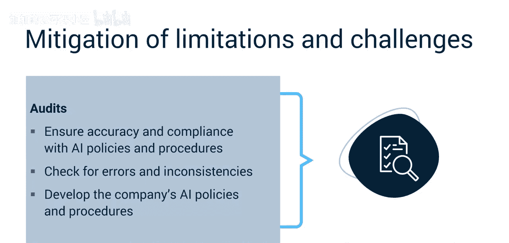
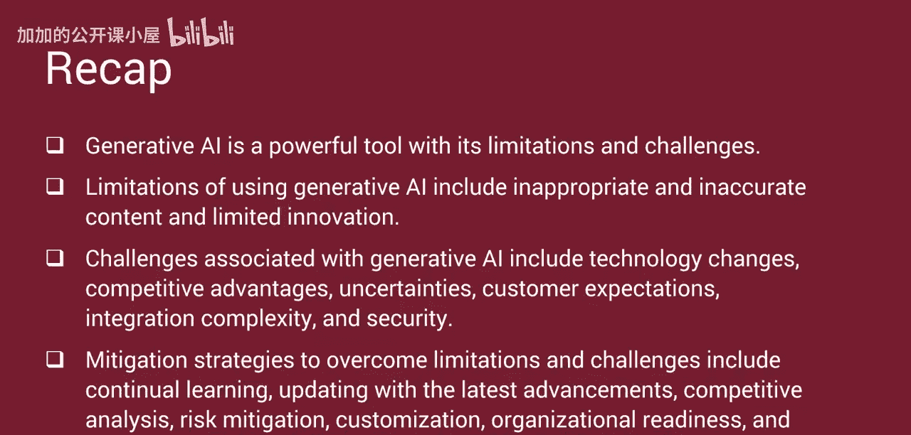

#  048：生成式人工智能的局限与挑战 🧠

在本节课中，我们将学习生成式人工智能（Generative AI）在实际应用中存在的局限性与挑战，并探讨如何有效管理和克服这些问题。

## 概述

生成式AI正迅速成为项目经理必须理解和采纳的重要工具。然而，其应用伴随着一系列局限性和挑战，需要谨慎的数据管理、持续的监控以及人类的监督。本节将详细介绍这些局限性，并提供相应的管理建议。

## 生成式AI的局限性

首先，我们来了解生成式AI本身固有的几个主要局限性。

**生成不可控或不恰当的内容**
生成式AI系统有时会产生出乎意料或不恰当的内容。这种不可控性可能导致客户不满、销售损失、输出结果带有偏见，并损害公司声誉。

**输出结果可能不准确**
生成式AI的输出并非总是准确的。这种不准确性会降低生成内容的质量和相关性，从而削弱其应用产品或服务的可信度。

**创新能力受限于训练数据**
生成式AI严重依赖于访问大量且多样化的数据集来学习并生成新概念。然而，AI所能访问的数据质量和多样性限制了其创造力和创新能力。换句话说，它的想象力只能达到其训练数据所允许的程度。

## 项目经理面临的挑战与应对策略

上一节我们介绍了生成式AI自身的局限性，本节中我们来看看项目经理在使用过程中可能遇到的具体挑战，以及如何克服它们。

**技术快速迭代**
AI技术发展迅速，AI驱动的产品和服务可能很快过时。项目经理必须意识到这些变化，并相应调整项目计划。

**保持竞争优势**
许多公司正利用生成式AI获取竞争优势。项目经理必须及时了解AI的最新进展，以确保所提供的产品和服务在市场中保持竞争力。

**应对法规不确定性**
围绕生成式AI的法规在不断变化。项目经理需要通过制定有吸引力的项目目标、解决潜在的担忧或约束来应对这种不确定性。

**确保输出质量与公平性**
他们需要维护数据质量以确保AI推荐的准确性，并检查和验证输出结果，确保其准确且无偏见。

**满足客户对创新与定制化的期望**
客户期望AI产品和服务具有创新性和定制化。项目经理必须理解这些期望，并交付满足不同市场细分需求的产品。

**系统集成的复杂性**
将生成式AI集成到现有系统中并非简单的“即插即用”解决方案。项目经理必须考虑支持其AI产品所需的端到端架构和基础设施。

**处理伦理与安全问题**
生成式AI存在潜在的伦理和安全问题，例如数据隐私侵犯和知识产权问题。项目经理必须优先考虑安全性，并确保他们开发的产品和服务遵守相关法规和标准。

## 克服局限与挑战的策略

现在您已经理解了生成式AI的局限性和挑战，让我们来探索如何克服它们。以下是具体的应对策略。

**持续学习与更新**
不断学习并跟进AI领域的最新进展。参加课程、研讨会，阅读相关资料，确保您拥有作为项目经理所需的知识和技能。

**进行竞争分析**
了解竞争对手的动态。使用AI工具收集和分析数据，以了解您的项目成果与市场上其他产品的比较情况。例如，您可以使用AI驱动的软件来跟踪竞争对手的产品功能、定价策略和客户评价。

**识别与管理不确定性**
识别并管理市场、运营、技术和监管方面的不确定性。通过理解潜在风险并制定缓解策略，您可以创建一个风险登记册，按原因、事件和影响记录风险。例如，如果不确定AI生成的内容可能如何违反版权法，则应制定协议以确保合规。

**基于反馈进行定制**
联系客户，了解您的产品和服务可以解决哪些挑战和痛点。使用调查、访谈和市场研究来收集反馈。例如，您可以使用AI工具分析来自社交媒体或在线评论的客户反馈，以识别常见的痛点或需要改进的领域。即使在产品发布后，反馈循环也必须持续进行。

**评估组织准备度**
持续评估和重新评估组织实施AI解决方案的准备情况。确保您能够获得必要的数据、专业知识和资源。例如，如果组织内部缺乏开发AI模型的技能，可以考虑外包或培训项目团队。

**与公司目标对齐**
使AI产品开发与公司的整体目标和战略保持一致。确保领导层与项目开发团队之间有清晰的沟通。例如，如果公司的目标是增加市场份额，则应确保AI产品和服务的功能设计旨在吸引新客户并留住现有客户。

**设计与实施保障措施**
设计和实施保障措施，以确保准确性并遵守AI政策和程序。建立检查和制衡机制以捕获错误和不一致之处。制定一套全面的AI政策和程序。例如，定期审查AI算法和模型，以确保它们产生准确的结果并符合法规。

## 总结

本节课中，我们一起学习了生成式AI作为强大工具所伴随的局限性与挑战。
*   **生成式AI的局限性**包括：生成不恰当或不准确的内容，以及创新能力受限于数据。
*   **相关的挑战**包括：技术快速变化、竞争压力、法规不确定性、客户高期望、系统集成复杂性以及安全伦理问题。
*   **主要的缓解策略**包括：持续学习、竞争分析、风险管理、基于反馈的定制化、评估组织准备度、目标对齐以及建立审计与保障机制。