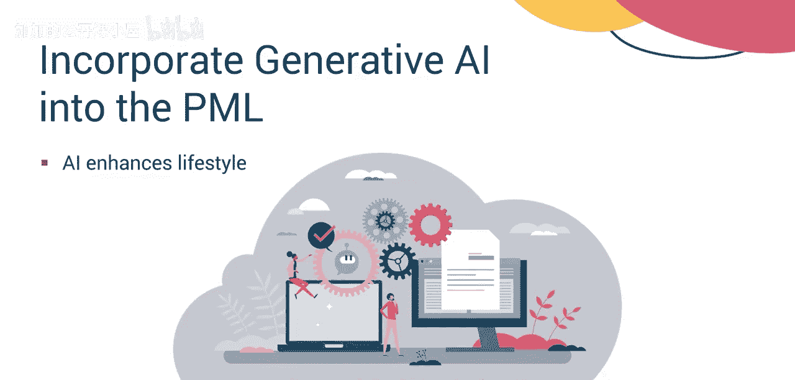
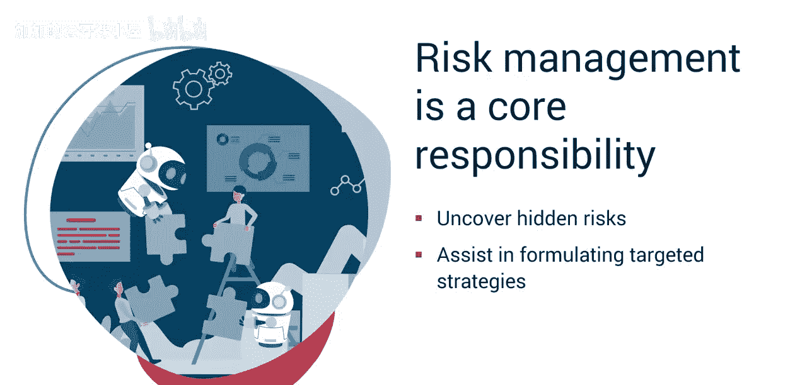

#  049：课程亮点与核心要点 🎯

在本节课中，我们将回顾并总结“释放项目管理潜能的生成式AI”课程的核心内容。课程讲师将分享十大关键见解与要点，帮助你巩固所学知识，并将其应用于未来的项目管理实践中。

## 概述

恭喜你完成了“释放项目管理潜能的生成式AI”课程。在这段学习旅程中，我们探讨了广泛的主题。作为你的课程讲师，我想重点分享我的十大见解与核心要点。

## 十大核心要点

上一节我们介绍了课程概述，本节中我们来看看讲师总结的十大核心要点。以下是具体的要点列表：

1.  **生成式AI不仅是概念，更是现实**。掌握生成式AI的技术层面和实际应用正成为项目经理的必备技能。请投入时间沉浸式学习这一变革性工具。
2.  **驾驭生成式AI伴随挑战**。与你的团队协作，以最小化可能扭曲结果的系统偏见；更重要的是，努力确保你的产品符合最高的道德标准。
3.  **将生成式AI融入项目管理生命周期**。AI是增强而非取代这个生命周期。
4.  **生成式AI工具包在不断扩展**，新工具迅速涌现。紧跟AI工具和系统的演变至关重要，要保持领先优势。
5.  **市场需求要求效率**。作为项目经理，应利用生成式AI提升生产力，从而将你的关注点优先集中在关键活动上。
6.  **超个性化是客户的追求**。他们期待符合其独特需求的产品和服务。生成式AI对于满足这些期望不可或缺。
7.  **数据洪流超越了个人的处理能力**。运用生成式AI来构建精确的提示，以聚焦于对明智决策、项目规划与执行提升至关重要的数据。请记住，生成式AI输出的质量取决于你提示的具体性。其关系可表示为：`输出质量 ∝ 提示具体性`
8.  **项目经理对于确保价值至关重要**。与你的整个项目管理团队协同工作，以确保组织做好准备，通过AI实现卓越。生成式AI工具能通过自动化常规任务、提供数据驱动的见解和促进决策过程，显著提升项目经理及其团队的能力。确保团队准备好拥抱这种潜力。
9.  **风险管理是核心职责**。生成式AI能够发现隐藏的风险，并协助制定有针对性的策略来降低其可能性或影响。
10. **最重要的是，生成式AI是一种工具**。虽然它产生的结果可能并非总是完美无瑕。请将其用作创意的跳板。始终注入人的因素。生成式AI的有效性因指导它的人类而增强。

## 总结与后续步骤

本节课中我们一起学习了课程讲师的十大核心见解。现在你已经回顾了本课程提出的一些基本思想，请记住利用每个模块的阅读材料、术语表和速查表。这些资源可以帮助你快速回顾所学内容。

再次祝贺你完成本课程，并祝你在项目管理之旅中好运。