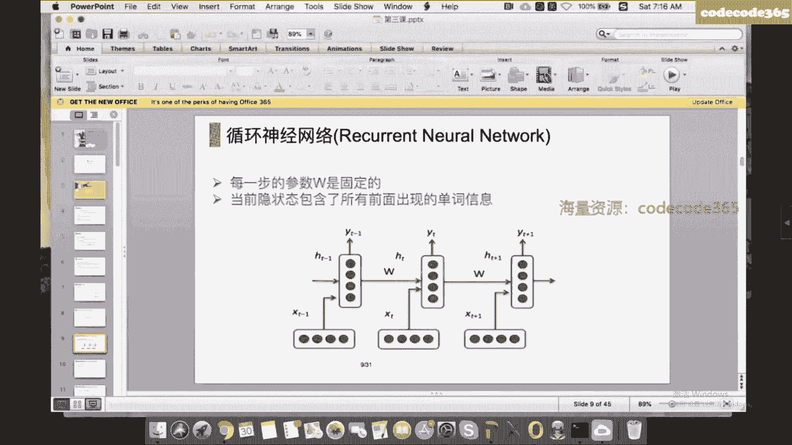
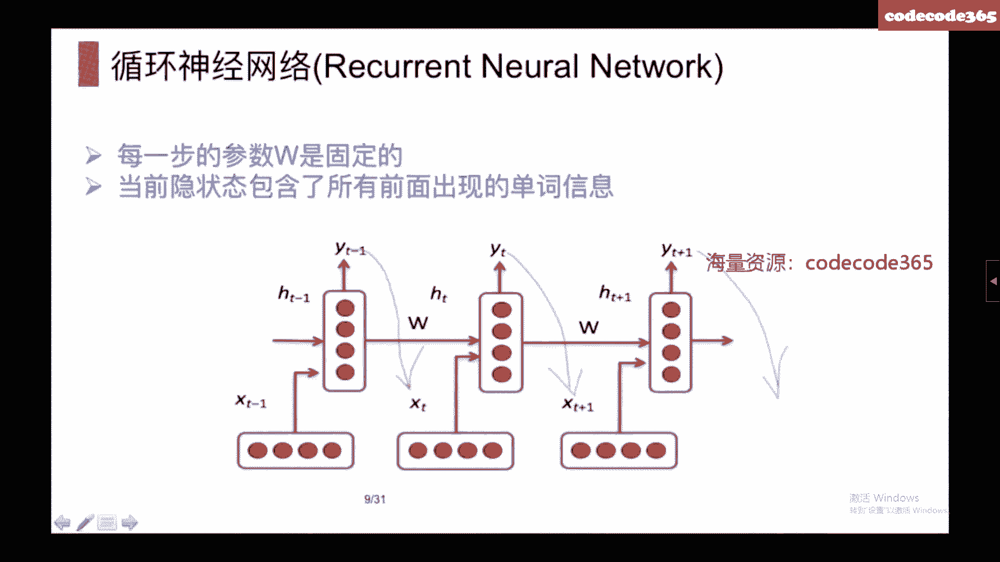
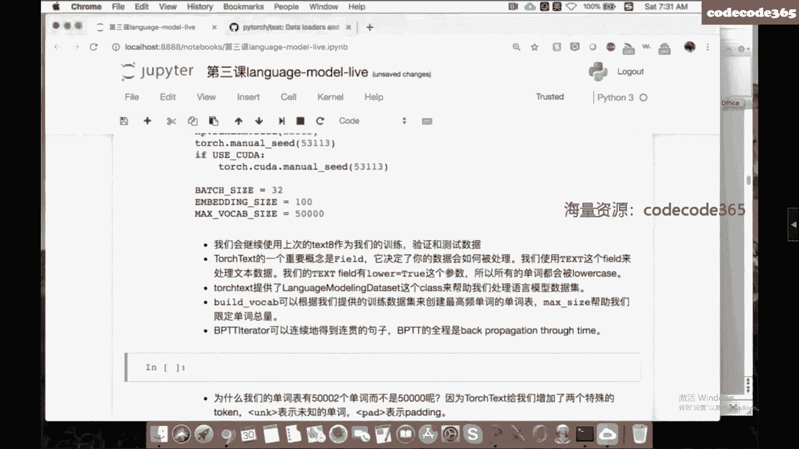
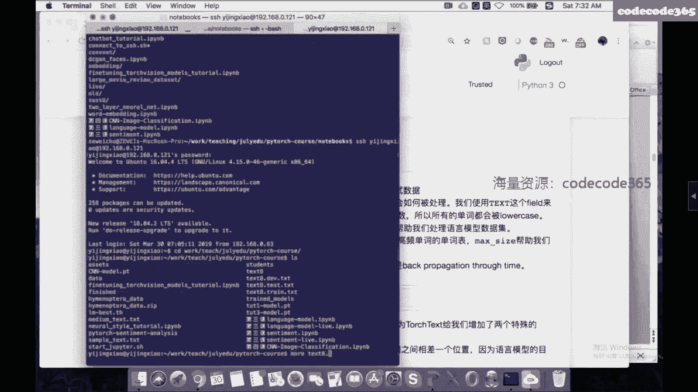
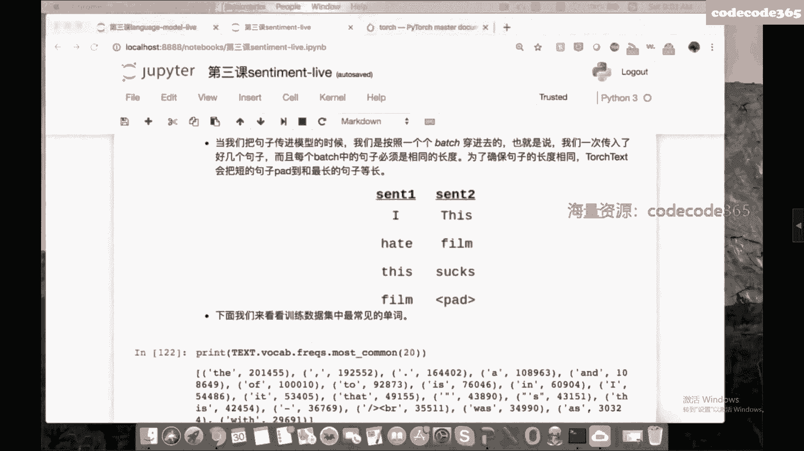

# 📚 课程名称：NLP高端就业小班10期 - P2：基于RNN的文本分类与语言模型

## 📖 课程概述
在本节课中，我们将学习语言模型和文本分类的基本概念，并重点介绍如何使用PyTorch构建循环神经网络（RNN）模型来解决这些问题。课程内容涵盖语言模型的定义、评价方法、RNN及其变体（LSTM、GRU）的原理，以及如何用代码实现和训练这些模型。





---

## 🧠 语言模型简介
语言模型的核心任务是计算一个句子出现的概率。这个概率衡量了一句话的合理性。例如，“七月在线是一所好学校”比“七月在线一是学好所效”出现的概率更大。

### 核心公式
给定一个句子 \( S = w_1, w_2, ..., w_n \)，其概率可以通过链式法则计算：
\[
P(S) = P(w_1) \cdot P(w_2|w_1) \cdot ... \cdot P(w_n|w_1, w_2, ..., w_{n-1})
\]
在传统n-gram模型中，我们使用马尔可夫假设，即下一个词只依赖于前n个词。但在神经网络模型中，我们可以用更长的历史信息。

### 模型评价：困惑度（Perplexity）
困惑度是评价语言模型好坏的标准，计算公式为：
\[
\text{Perplexity} = 2^{J}
\]
其中 \( J \) 是模型在测试集上的平均交叉熵损失。困惑度越低，表示模型越好。

---

## 🔄 基于神经网络的语言模型
神经网络语言模型同样基于前面的单词预测下一个单词，但使用神经网络（如RNN）来拟合概率 \( P \)，而不是简单地计算频率。





### 循环神经网络（RNN）基础
一个简单的RNN单元在每个时间步 \( t \) 的计算如下：
\[
h_t = \tanh(W_{hh} h_{t-1} + W_{xh} x_t)
\]
\[
\hat{y}_t = \text{softmax}(W_{hy} h_t)
\]
其中：
- \( h_t \) 是当前隐藏状态。
- \( x_t \) 是当前输入（单词的嵌入向量）。
- \( \hat{y}_t \) 是预测的下一个单词的概率分布。

初始隐藏状态 \( h_0 \) 通常初始化为零向量。

### 训练与损失函数
使用交叉熵损失函数，并对序列中每个预测位置计算损失：
\[
\text{Loss} = -\sum_{t=1}^{T} \log P(w_t | w_{<t})
\]
优化器常用Adam。

### RNN的挑战：梯度消失与爆炸
RNN在训练时，梯度需要通过时间反向传播（Backpropagation Through Time, BPTT）。长序列会导致梯度变得极小（消失）或极大（爆炸）。

**解决方法**：
1.  **梯度裁剪（Gradient Clipping）**：解决梯度爆炸，将梯度范数限制在阈值内。
2.  **使用LSTM或GRU**：更复杂的门控机制，能更好地捕捉长期依赖，缓解梯度消失。

---

## 🏗️ 长短时记忆网络（LSTM）与门控循环单元（GRU）
上一节我们介绍了基础RNN及其训练挑战，本节中我们来看看两种更强大的变体。

### LSTM（长短时记忆网络）
LSTM通过引入“门”结构（输入门、遗忘门、输出门、细胞状态）来控制信息的流动和记忆，有效缓解了梯度消失问题。PyTorch中实现了标准的LSTM单元。

### GRU（门控循环单元）
GRU是LSTM的简化版本，它将遗忘门和输入门合并为“更新门”，并引入了“重置门”。参数更少，训练速度往往更快。

**核心总结**：
- 实践中，LSTM和GRU比基础RNN更常用。
- LSTM同时传递隐藏状态 \( h_t \) 和细胞状态 \( c_t \)。
- 训练时通常仍会使用梯度裁剪作为稳定训练的技巧。

---

## 💻 代码实践：构建语言模型
以下是使用PyTorch和`torchtext`库构建语言模型的关键步骤概述。

### 1. 数据准备与`torchtext`
`torchtext`是一个用于文本处理的库，可以帮助我们加载数据、构建词汇表和数据迭代器。

**关键步骤**：
- 定义`Field`来处理文本（如转为小写）。
- 使用`LanguageModelingDataset`加载数据。
- 从训练数据构建词汇表（`build_vocab`），并设置最大词汇量和未知词标记。
- 创建`BPTTIterator`，它将长文本按固定长度（`bptt_len`）切分成批次，用于BPTT训练。

### 2. 定义模型结构
我们定义一个通用的RNN模型类，可以配置为RNN、LSTM或GRU。

```python
import torch.nn as nn

class RNNModel(nn.Module):
    def __init__(self, vocab_size, embed_size, hidden_size, rnn_type='LSTM'):
        super(RNNModel, self).__init__()
        self.encoder = nn.Embedding(vocab_size, embed_size)
        if rnn_type == 'LSTM':
            self.rnn = nn.LSTM(embed_size, hidden_size)
        # ... 可以添加GRU和RNN选项
        self.decoder = nn.Linear(hidden_size, vocab_size)

    def forward(self, text, hidden):
        embedded = self.encoder(text) # shape: [seq_len, batch, embed_size]
        output, hidden = self.rnn(embedded, hidden)
        decoded = self.decoder(output.view(-1, output.size(2)))
        return decoded.view(output.size(0), output.size(1), decoded.size(1)), hidden

    def init_hidden(self, batch_size):
        # 初始化隐藏状态，与模型参数在同一设备上
        weight = next(self.parameters())
        if isinstance(self.rnn, nn.LSTM):
            return (weight.new_zeros(1, batch_size, self.hidden_size),
                    weight.new_zeros(1, batch_size, self.hidden_size))
        else:
            return weight.new_zeros(1, batch_size, self.hidden_size)
```

### 3. 训练循环与技巧
**关键训练循环步骤**：
1.  初始化隐藏状态。
2.  获取一个批次的数据（`text`和`target`，`target`是`text`向右偏移一位）。
3.  前向传播，计算损失。
4.  反向传播，进行梯度裁剪。
5.  优化器更新参数。

**重要技巧**：隐藏状态再包装（Repackaging Hidden States）
为了避免在非常长的序列上反向传播导致计算图过大和内存爆炸，我们在每个小批次（`bptt_len`长度）训练后，将隐藏状态从其计算历史中分离（`detach`），只保留其数值用于下一个批次的初始化。

```python
def repackage_hidden(h):
    if isinstance(h, torch.Tensor):
        return h.detach()
    else:
        return tuple(repackage_hidden(v) for v in h)
```

### 4. 模型评估、保存与加载
- **评估**：在验证集上计算困惑度，监控模型性能。
- **保存**：当验证损失达到新低时，保存模型的`state_dict()`。
- **加载**：`model.load_state_dict(torch.load(‘model.pth’))`。

### 5. 文本生成
使用训练好的模型，可以从一个种子词开始，递归地预测下一个词来生成文本。采样时可以使用`multinomial`采样增加多样性，或使用`argmax`获取确定性结果。

---

## 📊 文本分类简介
文本分类是另一个重要的NLP任务，例如情感分析、垃圾邮件识别。其目标是将一段文本分配到一个预定义的类别。

### 基本思路
无论使用什么模型，核心思路都是将变长的文本编码成一个固定长度的句子向量，然后通过一个分类器（如全连接层）进行分类。

**常用方法**：
1.  **词向量平均（Word Average）**：将句子中所有词的词向量取平均，作为句子表示。简单但有效。
2.  **RNN编码**：使用RNN（或LSTM/GRU）处理整个句子，用最后一个隐藏状态作为句子表示。
3.  **双向RNN（Bi-RNN）**：分别从前向后和从后向前处理句子，将两个方向的最终隐藏状态拼接，能更好地捕获上下文信息。
4.  **卷积神经网络（CNN）**：使用不同尺寸的卷积核在词向量序列上滑动，提取局部特征，然后通过池化层得到句子表示。（下节课重点）

### 使用`torchtext`处理分类数据
与语言模型类似，但`Field`定义可能包含更复杂的分词器（如`spaCy`），并且需要`LabelField`来处理标签。可以使用`BucketIterator`来将长度相似的句子分到同一个批次，以减少填充（Padding）的数量，提升效率。

---

## 🎯 课程总结
本节课我们一起学习了：
1.  **语言模型**的定义、评价指标（困惑度）及其数学基础。
2.  **循环神经网络（RNN）** 的原理、训练方法及其梯度问题。
3.  **LSTM和GRU** 的结构与优势。
4.  使用 **PyTorch** 和 **`torchtext`** 库构建、训练、评估语言模型的完整流程，包括数据加载、模型定义、训练技巧（梯度裁剪、隐藏状态再包装）和文本生成。
5.  **文本分类**任务的基本概念和常用模型框架，为下节课深入讲解CNN文本分类打下基础。




通过本课的学习，你应该掌握了使用RNN家族模型处理序列数据的基本能力，并了解了文本分类任务的基本范式。