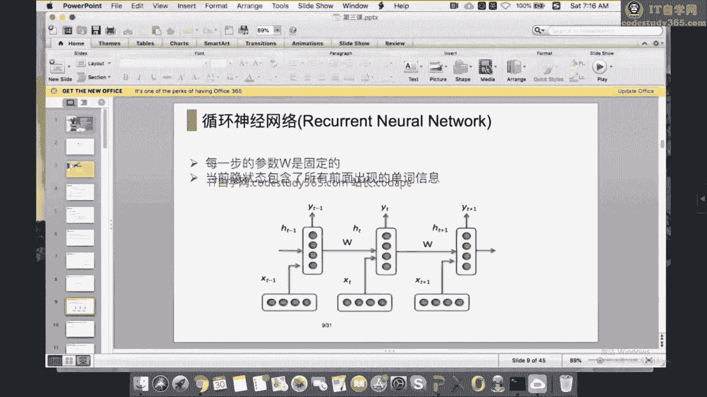
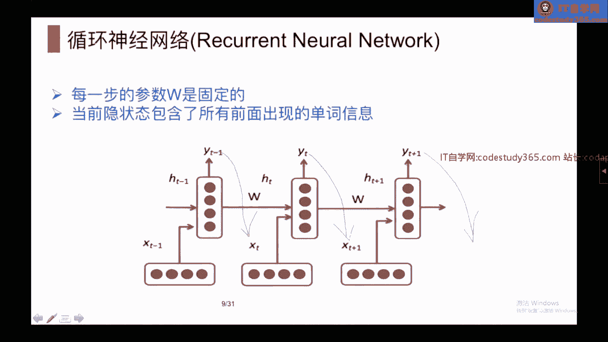
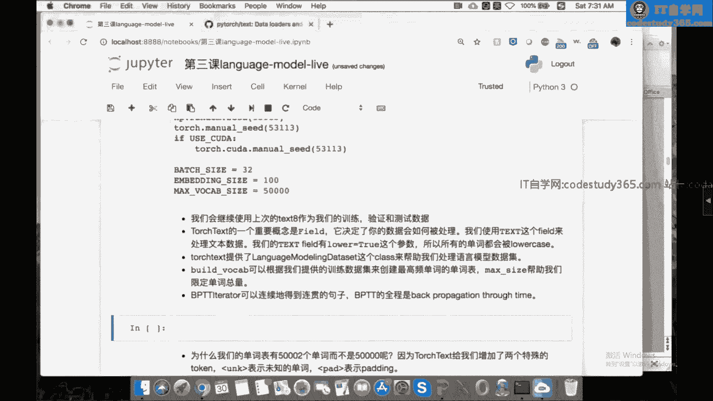
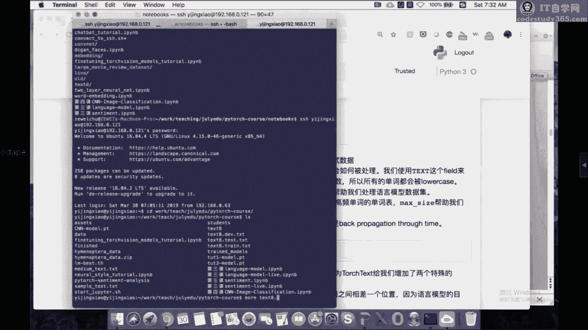
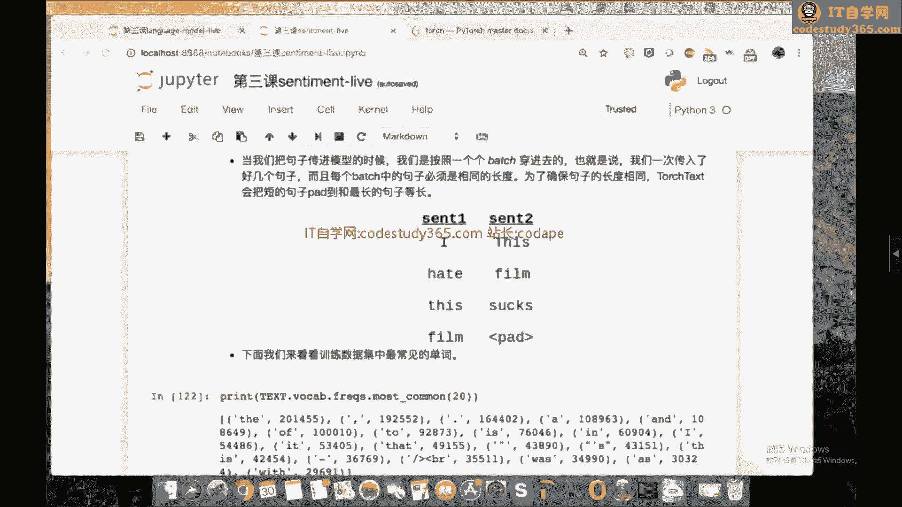

# 【七月在线】NLP高端就业训练营10期 - P2：2.基于RNN的文本分类与语言模型 📚

## 概述

在本节课中，我们将学习语言模型和文本分类的基本概念，并重点介绍如何使用PyTorch构建循环神经网络（RNN）模型来解决这些问题。我们将从语言模型的定义和评价方法开始，逐步深入到RNN、LSTM和GRU的具体实现，最后探讨如何将这些模型应用于文本分类任务。

---

## 语言模型介绍

语言模型的核心任务是计算一个句子出现的概率。这个概率衡量了一句话的合理性。例如，“七月在线是一所好学校”比“七月在线一是学好所效”出现的概率更大，正常人更可能说出前者。



### 语言模型的应用



如果你能知道每句话出现的概率，就可以完成许多任务，例如完形填空或文本生成。因为你可以判断哪些后续文本的概率更高。

### 链式法则与马尔可夫假设

在构建语言模型时，我们通常遵循链式法则，即一个句子出现的概率等于其中每个词基于前面词出现的条件概率的乘积。

在传统模型中，我们常常使用马尔可夫假设，即下一个词出现的概率只依赖于前面的N个词，忽略更早的历史。这有助于减少模型参数。但在神经网络模型中，我们可以让模型看到更长的历史信息。

### 语言模型的评价：困惑度（Perplexity）

我们通常使用困惑度来评价一个语言模型的好坏。困惑度的计算公式是句子概率的负N分之一次方。这样做有两个原因：首先，句子概率通常非常小，取负次方可以将其变为较大的数字以便观察；其次，取N分之一次方可以消除句子长度对概率的影响，进行归一化。

困惑度越低，表示模型对句子的预测越好，模型质量越高；困惑度越高，则表示模型越“困惑”，质量越差。

---

## 基于神经网络的语言模型

基于神经网络的语言模型，其目标与传统模型一致：根据前面的若干个单词预测下一个单词。关键区别在于，我们使用一个神经网络（而非简单的计数统计）来拟合条件概率P。

在语言模型中，我们经常使用循环神经网络（RNN）来进行预测。

### 循环神经网络（RNN）的基本架构



RNN的基本思想是维护一个隐藏状态（hidden state），该状态随着序列的输入而更新。在每一个时间步t，模型接收当前输入单词Xt和上一个隐藏状态Ht-1，通过神经网络计算得到当前隐藏状态Ht，再利用Ht预测下一个单词。



一个典型的RNN单元计算公式如下：
`Ht = tanh(Whh * Ht-1 + Wxh * Xt + bh)`
其中，`Whh`和`Wxh`是权重矩阵，`bh`是偏置项。

初始隐藏状态H0通常初始化为全零向量。

预测输出Yt（即下一个单词的概率分布）通过对隐藏状态Ht进行线性变换得到：
`Yt = softmax(Why * Ht + by)`
这里，`Why`将隐藏状态映射到整个词表大小的维度上。

### RNN的训练与损失函数

训练RNN时，我们通常使用交叉熵损失函数。需要注意的是，损失是在每一个预测的时间步上计算的。假设我们有一个长度为N的文本，模型需要预测从第2个到第N+1个单词。每一步的预测都会产生一个损失，总损失是这些步骤损失的和。

优化方法通常使用随机梯度下降（SGD）或其变种，如Adam优化器，因为它们通常效果较好。

### RNN的挑战：梯度消失与爆炸

训练RNN的一个主要困难是梯度消失和梯度爆炸问题。这是因为在反向传播时，梯度需要沿着时间步连续相乘。当序列很长时，连续的乘法可能导致梯度变得极小（消失）或极大（爆炸）。

为了解决梯度爆炸，可以采用梯度裁剪（gradient clipping）技术，即当梯度范数超过某个阈值时，将其缩放。

为了解决梯度消失，研究者提出了更复杂的循环单元结构。

---

## 长短时记忆网络（LSTM）与门控循环单元（GRU）

### 长短时记忆网络（LSTM）

LSTM通过引入“门”机制和额外的细胞状态（cell state）来更好地控制信息的流动和记忆，有效缓解了梯度消失问题。

一个LSTM单元包含三个门：
1.  **遗忘门（Forget Gate）**：决定从细胞状态中丢弃哪些信息。
2.  **输入门（Input Gate）**：决定哪些新信息将被存储到细胞状态中。
3.  **输出门（Output Gate）**：基于细胞状态，决定输出什么信息到隐藏状态。

LSTM在传递过程中同时维护两个状态：隐藏状态H和细胞状态C。PyTorch中实现的LSTM版本是一个更流行的变体。

### 门控循环单元（GRU）

GRU是LSTM的一个简化版本，它将遗忘门和输入门合并为一个“更新门”，并取消了细胞状态，只有隐藏状态。GRU的参数更少，训练速度可能更快，但在许多任务上表现与LSTM相当。

### 模型选择总结

在实际项目中，我们很少使用最基础的RNN，大部分时候会选择LSTM或GRU。LSTM同时传递隐藏状态和细胞状态，而GRU只传递一个隐藏状态。

---

## 实践部分：使用PyTorch和TorchText构建语言模型

上一节我们介绍了RNN家族的理论基础，本节中我们来看看如何用代码实现一个语言模型。我们将使用`torchtext`库来简化文本数据的处理。

### 环境准备与数据加载

首先，导入必要的库并设置超参数。

```python
import torch
import torch.nn as nn
import torch.optim as optim
from torchtext import data, datasets

# 设置随机种子以保证结果可复现
torch.manual_seed(1234)

# 超参数
BATCH_SIZE = 32
EMBEDDING_SIZE = 100
HIDDEN_SIZE = 100
NUM_EPOCHS = 2
GRADIENT_CLIP = 5.0
LEARNING_RATE = 0.001
```

接下来，使用`torchtext`加载和预处理数据。我们使用`text8`数据集作为示例。

```python
# 定义文本字段，指定预处理（如转为小写）
TEXT = data.Field(lower=True)

# 加载语言模型数据集
train_data, val_data, test_data = datasets.LanguageModelingDataset.splits(
    path='.',
    train='text8.train.txt',
    validation='text8.valid.txt',
    test='text8.test.txt',
    text_field=TEXT
)

# 构建词表，只保留最高频的50000个词，其余用<unk>表示
TEXT.build_vocab(train_data, max_size=50000)
VOCAB_SIZE = len(TEXT.vocab)
print(f"词表大小: {VOCAB_SIZE}")
```

### 构建数据迭代器

我们需要将数据组织成批次（batch）。对于语言模型，我们使用`BPTTIterator`，它会将长文本序列切割成较短的片段（由`bptt_len`参数控制），以便进行随时间反向传播。

```python
device = torch.device('cuda' if torch.cuda.is_available() else 'cpu')

# 创建数据迭代器
train_iter, val_iter, test_iter = data.BPTTIterator.splits(
    (train_data, val_data, test_data),
    batch_size=BATCH_SIZE,
    bptt_len=50,  # 反向传播的时间步长度
    device=device,
    repeat=False,
    shuffle=True
)
```

### 定义RNN语言模型

现在，我们来定义模型。这个模型包含一个词嵌入层、一个循环神经网络层（这里以LSTM为例）和一个输出层。

```python
class RNNModel(nn.Module):
    def __init__(self, vocab_size, embed_size, hidden_size):
        super(RNNModel, self).__init__()
        self.hidden_size = hidden_size
        # 词嵌入层
        self.encoder = nn.Embedding(vocab_size, embed_size)
        # LSTM层
        self.rnn = nn.LSTM(embed_size, hidden_size, batch_first=False)
        # 输出层，将隐藏状态映射回词表空间
        self.decoder = nn.Linear(hidden_size, vocab_size)

    def forward(self, input, hidden):
        # input shape: [seq_len, batch_size]
        embedded = self.encoder(input)  # [seq_len, batch_size, embed_size]
        output, hidden = self.rnn(embedded, hidden)  # output: [seq_len, batch_size, hidden_size]
        # 将输出重塑为二维张量以输入线性层
        decoded = self.decoder(output.view(-1, self.hidden_size))  # [seq_len*batch_size, vocab_size]
        # 将输出重塑回三维
        return decoded.view(output.size(0), output.size(1), decoded.size(-1)), hidden

    def init_hidden(self, batch_size):
        # 初始化隐藏状态和细胞状态为零
        weight = next(self.parameters())
        return (weight.new_zeros(1, batch_size, self.hidden_size),
                weight.new_zeros(1, batch_size, self.hidden_size))
```

### 训练模型

以下是训练循环的关键步骤。注意，由于语言模型的序列连续性，我们需要在批次间传递隐藏状态，但为了避免计算图过长导致内存爆炸，我们使用`.detach()`来截断历史。

```python
model = RNNModel(VOCAB_SIZE, EMBEDDING_SIZE, HIDDEN_SIZE).to(device)
criterion = nn.CrossEntropyLoss()
optimizer = optim.Adam(model.parameters(), lr=LEARNING_RATE)

def repackage_hidden(h):
    """将隐藏状态从计算图中分离，以截断历史。"""
    if isinstance(h, torch.Tensor):
        return h.detach()
    else:
        return tuple(repackage_hidden(v) for v in h)

for epoch in range(NUM_EPOCHS):
    model.train()
    hidden = model.init_hidden(BATCH_SIZE)
    for i, batch in enumerate(train_iter):
        data, targets = batch.text, batch.target
        # 分离隐藏状态，防止梯度爆炸
        hidden = repackage_hidden(hidden)
        optimizer.zero_grad()
        # 前向传播
        output, hidden = model(data, hidden)
        # 计算损失
        loss = criterion(output.view(-1, VOCAB_SIZE), targets.view(-1))
        # 反向传播
        loss.backward()
        # 梯度裁剪
        torch.nn.utils.clip_grad_norm_(model.parameters(), GRADIENT_CLIP)
        optimizer.step()
        if i % 100 == 0:
            print(f'Epoch: {epoch}, Iteration: {i}, Loss: {loss.item()}')
```

### 模型评估与保存

我们可以在验证集上评估模型，并保存效果最好的模型。

```python
def evaluate(model, data_iter):
    model.eval()
    total_loss = 0
    total_count = 0
    hidden = model.init_hidden(BATCH_SIZE)
    with torch.no_grad():
        for batch in data_iter:
            data, targets = batch.text, batch.target
            output, hidden = model(data, hidden)
            hidden = repackage_hidden(hidden)
            loss = criterion(output.view(-1, VOCAB_SIZE), targets.view(-1))
            total_loss += loss.item() * data.numel()
            total_count += data.numel()
    model.train()
    return total_loss / total_count

best_val_loss = float('inf')
for epoch in range(NUM_EPOCHS):
    # ... 训练代码 ...
    val_loss = evaluate(model, val_iter)
    if val_loss < best_val_loss:
        best_val_loss = val_loss
        torch.save(model.state_dict(), 'best_language_model.pth')
        print(f'Best model saved with validation loss: {val_loss}')
```

---

## 文本分类简介

上一节我们详细探讨了用于语言模型的RNN，本节中我们来看看RNN在另一个重要任务——文本分类中的应用。文本分类的目标是给一段文本分配一个预定义的类别标签，例如情感分析（正面/负面）、垃圾邮件识别等。

### 文本分类的基本思路

无论使用何种模型，文本分类的通用流程是：
1.  将文本中的单词转换为词向量。
2.  将这些词向量组合成一个能够代表整个句子的向量（句子表示）。
3.  将这个句子表示输入到一个分类器（通常是线性层）中得到类别预测。

### 基于词向量平均的模型

一个简单而有效的基线模型是词向量平均模型。其步骤如下：
1.  将句子中的每个单词通过查找表转换为词向量。
2.  对所有词向量求平均，得到一个句子向量。
3.  将该句子向量输入到一个前馈神经网络中进行分类。

虽然简单，但这个模型在很多任务上表现非常鲁棒。

### 基于RNN的文本分类模型

RNN天然适合处理序列数据，可以更好地捕捉单词间的顺序和上下文信息。常用的RNN文本分类架构包括：
*   **使用最后隐藏状态**：将RNN处理完整个句子后的最后一个隐藏状态作为句子表示。缺点是可能遗忘句子开头的长程信息。
*   **使用所有隐藏状态的平均（平均池化）**：对RNN在所有时间步产生的隐藏状态求平均。
*   **双向RNN（Bi-RNN）**：同时运行一个前向RNN和一个后向RNN，然后将两个方向对应时间步的隐藏状态拼接起来。这样每个单词的表示都包含了其左右上下文的信息，最后再通过池化（如平均）得到句子表示。

### 使用TorchText处理文本分类数据

以下是如何使用`torchtext`加载IMDB电影评论数据集（一个二分类情感分析数据集）的示例。

```python
from torchtext import data, datasets
import spacy

# 使用spacy进行分词
spacy_en = spacy.load('en_core_web_sm')
def tokenizer(text):
    return [tok.text for tok in spacy_en.tokenizer(text)]

# 定义字段
TEXT = data.Field(tokenize=tokenizer, lower=True)
LABEL = data.LabelField(dtype=torch.float)

# 加载IMDB数据集
train_data, test_data = datasets.IMDB.splits(TEXT, LABEL)
# 将训练集进一步划分为训练集和验证集
train_data, val_data = train_data.split(random_state=random.seed(1234))

# 构建词表，并加载预训练的词向量（如GloVe）
TEXT.build_vocab(train_data, max_size=25000, vectors="glove.6B.100d")
LABEL.build_vocab(train_data)

# 创建迭代器，使用BucketIterator将长度相似的句子放在同一个批次以减少填充
train_iter, val_iter, test_iter = data.BucketIterator.splits(
    (train_data, val_data, test_data),
    batch_size=BATCH_SIZE,
    device=device,
    sort_within_batch=True,
    sort_key=lambda x: len(x.text)
)
```

关于`BucketIterator`：它不会打乱一个句子内部的单词顺序，而是将训练集中所有句子按长度分组，使得同一个批次内的句子长度相近。这能有效减少填充符（`<pad>`）的数量，提升训练效率和模型效果。对于文本分类任务，不同数据样本之间的顺序无关紧要，因此这种分组是可行的。

---

## 总结

本节课我们一起学习了自然语言处理中的两个核心任务：语言模型和文本分类。

我们首先深入探讨了语言模型，理解了其如何计算句子概率以及用困惑度进行评价。然后，我们重点学习了循环神经网络（RNN）及其为解决长程依赖问题而衍生的变体——长短时记忆网络（LSTM）和门控循环单元（GRU）。通过PyTorch代码实践，我们掌握了构建、训练和评估一个RNN语言模型的完整流程，包括使用`torchtext`处理数据、梯度裁剪、隐藏状态传递与截断等关键技巧。

接着，我们将视角转向文本分类，介绍了其基本思路和常用模型，特别是如何利用RNN来获取更好的句子表示。我们看到了如何使用`torchtext`便捷地加载和处理像IMDB这样的标准分类数据集。




通过本课的学习，你应该对基于RNN的序列建模有了扎实的理解，并具备了使用PyTorch框架实现相关模型的实践能力。这些知识是构建更复杂NLP应用（如机器翻译、对话系统）的重要基石。