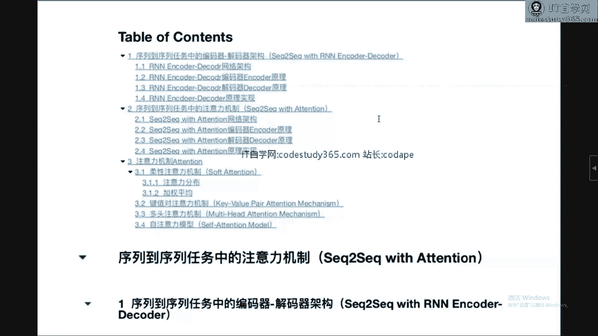

# 【七月在线】NLP高端就业训练营10期 - P5：1. 基于Attention机制的Seq2Seq任务 🧠

在本节课中，我们将要学习序列到序列（Seq2Seq）任务中的注意力机制。我们将从经典的编码器-解码器架构入手，分析其局限性，并自然地引出注意力机制的概念。最后，我们会将注意力机制抽象为一个通用的特征提取框架，并了解其核心变体。

## 1. 序列到序列任务中的编码器-解码器架构 🔄

上一节我们介绍了课程的整体脉络，本节中我们来看看序列到序列任务的基础模型——编码器-解码器架构。

编码器-解码器架构是解决序列到序列问题的经典框架，例如机器翻译。其核心思想是将一个变长的输入序列编码成一个固定长度的向量，再将该向量解码成另一个变长的输出序列。

### 1.1 网络架构图示

下图展示了标准的编码器-解码器架构：

```
输入序列 (X1, X2, ..., XT) -> [编码器 RNN] -> 上下文向量 C -> [解码器 RNN] -> 输出序列 (Y1, Y2, ..., YT')
```

在编码器阶段，一个循环神经网络（如RNN、LSTM或GRU）逐步读取输入序列。最后一个时间步的隐藏状态 `h_T` 被用作整个输入序列的“总结”，即上下文向量 `C`。

在解码器阶段，另一个循环神经网络以 `C` 作为其初始隐藏状态，并逐步生成输出序列。在生成每一个输出 `Y_t` 时，解码器都会参考上一个时刻的隐藏状态、上一个时刻的输出 `Y_{t-1}` 以及上下文向量 `C`。

### 1.2 数学公式描述

以下是该架构核心部分的数学描述：

**编码器**（以GRU为例）：
对于每个时间步 `t`（从1到T）：
```
z_t = σ(W_z · [h_{t-1}, x_t])
r_t = σ(W_r · [h_{t-1}, x_t])
h̃_t = tanh(W · [r_t * h_{t-1}, x_t])
h_t = (1 - z_t) * h_{t-1} + z_t * h̃_t
```
最终，上下文向量 `C = h_T`。

**解码器**：
解码器的初始隐藏状态 `s_0 = C`。
对于每个时间步 `t`（从1到T‘）：
```
s_t = f(s_{t-1}, y_{t-1}, C)  // f是解码器RNN单元（如GRU）的计算过程
P(y_t | y_{<t}, C) = g(s_t, y_{t-1}, C) // g是输出层（如softmax）
```
其中，`f` 和 `g` 都是可学习的函数。

### 1.3 代码示意

以下是该架构在代码中的核心逻辑示意（使用PyTorch风格）：

```python
class Encoder(nn.Module):
    def forward(self, x):
        # x: [seq_len, batch_size, embed_dim]
        outputs, hidden = self.rnn(x) # outputs保存所有时间步的隐藏状态
        # 取最后一个时间步的隐藏状态作为上下文向量
        context = hidden[-1] # 假设是单层RNN
        return context

class Decoder(nn.Module):
    def __init__(self, ...):
        self.rnn = nn.GRU(...)
        self.fc_out = nn.Linear(...)

    def forward(self, decoder_input, hidden, context):
        # decoder_input: 上一个时间步的输出（或起始符）
        # hidden: 上一个时间步的隐藏状态，初始为context
        # context: 编码器输出的上下文向量
        output, hidden = self.rnn(decoder_input, hidden)
        # 在计算输出时，会结合context信息
        output = self.fc_out(torch.cat([output, context.unsqueeze(0)], dim=-1))
        return output, hidden
```

### 1.4 架构的局限性

通过以上分析，我们可以清晰地看到该架构的核心操作：**将变长的输入序列压缩成一个定长的向量 `C`**。

这带来了一个根本性问题：`C` 的容量有限，难以完整存储长序列的所有信息，尤其是序列开头的细节信息在传递到末尾时可能已经丢失或稀释。这被称为“信息瓶颈”问题。

## 2. 序列到序列任务中的注意力机制 🎯

上一节我们介绍了编码器-解码器架构及其信息瓶颈问题，本节中我们来看看如何通过注意力机制来解决这个问题。

注意力机制的朴素想法是：在解码器生成每一个词时，不应该均等地看待编码器所有时间步的信息，而应该“有侧重地”去查看输入序列的不同部分。解码器在每一步都可以“软搜索”一组与当前生成词最相关的输入位置，并基于这些位置的编码信息来生成当前词。

### 2.1 带有注意力机制的Seq2Seq架构

下图展示了引入注意力机制后的Seq2Seq模型：

```
编码器隐藏状态: (h1, h2, ..., hT)
                ↓ (为解码器每一步计算注意力权重)
解码器步骤t: -- 注意力权重 (α_t1, α_t2, ..., α_tT) --
                ↓ (加权求和)
            上下文向量 C_t = Σ(α_ti * h_i)
                ↓ (与解码器状态结合)
            输出 Y_t
```

关键改进在于：**上下文向量 `C` 不再是固定的，而是为解码器的每一个时间步 `t` 动态计算一个专属的 `C_t`**。

### 2.2 注意力机制的计算步骤

以下是计算动态上下文向量 `C_t` 的步骤：

**第一步：计算注意力得分（Alignment Scores）**
对于解码器当前时刻 `t` 的隐藏状态 `s_{t-1}` 和编码器所有时刻的隐藏状态 `h_i`，计算一个得分 `e_{ti}`，表示 `h_i` 对生成当前词的重要程度。
一种常见的计算方式是：
```
e_{ti} = v_a^T · tanh(W_a · [s_{t-1}; h_i])
```
其中 `W_a` 和 `v_a` 是可学习的参数，`[;]` 表示向量拼接。

**第二步：计算注意力权重（Attention Weights）**
使用softmax函数将所有得分 `e_{ti}` 归一化为概率分布，即注意力权重 `α_{ti}`：
```
α_{ti} = exp(e_{ti}) / Σ_{j=1}^{T} exp(e_{tj})
```
`α_{ti}` 表示在生成第 `t` 个输出词时，编码器第 `i` 个输入词的关注程度。

**第三步：计算上下文向量（Context Vector）**
将编码器的所有隐藏状态 `h_i` 按其对应的注意力权重 `α_{ti}` 进行加权求和，得到当前时刻的上下文向量 `C_t`：
```
C_t = Σ_{i=1}^{T} α_{ti} · h_i
```

**第四步：更新解码器输出**
将动态上下文向量 `C_t` 与解码器当前隐藏状态 `s_{t-1}` 拼接，一起送入输出层预测当前词 `y_t`：
```
s_t = f(s_{t-1}, y_{t-1}, C_t)
P(y_t | ...) = g(s_t, y_{t-1}, C_t)
```

### 2.3 代码示意

以下是注意力机制核心计算的代码示意：

```python
class Attention(nn.Module):
    def __init__(self, enc_hid_dim, dec_hid_dim):
        super().__init__()
        self.attn = nn.Linear((enc_hid_dim * 2) + dec_hid_dim, dec_hid_dim) # 对应 W_a
        self.v = nn.Linear(dec_hid_dim, 1, bias=False) # 对应 v_a^T

    def forward(self, decoder_hidden, encoder_outputs):
        # decoder_hidden: [batch_size, dec_hid_dim]
        # encoder_outputs: [src_len, batch_size, enc_hid_dim * 2] (双向)
        src_len = encoder_outputs.shape[0]
        # 重复解码器隐藏状态以匹配编码器输出序列长度
        repeated_decoder_hidden = decoder_hidden.unsqueeze(1).repeat(1, src_len, 1)
        # 计算能量值 e_{ti}
        energy = torch.tanh(self.attn(torch.cat((repeated_decoder_hidden, encoder_outputs.permute(1,0,2)), dim=2)))
        attention = self.v(energy).squeeze(2) # [batch_size, src_len]
        # 计算注意力权重 α_{ti}
        return F.softmax(attention, dim=1)
```

在解码器中，每一步都需要调用此注意力模块：
```python
# 在解码器每一步中
attention_weights = self.attention(decoder_hidden, encoder_outputs) # [batch_size, src_len]
# encoder_outputs: [src_len, batch_size, hid_dim]
context_vector = torch.bmm(attention_weights.unsqueeze(1), encoder_outputs.permute(1,0,2))
# context_vector: [batch_size, 1, hid_dim]
```

## 3. 注意力机制的抽象：通用框架 🧩

上一节我们看到了注意力机制在Seq2Seq中的具体应用，本节中我们将其抽象为一个通用的特征提取框架。

注意力机制的本质可以概括为：**根据某些“查询”（Query），在一组“键-值”（Key-Value）对中，有选择地（通过权重）聚合“值”（Value）信息**。

### 3.1 软性注意力（Soft Attention）的一般形式

一个通用的软性注意力机制包含两步：

**1. 注意力分布计算**
给定查询向量 `q` 和包含 `N` 个元素的输入信息 `X = {x_1, ..., x_N}`，计算注意力分布 `α_i`，表示 `x_i` 受关注的程度。
```
α_i = softmax(s(x_i, q))
```
其中 `s(x_i, q)` 是**打分函数**，用于计算 `x_i` 与 `q` 的相关性。常见的打分函数有：
*  加性模型：`s(x_i, q) = v^T tanh(W x_i + U q)`
*  点积模型：`s(x_i, q) = x_i^T q`
*  缩放点积模型：`s(x_i, q) = (x_i^T q) / √d_k` （`d_k` 是 `x_i` 和 `q` 的维度，用于稳定梯度）

**2. 信息聚合（加权平均）**
根据注意力分布，对输入信息进行加权求和，得到输出向量。
```
output = Σ_{i=1}^{N} α_i · x_i
```
在抽象框架中，`x_i` 同时充当了计算注意力的“键”和被聚合的“值”。

### 3.2 键值对注意力（Key-Value Attention）

在更一般的设定中，用于计算注意力的“键”（Key）和用于聚合的“值”（Value）是分离的。输入是一组键值对 `(K, V) = {(k_1, v_1), ..., (k_N, v_N)}`。
```
α_i = softmax(s(k_i, q))
output = Σ_{i=1}^{N} α_i · v_i
```
这种分离使得模型可以学习更灵活的表征，例如，`k_i` 可以编码“哪些信息是可供检索的”，而 `v_i` 编码“这些信息的具体内容是什么”。

### 3.3 自注意力（Self-Attention）与缩放点积注意力

自注意力是一种特殊的键值对注意力，其查询 `Q`、键 `K`、值 `V` 都来自同一个输入序列 `X` 的线性变换：
```
Q = X W^Q, K = X W^K, V = X W^V
```
其中 `W^Q, W^K, W^V` 是可学习的权重矩阵。

**缩放点积注意力（Scaled Dot-Product Attention）** 是Transformer模型的核心，其计算公式如下：
```
Attention(Q, K, V) = softmax( (Q K^T) / √d_k ) V
```
这里使用了点积作为打分函数，并除以 `√d_k` 进行缩放，以防止点积结果过大导致softmax梯度消失。

### 3.4 多头注意力（Multi-Head Attention）

为了增强模型的容量，允许模型在不同的表示子空间里学习相关信息，可以将自注意力机制并行执行多次，即“多头”。
```
MultiHead(Q, K, V) = Concat(head_1, ..., head_h) W^O
其中 head_i = Attention(Q W_i^Q, K W_i^K, V W_i^V)
```
每个头都有自己独立的线性变换权重 `W_i^Q, W_i^K, W_i^V`，最后将所有头的输出拼接起来再做一次线性变换 `W^O`。

## 总结 📚

本节课中我们一起学习了注意力机制从具体应用到抽象框架的完整脉络。

1.  **起点**：我们从经典的Seq2Seq编码器-解码器架构出发，分析了其将变长序列压缩为定长向量所导致的“信息瓶颈”问题。
2.  **引入**：为了解决这个问题，我们引入了注意力机制。在Seq2Seq中，它为解码器的每一步动态计算一个上下文向量，该向量是编码器所有隐藏状态的加权和，权重由解码器当前状态与编码器各状态的匹配度决定。
3.  **抽象**：我们将注意力机制抽象为一个通用的特征提取框架。其核心是 **“根据查询（Query），有选择地聚合键值对（Key-Value）信息”** 。这包含两个步骤：计算注意力分布（通常用softmax归一化打分函数结果）和加权求和。
4.  **演进**：我们进一步了解了其重要变体：
    *   **键值对注意力**：将用于计算注意力的“键”和用于聚合的“值”分离，提供更大灵活性。
    *   **自注意力**：查询、键、值均来自同一输入序列的变换，使序列内部元素能够直接相互关注，并行计算效率高。
    *   **缩放点积注意力与多头注意力**：这是现代Transformer模型的基础。缩放点积注意力是高效的计算方式，多头注意力则允许模型在不同子空间共同关注信息。




注意力机制的本质可以理解为**在全连接网络的特征提取基础上，增加了一个动态的、内容相关的权重调制**。它不依赖于序列的顺序计算，具有强大的并行能力，并且能够建立序列中任意距离元素之间的直接依赖关系，因此已成为深度学习，尤其是自然语言处理领域最重要的基础模块之一。