# 【七月在线】NLP高端就业训练营10期 - P7：3.基于Luong Attention的机器翻译教程 🧠➡️🗣️

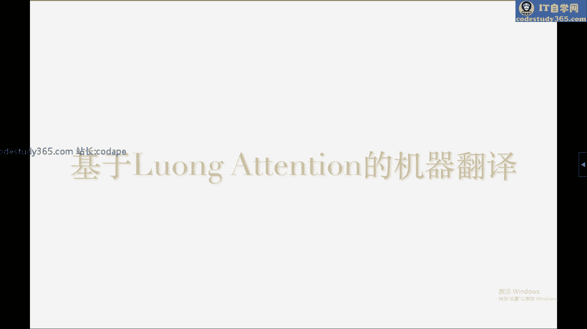

在本节课中，我们将学习如何使用Sequence-to-Sequence模型进行机器翻译，并训练一个简单的聊天机器人。我们将从基础的Encoder-Decoder模型开始，逐步引入Luong Attention机制，以提升翻译效果。课程内容将涵盖模型原理、代码实现以及实际应用。

---

## 模型回顾 📚

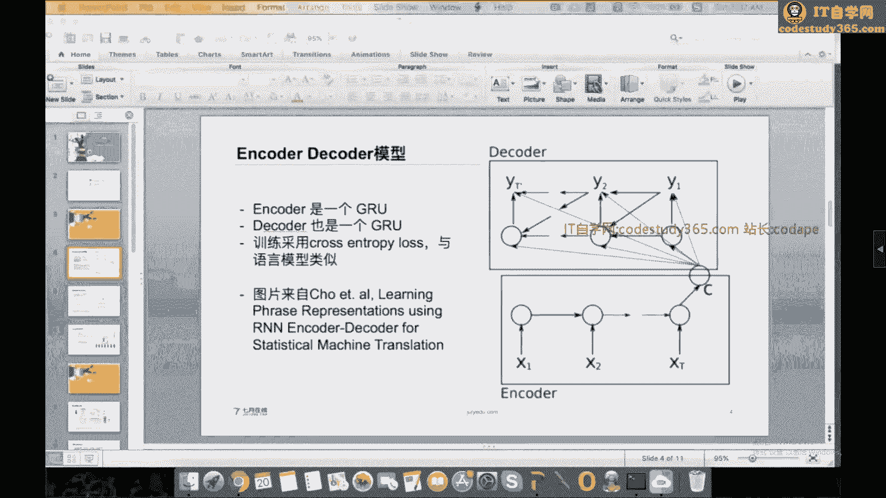

上一节我们介绍了语言模型的基本概念。本节中，我们来看看用于机器翻译的Sequence-to-Sequence模型。

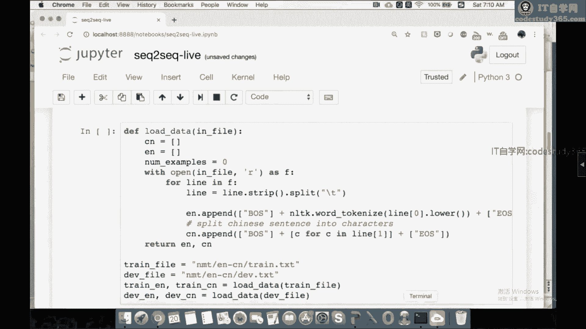

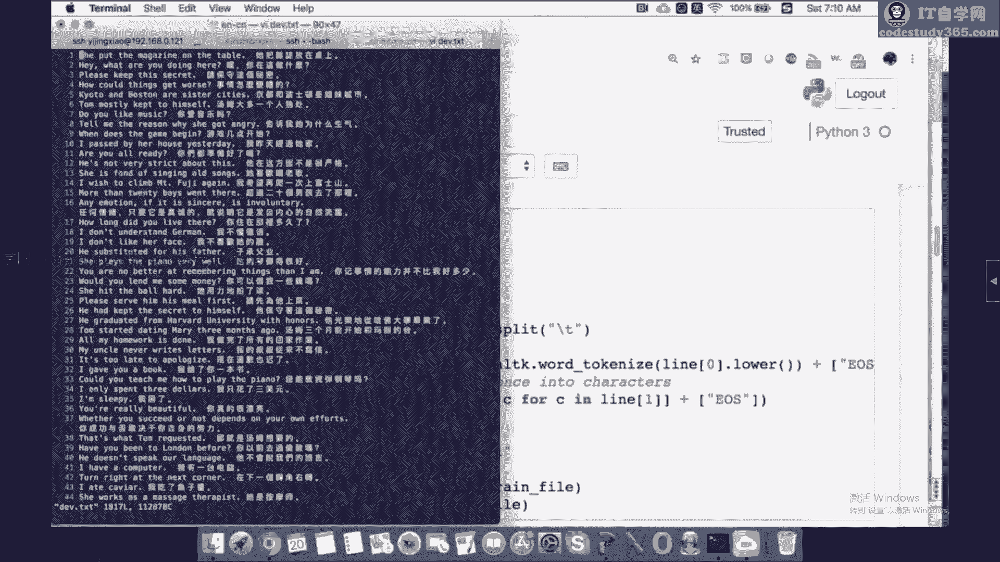

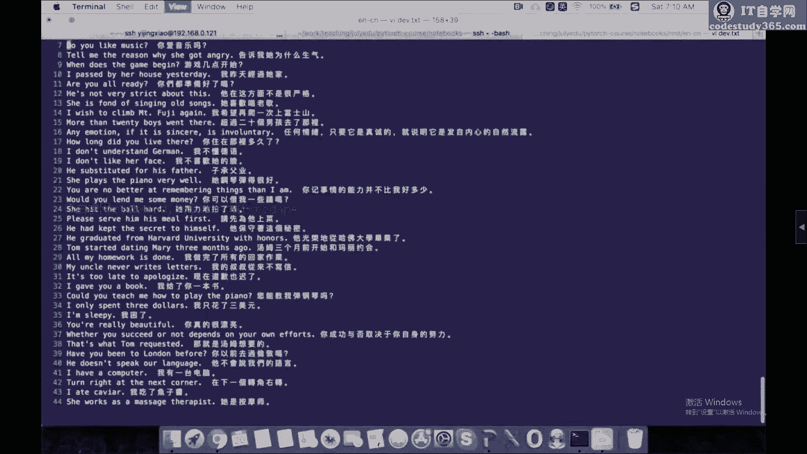

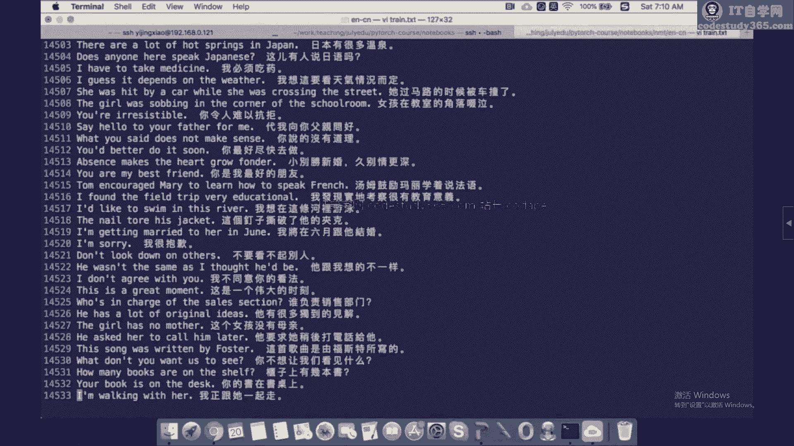

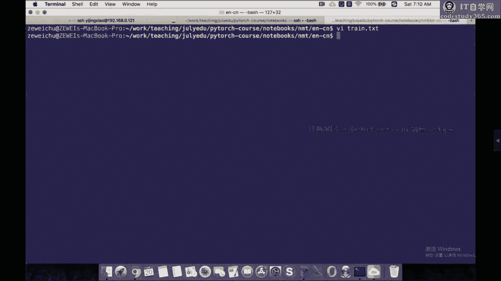

### 基础Encoder-Decoder模型

2014年，Cho等人发表了论文《Learning Phrase Representations using RNN Encoder-Decoder for Statistical Machine Translation》。该模型的基本思路非常简单。

*   将待翻译的中文句子用 **X** 表示，目标英文句子用 **Y** 表示。
*   将中文句子进行词嵌入（Embedding），然后输入一个循环神经网络（RNN，文中使用了GRU）。
*   编码器（Encoder）处理完整个输入序列后，会得到一个向量 **c**，它包含了整个句子的信息。
*   将这个向量 **c** 作为初始状态，一步步输入到另一个循环神经网络——解码器（Decoder）中，解码生成英文句子。

模型的训练采用交叉熵损失（Cross-Entropy Loss），与语言模型非常类似，可以看作是一个以向量 **c** 为条件的语言模型。

### 引入Attention机制

随后，Bahdanau等人在此基础上加入了Attention机制，显著提升了翻译效果。

*   编码器使用**双向循环神经网络**，获取每个输入单词更丰富的上下文表示。
*   不再只使用最后一个隐藏状态作为句子表示，而是认为**每个隐藏状态**都是句子表示的一部分。
*   在解码时，对于当前要生成的单词，计算一个**加权和**（Weighted Sum）作为当前的上下文向量（Context Vector），并将其与解码器的输入结合。

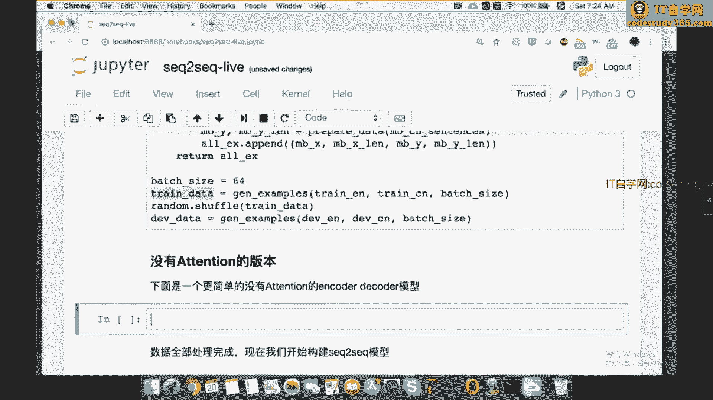

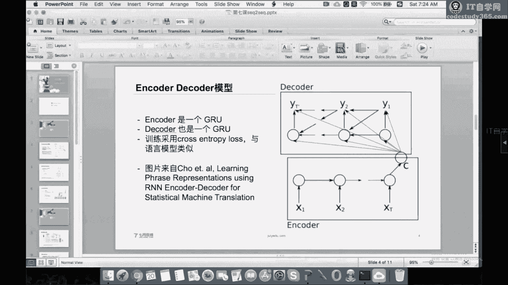

这个加权和的权重（即Attention分数）通过以下方式计算：
1.  计算解码器上一个时刻的隐藏状态 **s<sub>t-1</sub>** 与编码器所有隐藏状态 **h<sub>j</sub>** 的相似度得分 **e<sub>tj</sub>**。
2.  对这些得分进行Softmax归一化，得到权重 **α<sub>tj</sub>**。
3.  用权重对编码器隐藏状态进行加权求和，得到当前时刻的上下文向量 **c<sub>t</sub>**。

**公式**：
**α<sub>tj</sub> = softmax(e<sub>tj</sub>)**
**c<sub>t</sub> = Σ<sub>j</sub> α<sub>tj</sub> h<sub>j</sub>**

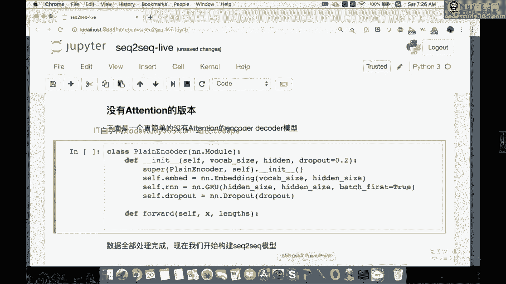

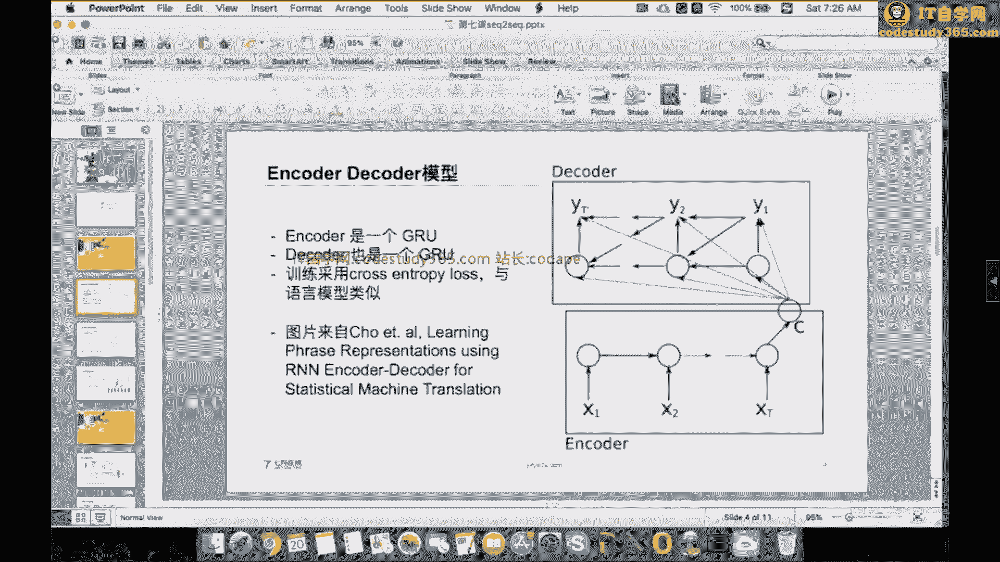

### Luong Attention

与Bahdanau的Attention（在计算得分时使用解码器上一时刻的隐藏状态）略有不同，Luong等人提出了另一种非常类似但更高效的Attention机制。

*   **得分函数（Scoring Function）**：Luong Attention介绍了几种计算得分 **e<sub>tj</sub>** 的方法，例如点积（Dot）、双线性（Bilinear，或称General）和拼接后加线性变换（Concat）。
*   **隐藏状态计算**：在获得上下文向量 **c<sub>t</sub>** 后，Luong Attention将其与解码器当前时刻的隐藏状态 **s<sub>t</sub>** 拼接，再经过一个线性变换和Tanh激活函数，得到用于预测最终输出的向量。

**公式（以双线性评分函数为例）**：
**e<sub>tj</sub> = s<sub>t</sub><sup>T</sup> W<sub>a</sub> h<sub>j</sub>**
**ã<sub>t</sub> = tanh(W<sub>c</sub> [c<sub>t</sub>; s<sub>t</sub>])**

本节我们将使用Luong Attention的**双线性（General）** 方法来构建我们的机器翻译模型。

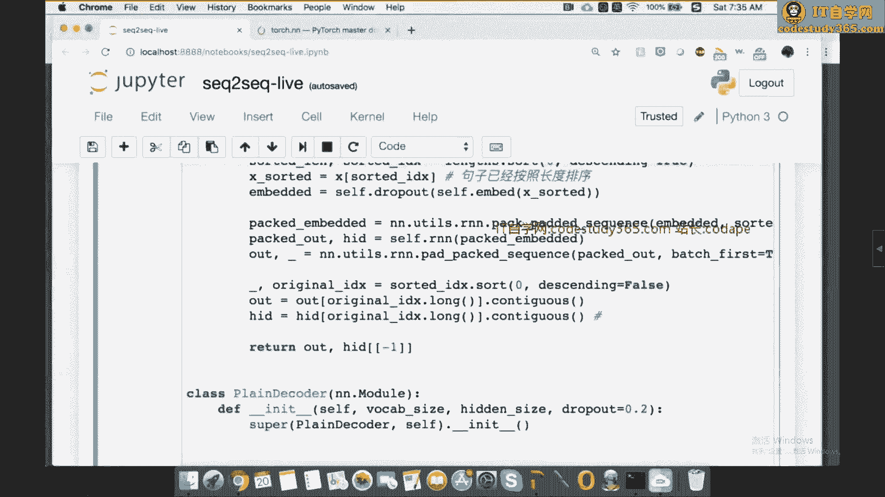

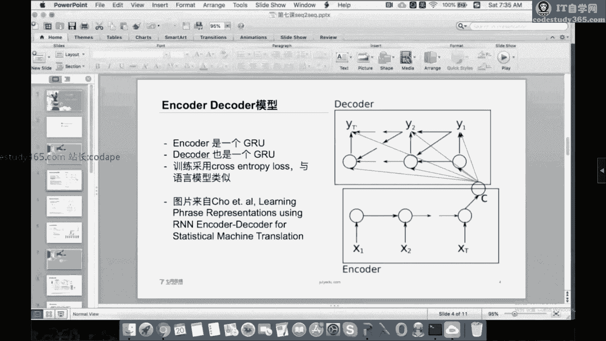

---

## 代码实现 💻

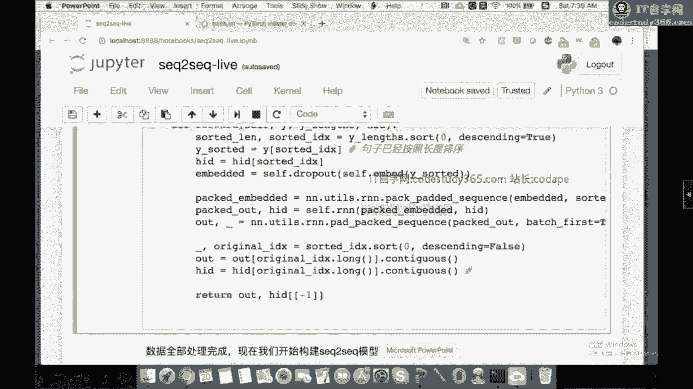

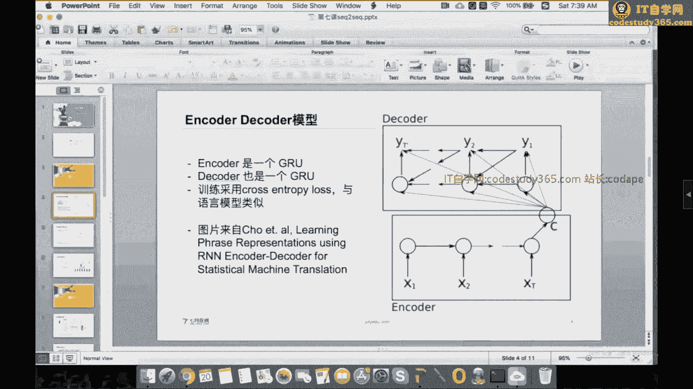

理解了模型原理后，本节我们来看看如何用PyTorch实现一个基于Luong Attention的机器翻译模型。由于数据集较小，训练出的模型效果可能有限，但足以帮助我们理解整个过程。

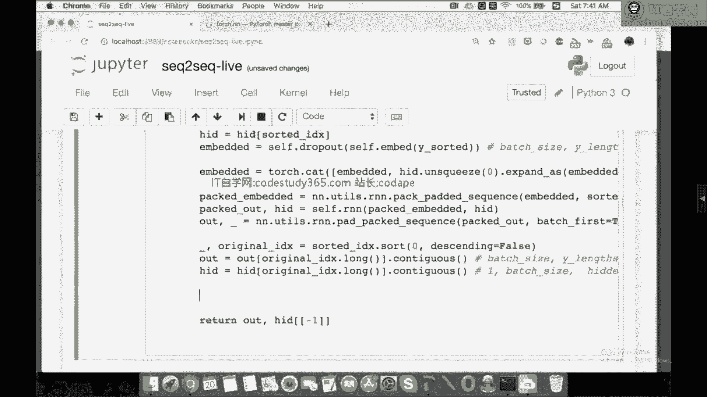

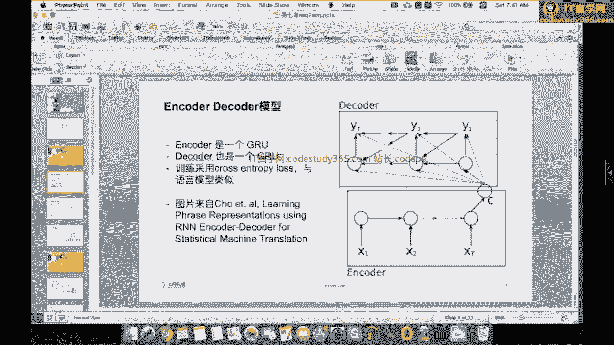

### 环境与数据准备

以下是导入必要库和进行数据预处理的步骤。

```python
import torch
import torch.nn as nn
import torch.optim as optim
from torch.nn.utils import clip_grad_norm_
import numpy as np
import nltk
nltk.download('punkt') # 用于英文分词
```

我们使用的数据是中文-英文平行语料，格式为“英文句子[TAB]中文句子”。以下是数据读取和预处理函数：

```python
def read_data(file_path):
    data = []
    with open(file_path, 'r', encoding='utf-8') as f:
        for line in f:
            parts = line.strip().split('\t')
            if len(parts) == 2:
                en_sent = ['<bos>'] + nltk.word_tokenize(parts[0].lower()) + ['<eos>']
                # 中文按字切分，也可使用jieba分词
                cn_sent = ['<bos>'] + [char for char in parts[1]] + ['<eos>']
                data.append((en_sent, cn_sent))
    return data

train_data = read_data('train.txt')
dev_data = read_data('dev.txt')
```

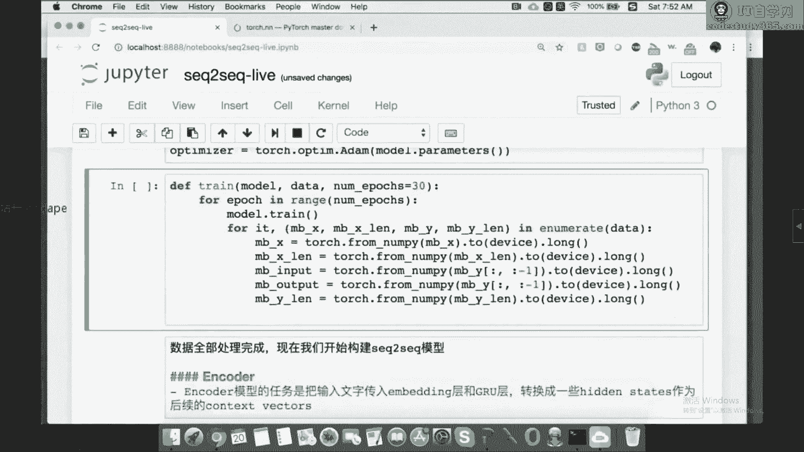

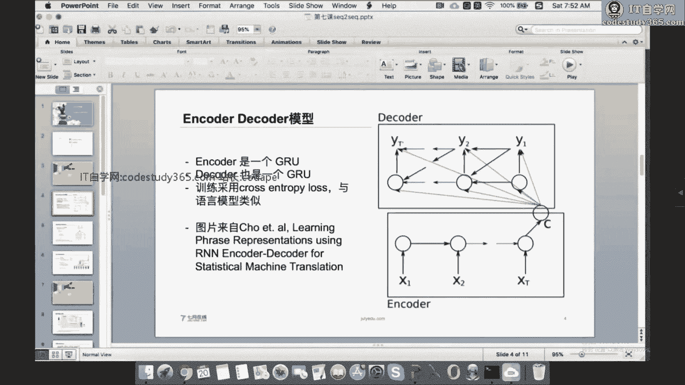

### 构建词表

我们需要为源语言（英文）和目标语言（中文）分别构建词表，将单词映射为索引。

```python
def build_vocab(sentences, max_size=50000):
    word_count = {}
    for sent in sentences:
        for word in sent:
            word_count[word] = word_count.get(word, 0) + 1
    # 保留最高频的词汇，并加入特殊符号
    vocab = ['<pad>', '<unk>', '<bos>', '<eos>']
    vocab += [word for word, _ in sorted(word_count.items(), key=lambda x: -x[1])[:max_size-len(vocab)]]
    word2idx = {word: idx for idx, word in enumerate(vocab)}
    return vocab, word2idx

# 构建词表
en_vocab, en_word2idx = build_vocab([sent for en, cn in train_data for sent in [en]])
cn_vocab, cn_word2idx = build_vocab([sent for en, cn in train_data for sent in [cn]])
```

### 数据批处理（Batching）

为了高效训练，我们需要将数据组织成批次（Batch）。一个批次内的句子长度最好相近，因此需要按长度排序。

```python
def get_mini_batch(data, batch_size, shuffle=True):
    # 按句子长度排序的索引
    sorted_indices = np.argsort([len(sent) for sent, _ in data])
    if shuffle:
        np.random.shuffle(sorted_indices)
    mini_batches = []
    for start_idx in range(0, len(data), batch_size):
        batch_indices = sorted_indices[start_idx: start_idx + batch_size]
        mini_batches.append([data[i] for i in batch_indices])
    return mini_batches
```

### 定义模型

接下来是模型的核心部分。我们将分别定义编码器、注意力机制和解码器。

#### 1. 编码器（Encoder）

编码器使用双向GRU来获取输入序列的隐藏状态。

```python
class Encoder(nn.Module):
    def __init__(self, vocab_size, embed_size, hidden_size, dropout=0.2):
        super(Encoder, self).__init__()
        self.embedding = nn.Embedding(vocab_size, embed_size)
        self.gru = nn.GRU(embed_size, hidden_size, bidirectional=True, batch_first=True)
        self.fc = nn.Linear(hidden_size * 2, hidden_size) # 将双向输出映射到解码器隐藏层大小
        self.dropout = nn.Dropout(dropout)

    def forward(self, x, lengths):
        # x: [batch_size, seq_len]
        embedded = self.dropout(self.embedding(x)) # [batch_size, seq_len, embed_size]
        packed_embedded = nn.utils.rnn.pack_padded_sequence(embedded, lengths, batch_first=True, enforce_sorted=False)
        packed_outputs, hidden = self.gru(packed_embedded)
        outputs, _ = nn.utils.rnn.pad_packed_sequence(packed_outputs, batch_first=True) # [batch_size, seq_len, hid_dim*2]
        # 合并双向的最终隐藏状态
        hidden = torch.tanh(self.fc(torch.cat((hidden[-2,:,:], hidden[-1,:,:]), dim=1))) # [batch_size, hid_dim]
        return outputs, hidden
```

#### 2. 注意力机制（Luong Attention）

实现Luong的General Attention（双线性评分）。

```python
class Attention(nn.Module):
    def __init__(self, encoder_hid_dim, decoder_hid_dim):
        super(Attention, self).__init__()
        self.attn = nn.Linear(encoder_hid_dim * 2, decoder_hid_dim, bias=False) # 双线性变换矩阵 Wa

    def forward(self, decoder_hidden, encoder_outputs, mask):
        # decoder_hidden: [batch_size, decoder_hid_dim]
        # encoder_outputs: [batch_size, src_len, encoder_hid_dim * 2]
        # mask: [batch_size, src_len]
        decoder_hidden = decoder_hidden.unsqueeze(1) # [batch_size, 1, decoder_hid_dim]
        # 计算注意力得分
        energy = torch.bmm(decoder_hidden, self.attn(encoder_outputs).transpose(1, 2)) # [batch_size, 1, src_len]
        energy = energy.squeeze(1).masked_fill(mask == 0, -1e10) # 屏蔽填充位置 [batch_size, src_len]
        attention = torch.softmax(energy, dim=1) # [batch_size, src_len]
        return attention
```

#### 3. 解码器（Decoder with Attention）

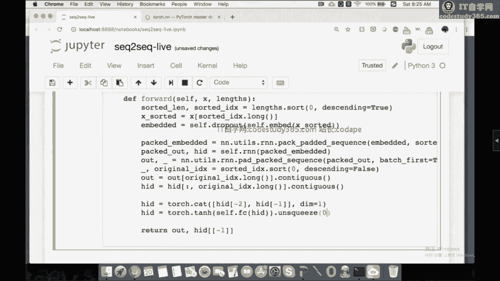

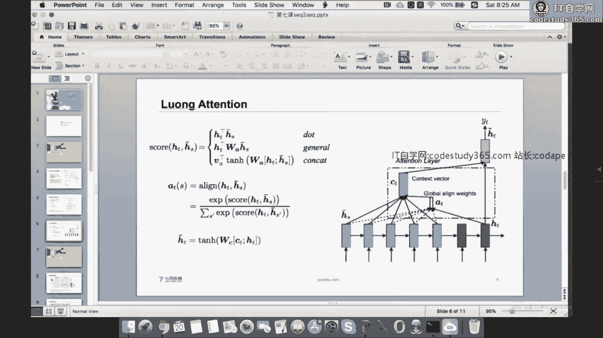

解码器在每一步使用Attention计算出的上下文向量。

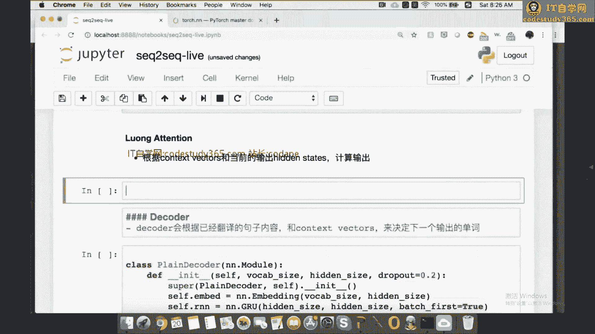

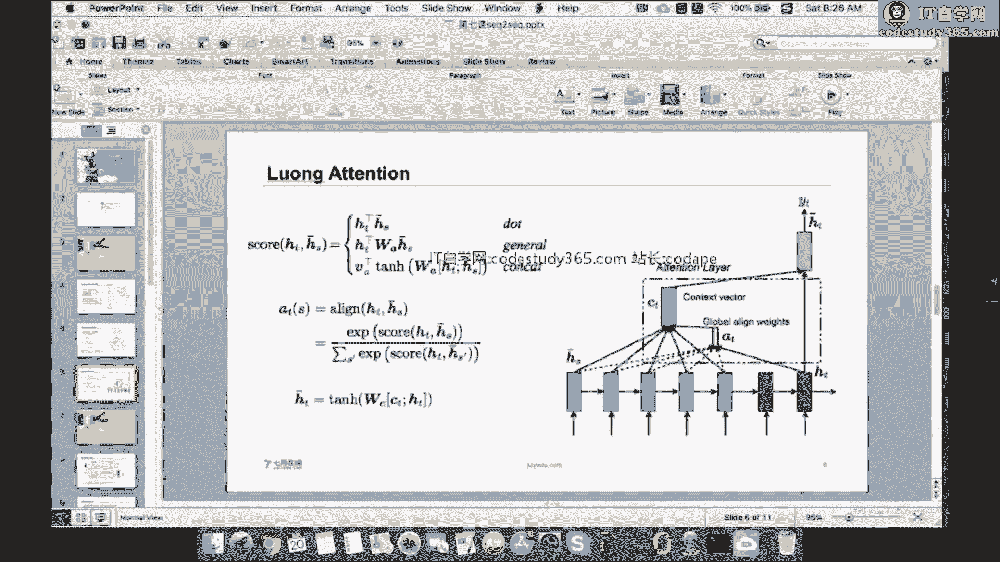

```python
class Decoder(nn.Module):
    def __init__(self, vocab_size, embed_size, hidden_size, encoder_hid_dim, dropout=0.2):
        super(Decoder, self).__init__()
        self.vocab_size = vocab_size
        self.attention = Attention(encoder_hid_dim, hidden_size)
        self.embedding = nn.Embedding(vocab_size, embed_size)
        self.gru = nn.GRU(embed_size + encoder_hid_dim * 2, hidden_size, batch_first=True)
        self.fc_out = nn.Linear(embed_size + encoder_hid_dim * 2 + hidden_size, vocab_size)
        self.dropout = nn.Dropout(dropout)

    def forward(self, y, hidden, encoder_outputs, mask):
        # y: [batch_size, trg_len]
        # hidden: [batch_size, hid_dim] (初始为编码器最终状态)
        # encoder_outputs: [batch_size, src_len, encoder_hid_dim*2]
        # mask: [batch_size, src_len]
        y = y.unsqueeze(1) if y.dim() == 1 else y # 确保是二维
        embedded = self.dropout(self.embedding(y)) # [batch_size, trg_len, embed_size]
        outputs = []
        for i in range(y.shape[1]):
            # 计算当前步的注意力权重和上下文向量
            attn_weights = self.attention(hidden, encoder_outputs, mask) # [batch_size, src_len]
            context = torch.bmm(attn_weights.unsqueeze(1), encoder_outputs) # [batch_size, 1, encoder_hid_dim*2]
            # GRU输入：当前词嵌入 + 上下文向量
            gru_input = torch.cat((embedded[:, i:i+1, :], context), dim=2) # [batch_size, 1, embed_size + encoder_hid_dim*2]
            output, hidden = self.gru(gru_input, hidden.unsqueeze(0))
            hidden = hidden.squeeze(0)
            # 预测输出
            output = torch.cat((embedded[:, i:i+1, :], context, output), dim=2)
            prediction = self.fc_out(output.squeeze(1))
            outputs.append(prediction.unsqueeze(1))
        outputs = torch.cat(outputs, dim=1) # [batch_size, trg_len, vocab_size]
        return outputs, hidden
```

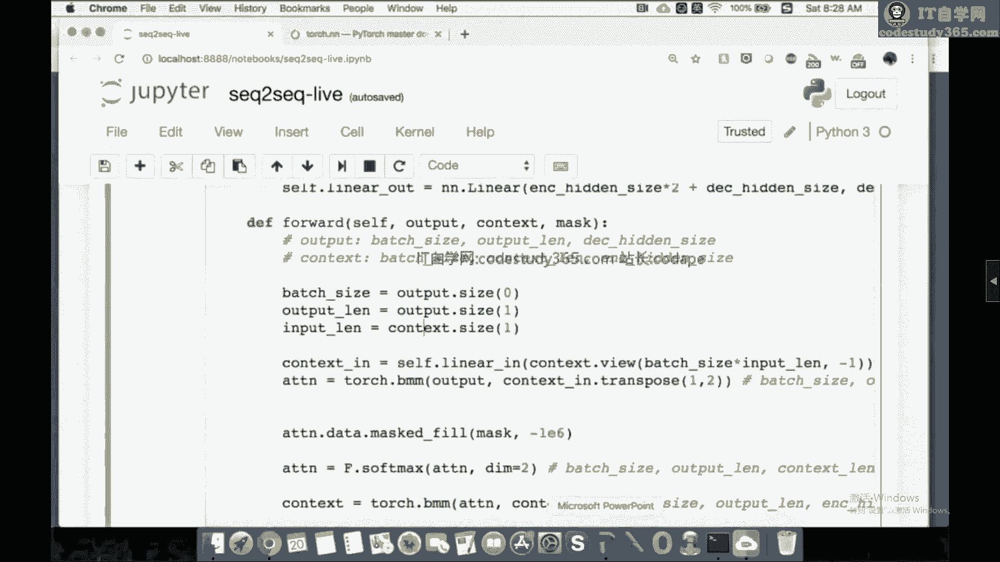

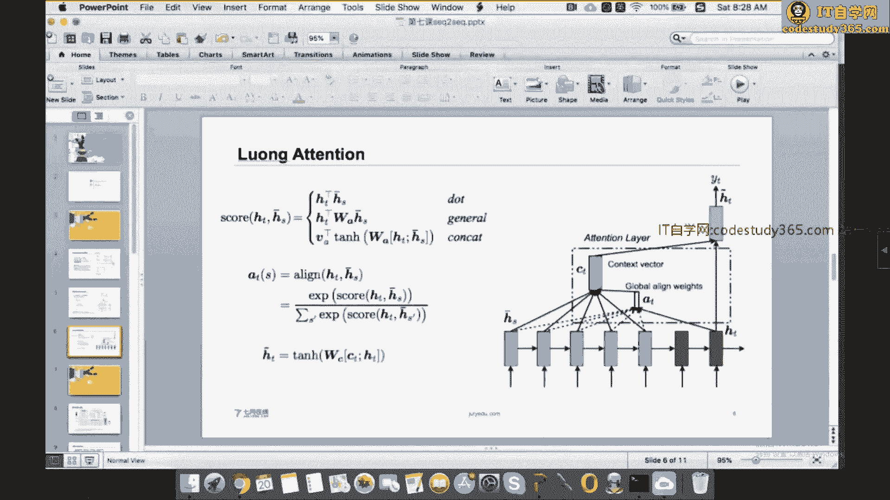

#### 4. Seq2Seq模型

最后，将编码器和解码器组合成完整的Sequence-to-Sequence模型。

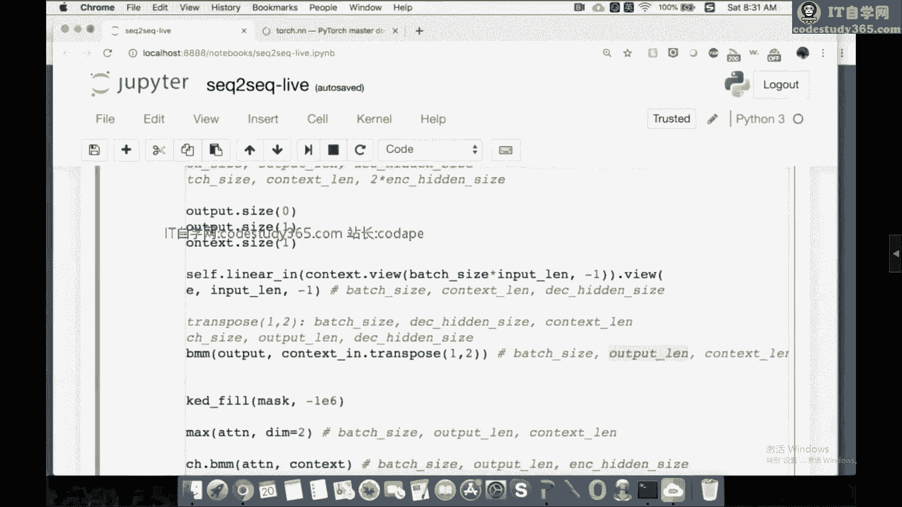

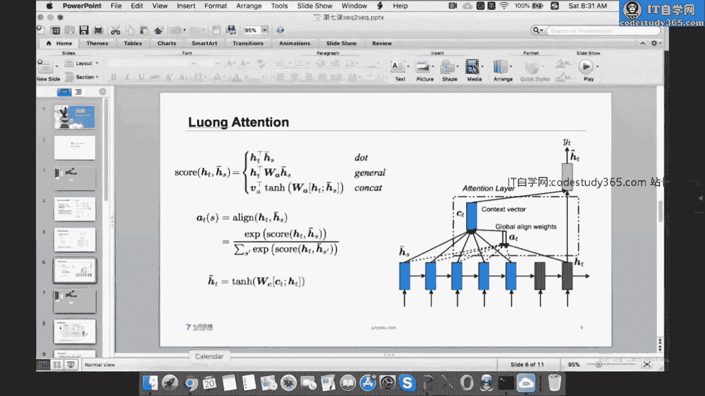

```python
class Seq2Seq(nn.Module):
    def __init__(self, encoder, decoder):
        super(Seq2Seq, self).__init__()
        self.encoder = encoder
        self.decoder = decoder

    def forward(self, src, src_len, trg, trg_len):
        encoder_outputs, hidden = self.encoder(src, src_len)
        # 创建源序列的mask
        src_mask = (src != 0).float() # 假设0是<pad>的索引
        decoder_outputs, _ = self.decoder(trg, hidden, encoder_outputs, src_mask)
        return decoder_outputs

    def translate(self, src, src_len, max_len=50):
        encoder_outputs, hidden = self.encoder(src, src_len)
        src_mask = (src != 0).float()
        trg_indices = [cn_word2idx['<bos>']]
        for _ in range(max_len):
            trg_tensor = torch.LongTensor([trg_indices[-1]]).unsqueeze(0).to(src.device)
            output, hidden = self.decoder(trg_tensor, hidden, encoder_outputs, src_mask)
            next_word = output.argmax(2).item()
            trg_indices.append(next_word)
            if next_word == cn_word2idx['<eos>']:
                break
        return trg_indices[1:] # 去掉<bos>
```

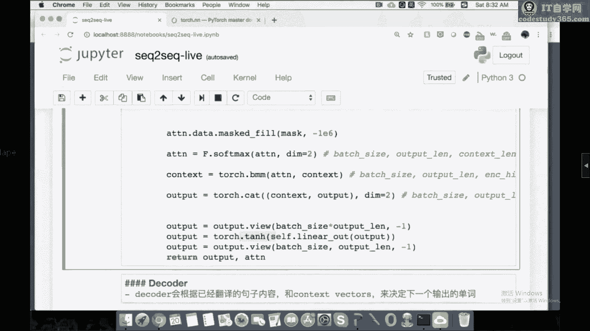

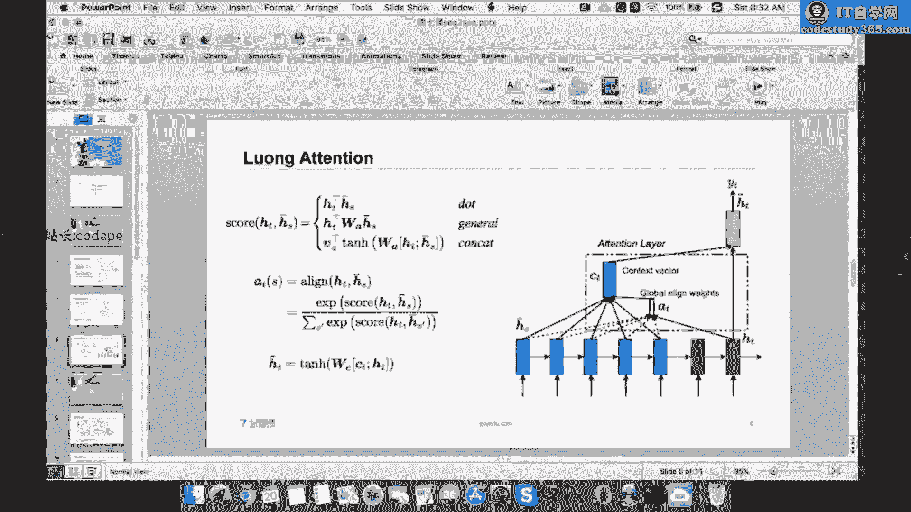

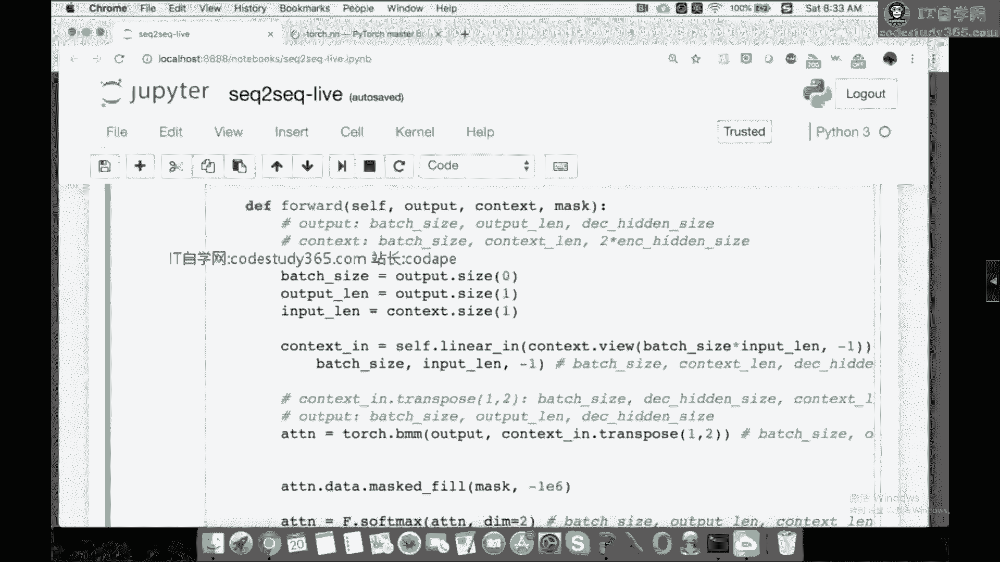

### 训练与评估

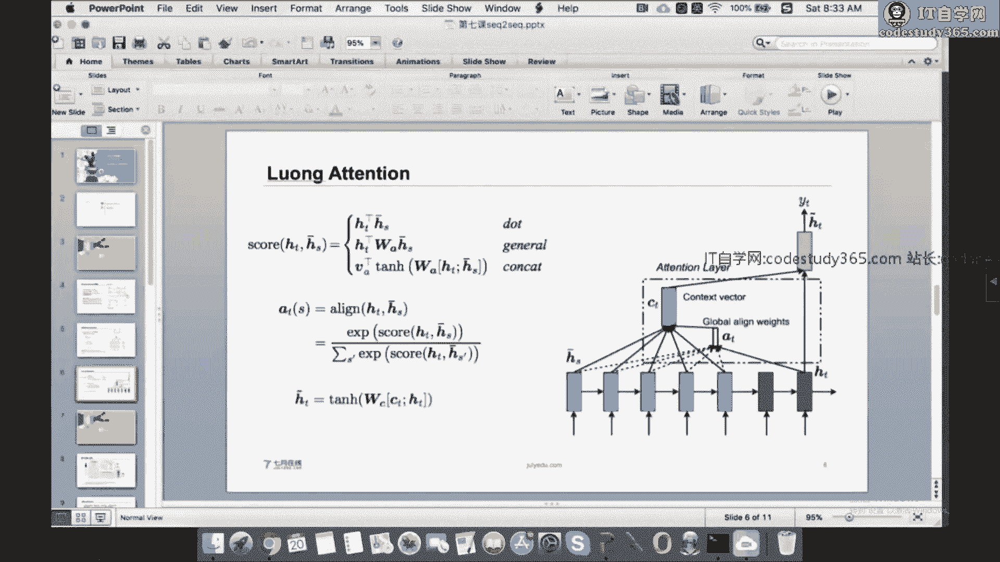

定义好模型后，我们需要编写训练和评估循环。

```python
def train(model, iterator, optimizer, criterion, clip):
    model.train()
    epoch_loss = 0
    for i, batch in enumerate(iterator):
        src, src_len, trg, trg_len = process_batch(batch) # 假设此函数处理一个batch的数据
        optimizer.zero_grad()
        output = model(src, src_len, trg[:, :-1], trg_len-1) # 解码器输入是trg去掉最后一个<eos>
        # 计算损失，忽略<pad>
        loss = criterion(output.reshape(-1, output.shape[-1]), trg[:, 1:].reshape(-1))
        loss.backward()
        clip_grad_norm_(model.parameters(), clip)
        optimizer.step()
        epoch_loss += loss.item()
    return epoch_loss / len(iterator)

def evaluate(model, iterator, criterion):
    model.eval()
    epoch_loss = 0
    with torch.no_grad():
        for batch in iterator:
            src, src_len, trg, trg_len = process_batch(batch)
            output = model(src, src_len, trg[:, :-1], trg_len-1)
            loss = criterion(output.reshape(-1, output.shape[-1]), trg[:, 1:].reshape(-1))
            epoch_loss += loss.item()
    return epoch_loss / len(iterator)
```

### 模型初始化与训练

现在，我们可以初始化模型并开始训练。

```python
# 超参数
EMBED_SIZE = 256
HIDDEN_SIZE = 512
ENCODER_HID_DIM = HIDDEN_SIZE * 2 # 因为是双向
DROPOUT = 0.2
CLIP = 1.0
LEARNING_RATE = 0.001
N_EPOCHS = 10

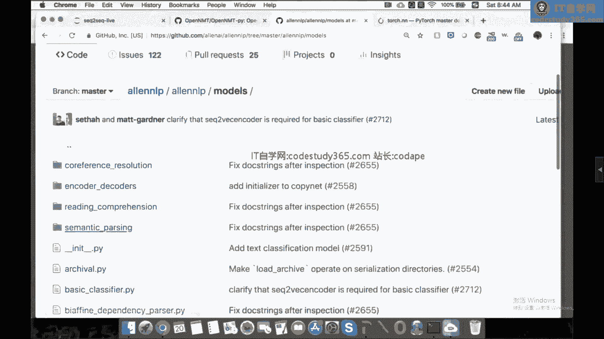

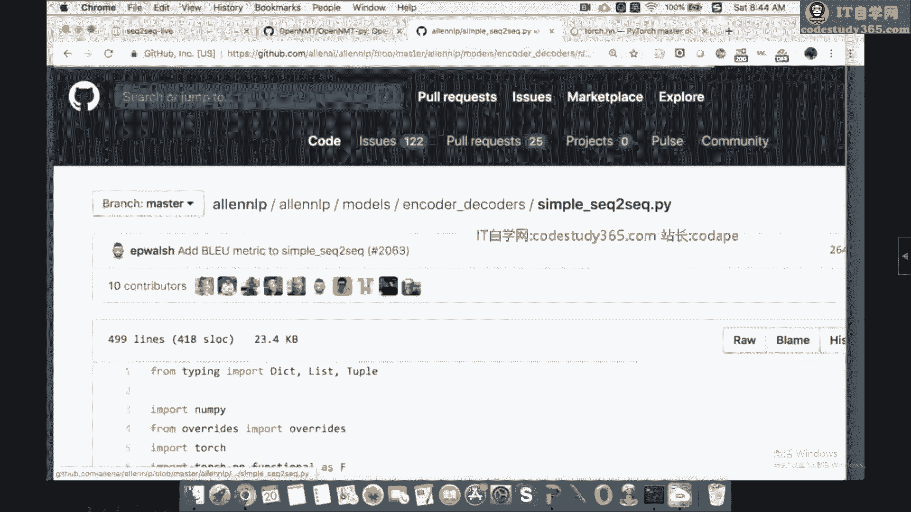

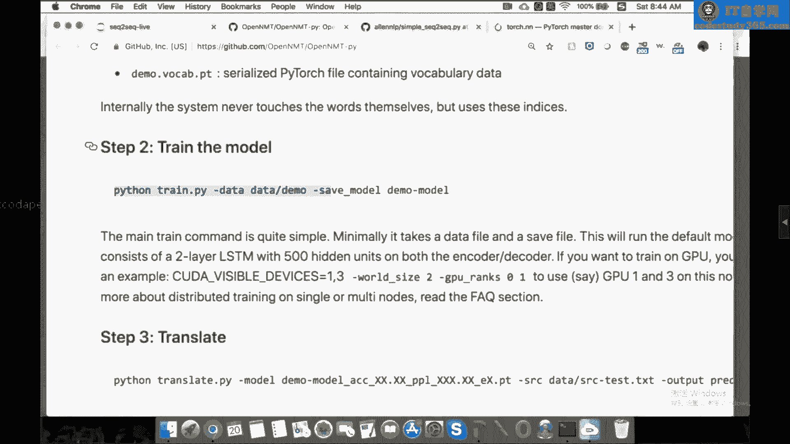

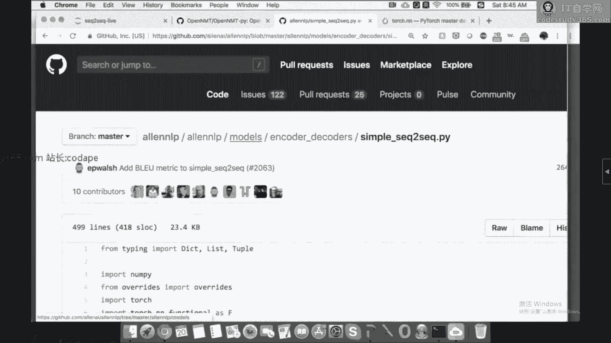

# 初始化模型
encoder = Encoder(len(en_vocab), EMBED_SIZE, HIDDEN_SIZE, DROPOUT)
decoder = Decoder(len(cn_vocab), EMBED_SIZE, HIDDEN_SIZE, ENCODER_HID_DIM, DROPOUT)
model = Seq2Seq(encoder, decoder).to(device)

# 定义优化器和损失函数
optimizer = optim.Adam(model.parameters(), lr=LEARNING_RATE)
criterion = nn.CrossEntropyLoss(ignore_index=0) # 忽略<pad>索引0

# 训练循环
for epoch in range(N_EPOCHS):
    train_loss = train(model, train_iterator, optimizer, criterion, CLIP)
    valid_loss = evaluate(model, dev_iterator, criterion)
    print(f'Epoch: {epoch+1:02}')
    print(f'\tTrain Loss: {train_loss:.3f}')
    print(f'\t Val. Loss: {valid_loss:.3f}')
```

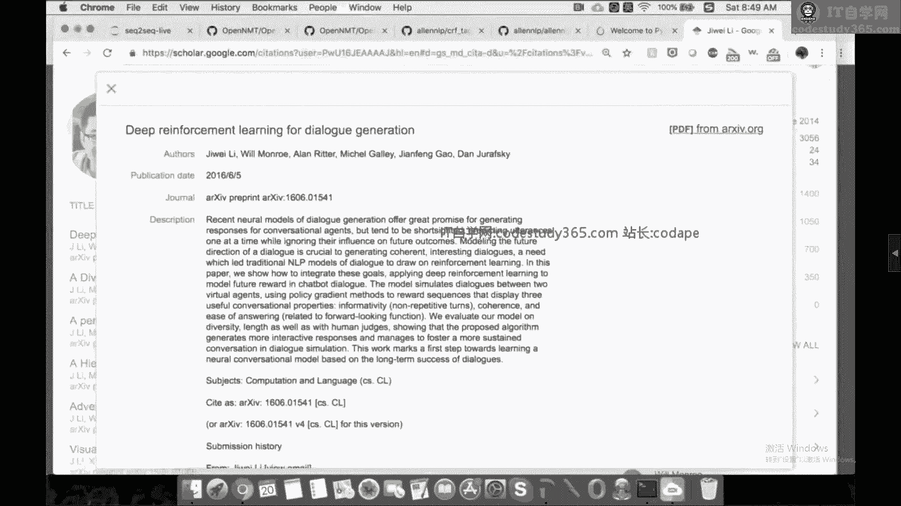

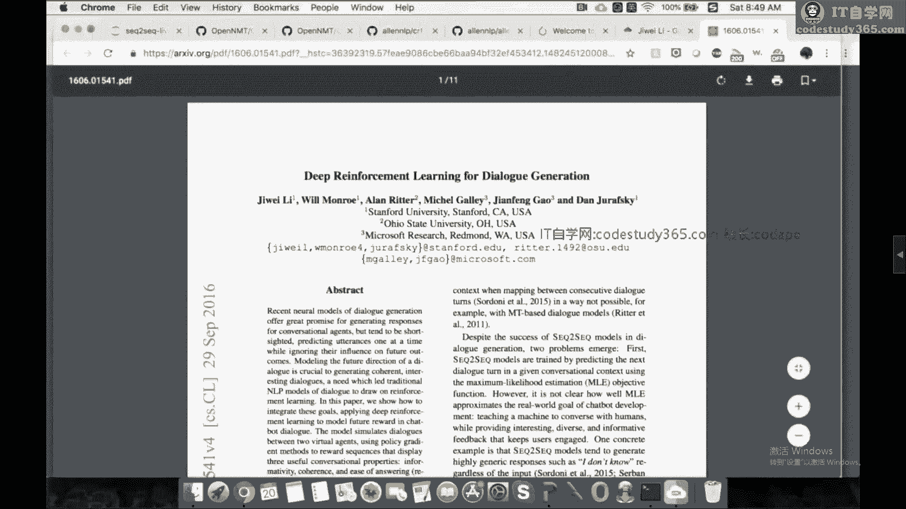

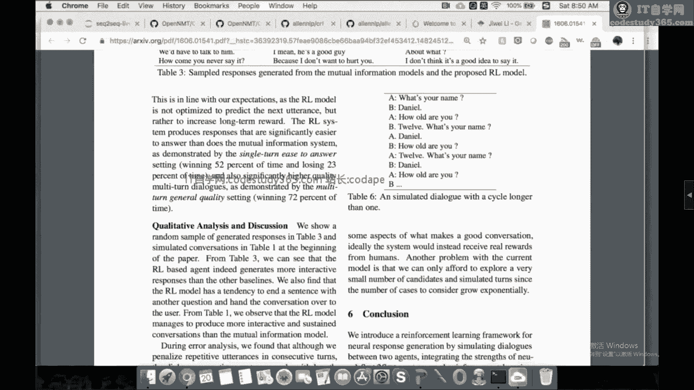

### 测试翻译

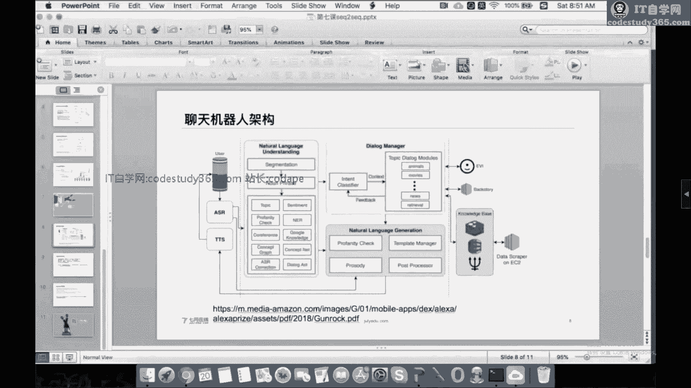

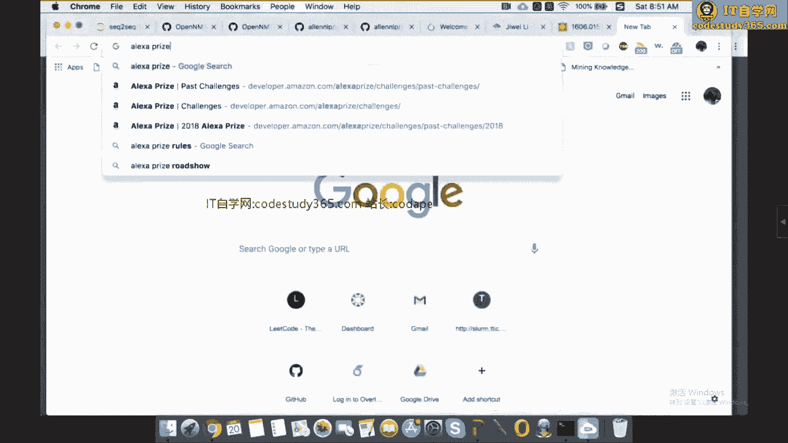

训练完成后，我们可以用模型进行翻译测试。

```python
def translate_sentence(sentence, model, device):
    model.eval()
    # 预处理输入句子
    tokens = ['<bos>'] + nltk.word_tokenize(sentence.lower()) + ['<eos>']
    indices = [en_word2idx.get(token, en_word2idx['<unk>']) for token in tokens]
    src_tensor = torch.LongTensor(indices).unsqueeze(0).to(device)
    src_len = torch.LongTensor([len(indices)]).to(device)
    with torch.no_grad():
        trg_indices = model.translate(src_tensor, src_len)
    trg_tokens = [cn_vocab[i] for i in trg_indices]
    return ''.join(trg_tokens) # 中文按字输出，直接拼接

# 示例
test_sentence = "How are you?"
translation = translate_sentence(test_sentence, model, device)
print(f"输入: {test_sentence}")
print(f"翻译: {translation}")
```

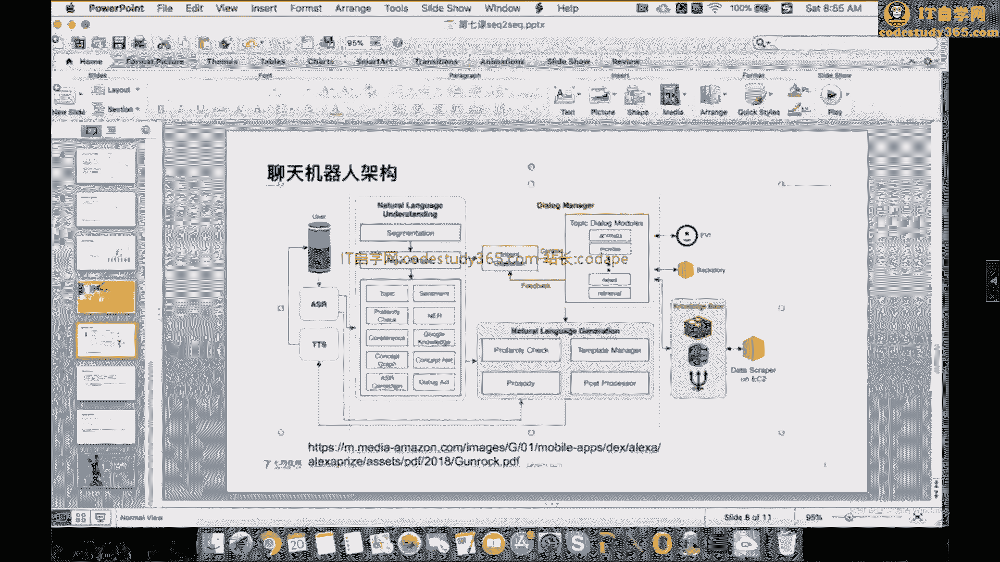


---

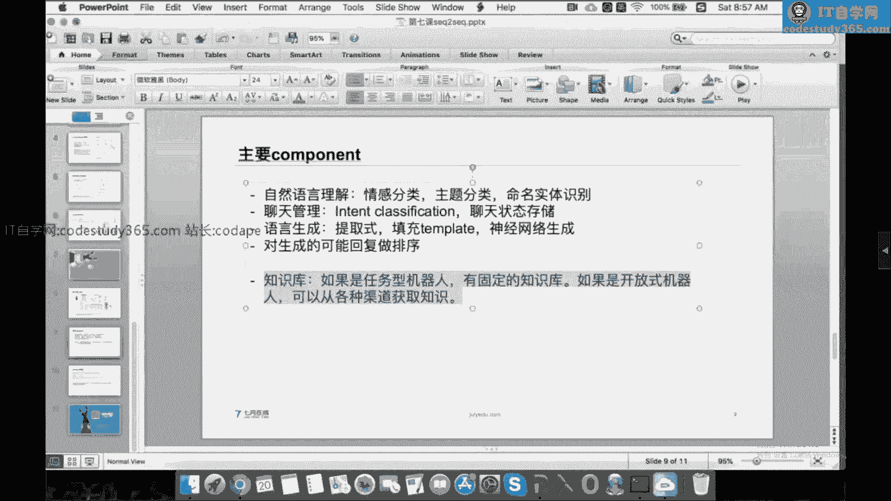

## 聊天机器人简介 🤖

Sequence-to-Sequence模型也被广泛应用于开放域聊天机器人（Open-Domain Chatbot）的构建。其基本思想是将对话历史作为输入，将生成的回复作为输出。

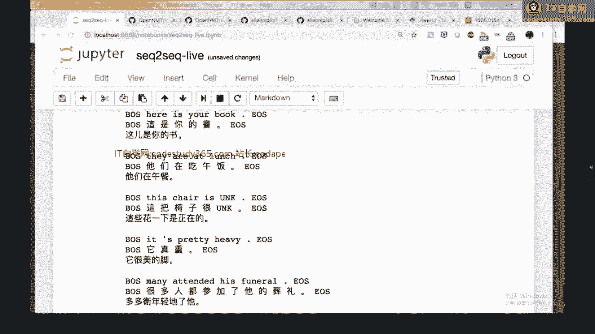

然而，纯粹的生成式模型在实际产品中面临挑战，