# 【七月在线】NLP高端就业训练营10期 - P8：4.隐马尔可夫模型原理 📊

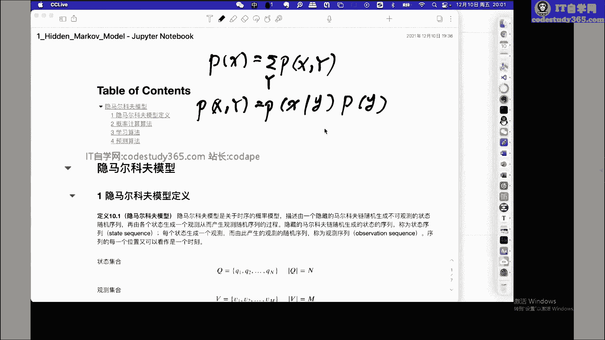

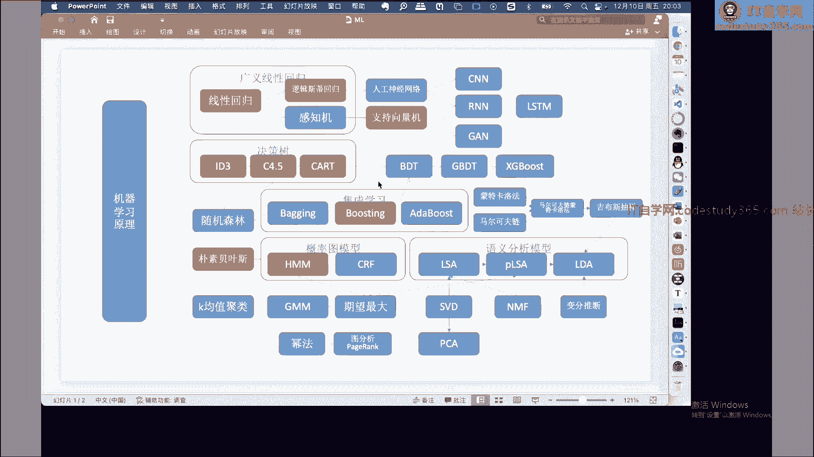

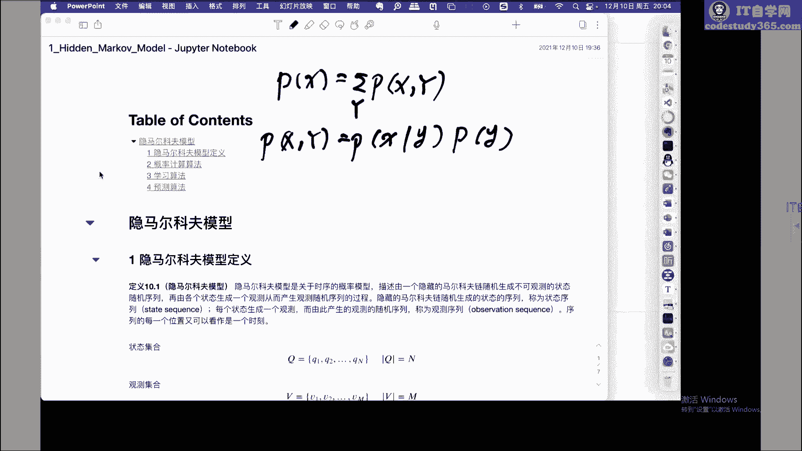

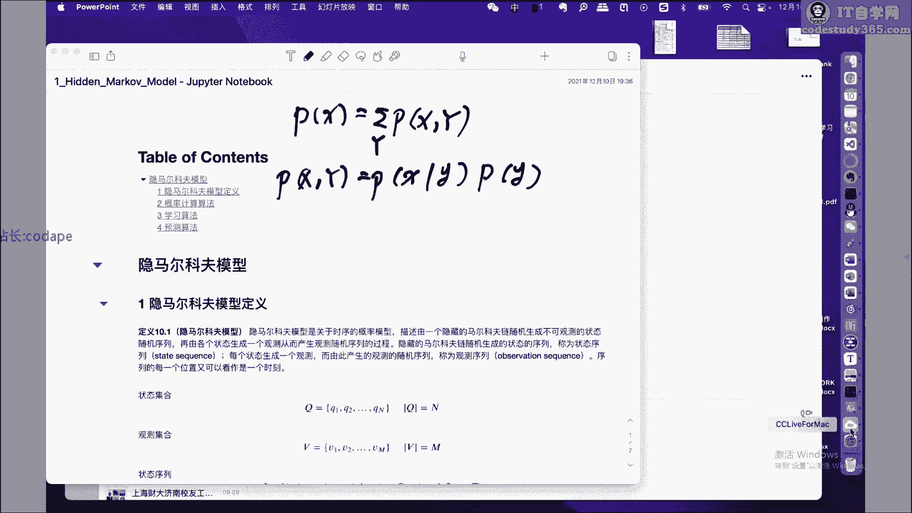

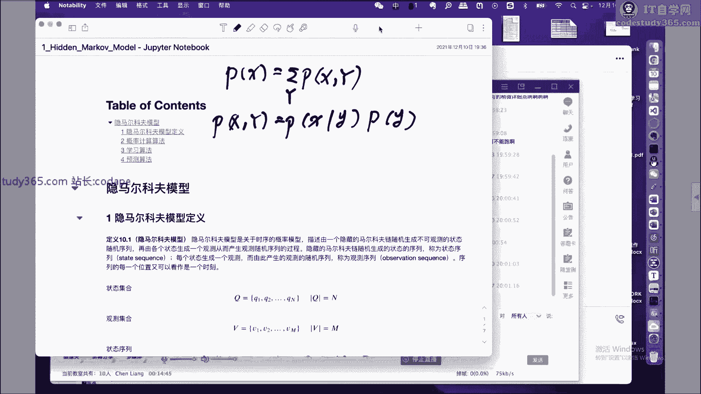

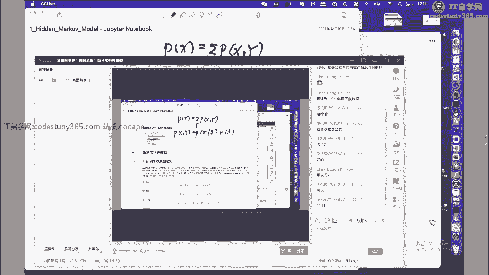

## 概述
在本节课中，我们将要学习隐马尔可夫模型（HMM）的基本原理。HMM是概率图模型中的重要组成部分，尤其在自然语言处理领域有着广泛的应用。我们将从模型定义、基本假设、核心问题及其求解方法等方面，系统地介绍HMM。

---

## 模型定义与结构 🏗️

隐马尔可夫模型是关于时序的概率模型。它描述了一个由隐藏的马尔可夫链随机生成不可观测的状态序列，再由各个状态生成一个观测，从而产生观测随机序列的过程。

### 核心概念与符号

*   **状态集合 Q**：所有可能状态的集合，`Q = {q1, q2, ..., qN}`，其中 `N` 是状态的数量。
*   **观测集合 V**：所有可能观测的集合，`V = {v1, v2, ..., vM}`，其中 `M` 是观测的数量。
*   **状态序列 I**：长度为 `T` 的状态序列，`I = (i1, i2, ..., iT)`，其中 `it ∈ Q`。
*   **观测序列 O**：长度为 `T` 的观测序列，`O = (o1, o2, ..., oT)`，其中 `ot ∈ V`。状态序列与观测序列长度一致，因为每个状态生成一个观测。
*   **状态转移概率矩阵 A**：一个 `N x N` 的矩阵，其中元素 `aij` 表示在时刻 `t` 处于状态 `qi` 的条件下，在时刻 `t+1` 转移到状态 `qj` 的概率。公式为：`aij = P(it+1 = qj | it = qi)`。
*   **观测概率矩阵 B**：一个 `N x M` 的矩阵，其中元素 `bj(k)` 表示在时刻 `t` 处于状态 `qj` 的条件下，生成观测 `vk` 的概率。公式为：`bj(k) = P(ot = vk | it = qj)`。
*   **初始状态概率向量 π**：一个 `N` 维向量，其中元素 `πi` 表示时刻 `t=1` 处于状态 `qi` 的概率。公式为：`πi = P(i1 = qi)`。

因此，一个隐马尔可夫模型 `λ` 可以用三元组表示：`λ = (A, B, π)`。

---

## 两个基本假设 🔧

为了简化模型的计算，HMM 引入了两个基本假设。

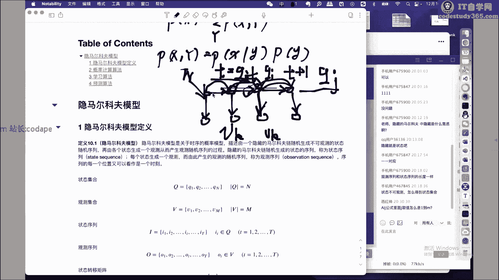

上一节我们介绍了HMM的模型结构，本节中我们来看看为了便于计算而引入的两个关键假设。

### 1. 齐次马尔可夫性假设
该假设认为，任意时刻 `t` 的状态只依赖于其前一时刻 `t-1` 的状态，而与更早的状态和观测无关。
`P(it | i1, o1, ..., it-1, ot-1) = P(it | it-1)`

### 2. 观测独立性假设
该假设认为，任意时刻 `t` 的观测只依赖于该时刻的状态，而与其他时刻的状态及观测无关。
`P(ot | i1, o1, ..., it, ..., iT, oT) = P(ot | it)`

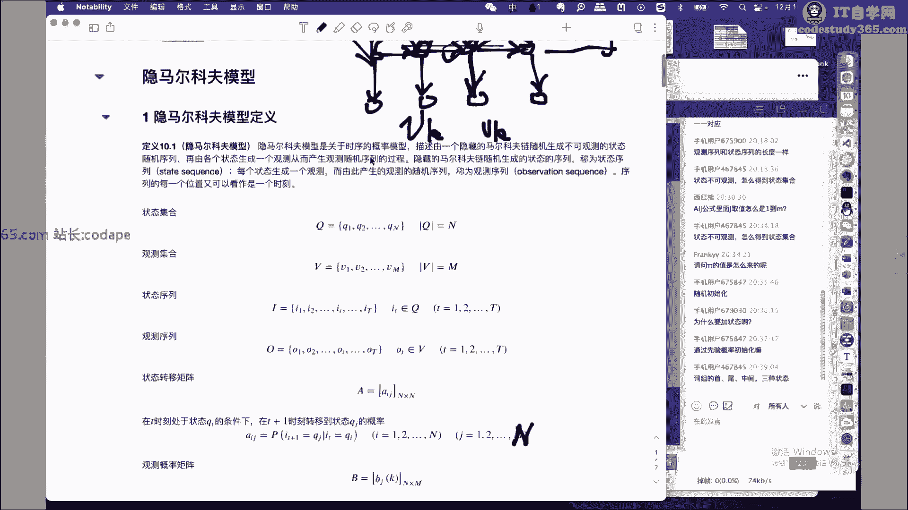

---

## HMM解决的三个基本问题 🎯

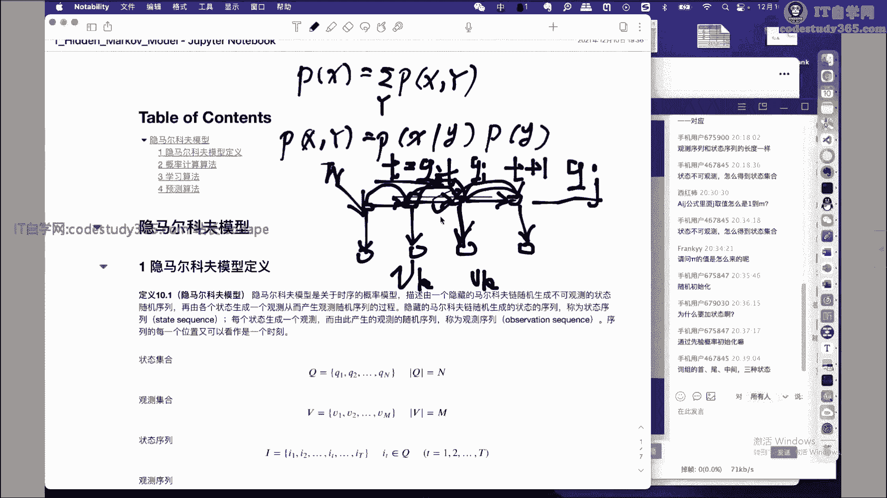

HMM主要用来解决三类问题，这三类问题构成了HMM应用的核心。

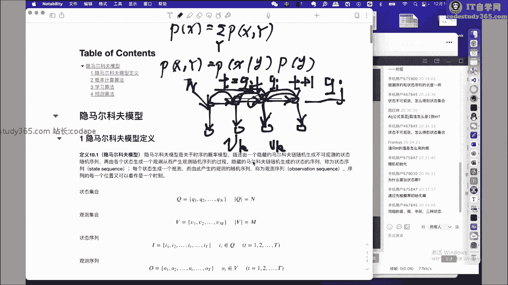

以下是HMM能够解决的三个核心问题：

1.  **概率计算问题（评估问题）**
    *   **已知**：模型 `λ = (A, B, π)` 和观测序列 `O`。
    *   **求解**：计算在该模型下，观测序列 `O` 出现的概率 `P(O | λ)`。这个问题是后续问题的基础，为学习问题和预测问题提供中间计算结果。

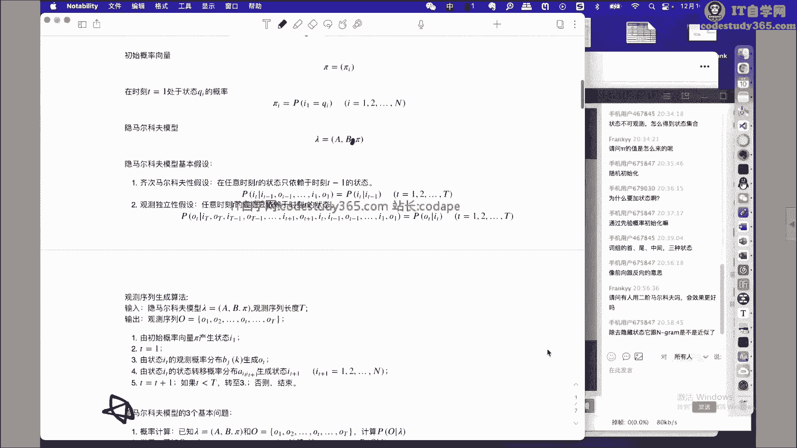

2.  **学习问题（参数估计问题）**
    *   **已知**：观测序列 `O`。
    *   **求解**：估计模型参数 `λ = (A, B, π)`，使得该模型下观测序列 `O` 的概率 `P(O | λ)` 最大。这是一个“无中生有”的过程，即仅从观测数据学习出模型。

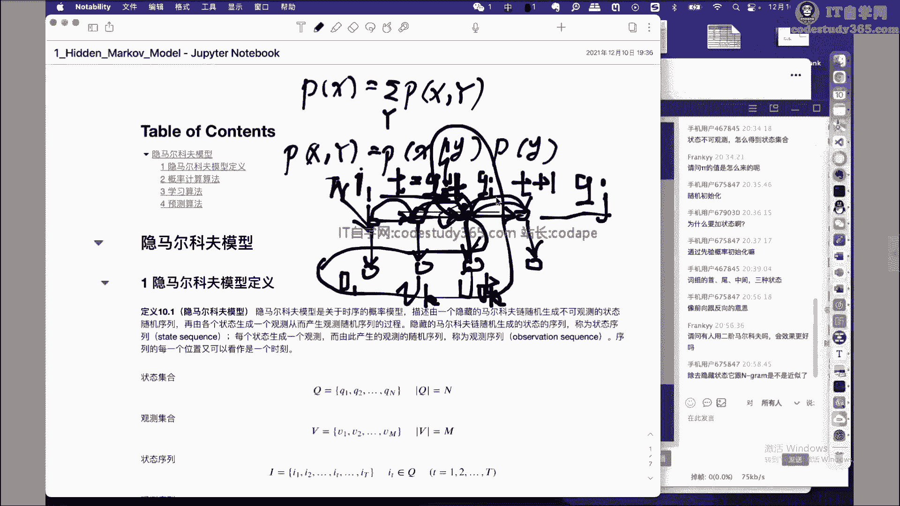

3.  **预测问题（解码问题）**
    *   **已知**：模型 `λ = (A, B, π)` 和观测序列 `O`。
    *   **求解**：求最有可能（概率最大）对应的状态序列 `I`。这是HMM最核心的应用，例如在词性标注中，观测序列是单词序列，预测出的状态序列就是词性标签序列。

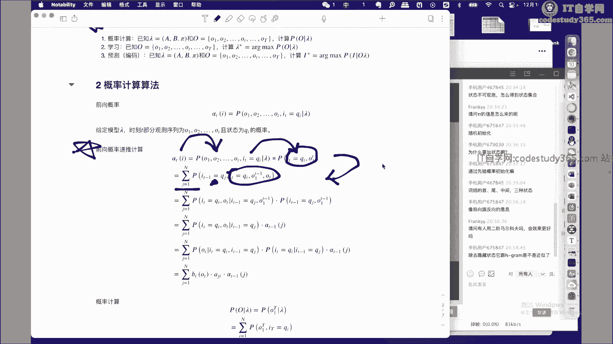

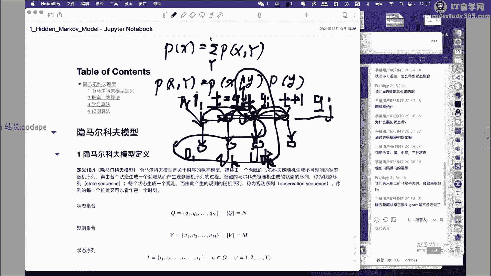

---

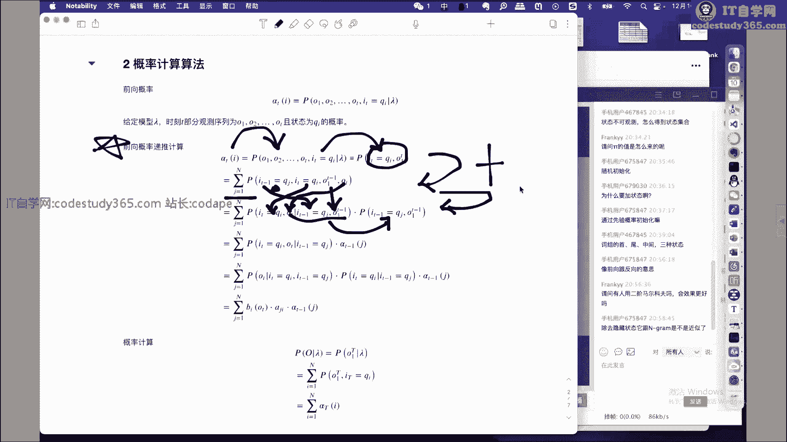

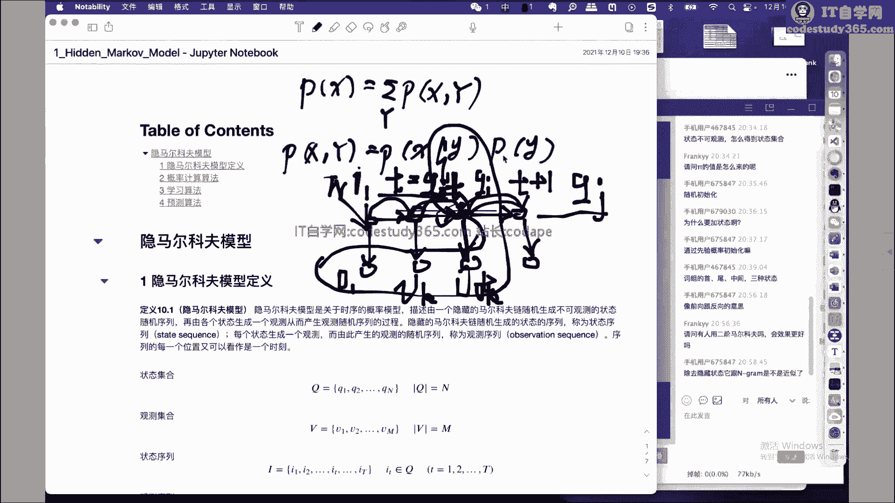

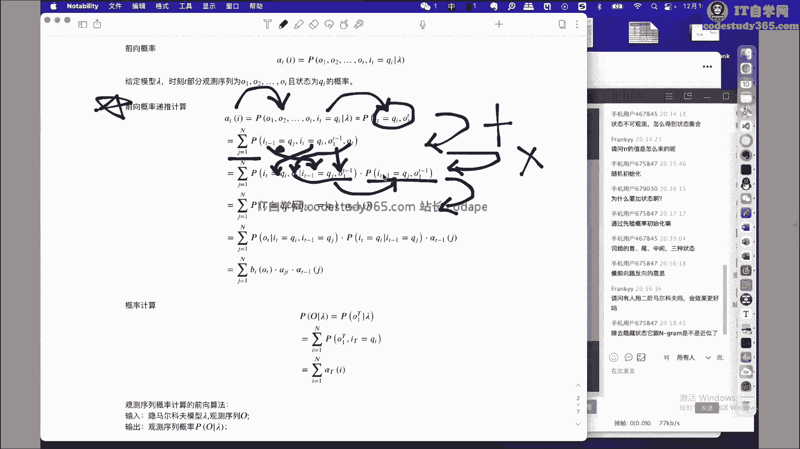

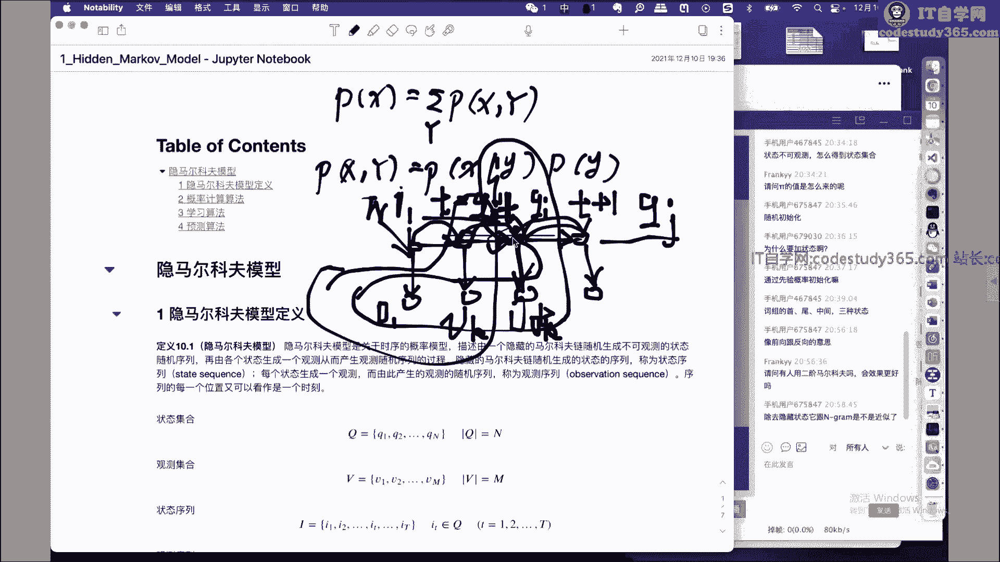

## 问题一：概率计算与前向算法 ➕

我们首先来看概率计算问题。给定模型和观测序列，如何高效计算 `P(O | λ)`？直接计算复杂度极高，因此引入前向算法。

### 前向概率定义
定义前向概率 `αt(i)` 为：在给定模型 `λ` 的条件下，到时刻 `t` 的部分观测序列为 `o1, o2, ..., ot`，且时刻 `t` 的状态为 `qi` 的概率。
`αt(i) = P(o1, o2, ..., ot, it = qi | λ)`

### 前向算法递推过程
1.  **初始化**：计算第一个时刻的前向概率。
    `α1(i) = πi * bi(o1), i=1,2,...,N`
2.  **递推**：对 `t = 1, 2, ..., T-1`，计算：
    `αt+1(j) = [ Σ αt(i) * aij ] * bj(ot+1), j=1,2,...,N`
    其中，`Σ` 表示对 `i` 从1到 `N` 求和。
3.  **终止**：计算观测序列概率。
    `P(O | λ) = Σ αT(i), i=1,2,...,N`

前向算法通过动态规划，将指数级复杂度的计算降至 `O(N²T)`。

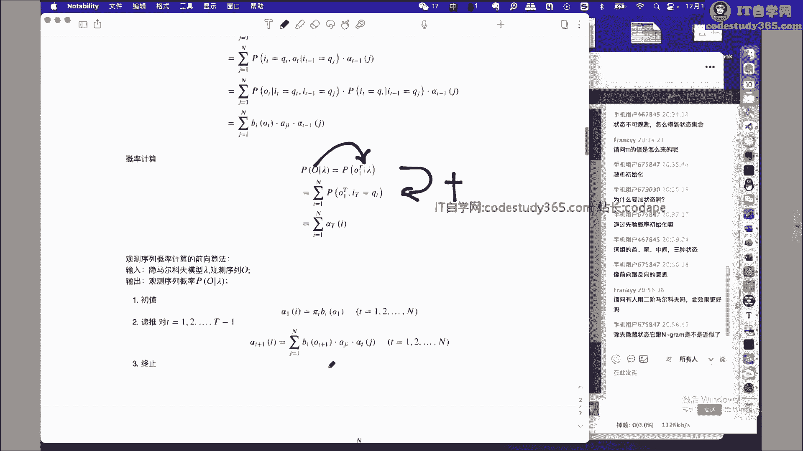

---

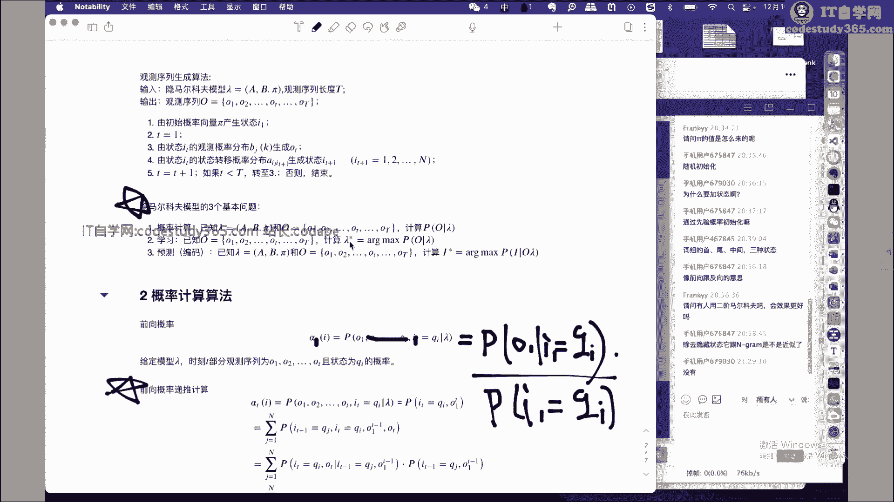

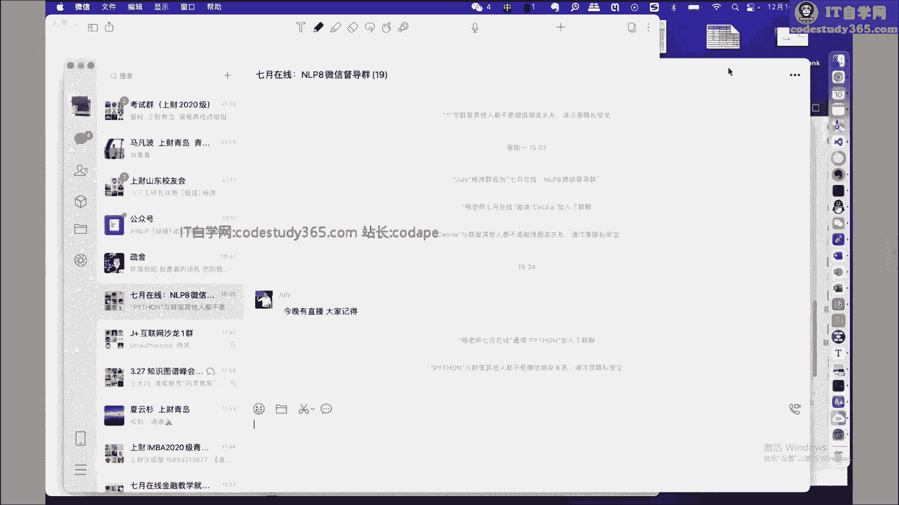

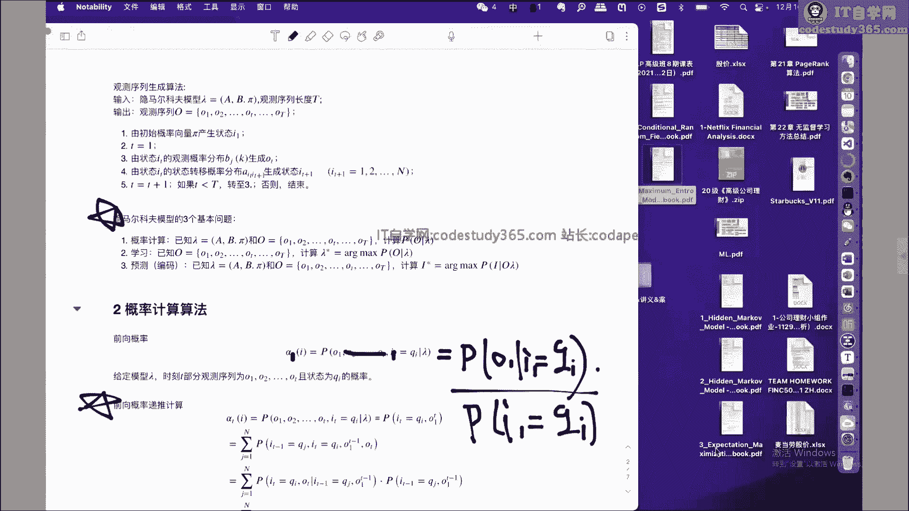

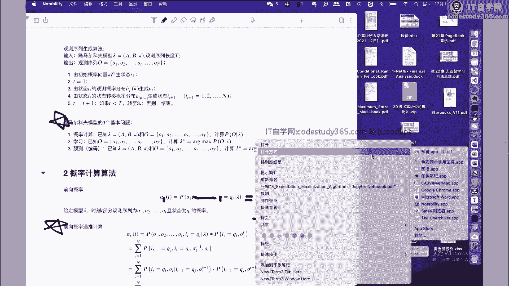

## 问题二：学习问题与EM算法 🧠

学习问题是如何仅从观测序列 `O` 估计出模型参数 `λ`。由于状态序列 `I` 是隐藏的，这是一个含有隐变量的参数估计问题，可以使用期望最大化（EM）算法求解。

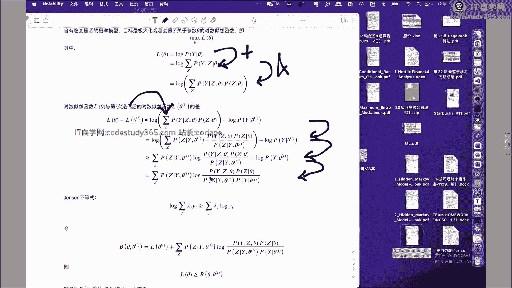

### EM算法框架回顾
EM算法用于求解含有隐变量的概率模型参数估计问题。
*   **E步（期望步）**：基于当前参数估计值 `λ`，计算完全数据（观测 `O` 和隐状态 `I`）的对数似然函数关于隐变量条件概率分布的期望，即Q函数：
    `Q(λ, λ) = Σ P(I | O, λ) * log P(O, I | λ)`
*   **M步（最大化步）**：寻找使Q函数最大化的新参数值 `λ`：
    `λ = argmax Q(λ, λ)`

### 在HMM中的应用（Baum-Welch算法）
将HMM的学习问题套入EM框架：
*   **完全数据**：`(O, I)`
*   **Q函数**：`Q(λ, λ) = Σ_I P(I | O, λ) log P(O, I | λ)`
*   通过对Q函数分别关于 `π`, `A`, `B` 求极大值（通常借助拉格朗日乘子法处理概率和为1的约束），可以得到参数的重估公式。这些公式可以用一些在概率计算问题中得到的中间概率（如前向概率、后向概率）来表示，从而迭代更新模型参数。

---

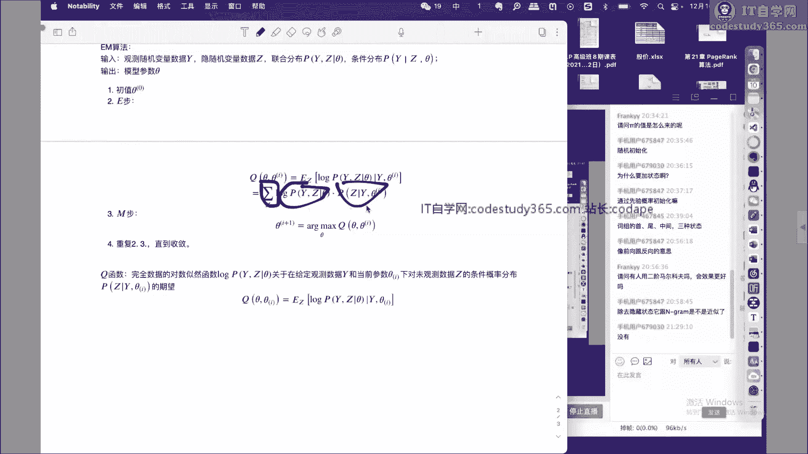

## 问题三：预测问题与维特比算法 🏆

预测问题是给定模型和观测序列，求最可能的状态序列。这是一个最优路径问题，可以使用维特比算法（Viterbi Algorithm）解决，它是一种动态规划算法。

### 维特比算法
定义在时刻 `t` 状态为 `i` 的所有单个路径 `(i1, i2, ..., it)` 中概率最大值：
`δt(i) = max P(i1, i2, ..., it=qi, o1, o2, ..., ot | λ)`

1.  **初始化**：
    `δ1(i) = πi * bi(o1), i=1,2,...,N`
    `ψ1(i) = 0`
2.  **递推**：对 `t = 2, 3, ..., T`
    `δt(j) = max [ δt-1(i) * aij ] * bj(ot), i=1,2,...,N`
    `ψt(j) = argmax [ δt-1(i) * aij ], i=1,2,...,N`
3.  **终止**：
    `P* = max δT(i), i=1,2,...,N`
    `iT* = argmax δT(i), i=1,2,...,N`
4.  **最优路径回溯**：对 `t = T-1, T-2, ..., 1`
    `it* = ψt+1(it+1*)`

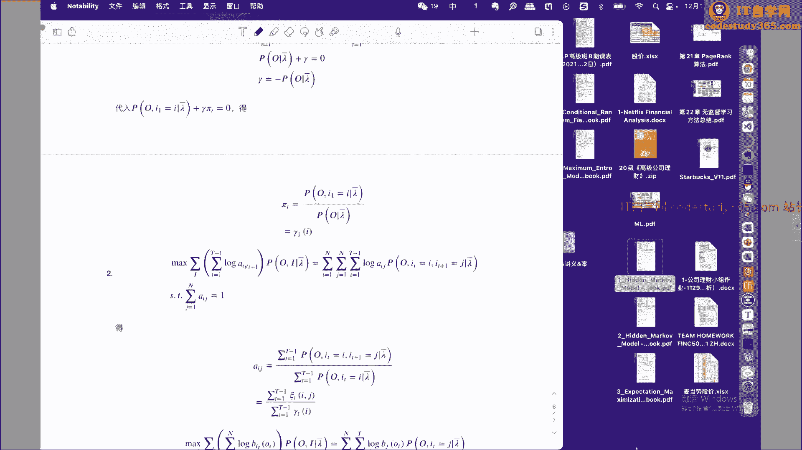

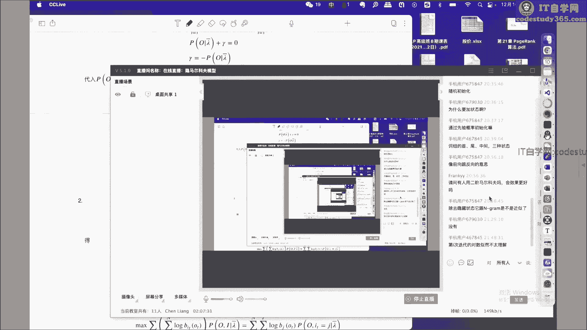

最终得到最优状态序列 `I* = (i1*, i2*, ..., iT*)`。

---

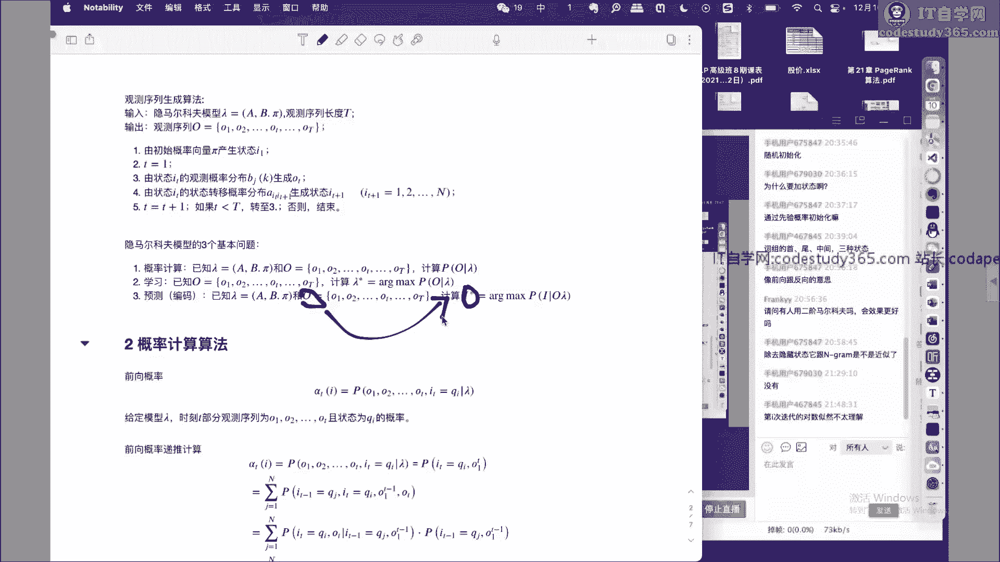

## 总结
本节课中我们一起学习了隐马尔可夫模型（HMM）的核心原理。我们从模型的定义和两个基本假设出发，明确了HMM描述的是隐藏状态序列与观测序列之间的生成关系。接着，我们深入探讨了HMM旨在解决的三个基本问题：**概率计算**、**参数学习**和**状态预测**，并分别介绍了对应的**前向算法**、**Baum-Welch算法（EM）**和**维特比算法**。理解HMM为解决序列到序列的映射问题（如词性标注、分词）提供了经典的概率框架，是学习更复杂模型（如条件随机场）的重要基础。