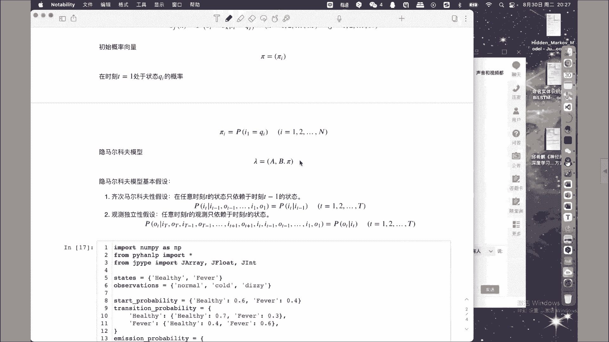
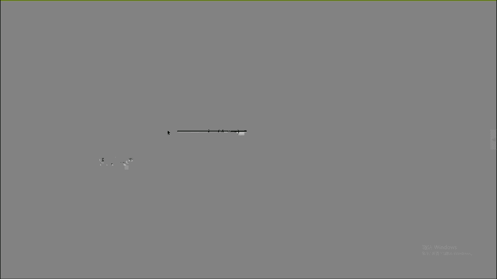
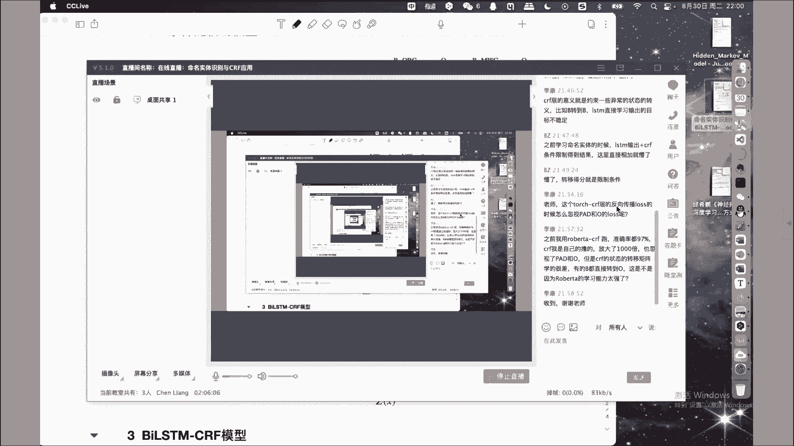

# 【七月在线】NLP高端就业训练营10期 - P9：6.命名实体识别与CRF应用 🧠

## 概述
在本节课中，我们将学习序列标注任务及其在自然语言处理（NLP）中的核心应用。我们将首先回顾隐马尔可夫模型（HMM）的基本原理及其如何解决序列标注问题。接着，我们将深入探讨条件随机场（CRF）模型，并重点介绍如何将双向长短期记忆网络（Bi-LSTM）与CRF结合，构建强大的命名实体识别（NER）模型。课程内容旨在让初学者理解核心概念，并通过公式和代码示例加深理解。

---

## 第一部分：序列标注与隐马尔可夫模型

### 1.1 序列标注任务定义
序列标注是一类重要的机器学习任务。给定一个输入序列 **X** = (x₁, x₂, ..., xₙ)，目标是计算出序列中每个元素对应的标签，从而得到一个输出序列 **Y** = (y₁, y₂, ..., yₙ)。

需要特别注意两点：
1.  输入 **X** 和输出 **Y** 都是**序列**，强调元素之间的严格先后顺序，这与无序的数据集集合不同。
2.  输入序列 **X** 和输出序列 **Y** 中的元素是**一一对应**的。

在NLP中，输入序列 **X** 通常是字符序列或词语序列，输出序列 **Y** 则是对应的标签，如词性（名词、动词等）或分词角色（B, M, E, S）。

**示例：中文分词**
对于句子“序列标注与中文分词”，其分词标注（BMES）结果为：
*   序列 -> B E
*   标注 -> B E
*   与 -> S
*   中文 -> B E
*   分词 -> B E
因此，输入是字序列，输出是标签序列 `[B, E, B, E, S, B, E, B, E]`。模型的目标就是学习从 **X** 到 **Y** 的映射。

上一节我们明确了序列标注任务的定义，本节中我们来看看解决此类任务的一个经典概率模型——隐马尔可夫模型。

### 1.2 隐马尔可夫模型（HMM）基础
HMM是一种用于描述含有隐含状态的序列的概率模型。它包含以下核心组件：

1.  **状态序列 I**： 不可见的隐含状态序列，I = (i₁, i₂, ..., iₜ)。每个状态 iₜ 取自**状态集合 Q** = {q₁, q₂, ..., qₙ}。
2.  **观测序列 O**： 可见的观测序列，O = (o₁, o₂, ..., oₜ)。每个观测 oₜ 取自**观测集合 V** = {v₁, v₂, ..., vₘ}。
3.  **状态转移矩阵 A**： 一个 N×N 的矩阵，其中元素 aᵢⱼ 表示在时刻 t 处于状态 qᵢ 的条件下，在时刻 t+1 转移到状态 qⱼ 的概率。
    *   **公式**： aᵢⱼ = P(iₜ₊₁ = qⱼ | iₜ = qᵢ)
4.  **观测概率矩阵 B**： 一个 N×M 的矩阵，其中元素 bⱼₖ 表示在时刻 t 处于状态 qⱼ 的条件下，生成观测 vₖ 的概率。
    *   **公式**： bⱼₖ = P(oₜ = vₖ | iₜ = qⱼ)
5.  **初始状态概率向量 π**： 一个 N 维向量，其中元素 πᵢ 表示初始时刻 (t=1) 处于状态 qᵢ 的概率。
    *   **公式**： πᵢ = P(i₁ = qᵢ)





一个HMM模型 λ 由以上三个参数决定：**λ = (A, B, π)**。

为了简化计算，HMM做了两个重要假设：
*   **齐次马尔可夫性假设**： 任意时刻 t 的状态只依赖于其前一时刻 t-1 的状态。
*   **观测独立性假设**： 任意时刻 t 的观测只依赖于该时刻的状态。

### 1.3 HMM的三个基本问题
HMM主要解决三类问题：

1.  **概率计算问题（评估）**： 给定模型 λ 和观测序列 O，计算该观测序列出现的概率 P(O|λ)。（前向-后向算法）
2.  **学习问题（参数估计）**： 仅给定观测序列 O，估计模型参数 λ = (A, B, π)，使得 P(O|λ) 最大。（Baum-Welch算法，一种EM算法）
3.  **预测问题（解码）**： 给定模型 λ 和观测序列 O，求最有可能对应的状态序列 I。（维特比算法）

**在序列标注任务中的应用**：
将观测序列 O 视为输入文本（可见），状态序列 I 视为标签序列（隐藏）。通过解决**学习问题**，我们可以从大量标注语料（O, I）中学习出模型 λ（即语言模型）。然后，对于新的输入文本 O‘，通过解决**预测问题**，即可得到最可能的标签序列 I’。这就完成了从序列到序列的映射。

### 1.4 HMM代码示例
以下是使用 `hmmlearn` 库构建一个简单HMM（模拟健康/发烧状态）的示例。

```python
import numpy as np
from hmmlearn import hmm

# 1. 定义状态和观测集合
states = ["Healthy", "Fever"]          # 状态集合 Q
observations = ["normal", "cold", "dizzy"] # 观测集合 V

# 2. 定义模型参数
# 初始状态概率 π
start_probability = np.array([0.6, 0.4]) # [健康， 发烧]

# 状态转移矩阵 A
transition_probability = np.array([
  [0.7, 0.3], # 健康 -> [健康， 发烧]
  [0.4, 0.6]  # 发烧 -> [健康， 发烧]
])

# 观测概率矩阵 B
emission_probability = np.array([
  [0.5, 0.4, 0.1], # 健康状态下生成 [正常，冷，头晕] 的概率
  [0.1, 0.3, 0.6]  # 发烧状态下生成 [正常，冷，头晕] 的概率
])

# 3. 创建并训练模型（这里直接传入参数，而非用数据拟合）
model = hmm.CategoricalHMM(n_components=len(states))
model.startprob_ = start_probability
model.transmat_ = transition_probability
model.emissionprob_ = emission_probability

# 4. 解码（预测问题）：给定观测序列，求最可能的状态序列
# 将观测值编码为索引
obs_seq = np.array([[0, 2, 1]]).T # 对应 [“normal”, “dizzy”, “cold”]
logprob, state_seq = model.decode(obs_seq, algorithm="viterbi")

print("观测序列:", [observations[i[0]] for i in obs_seq])
print("最可能状态序列:", [states[i] for i in state_seq])
print("序列对数概率:", logprob)
```

以上我们介绍了HMM模型及其在序列标注中的应用。然而，HMM基于较强的独立性假设，且难以融入复杂的特征。接下来，我们将探讨更强大的序列标注模型——条件随机场。

---

## 第二部分：命名实体识别与CRF模型

### 2.1 从HMM到CRF
HMM是**生成式模型**，它试图对联合概率 P(O, I) 进行建模。而条件随机场（CRF）是一种**判别式模型**，它直接对条件概率 P(I | O) 进行建模。这意味着CRF专注于给定输入序列条件下，输出序列的分布，通常能取得更好的性能。

线性链条件随机场（Linear-Chain CRF）是NLP中最常用的形式，其定义如下：

给定输入序列 **X** = (x₁, x₂, ..., xₙ)，输出序列 **Y** = (y₁, y₂, ..., yₙ) 的条件概率为：

**公式**：
P(Y | X) = (1 / Z(X)) * exp( Σₜ Σₖ λₖ fₖ(yₜ₋₁, yₜ, X, t) + Σₜ Σₗ μₗ gₗ(yₜ, X, t) )

其中：
*   **Z(X)** 是归一化因子（配分函数），确保所有可能Y序列的概率和为1。
*   **fₖ** 是**边特征函数**，定义在相邻标签 (yₜ₋₁, yₜ) 上，捕捉标签之间的转移关系（如：前一个词是动词时，当前词是名词的概率）。
*   **gₗ** 是**点特征函数**，定义在单个标签 yₜ 上，捕捉当前观测与标签的关系（如：当前词是大写时，它是人名起始标签B-PER的概率）。
*   **λₖ** 和 **μₗ** 是对应特征函数的权重，是模型需要学习的参数。

CRF的优点在于可以灵活地定义大量特征函数，从而充分利用上下文信息。

### 2.2 双向LSTM-CRF模型
尽管CRF强大，但手工设计特征函数费时费力。深度学习模型，如LSTM，能够自动从数据中学习丰富的特征表示。因此，将两者结合的 **Bi-LSTM-CRF** 模型成为了序列标注（特别是NER）的强基准模型。

**模型结构**：
1.  **嵌入层**： 将输入的每个词或字转换为稠密向量。
2.  **Bi-LSTM层**： 双向LSTM捕获每个时间步的上下文信息，输出每个词的上下文相关表示。
3.  **CRF层**： 接收Bi-LSTM的输出作为“点特征”的分数，同时学习标签之间的转移矩阵（对应“边特征”的分数），共同决定全局最优的标签序列。

**核心思想**：
*   Bi-LSTM为每个位置 t 的单词生成一个分数向量，表示该单词属于每个标签的“置信度”。
*   CRF层有一个**标签转移矩阵**，存储了从标签 i 转移到标签 j 的分数。
*   对于一个候选标签序列 Y，其总分数由两部分组成：所有位置LSTM输出的标签分数之和 + 所有相邻标签的转移分数之和。
*   模型训练目标是最大化正确标签序列的总分数（通过负对数似然损失）。

**分数计算示例**：
假设标签集为 {O, B-PER, I-PER}。对于句子“Barack Obama”，Bi-LSTM输出每个词的分数，CRF有一个3x3的转移矩阵。
*   序列 `[B-PER, I-PER]` 的分数 = (LSTM给“Barack”的B-PER分) + (LSTM给“Obama”的I-PER分) + (转移矩阵中 B-PER -> I-PER 的分)。
*   模型会对比所有可能序列（如 `[O, O]`, `[B-PER, O]`等）的分数，并通过维特比算法高效地找到分数最高的序列。

### 2.3 模型实现要点
以下是使用PyTorch框架构建Bi-LSTM-CRF的核心代码逻辑概述：

```python
import torch
import torch.nn as nn
import torch.optim as optim

class BiLSTM_CRF(nn.Module):
    def __init__(self, vocab_size, tag_to_ix, embedding_dim, hidden_dim):
        super(BiLSTM_CRF, self).__init__()
        self.embedding_dim = embedding_dim
        self.hidden_dim = hidden_dim
        self.vocab_size = vocab_size
        self.tag_to_ix = tag_to_ix
        self.tagset_size = len(tag_to_ix)

        self.word_embeds = nn.Embedding(vocab_size, embedding_dim)
        self.lstm = nn.LSTM(embedding_dim, hidden_dim // 2,
                            num_layers=1, bidirectional=True, batch_first=True)
        # 将LSTM输出映射到标签空间
        self.hidden2tag = nn.Linear(hidden_dim, self.tagset_size)

        # CRF参数：转移矩阵，transition_matrix[i, j] 表示从标签j转移到标签i的分数
        self.transitions = nn.Parameter(torch.randn(self.tagset_size, self.tagset_size))
        # 约束：不可能从其他标签转移到开始标签（START），也不可能从结束标签（STOP）转移到其他标签
        self.transitions.data[tag_to_ix[START_TAG], :] = -10000
        self.transitions.data[:, tag_to_ix[STOP_TAG]] = -10000

    def _forward_alg(self, feats):
        # 实现前向算法，计算所有可能序列的分数和（即配分函数Z(X)）
        # ... (省略具体实现)
        return torch.logsumexp(init_alphas, dim=1)

    def _score_sentence(self, feats, tags):
        # 计算给定标签序列tags的分数
        # ... (省略具体实现)
        return score

    def _viterbi_decode(self, feats):
        # 维特比解码，寻找分数最高的标签序列
        # ... (省略具体实现)
        return path_score, best_path

    def neg_log_likelihood(self, sentence, tags):
        # 计算负对数似然损失
        feats = self._get_lstm_features(sentence) # 通过Bi-LSTM获取特征分数
        forward_score = self._forward_alg(feats)   # 配分函数
        gold_score = self._score_sentence(feats, tags) # 正确序列的分数
        return forward_score - gold_score # 损失 = log(Z) - S(gold)

    def forward(self, sentence):
        # 前向传播（解码阶段）
        lstm_feats = self._get_lstm_features(sentence)
        score, tag_seq = self._viterbi_decode(lstm_feats)
        return score, tag_seq
```

### 2.4 命名实体识别（NER）任务
命名实体识别是序列标注的一个典型应用，旨在识别文本中具有特定意义的实体，并将其分类到预定义的类别中，如人名（PER）、地名（LOC）、组织名（ORG）等。

**常用标签方案**： BIO或BIOES
*   B-XXX： 实体开头
*   I-XXX： 实体内部
*   E-XXX： 实体结尾（BIOES方案）
*   S-XXX： 单字实体（BIOES方案）
*   O： 非实体

**示例**：
句子： “马云在杭州创立了阿里巴巴集团。”
标注： `马/B-PER 云/E-PER 在/O 杭/B-LOC 州/E-LOC 创/O 立/O 了/O 阿/B-ORG 里/I-ORG 巴/I-ORG 巴/I-ORG 集/I-ORG 团/E-ORG 。/O`

Bi-LSTM-CRF模型在此任务上表现优异，因为它既能利用Bi-LSTM捕获“杭州”、“阿里巴巴集团”这类上下文依赖，又能利用CRF施加“B-LOC后面不能接I-PER”之类的标签约束。

---

## 总结
本节课我们一起学习了序列标注任务及其在NLP中的核心模型。

1.  **序列标注**： 我们首先明确了序列标注任务的定义，即从输入序列到输出序列的一一映射，并以中文分词和词性标注为例说明了其应用。
2.  **隐马尔可夫模型（HMM）**： 作为经典的生成式概率模型，我们学习了HMM的三大组件（A, B, π）和两个基本假设。HMM通过解决学习问题和预测问题，可以完成序列标注。我们通过一个健康监测的代码示例进行了实践。
3.  **条件随机场（CRF）与Bi-LSTM-CRF**： 我们了解到CRF作为判别式模型的优势。重点介绍了将深度学习的特征学习能力（Bi-LSTM）与CRF的序列全局优化能力相结合的Bi-LSTM-CRF模型。该模型通过联合计算LSTM的发射分数和CRF的转移分数，并利用维特比解码，在命名实体识别等任务上取得了显著效果。
4.  **命名实体识别（NER）**： 作为序列标注的重要应用，我们介绍了NER的任务目标和常用的标注体系。




从HMM到CRF，再到深度学习与CRF的结合，体现了NLP技术从概率图模型到深度神经网络的发展脉络。理解这些基础模型，对于后续学习更先进的预训练模型（如BERT）及其在NER等任务上的应用至关重要。