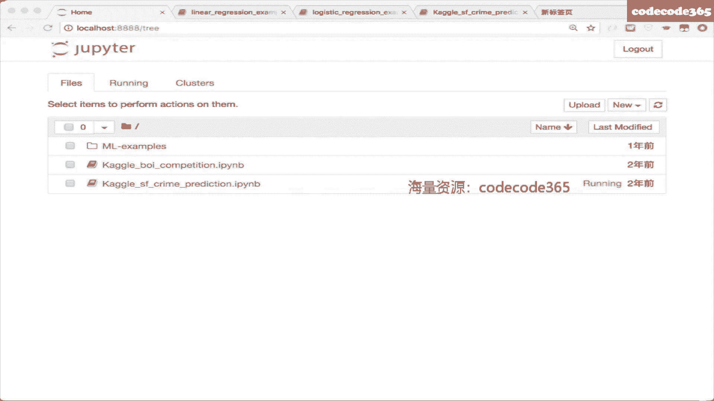

# 机器学习基础课程01：线性回归、逻辑回归与梯度下降 🧠

在本节课中，我们将要学习机器学习中最基础且核心的两个算法：**线性回归**和**逻辑回归**。我们将从机器学习的基本概念入手，理解监督学习与无监督学习的区别，然后深入探讨这两个回归类算法的原理、假设函数、损失函数以及如何通过**梯度下降**进行优化。课程最后，我们会通过代码示例来巩固理解。

---

## 机器学习基本概念

在深入学习具体算法之前，我们需要建立一个宏观的机器学习框架。机器学习主要分为两大类：**监督学习**和**无监督学习**。

### 监督学习 (Supervised Learning)

监督学习类似于有参考答案的学习过程。我们拥有输入数据 `X` 和对应的正确答案（标签）`Y`。算法的目标是从这些“题目”和“答案”中学习出一个从 `X` 到 `Y` 的映射关系 `F`，以便在面对新的、没有答案的“题目”时，能给出准确的预测。

*   **分类问题**：输出 `Y` 是离散的类别标签，例如判断邮件是否为垃圾邮件（是/否），或识别图像中的动物种类（猫/狗/鸟）。这相当于做“选择题”。
*   **回归问题**：输出 `Y` 是连续的数值，例如预测房价、票房或温度。这相当于做“填空题”或“问答题”。

### 无监督学习 (Unsupervised Learning)

无监督学习则是在没有标签的数据中寻找内在结构和模式。例如，根据用户的购物行为将用户分成不同的群体（聚类），或者发现商品之间的关联规则（如“啤酒与尿布”）。

上一节我们介绍了机器学习的宏观分类，本节中我们来看看监督学习中最基础的两个模型。

---

## 线性回归 (Linear Regression) 📈

线性回归用于解决回归问题，其核心思想是假设输入特征 `X` 和输出 `Y` 之间存在线性关系。

### 假设函数 (Hypothesis Function)

我们假设映射关系 `F` 是一个线性组合：
`h_θ(x) = θ₀ + θ₁x₁ + θ₂x₂ + ... + θₙxₙ`
其中，`θ` 是模型需要学习的参数（权重），`x` 是输入特征。

为了简化表示，我们通常使用向量化形式。令 `θ` 和 `x` 都为列向量（并在 `x` 前添加一个值为1的 `x₀` 以包含截距项 `θ₀`），则假设函数可以写为：
`h_θ(x) = θᵀx`

### 损失函数与优化目标

仅仅知道假设函数的形式还不够，我们需要一个标准来衡量一组参数 `θ` 的好坏。这个标准就是**损失函数**。

对于线性回归，最常用的损失函数是**均方误差**：
`J(θ) = (1/(2m)) * Σ (h_θ(x⁽ⁱ⁾) - y⁽ⁱ⁾)²`
其中，`m` 是样本数量。`J(θ)` 衡量了模型预测值与真实值之间的平均差异（乘以 `1/2` 是为了后续求导方便，不影响优化方向）。

我们的优化目标就是找到一组参数 `θ*`，使得损失函数 `J(θ)` 最小化：
`θ* = argmin_θ J(θ)`

### 梯度下降算法 (Gradient Descent)

如何找到使 `J(θ)` 最小的 `θ` 呢？一个直观的方法是**梯度下降**。想象 `J(θ)` 是一个碗状曲面，我们随机放置一个小球（随机初始化 `θ`），让它沿着最陡的下坡方向滚动，最终它会到达碗底（最小值点）。

这个“最陡的下坡方向”就是损失函数 `J(θ)` 在当前 `θ` 处的**负梯度**。梯度下降的更新公式为：
`θ_j := θ_j - α * (∂J(θ)/∂θ_j)`
对于所有参数 `j` 同时进行更新。其中 `α` 称为**学习率**，它控制了每次更新的步长。

*   **学习率 `α` 的影响**：
    *   `α` 太小：收敛速度慢，需要很多次迭代。
    *   `α` 太大：可能越过最低点，导致无法收敛甚至发散。
    *   `α` 是一个需要手动调节的**超参数**。

将均方误差的梯度代入，可以得到线性回归的梯度下降更新规则：
`θ_j := θ_j - α * (1/m) * Σ (h_θ(x⁽ⁱ⁾) - y⁽ⁱ⁾) * x_j⁽ⁱ⁾`

---

## 逻辑回归 (Logistic Regression) 🎯

逻辑回归虽然名字里有“回归”，但它是一个用于解决**二分类**问题的模型。它的目标是预测一个样本属于正类（如“是垃圾邮件”）的概率。

### 从线性回归到分类问题

直接使用线性回归的输出（范围是 `(-∞, +∞)`）作为概率并不合适，因为它可能超出 `[0, 1]` 区间，且对异常值敏感。我们需要一个函数将线性回归的结果映射到 `(0, 1)` 之间。

### Sigmoid 函数

这个函数就是 **Sigmoid 函数**（或 Logistic 函数）：
`g(z) = 1 / (1 + e^{-z})`
它的值域是 `(0, 1)`，并且具有良好的数学性质，其导数 `g'(z) = g(z)(1 - g(z))`。

### 假设函数与决策边界

我们将线性回归的结果 `z = θᵀx` 送入 Sigmoid 函数，得到逻辑回归的假设函数：
`h_θ(x) = g(θᵀx) = 1 / (1 + e^{-θᵀx})`
`h_θ(x)` 的输出可以解释为 `y=1` 的概率，即 `P(y=1|x; θ)`。

我们设定一个阈值（通常为0.5）：
*   如果 `h_θ(x) >= 0.5`，预测 `y=1`。
*   如果 `h_θ(x) < 0.5`，预测 `y=0`。
由于 `g(z) >= 0.5` 等价于 `z >= 0`，所以决策边界实际上是由 `θᵀx = 0` 这个线性（或经特征变换后的非线性）方程决定的。

### 损失函数：对数损失

我们不能再用均方误差作为逻辑回归的损失函数，因为它会导致 `J(θ)` 非凸，存在多个局部最小值，不利于优化。

逻辑回归使用**对数损失**（或交叉熵损失）：
`J(θ) = - (1/m) * Σ [ y⁽ⁱ⁾ log(h_θ(x⁽ⁱ⁾)) + (1 - y⁽ⁱ⁾) log(1 - h_θ(x⁽ⁱ⁾)) ]`
这个函数是凸函数，保证了梯度下降能找到全局最优解。

其梯度下降更新公式（经过求导）为：
`θ_j := θ_j - α * (1/m) * Σ (h_θ(x⁽ⁱ⁾) - y⁽ⁱ⁾) * x_j⁽ⁱ⁾`
**形式上与线性回归完全一致**，但请注意 `h_θ(x)` 的定义已变为 Sigmoid 函数。

### 多分类扩展

逻辑回归本质上是二分类器。对于多分类问题，有两种常用策略：
1.  **一对多 (One-vs-Rest, OvR)**：训练 `K` 个分类器（`K` 为类别数），每个分类器判断样本是否属于特定类别。
2.  **一对一 (One-vs-One, OvO)**：为每两个类别训练一个分类器，共 `K(K-1)/2` 个，通过投票决定最终类别。

---

## 过拟合、欠拟合与正则化 ⚖️

在模型训练中，我们常遇到两个问题：

*   **欠拟合**：模型过于简单，无法捕捉数据中的基本模式。对应高偏差。
*   **过拟合**：模型过于复杂，不仅学习了数据中的规律，还“记忆”了噪声和异常值。对应高方差，在新数据上表现差。

解决过拟合的一个核心方法是**正则化**。它在损失函数中增加一个惩罚项，限制参数 `θ` 的幅度，迫使模型变得更简单、平滑。

### L2 正则化

在损失函数中加入参数 `θ` 的 L2 范数平方（通常不惩罚截距项 `θ₀`）：
`J(θ)_reg = J(θ) + (λ/(2m)) * Σ θ_j²`
其中 `λ` 是**正则化参数**，也是一个超参数。
*   `λ` 太大：惩罚过重，可能导致欠拟合。
*   `λ` 太小：惩罚不足，可能无法抑制过拟合。

加入 L2 正则化后，梯度下降的更新公式变为：
`θ_j := θ_j - α * [ (1/m) * Σ (h_θ(x⁽ⁱ⁾) - y⁽ⁱ⁾) * x_j⁽ⁱ⁾ + (λ/m) * θ_j ]`

---

## 代码实践与工具库

在实际应用中，我们通常使用成熟的机器学习库，而不是从头手写算法。以下是两个推荐的工具库：

*   **Scikit-learn**：Python 中最流行的机器学习库之一，提供了 `LinearRegression` 和 `LogisticRegression` 等简洁易用的接口。
*   **LIBSVM / LIBLINEAR**：由台湾大学开发的高效库（C++），Scikit-learn 中的 SVM 和逻辑回归部分对其进行了封装。

**核心代码示例（使用 Scikit-learn）：**
```python
# 线性回归
from sklearn.linear_model import LinearRegression
model_lr = LinearRegression()
model_lr.fit(X_train, y_train) # 拟合数据
predictions = model_lr.predict(X_test) # 预测

# 逻辑回归
from sklearn.linear_model import LogisticRegression
model_logr = LogisticRegression(C=1.0) # C 是正则化强度的倒数，即 C = 1/λ
model_logr.fit(X_train, y_train)
predictions = model_logr.predict(X_test)
probabilities = model_logr.predict_proba(X_test) # 获取预测概率
```

---

## 总结

本节课中我们一起学习了机器学习的基础入门知识：

1.  **建立了机器学习的地图**：理解了监督学习（分类/回归）与无监督学习的区别。
2.  **掌握了线性回归**：学习了其线性假设函数、均方误差损失函数，以及通过梯度下降进行优化的全过程。
3.  **深入理解了逻辑回归**：明白了如何通过 Sigmoid 函数将线性模型用于分类，并学习了其特有的对数损失函数。
4.  **认识了模型的核心挑战**：了解了过拟合与欠拟合的概念，并学会了使用 **L2 正则化** 来对抗过拟合，提升模型泛化能力。
5.  **接触了实践工具**：了解了使用 Scikit-learn 等库可以快速实现模型，而理解底层原理是调优和解决问题的关键。




逻辑回归因其简单、高效、可解释性强，至今仍是工业界许多场景下的首选基线模型。理解好这两个基础模型，将为后续学习更复杂的算法打下坚实的基础。