# 【七月在线】机器学习就业训练营16期 - P10：机器学习基本流程、基础模型与sklearn使用教程 📚

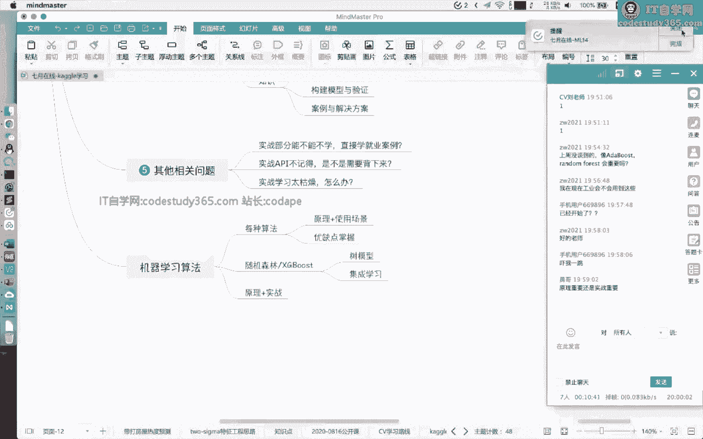

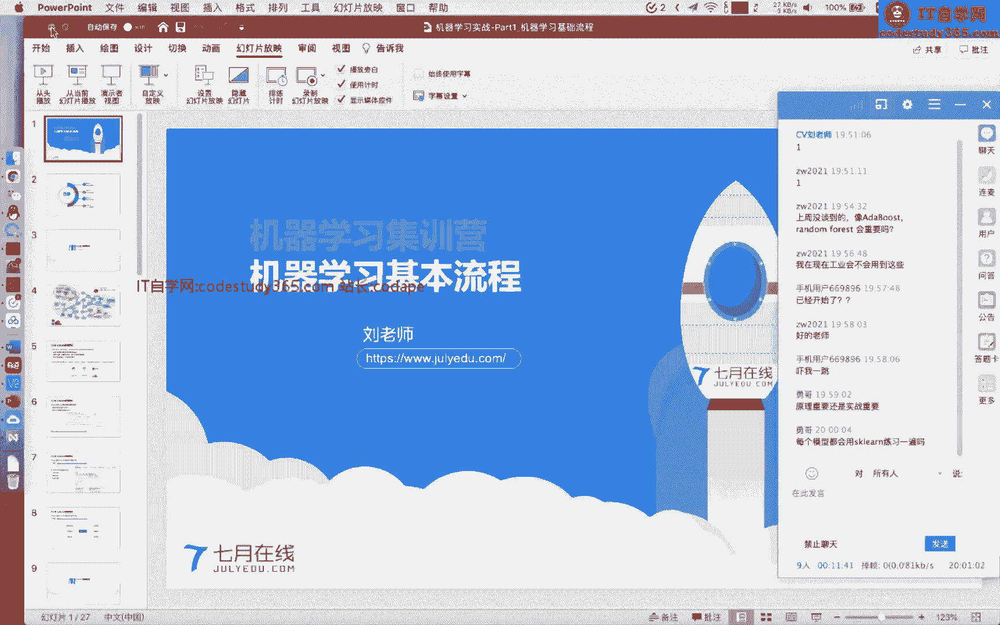

在本节课中，我们将学习机器学习的基本流程，并重点介绍如何使用Python的`scikit-learn`（简称sklearn）库来构建和评估基础模型。课程内容将涵盖从数据预处理到模型训练、验证和调参的全过程。

---

## 第一部分：课程概述与实战重要性 🎯

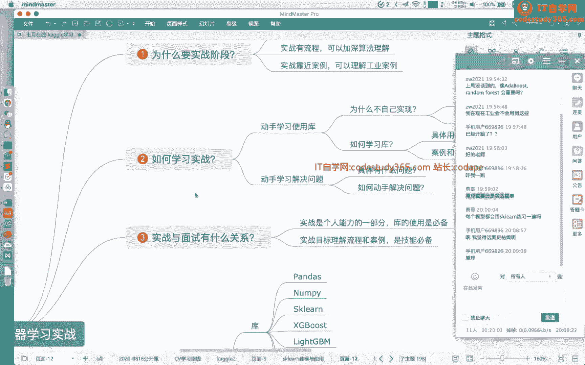

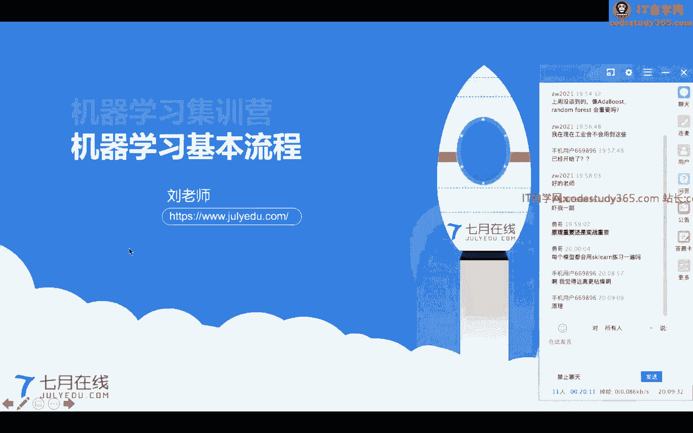

大家好，我是刘老师。在接下来的两周里，我将带领大家学习机器学习的实战部分。今天的课程将重点讲解机器学习的基本流程，并以`sklearn`库为核心进行演示。

机器学习的学习中，原理与实战同等重要。原理帮助我们理解算法的来龙去脉，而实战则能增加我们对算法的具体理解，积累解决工业级案例的经验，并为后续的项目实践打下基础。

在Python环境下进行机器学习实战，掌握核心库的使用是必备技能。`sklearn`是其中功能最强大、应用最广泛的机器学习库之一，涵盖了数据预处理、特征工程、模型训练与评估等各个环节。

---

## 第二部分：scikit-learn 库介绍 🧰

`scikit-learn`（`sklearn`）是Python环境下功能最强大的机器学习库之一。它几乎涵盖了所有常见的机器学习算法，并提供了标准化的实现流程和易于使用的API。

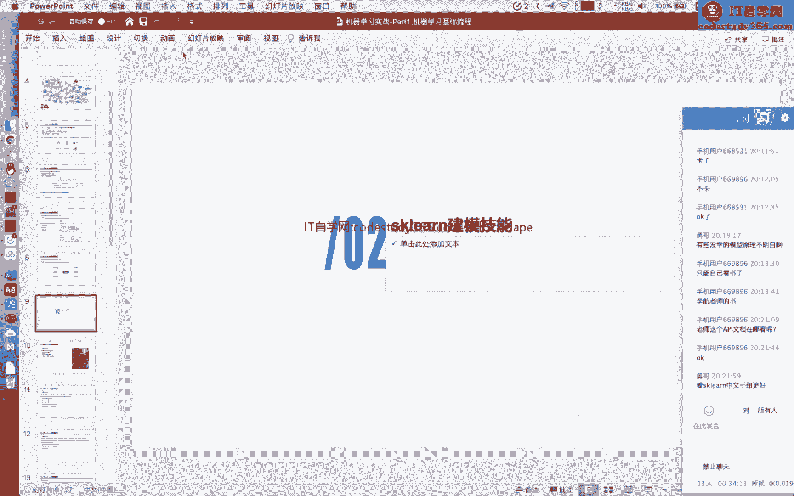

### sklearn的核心特点：
*   **算法覆盖全面**：包含分类、回归、聚类、降维等各类机器学习算法。
*   **标准化API**：所有模型都遵循`fit`、`predict`、`score`等统一的接口，易于学习和使用。
*   **高效稳定**：底层基于`NumPy`、`SciPy`等库，使用C/C++进行优化，保证了计算效率。
*   **文档详尽**：官方提供了非常清晰的API文档、教程和示例，是学习的绝佳资源。

### 如何选择算法？
sklearn官网提供了一张非常有用的算法选择指南图。其核心思路是：
1.  根据样本数量（是否大于50）判断数据集是否可用。
2.  根据任务目标判断是**分类**、**回归**、**聚类**还是**降维**问题。
3.  对于有监督任务（分类/回归），再根据数据特征（如样本量、是否为文本等）进一步选择具体算法。

这张图是一个很好的思维框架，能帮助我们在面对具体问题时快速定位合适的算法。

---

## 第三部分：机器学习建模基本流程 🔄

上一部分我们介绍了`sklearn`库，本节中我们来看看使用它进行机器学习建模的标准流程。

一个完整的机器学习项目通常包含以下步骤：

### 1. 数据划分
在开始建模前，需要将数据划分为**训练集**、**验证集**和**测试集**。常见的划分方法有：
*   **留出法**：按固定比例（如8:2）随机划分。
*   **K折交叉验证**：将数据均分为K份，依次用其中一份作为验证集，其余K-1份作为训练集，循环K次。
*   **自助采样法**：通过有放回采样构建训练集，未采到的样本作为验证集。

在`sklearn`中，可以使用`model_selection.train_test_split`进行留出法划分，使用`model_selection.KFold`或`cross_val_score`进行交叉验证。

### 2. 数据预处理与特征工程
原始数据通常不能直接输入模型，需要进行预处理。`sklearn`的`preprocessing`模块提供了丰富的工具：
*   **标准化/归一化**：如`StandardScaler`, `MinMaxScaler`。
*   **缺失值填充**：如`SimpleImputer`。
*   **特征编码**：对类别型特征进行编码，如`LabelEncoder`, `OneHotEncoder`。

**核心概念**：`fit`与`transform`
*   `fit`：计算预处理所需的参数（如均值、方差），并保存状态。
*   `transform`：使用`fit`阶段计算好的参数对数据进行转换。
*   **重要原则**：预处理器（如`StandardScaler`）只能在训练集上`fit`一次，然后在训练集和测试集上分别`transform`，以确保转换标准一致。

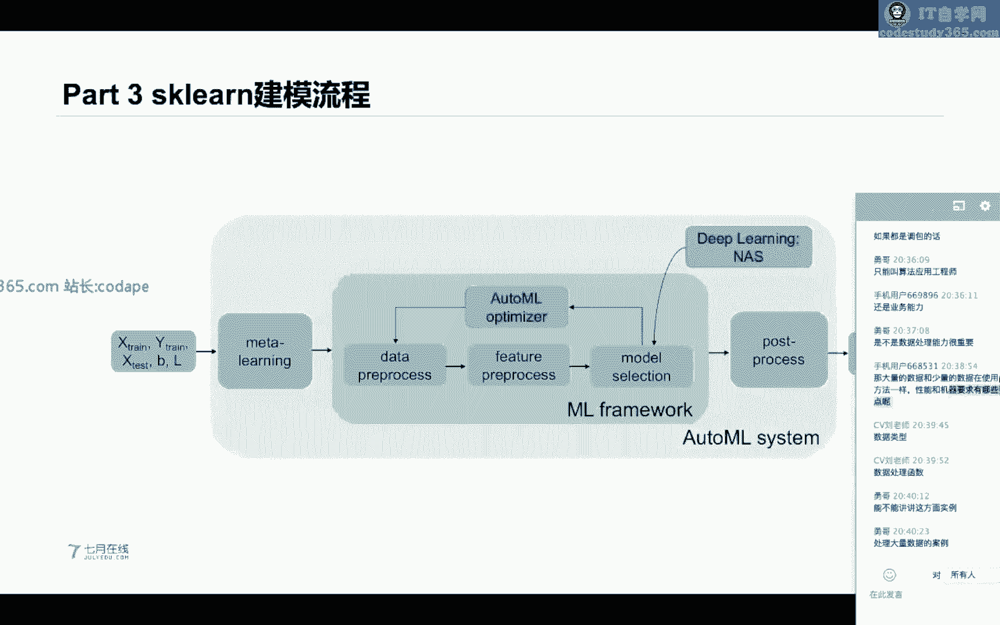

### 3. 模型训练与评估
选择好算法和处理好数据后，就可以进行模型训练。`sklearn`中所有模型都遵循相似的接口：
```python
from sklearn.xxx import SomeModel
model = SomeModel(hyperparameter=value) # 1. 实例化模型
model.fit(X_train, y_train)             # 2. 在训练集上训练
score = model.score(X_test, y_test)     # 3. 在测试集上评估
y_pred = model.predict(X_new)           # 4. 对新数据进行预测
```

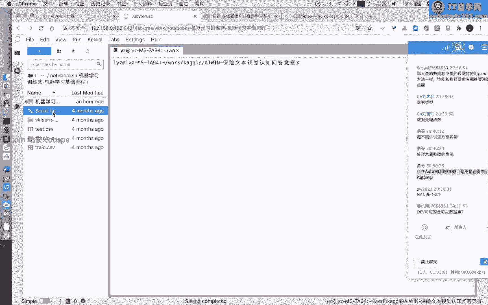

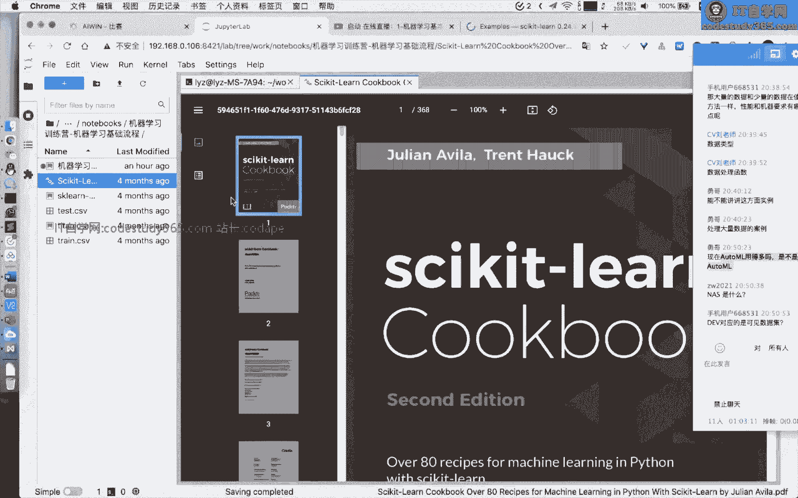

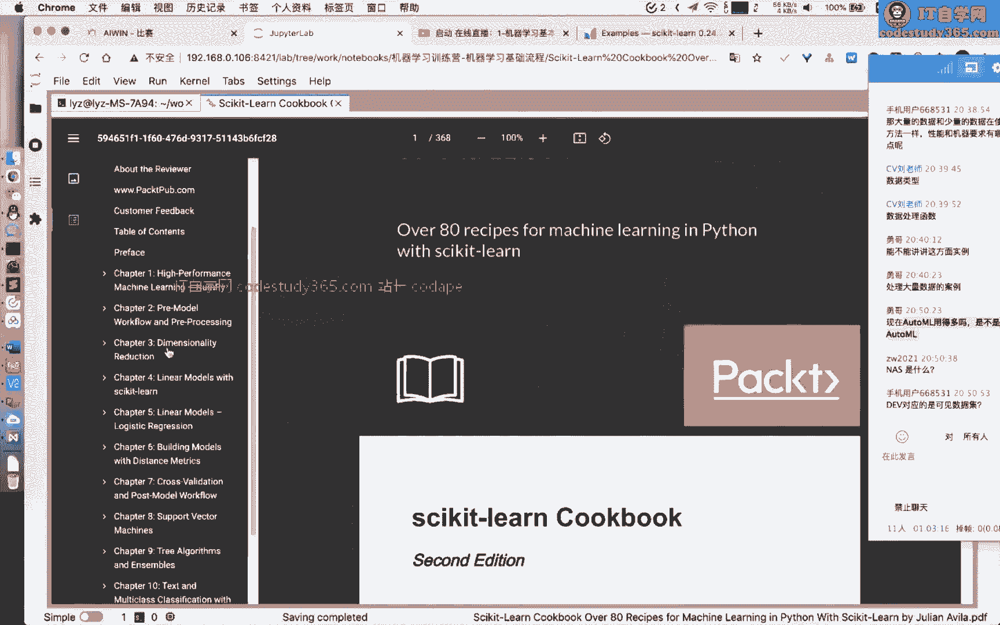

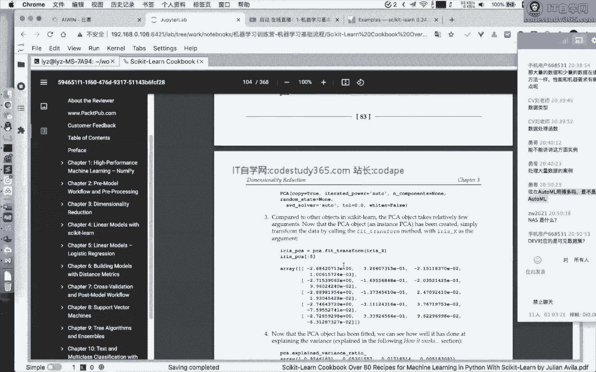

### 4. 模型调参与选择
模型有许多超参数需要调整。`sklearn`的`model_selection`模块提供了自动调参工具：
*   **网格搜索**：`GridSearchCV`，遍历所有给定的参数组合。
*   **随机搜索**：`RandomizedSearchCV`，在给定的参数分布中随机采样。

### 5. 误差分析与流程迭代
根据模型在训练集和验证集上的表现，判断问题是欠拟合还是过拟合，并决定下一步优化方向（如获取更多数据、调整模型复杂度、增加正则化等）。

---

## 第四部分：sklearn 实战代码示例 💻

前面我们介绍了基本流程，现在让我们通过几个具体的代码示例来加深理解。

### 示例1：使用KNN进行鸢尾花分类
这是一个完整的迷你工作流示例。

```python
# 导入必要的模块
from sklearn.datasets import load_iris
from sklearn.model_selection import train_test_split
from sklearn.preprocessing import StandardScaler
from sklearn.neighbors import KNeighborsClassifier
from sklearn.metrics import accuracy_score

# 1. 加载数据
iris = load_iris()
X, y = iris.data, iris.target

# 2. 划分数据集
X_train, X_test, y_train, y_test = train_test_split(X, y, test_size=0.25, random_state=42)

# 3. 数据预处理：标准化
scaler = StandardScaler()
X_train_scaled = scaler.fit_transform(X_train) # 只在训练集上fit
X_test_scaled = scaler.transform(X_test)       # 用训练集的参数转换测试集

# 4. 训练模型
knn = KNeighborsClassifier(n_neighbors=3)
knn.fit(X_train_scaled, y_train)

# 5. 预测与评估
y_pred = knn.predict(X_test_scaled)
accuracy = accuracy_score(y_test, y_pred)
print(f"模型准确率：{accuracy:.2f}")
```

### 示例2：构建Pipeline简化流程
对于包含多个步骤的流程，可以使用`Pipeline`将其串联，使代码更简洁，并防止数据泄露。

```python
from sklearn.pipeline import make_pipeline
from sklearn.ensemble import RandomForestClassifier

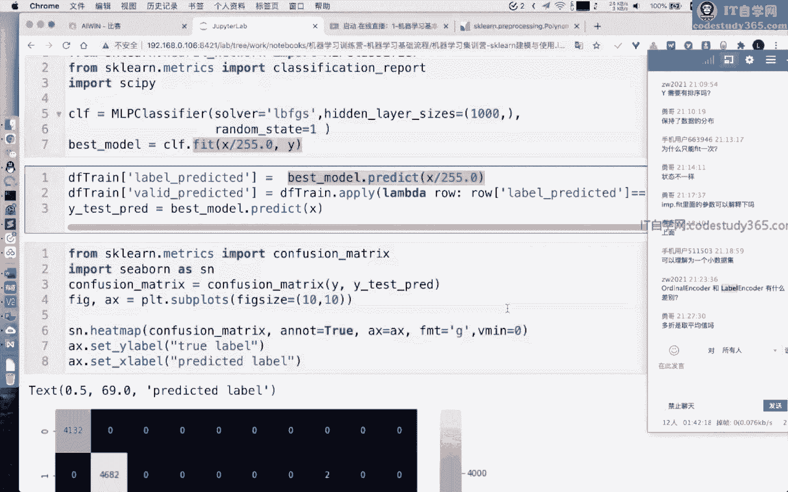

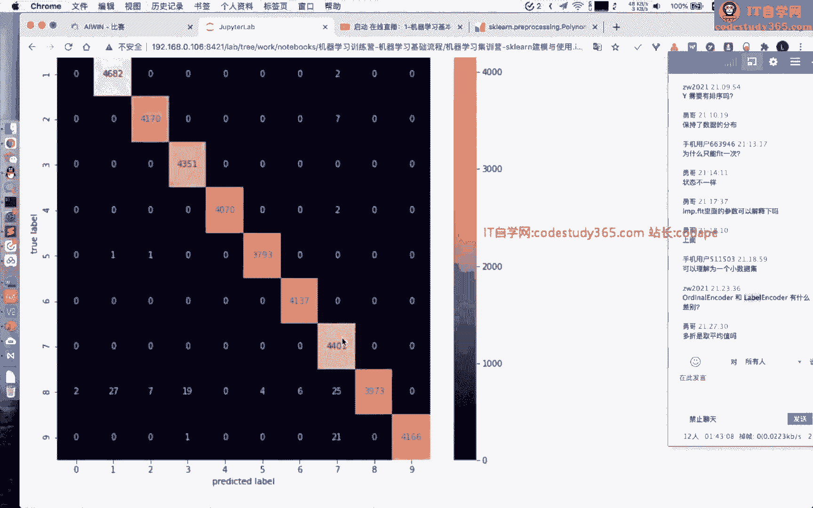

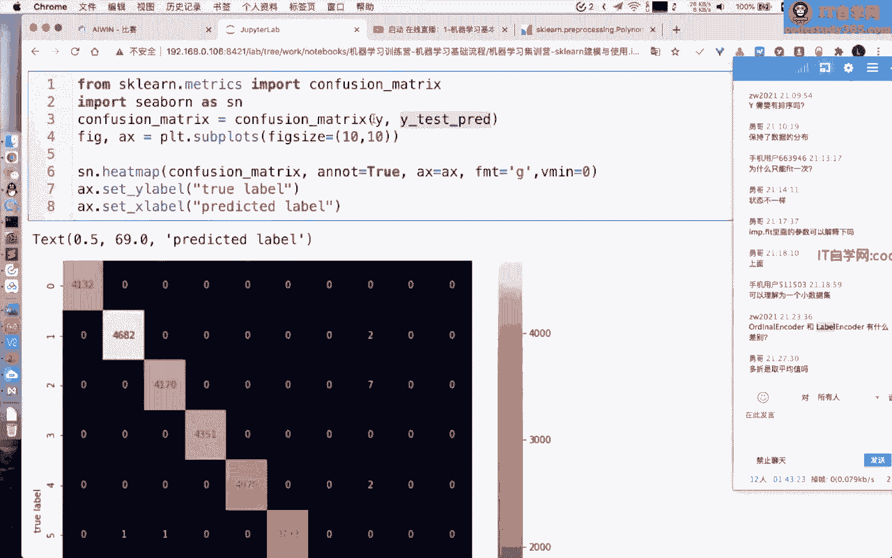

# 创建一个管道：先标准化，再使用随机森林分类
pipeline = make_pipeline(StandardScaler(),
                         RandomForestClassifier(n_estimators=100, random_state=42))
# 训练和预测只需一步
pipeline.fit(X_train, y_train)
pipeline_score = pipeline.score(X_test, y_test)
```

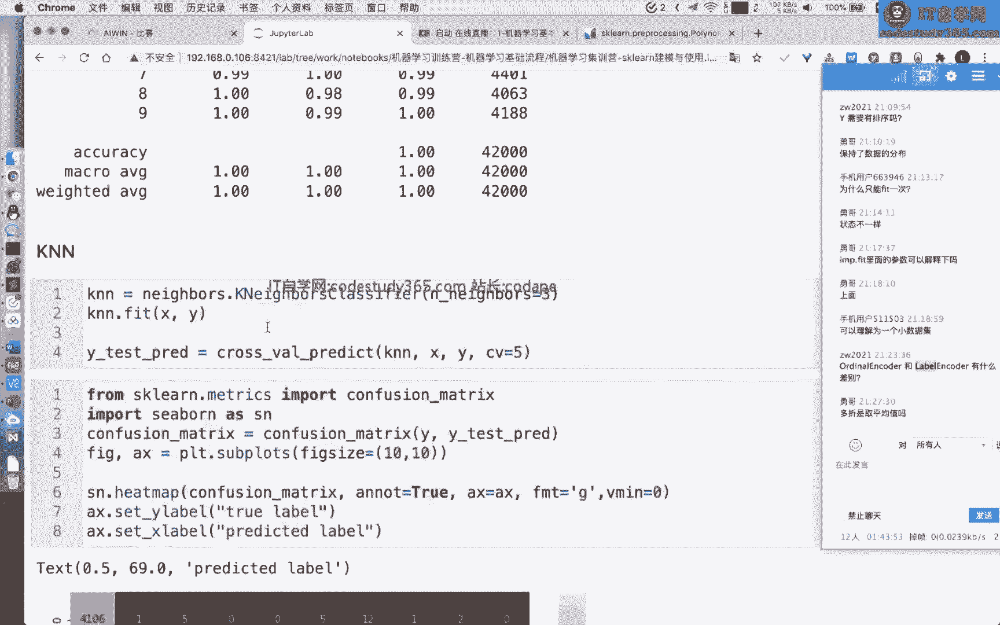

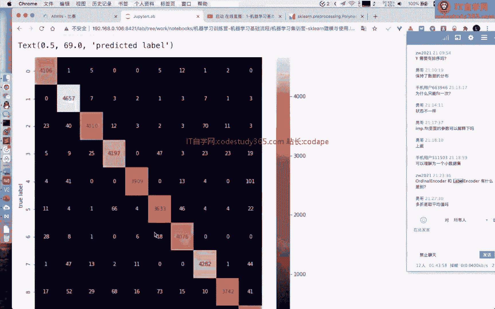

### 示例3：使用交叉验证与网格搜索
```python
from sklearn.model_selection import cross_val_score, GridSearchCV

# 交叉验证评估模型
cv_scores = cross_val_score(knn, X_train_scaled, y_train, cv=5)
print(f"交叉验证平均得分：{cv_scores.mean():.2f}")

# 网格搜索寻找最佳参数
param_grid = {'n_neighbors': [3, 5, 7, 9]}
grid_search = GridSearchCV(KNeighborsClassifier(), param_grid, cv=5)
grid_search.fit(X_train_scaled, y_train)
print(f"最佳参数：{grid_search.best_params_}")
print(f"最佳得分：{grid_search.best_score_:.2f}")
```

---

## 第五部分：学习建议与总结 📝

本节课中，我们一起学习了机器学习的基本流程和`scikit-learn`库的核心用法。

### 核心总结：
1.  **流程是关键**：机器学习项目遵循“数据划分 -> 预处理 -> 模型训练/评估 -> 调参优化”的基本流程。
2.  **sklearn是利器**：`sklearn`提供了标准化、模块化的工具，能高效完成上述所有步骤。掌握`fit`/`transform`/`predict`等核心接口至关重要。
3.  **原理与实战结合**：理解算法原理能帮助我们更好地调参和解决问题，而动手实践则能加深对原理的理解并积累经验。

### 给初学者的建议：
*   **从案例入手**：建议从`sklearn`官网的`examples`或经典的案例（如泰坦尼克号生存预测）开始实践，先跑通代码，再深入理解。
*   **善用文档**：`sklearn`官方API文档是最好、最准确的学习资料，遇到问题首先查阅文档。
*   **动手练习**：机器学习是实践性很强的学科，一定要多写代码，尝试修改参数，观察结果变化。

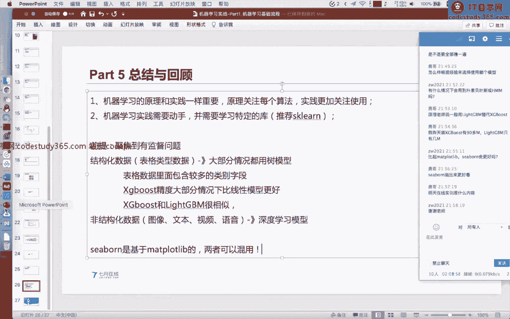


通过本课程的学习，希望大家能够建立起使用`sklearn`进行机器学习建模的完整知识框架，并能够将其应用到实际问题中。