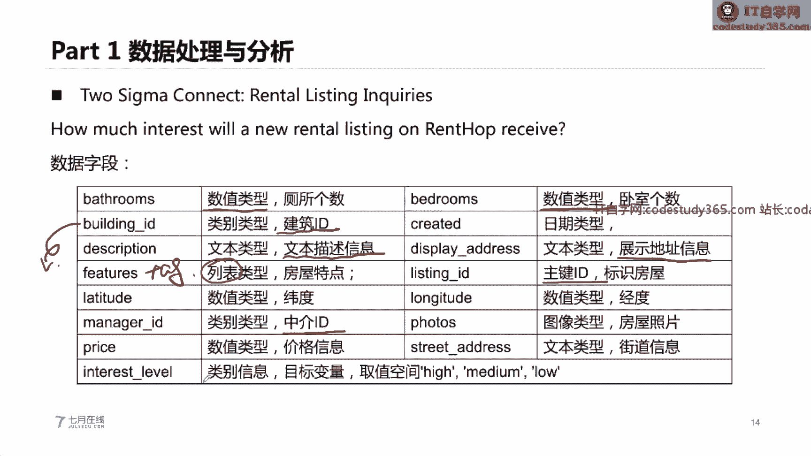
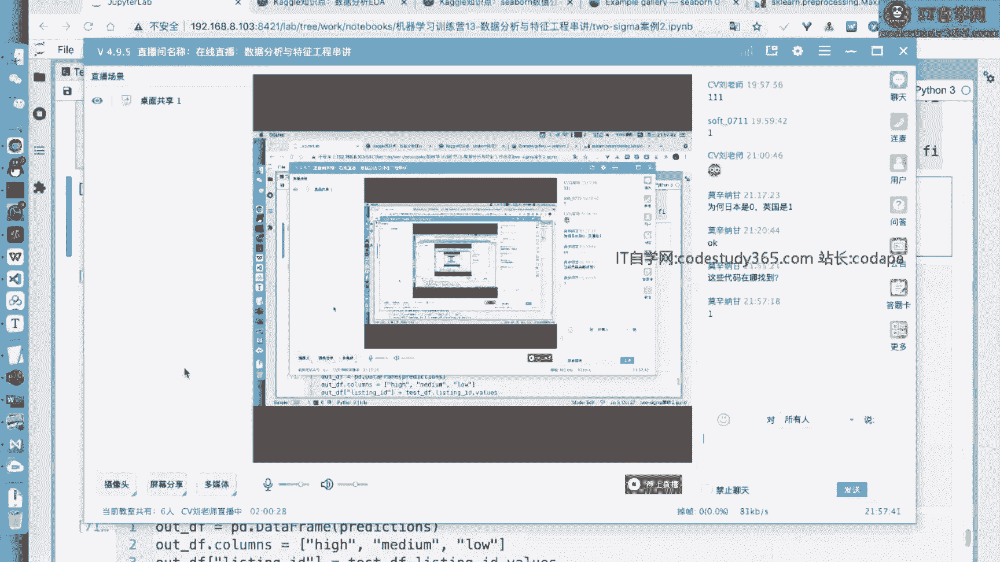

# 🧠 机器学习实战教程 第11课：数据分析与特征工程串讲


在本节课中，我们将系统性地学习数据分析与特征工程的核心流程与实践方法。课程将从一个具体的租房热度预测案例出发，讲解如何从原始数据出发，通过数据理解、特征构建与模型训练，最终完成一个机器学习项目。

---

## 🎯 第一部分：问题识别与建模

在开始数据分析之前，我们首先需要对问题进行抽象和建模。这决定了我们最终的解题思路和方法。

机器学习任务通常根据场景进行划分，例如分类、回归、排序或无监督学习。我们可以根据问题的类型（有无标签、标签类型）来定义任务。

*   **有监督学习**：数据包含标签（label）。根据标签类型可进一步划分：
    *   **分类问题 (Classification)**：标签是离散的类别。例如，预测用户是否违约。
    *   **回归问题 (Regression)**：标签是连续的数值。例如，预测房屋价格。
    *   **排序问题 (Ranking)**：标签是次序关系。
*   **无监督学习 (Unsupervised Learning)**：数据没有标签。例如，聚类（k-means）、降维（PCA）。

此外，数据的类型也决定了适用的算法：
*   **结构化数据**：表格型数据，适合使用树模型（如 XGBoost, LightGBM）或进行人工特征工程。
*   **非结构化数据**：如图像、文本、语音，通常更适合深度学习模型。

**建模流程并非线性**，而是一个需要反复迭代的过程。我们可能在数据理解、预处理、建模、评估等任何环节发现问题并返回调整，直到模型性能达到要求。

在实际项目中，**数据处理和特征工程往往占据70%以上的时间**，而模型训练和验证可能只占10%。因此，深入理解数据和构建有效特征是至关重要的。

---

## 📊 第二部分：数据处理与分析实战

本节我们将以 Kaggle 竞赛数据集 `Two Sigma Connect: Rental Listing Inquiries`（租房热度预测）为例，进行实际操作。

### 问题背景与数据理解

该任务是根据房屋信息预测其受欢迎程度（热度），标签分为三类：`high`，`medium`，`low`。这是一个多分类问题，评估指标为 `Log Loss`。

以下是数据集的主要字段及其含义：

| 字段名 | 类型 | 含义 |
| :--- | :--- | :--- |
| `bathrooms` | 数值 | 卫生间数量 |
| `bedrooms` | 数值 | 卧室数量 |
| `building_id` | 类别 | 建筑物ID |
| `created` | 日期 | 信息发布时间 |
| `description` | 文本 | 房屋描述 |
| `features` | 列表 | 房屋特点标签（如“有电梯”） |
| `latitude` / `longitude` | 数值 | 经纬度 |
| `price` | 数值 | 价格 |
| `interest_level` | 类别 | 热度标签（目标变量） |

### 单变量分析

对于单个字段，我们可以通过统计和可视化来理解其分布规律。

**对于数值型字段**（如 `price`, `bathrooms`）：
*   **统计描述**：使用 `pandas.DataFrame.describe()` 计算均值、标准差、分位数等。
*   **可视化**：绘制**直方图 (Histogram)** 或 **核密度估计图 (KDE)** 观察分布。例如，价格数据通常呈现**左偏分布**，可以通过取对数 (`np.log`) 来使其更接近正态分布。
*   **箱线图 (Boxplot)**：用于识别**离群点 (Outliers)**。其上下界计算公式为：
    *   `IQR = Q3 - Q1`
    *   上界 = `Q3 + 1.5 * IQR`
    *   下界 = `Q1 - 1.5 * IQR`

**对于类别型字段**（如 `building_id`）：
*   **统计描述**：使用 `pandas.Series.value_counts()` 统计各类别出现频次。
*   **可视化**：当类别数不多时，可使用**柱状图 (Bar Chart)**。

**对于文本/日期型字段**：
*   **日期字段**：可提取年、月、日、小时、是否周末等特征，并绘制时间序列图观察趋势。
*   **文本字段**：可统计词频，或使用**词云 (Word Cloud)** 直观展示高频词汇。

通过以上分析，我们可以对数据有初步理解，例如：哪些字段存在缺失值？分布是否异常？哪些字段可能与目标变量相关？



---

## 🔧 第三部分：特征工程原理与实践

特征工程是将原始数据转换为更能代表问题本质的特征的过程，是提升模型性能的关键。

### 1. 类别特征编码

类别特征（字符串）必须转换为数值才能被模型处理。

*   **独热编码 (One-Hot Encoding)**
    *   **方法**：为每个类别创建一个新的二进制列。
    *   **公式**：若类别有 `K` 种取值，则转换为 `K` 维向量，对应类别位置为1，其余为0。
    *   **优点**：不引入次序关系，适用于无序类别。
    *   **缺点**：当类别数很多时，会导致特征维度爆炸，数据稀疏。
    *   **代码**：
        ```python
        pd.get_dummies(df[‘col‘])
        # 或
        from sklearn.preprocessing import OneHotEncoder
        ```

*   **标签编码 (Label Encoding)**
    *   **方法**：为每个类别分配一个唯一的整数ID。
    *   **优点**：不增加维度。
    *   **缺点**：会引入人为的次序关系，可能误导模型。**更适合树模型**。
    *   **代码**：
        ```python
        df[‘col‘].astype(‘category‘).cat.codes
        # 或
        from sklearn.preprocessing import LabelEncoder
        ```

*   **频数编码 (Count / Frequency Encoding)**
    *   **方法**：用该类别在训练集中出现的次数或频率来替代类别本身。
    *   **优点**：简单，包含了类别流行度信息。
    *   **缺点**：不同类别可能有相同频数，导致信息混淆。需注意训练集和测试集分布一致。

*   **目标编码 (Target Encoding)**
    *   **方法**：用该类别下**目标变量的均值**来替代类别。例如，`building_id` 为 “A” 的所有房子，其热度为 `high` 的平均概率是0.7，则用0.7替代 “A”。
    *   **优点**：编码值含有与目标变量的直接关联信息，非常强大。
    *   **缺点**：极易导致**标签泄露 (Data Leakage)** 和过拟合。
    *   **改进**：使用**交叉验证**进行目标编码，防止泄露。即对第 `i` 折的验证集编码时，仅使用其他折的训练集数据来计算目标均值。

### 2. 数值特征处理

*   **缩放与归一化**：将特征值映射到特定区间，有助于模型收敛。
    *   **最大最小值归一化 (MinMaxScaler)**：`X_scaled = (X - X.min) / (X.max - X.min)`
    *   **标准化 (StandardScaler)**：`X_scaled = (X - X.mean) / X.std`，适用于近似高斯分布的数据。
*   **离散化 (Binning)**：将连续值分段，转化为有序的类别。例如，将年龄划分为 `[0-18, 19-35, 36-60, 60+]`。
*   **交叉特征**：通过已有特征进行加减乘除运算，生成新特征。
    *   **同类型特征**：可做加减。如 `total_rooms = bedrooms + bathrooms`。
    *   **不同类型特征**：可做乘除。如 `price_per_bedroom = price / bedrooms`。

### 3. 时间、文本特征构建

*   **时间特征**：从日期字段中提取丰富特征，如年份、月份、星期几、是否节假日、距某个日期的天数等。
*   **文本特征**：常用方法包括**词袋模型 (Bag-of-Words)** 和 **TF-IDF**，将文本转换为数值向量。

### 4. 特征选择与重要性

训练模型后，可以评估特征的重要性。
*   **树模型**：可通过 `model.feature_importances_` 属性获取基于信息增益或基尼不纯度的特征重要性排序。
*   **作用**：帮助理解数据，并可用于特征筛选，移除不重要特征以简化模型。

---

## 🤖 第四部分：模型训练、验证与集成

### 数据划分与交叉验证

将数据划分为**训练集 (Train Set)**、**验证集 (Validation Set)** 和**测试集 (Test Set)**。
*   **训练集**：用于训练模型参数。
*   **验证集**：用于调整超参数、选择模型，监控训练过程以防过拟合。
*   **测试集**：用于最终评估模型泛化能力，**在最终模型确定前不应使用**。

**K折交叉验证 (K-Fold CV)** 是一种更鲁棒的验证方法。它将训练集均分为K份，每次用其中K-1份训练，剩余1份验证，循环K次，最终取K次验证结果的平均值。这能更稳定地评估模型性能。

### 过拟合与欠拟合

*   **欠拟合**：模型在训练集和验证集上表现都差。解决方法：增加模型复杂度、增加特征。
*   **过拟合**：模型在训练集上表现好，在验证集上表现差。解决方法：获取更多数据、降低模型复杂度、正则化、早停 (Early Stopping)。

**早停法**：在训练迭代过程中（如深度学习或梯度提升树），监控验证集误差。当验证集误差不再下降反而开始上升时，停止训练，从而避免过拟合。

### 模型集成：Stacking

**Stacking** 是一种高级集成技术，将多个基模型（如随机森林、XGBoost）的预测结果作为新特征，输入到一个次级模型（元模型）中进行再次训练。

**关键步骤**：
1.  将训练集分为K折。
2.  对于每个基模型，进行K折交叉验证：用K-1折训练模型，预测剩余1折（得到对部分训练集的预测），同时预测整个测试集。
3.  将所有基模型对训练集的K折预测结果拼接起来，形成新的训练特征。
4.  将所有基模型对测试集的预测结果取平均，形成新的测试特征。
5.  用新的训练特征和原始标签训练次级模型（如线性回归），并用其预测新的测试特征，得到最终结果。

这种方法能融合不同模型的优势，通常能提升预测精度。

---

## 📝 总结与回顾

本节课我们一起学习了机器学习项目中的两个核心环节：**数据分析**与**特征工程**。

1.  **问题建模**：我们首先学习了如何根据标签和数据形式定义机器学习任务（分类、回归等），并理解了结构化与非结构化数据的差异。
2.  **数据分析**：我们以租房数据集为例，演示了如何通过统计描述和可视化（直方图、箱线图、词云等）来理解数据分布、发现异常值、探索特征与目标的关系。
3.  **特征工程**：我们系统介绍了各类特征的处理方法：
    *   **类别特征**：独热编码、标签编码、频数编码、目标编码。
    *   **数值特征**：缩放、离散化、构造交叉特征。
    *   **时间/文本特征**：提取关键信息并向量化。
4.  **模型实践**：我们介绍了数据划分、交叉验证、过拟合应对策略，并简要说明了通过特征重要性进行特征选择，以及使用Stacking集成模型来提升性能。




记住，**没有放之四海而皆准的特征工程方法**。最佳实践依赖于具体的数据、问题和模型。核心能力在于理解每种方法的原理与适用场景，并在实践中灵活运用和迭代优化。