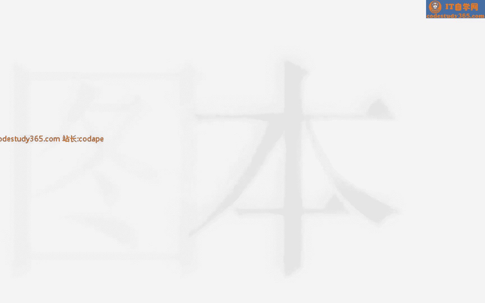
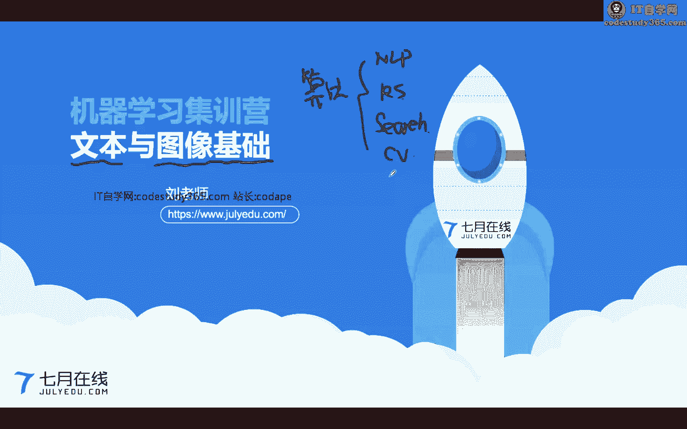
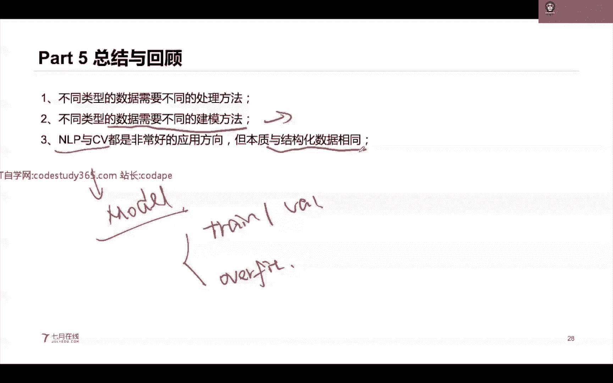
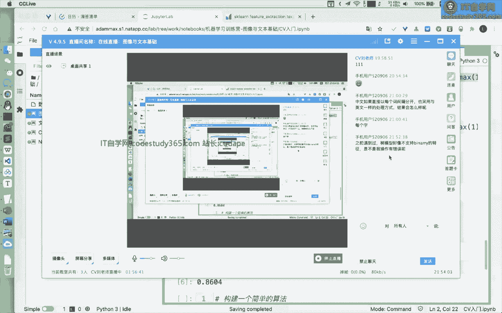

# 【七月在线】机器学习就业训练营16期 - P12：图像与文本基础教程






在本节课中，我们将要学习机器学习中两个核心的非结构化数据类型：文本和图像的基础处理方法。课程将分为数据类型介绍、文本数据处理基础、图像数据处理基础以及实践案例四个部分。

## 第一部分：数据类型介绍

上一节我们介绍了算法工程师的不同方向。本节中，我们来看看数据类型的划分，这是选择合适方法的第一步。

在机器学习任务中，数据通常分为结构化数据和非结构化数据。
*   **结构化数据**：指表格类型的数据，可以用 `pandas` 库方便地读取和处理。
*   **非结构化数据**：指不适合用表格表示的数据，主要包括文本、图像和视频。

视频可以看作是图像帧与音频的组合。理解数据类型至关重要，因为即使是相同的任务（如分类），处理结构化数据（如房价预测）和非结构化数据（如文本分类）的方法也截然不同。

## 第二部分：文本数据处理基础

上一节我们区分了数据类型，本节中我们来看看如何处理文本这类非结构化数据。

文本处理属于自然语言处理（Natural Language Processing, NLP）领域，目标是让机器理解或生成人类语言。NLP任务主要分为两类：
*   **自然语言理解（NLU）**：理解给定文本的核心含义。公式可表示为：`输入文本 -> 输出类别/标签`。
*   **自然语言生成（NLG）**：根据输入文本或含义生成新的文本。

NLP非常具有挑战性，因为语言是开放、复杂且依赖上下文的。

以下是NLP中常见的任务类型：
*   **NLU任务**：垃圾邮件识别、情感分析、意图识别（本质是文本分类）、聊天机器人、智能客服、语音识别。
*   **NLG任务**：机器翻译、文本摘要。

处理文本时，不同语言（如中文和英文）有显著区别。中文需要分词，而英文通常以空格分隔单词。这个过程称为 **`tokenization`**。

### 文本特征提取：从词到向量

机器学习的模型通常需要数值输入，因此我们需要将文本转换为数值向量。以下是两种经典方法：

**1. 词频向量与N-Gram**
`CountVectorizer` 是一种将文本转换为词频向量的方法。它首先构建一个词汇表，然后将每个句子转换为一个向量，向量的每个位置对应一个单词在该句子中出现的次数。

```python
from sklearn.feature_exture_extraction.text import CountVectorizer
vectorizer = CountVectorizer()
X = vectorizer.fit_transform(corpus)
```

`N-Gram` 是一种语言模型，它考虑连续的N个词项（token）作为特征。例如，`bigram (N=2)` 会考虑“this is”、“is good”这样的组合，能更好地保留词序信息。在 `CountVectorizer` 中，可以通过 `ngram_range` 参数设置。

**2. TF-IDF向量**
TF-IDF 衡量一个词在文档中的重要程度，由两部分组成：
*   **词频（TF）**：词在当前文档中出现的频率。
*   **逆文档频率（IDF）**：词在所有文档中出现的普遍性的倒数。公式为：`IDF(t) = log(总文档数 / 包含词t的文档数)`。

TF-IDF值由 `TF * IDF` 计算得出。一个词的TF高且IDF高（即该词在当前文档常见但在整个语料库中罕见），则其TF-IDF值高，被认为更具代表性。

```python
from sklearn.feature_exture_extraction.text import TfidfVectorizer
vectorizer = TfidfVectorizer()
X = vectorizer.fit_transform(corpus)
```

`TfidfVectorizer` 一步到位，而 `TfidfTransformer` 则用于对已有的词频矩阵进行转换。

**中文文本处理注意**：使用上述方法前，需先对中文进行分词并用空格连接，才能进行有效的特征提取。

### 文本分类实践

我们以一个真假新闻文本二分类任务为例，展示完整流程：

1.  **文本预处理**：包括统一为小写、去除噪声（如URL）、分词、去除停用词、词形还原等。
2.  **特征提取**：使用 `CountVectorizer` 或 `TfidfVectorizer` 将文本转换为特征向量。
3.  **模型训练与评估**：使用逻辑回归、朴素贝叶斯等分类器进行训练，并用交叉验证评估。

实践发现，在此任务中：
*   逻辑回归和朴素贝叶斯模型表现较好。
*   使用 `CountVectorizer` 的特征有时比 `TfidfVectorizer` 效果更好，说明IDF项并非总是有效。
*   XGBoost等树模型在此类数值特征上表现可能不如线性模型，这体现了模型对数据类型的偏好。

**进阶**：更现代的方法是使用词嵌入（Word Embedding）将单词表示为稠密向量，这将在后续课程中深入讲解。

## 第三部分：图像数据处理基础

上一节我们学习了文本处理，本节中我们来看看图像这种视觉数据如何处理。

计算机视觉（Computer Vision, CV）的目标是让机器理解和处理图像/视频。图像在计算机中本质是一个矩阵（或张量），例如一张彩色图像可表示为 **`高度(H) × 宽度(W) × 通道数(C)`** 的矩阵，其中通道通常为3（RGB）。

### 计算机视觉任务与深度学习

CV的核心任务包括：
*   **图像分类**：识别图像主体类别。
*   **目标检测**：识别图中多个目标并定位。
*   **语义分割**：对每个像素进行分类。

深度学习，特别是卷积神经网络（CNN），在CV任务中取得了巨大成功。CNN通过卷积层、池化层等结构，能够自动从浅到深地提取图像的边缘、局部特征乃至全局语义特征。

### 图像特征提取方法

除了使用深度学习模型端到端地学习，我们也可以手动提取图像特征用于机器学习模型。以下是几种方法：

**1. 图像哈希**
将图片缩放至固定大小（如8x8），灰度化后根据像素值与均值的比较生成二进制序列，再转换为哈希字符串。相似图片的哈希值也相似。适用于图片去重。

**2. 颜色直方图**
统计图像中各颜色强度区间的像素数量。它描述了图像的全局颜色分布，适用于颜色相似的图片匹配。距离计算可使用欧氏距离。

**3. 关键点检测（如SIFT）**
检测图像中梯度变化明显的角点、边缘等局部特征点，并为每个关键点生成一个描述子向量（如128维）。SIFT特征具有尺度、旋转不变性。适用于局部相似性匹配和版权检测。

**4. 深度学习特征**
使用预训练好的CNN模型（如ResNet），移除最后的分类层，将图像前向传播，提取中间层的输出作为特征向量。这是一种强大的全局特征表示方法，计算特征间的相似度（如余弦相似度）即可衡量图像相似性。

不同特征各有适用场景：哈希用于去重，颜色直方图用于颜色匹配，SIFT用于局部匹配，CNN特征用于通用语义匹配。

### 图像分类实践

我们以手写数字识别（MNIST数据集）为例，展示两种方法：

**1. 使用深度学习框架（Keras）搭建CNN**
```python
# 示例代码结构
model = Sequential([
    Conv2D(32, (3,3), activation='relu', input_shape=(28,28,1)),
    MaxPooling2D((2,2)),
    Conv2D(64, (3,3), activation='relu'),
    MaxPooling2D((2,2)),
    Flatten(),
    Dropout(0.5),
    Dense(10, activation='softmax')
])
model.compile(...)
model.fit(...)
```
CNN通过卷积和池化层逐步提取特征，最终实现高精度分类。

**2. 使用机器学习库（Scikit-learn）**
可以将图像像素矩阵展平为一维向量，作为特征输入到MLPClassifier（全连接网络）或线性分类器中进行训练。但通常效果不如专门设计的CNN。

## 第四部分：总结与核心要点

本节课中我们一起学习了图像与文本处理的基础知识。

我们来总结一下核心要点：
1.  **数据驱动方法选择**：遇到问题时，首先分析数据类型（结构化/非结构化），这决定了后续的技术选型。不存在适用于所有问题的“银弹”。
2.  **模型与数据的匹配**：不同数据需要不同的建模方法。例如，文本的TF-IDF特征更适合线性模型，而图像分类任务中CNN表现卓越。算法工程师的核心能力之一就是为特定数据匹配合适的模型。
3.  **NLP与CV是重要方向**：两者都是机器学习的热门应用领域，拥有各自丰富的任务体系和技术栈。
4.  **基础理论相通**：尽管处理的数据和模型不同，但机器学习的基础是相通的，例如训练集/验证集划分、过拟合判断、评估指标等，这些概念在处理结构化数据时同样适用。



对于初学者，建议从 **文本分类** 和 **图像分类** 这两个基础任务入手，掌握 `Scikit-learn`、`Keras`/`PyTorch` 等库的基本使用，并深入理解特征提取的核心思想。通过实践积累，逐步拓展到更复杂的任务中去。




---
**注**：本教程根据提供的直播内容整理，保留了原话的核心含义，并按照要求进行了结构化、简化和格式化处理。