# 【七月在线】机器学习就业训练营16期 - P13：基于SQL的机器学习流程和实践 📊


## 概述

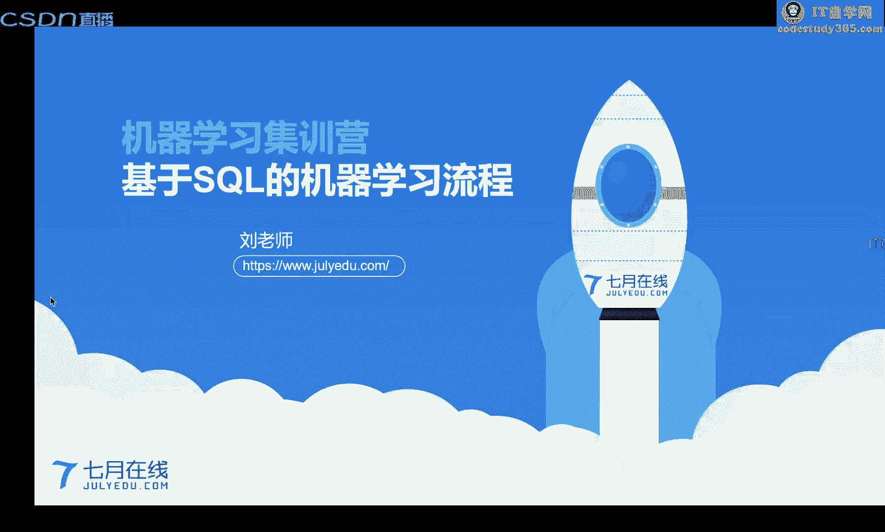

在本节课中，我们将学习如何在大数据环境下，使用SQL和Spark进行机器学习。课程将涵盖SQL基础、Spark框架介绍、Spark SQL的使用以及基于Spark的机器学习实践案例。我们将通过对比Pandas与SQL/Spark的操作，帮助初学者理解不同工具的应用场景和语法差异。

---

## 第一部分：SQL与大数据开发 🗃️

在之前的课程中，我们主要讲解了Python环境下的机器学习流程。然而，SQL在大数据处理中同样扮演着至关重要的角色。本节我们将介绍SQL的基础知识及其在大数据开发岗位中的应用。

SQL是用于访问和操作数据库的标准计算机语言。它可以完成数据的插入、查询、更新、删除以及所有与数据库相关的控制操作。常见的数据库软件如MySQL、SQL Server、Oracle等都使用SQL进行交互。

SQL可以视为计算机领域的基础技能，是大多数计算机专业学生的必修课，也是大数据开发的必备技能。下图展示了编程语言如何通过SQL与数据库进行交互：


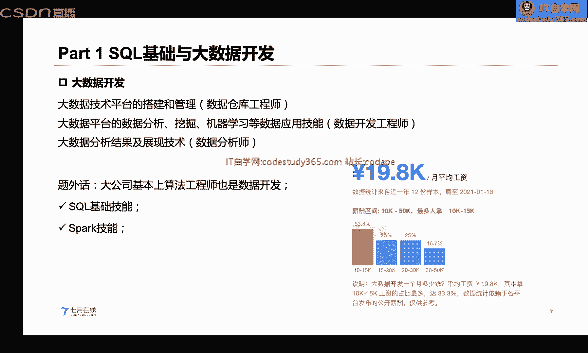


HTTP协议发送具体的SQL语句，通过SQL软件与底层数据库进行交互。SQL语言独立于具体的编程语言，但与数据库系统紧密相关。

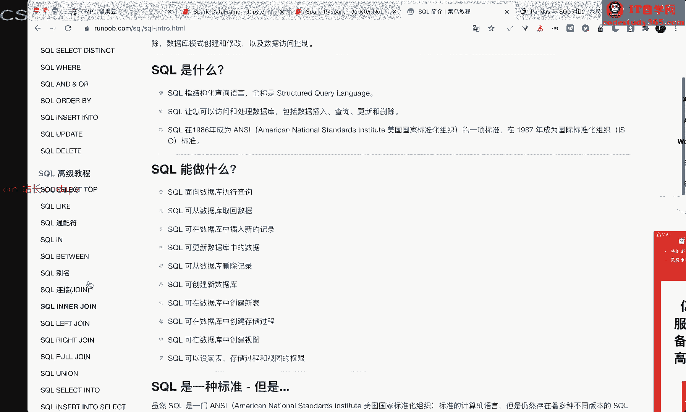

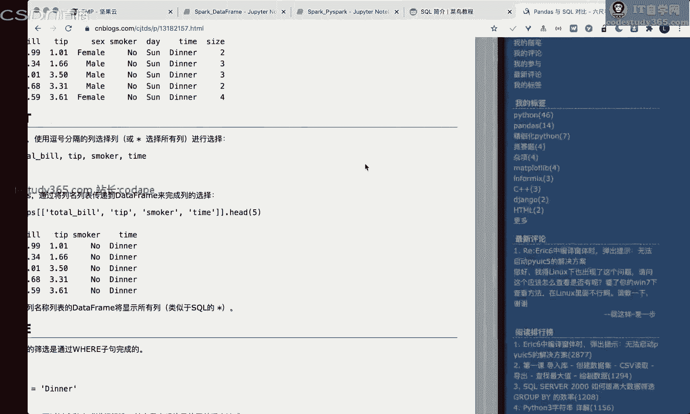

对于转行的同学，需要了解数据库是用于存储、管理和查询数据的关系系统。常见的关系型数据库有MySQL、SQL Server，此外还有非关系型数据库。数据库能够保证数据稳定存储，支持多用户并发操作，并具备事务回滚等特性。

在之前的课程中，我们使用了Pandas进行数据处理。Pandas的本质操作与SQL有许多相似之处，只是实现方式不同。例如，两者都能完成数据筛选、展示、删除、分组聚合以及多表合并等操作。

有同学可能只知道SQL的增删改查，但不清楚其在实际工作中的应用。这里举一个电商的例子：用户登录时，系统会校验用户名和密码，这些信息通常加密后存储在数据库中，通过SQL查询进行匹配。此外，统计用户年度总消费金额（如支付宝年度账单）也依赖于SQL查询，例如：
```sql
SELECT SUM(amount) FROM orders WHERE year = 2020;
```

在实际工作中，程序员（有时被称为“SQL Boy”）的核心任务之一就是将产品经理的业务需求，转化为具体的SQL查询逻辑。

### Pandas与SQL语法对比

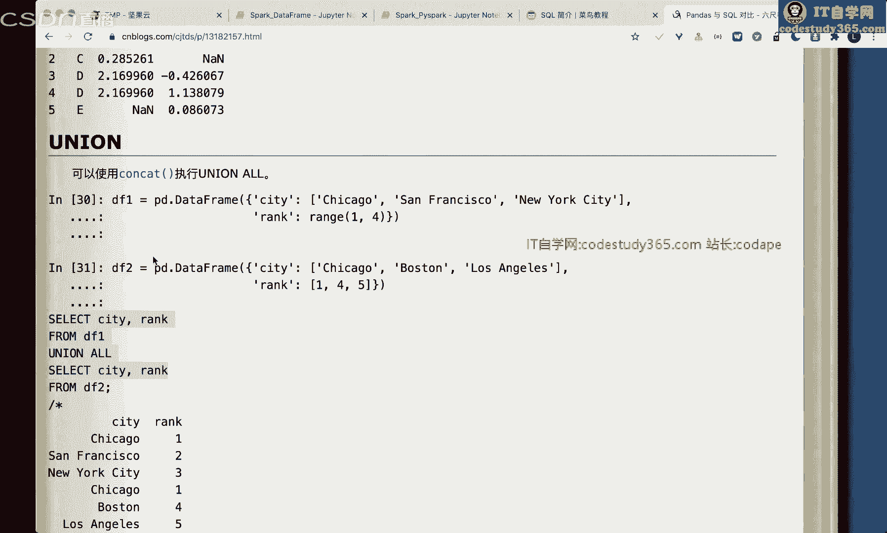

以下是Pandas操作与SQL语句的对比示例，帮助大家理解两者的异同。


**选择指定列并限制行数：**
*   **SQL语法：** `SELECT total_bill, tip, smoker, time FROM tips LIMIT 5;`
*   **Pandas语法：** `tips[['total_bill', 'tip', 'smoker', 'time']].head(5)`

**添加条件筛选：**
*   **SQL语法：** `SELECT * FROM tips WHERE time = 'Dinner' LIMIT 5;`
*   **Pandas语法：** `tips[tips['time'] == 'Dinner'].head(5)`

**多条件筛选：**
*   **SQL语法：** `SELECT * FROM tips WHERE time = 'Dinner' AND tip > 5;`

**分组聚合：**
*   **SQL语法：** `SELECT sex, COUNT(*) FROM tips GROUP BY sex;`
*   **说明：** `SELECT sex` 表示选择分组键，`COUNT(*)` 表示统计每个分组的行数。

**多列分组聚合：**
*   **SQL语法：** `SELECT smoker, day, COUNT(*), AVG(tip) FROM tips GROUP BY smoker, day;`

**表连接（内连接）：**
*   **SQL语法：** `SELECT * FROM df1 INNER JOIN df2 ON df1.key = df2.key;`

通过对比可以发现，Pandas通常用一个函数实现一个操作，而SQL则用一条语句完成。两者的核心逻辑是相通的。

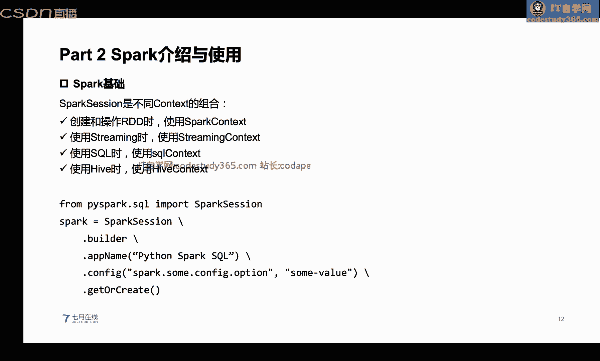

### 为何要学习SQL和Spark？

上一节我们对比了Pandas和SQL的语法，本节我们来看看学习这些工具的必要性。

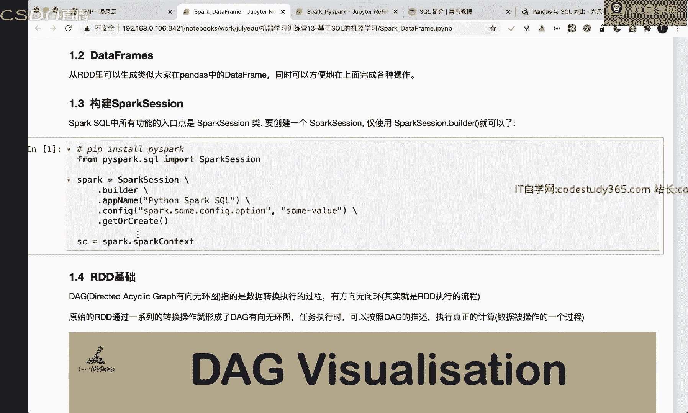

1.  **基础与面试要求：** SQL是基础技能，在算法、数据开发等岗位的面试中经常被考察。
2.  **大公司技术栈：** 大型互联网公司（如阿里）的算法工程师往往在大数据平台（而非单机Python环境）上进行开发，主要使用SQL或Spark等工具处理海量数据。
3.  **薪资与发展：** 大数据开发方向的薪资通常高于普通软件开发，且技能更具竞争力。

大数据开发岗位主要分为三类：
1.  **大数据开发平台与管理：** 如数据仓库工程师、数据运维。
2.  **大数据平台数据分析、挖掘与机器学习：** 即数据开发工程师或算法工程师，这也是本课程关注的重点。
3.  **大数据分析结果展示：** 如数据分析师。

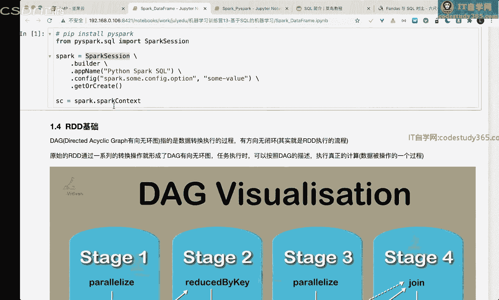

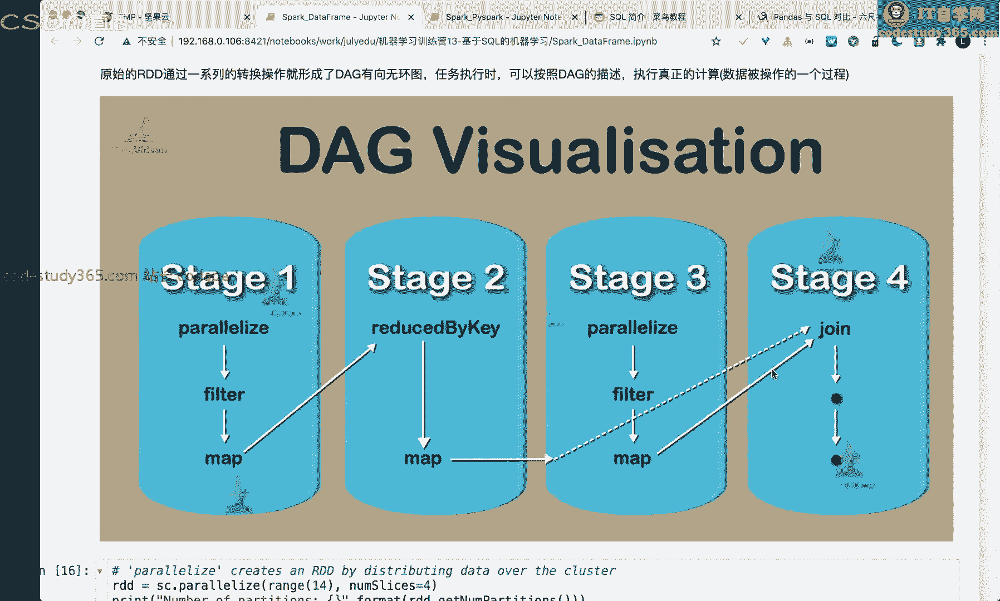

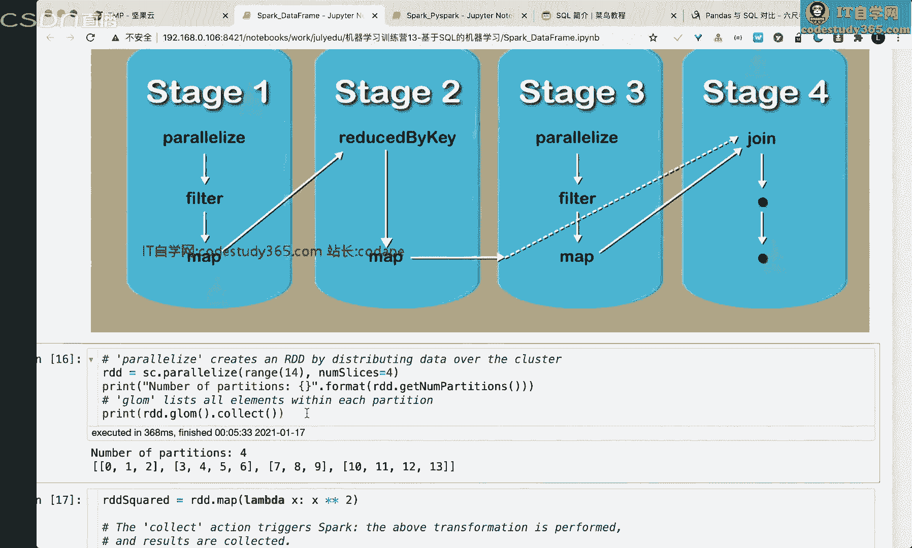

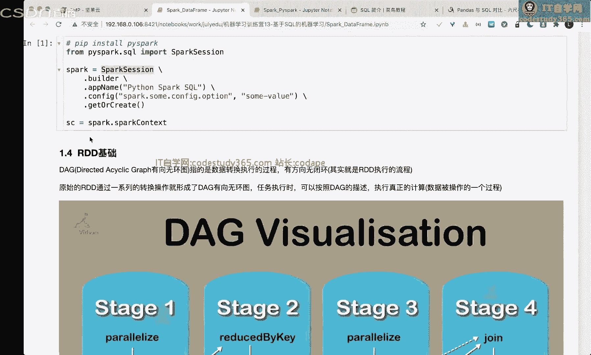

对于希望进入大型公司从事算法或数据开发的同学，掌握SQL和Spark技能是非常必要的。

---

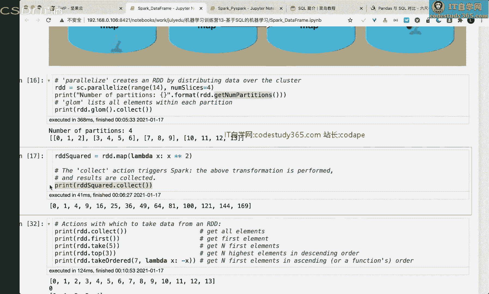

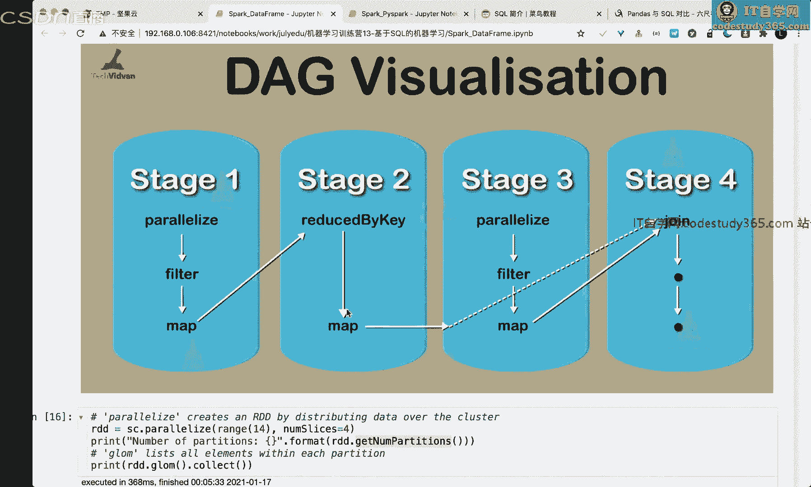

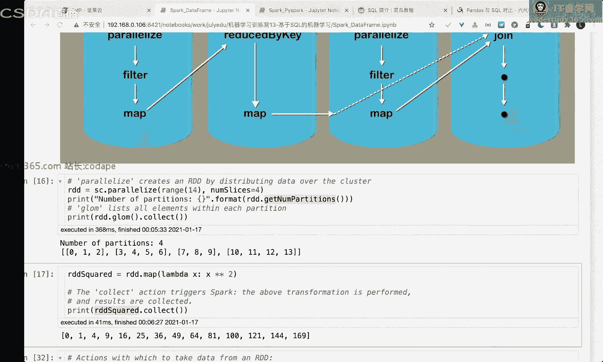

## 第二部分：Spark介绍与使用 ⚡

在了解了SQL的重要性后，我们引入一个强大的大数据处理框架——Spark。本节将介绍Spark的基本概念、优势及其核心组件。

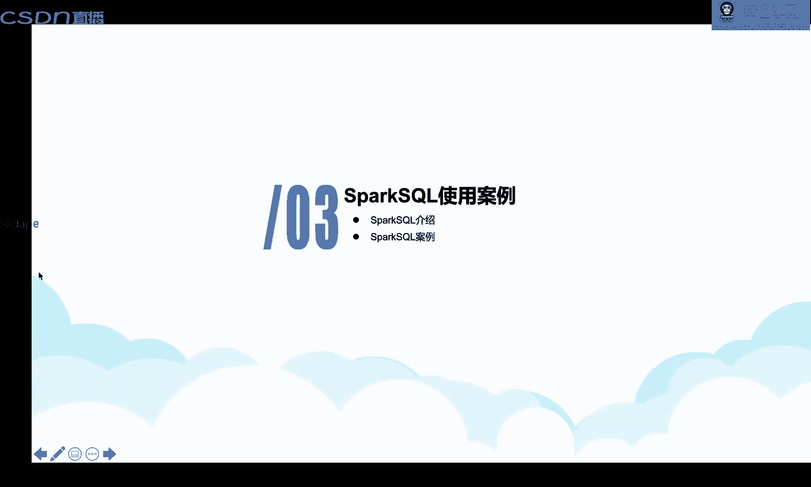


Spark是由加州大学伯克利分校开发的基于内存的并行计算框架，是目前流行的大数据计算框架之一。

**Spark的主要优点包括：**
*   **运行速度快：** 基于内存计算，速度比Hadoop MapReduce快10倍以上。
*   **易用性好：** 支持Scala、Java、Python、R等多种语言。
*   **生态完善：** 支持Spark SQL（交互式查询）、Spark Streaming（流计算）、MLlib（机器学习库）、GraphX（图计算库）等。
*   **数据源丰富：** 支持从CSV、JSON、MySQL、Hive等多种数据源读取数据。

**Spark与Hadoop对比：**
*   Spark将中间数据放在内存中，效率更高。
*   Spark通过RDD概念提供了更好的容错性。
*   Spark提供了更丰富的操作算子（如map、filter、reduceByKey等），而Hadoop需要编写复杂的MapReduce程序。

**Spark适用场景：**
1.  **复杂的批处理：** 处理时间跨度长（数十分钟到数小时）的离线任务，常用于数据报表生成。
2.  **基于历史数据的交互式查询：** 响应时间在十秒到数十分钟之间，类似交互式分析。
3.  **流式数据处理：** 处理源源不断的数据流，响应时间在几百毫秒到数秒之间，适用于实时推荐等场景。第三代框架Flink也专注于流处理。

**Spark核心概念：**
从Spark 2.0开始，主要使用`SparkSession`作为统一的入口，它整合了SparkContext、SQLContext、HiveContext等，用于操作RDD、SQL、Streaming等。

创建SparkSession的示例代码如下：
```python
from pyspark.sql import SparkSession
spark = SparkSession.builder \
    .appName("MyApp") \
    .config("spark.some.config.option", "some-value") \
    .getOrCreate()
```

---

## 第三部分：Spark核心概念与操作 🛠️

上一节我们介绍了Spark框架，本节我们将深入其两个核心概念：RDD和DataFrame，并通过代码演示其基本操作。

### RDD（弹性分布式数据集）

RDD是Spark最基础的数据抽象，代表一个不可变、可分区的元素集合，可以在集群中并行操作。

**RDD的特点：**
*   **基于内存：** 数据可以缓存在内存中，加快迭代计算。
*   **容错性：** 通过RDD的血缘关系（Lineage）记录转换过程，丢失数据时可自动恢复。
*   **惰性计算：** RDD的转换操作（如map、filter）是惰性的，只有遇到行动操作（如collect、count）时才会真正执行。这允许Spark进行整体优化。

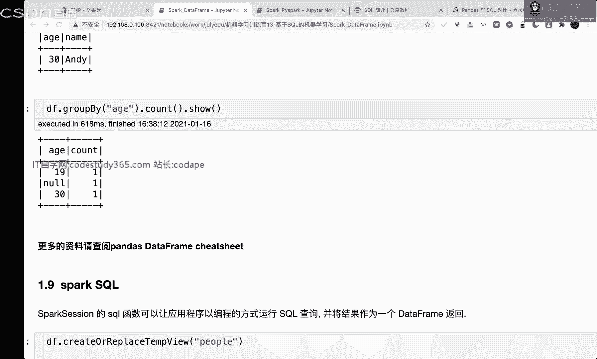


**创建RDD与基础操作：**
```python
# 通过并行化集合创建RDD
data = [1, 2, 3, 4, 5]
rdd = spark.sparkContext.parallelize(data, numSlices=4)

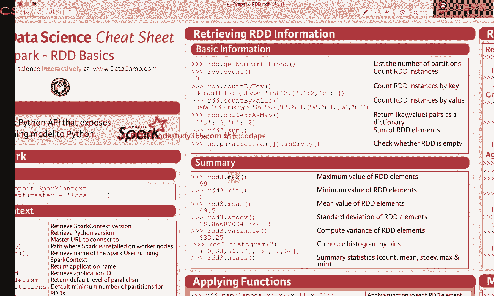

# 转换操作：每个元素乘以2（惰性执行）
rdd_double = rdd.map(lambda x: x * 2)
# 行动操作：触发计算并收集结果
print(rdd_double.collect())  # 输出: [2, 4, 6, 8, 10]

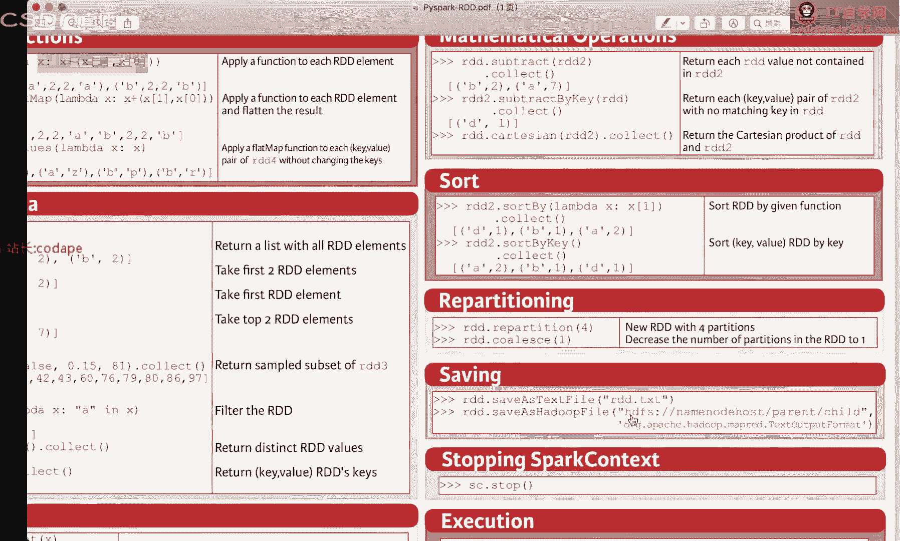

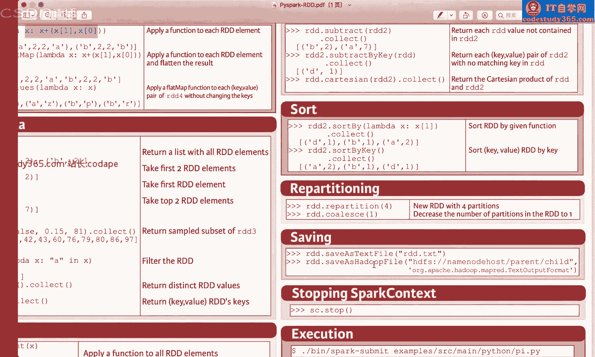

# 过滤操作
rdd_filtered = rdd.filter(lambda x: x > 3)
print(rdd_filtered.collect())  # 输出: [4, 5]

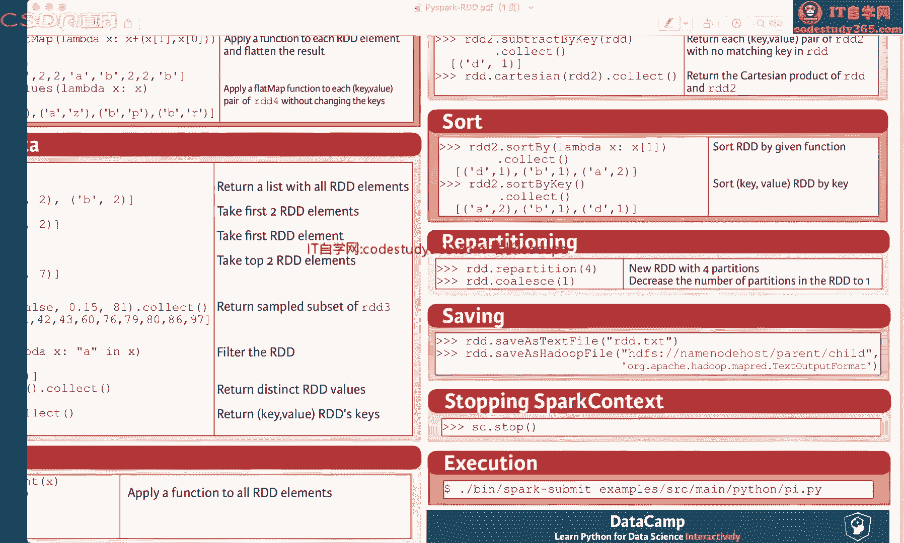


# 统计操作
print(rdd.count())      # 计数: 5
print(rdd.mean())       # 平均值: 3.0
```

**WordCount示例（经典案例）：**
```python
text_rdd = spark.sparkContext.parallelize(["hello spark", "hello world", "hello world"])
word_counts = text_rdd.flatMap(lambda line: line.split(" ")) \
                      .map(lambda word: (word, 1)) \
                      .reduceByKey(lambda a, b: a + b)
print(word_counts.collect())  # 输出: [('hello', 3), ('spark', 1), ('world', 2)]
```

### DataFrame

DataFrame是以RDD为基础构建的分布式数据表，具有明确的列名和数据类型（Schema），提供了更高级的数据操作接口，类似于Pandas DataFrame或数据库中的表。

**创建DataFrame：**
```python
# 从JSON文件创建
df = spark.read.json("path/to/people.json")
df.show()
# 输出示例：
# +----+-------+
# | age|   name|
# +----+-------+
# |null|Michael|
# |  30|   Andy|
# |  19| Justin|
# +----+-------+

# 查看Schema
df.printSchema()
# 输出：
# root
#  |-- age: long (nullable = true)
#  |-- name: string (nullable = true)
```

**DataFrame基本操作：**
```python
# 选择列
df.select("name").show()
df.select(df['name'], df['age'] + 1).show()

# 条件筛选
df.filter(df['age'] > 20).show()

# 分组聚合
df.groupBy("age").count().show()

# 排序
df.sort(df['age'].desc()).show()
```

**RDD与DataFrame互转：**
1.  **反射推断：** 通过样例类（Scala）或Row对象（Python）推断Schema。
    ```python
    from pyspark.sql import Row
    rdd = spark.sparkContext.textFile("people.txt")
    row_rdd = rdd.map(lambda line: line.split(",")).map(lambda p: Row(name=p[0], age=int(p[1])))
    df = spark.createDataFrame(row_rdd)
    ```
2.  **编程指定：** 明确定义Schema结构。
    ```python
    from pyspark.sql.types import StructType, StructField, StringType, IntegerType
    schema = StructType([
        StructField("name", StringType(), True),
        StructField("age", IntegerType(), True)
    ])
    df = spark.createDataFrame(row_rdd, schema)
    ```

---

## 第四部分：Spark SQL与机器学习案例 🤖

掌握了Spark的核心操作后，本节我们将学习如何使用Spark SQL进行数据查询，并完成两个完整的机器学习案例。

### Spark SQL

Spark SQL允许用户使用SQL语句来查询DataFrame中的数据，实现了SQL与Spark程序的无缝集成。

**使用示例：**
```python
# 将DataFrame注册为临时视图
df.createOrReplaceTempView("people")

# 执行SQL查询
sql_df = spark.sql("SELECT name, age FROM people WHERE age > 20")
sql_df.show()
```

Spark SQL的语法与标准SQL高度相似，支持SELECT、WHERE、GROUP BY、JOIN、ORDER BY等几乎所有常用子句。

### 机器学习案例一：垃圾邮件分类（文本分类）

本案例演示如何使用Spark MLlib构建一个文本分类管道，识别垃圾邮件。

**流程概述：**
1.  **数据读取与预览：** 读取包含邮件文本和标签的数据。
2.  **数据预处理：** 包括分词、去除停用词、特征提取（TF-IDF）。
3.  **标签编码：** 将字符串标签转换为数值。
4.  **构建机器学习管道：** 将预处理步骤和模型训练封装。
5.  **模型训练与评估：** 使用朴素贝叶斯算法进行分类。

**核心代码片段：**
```python
from pyspark.ml import Pipeline
from pyspark.ml.feature import Tokenizer, StopWordsRemover, HashingTF, IDF, StringIndexer
from pyspark.ml.classification import NaiveBayes
from pyspark.ml.evaluation import MulticlassClassificationEvaluator

# 1. 读取数据
df = spark.read.csv("spam_data.csv", inferSchema=True, sep='\t')
df = df.withColumnRenamed("_c0", "label").withColumnRenamed("_c1", "text")

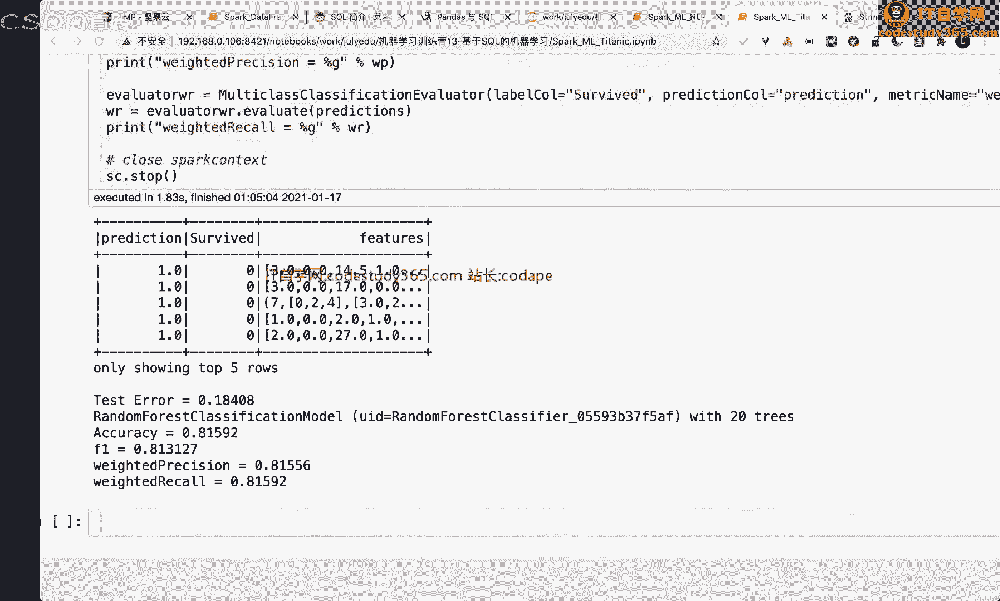


# 2. 定义管道阶段
tokenizer = Tokenizer(inputCol="text", outputCol="words")
remover = StopWordsRemover(inputCol="words", outputCol="filtered_words")
hashing_tf = HashingTF(inputCol="filtered_words", outputCol="raw_features")
idf = IDF(inputCol="raw_features", outputCol="features")
label_indexer = StringIndexer(inputCol="label", outputCol="indexed_label")

# 3. 定义模型
nb = NaiveBayes(labelCol="indexed_label", featuresCol="features")

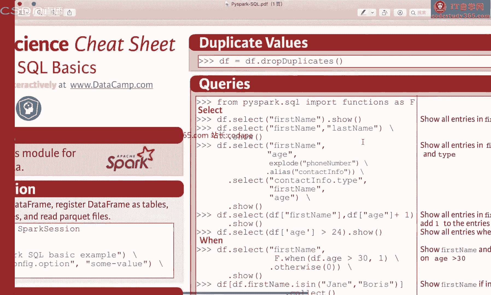

# 4. 构建管道
pipeline = Pipeline(stages=[label_indexer, tokenizer, remover, hashing_tf, idf, nb])

# 5. 拆分数据集并训练
train_df, test_df = df.randomSplit([0.7, 0.3])
model = pipeline.fit(train_df)

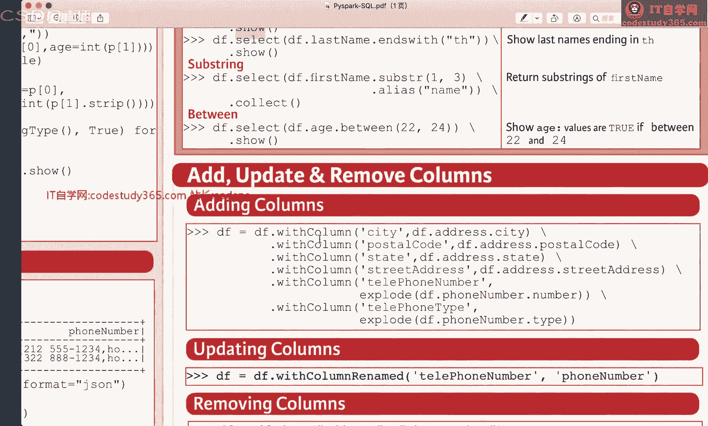

# 6. 预测与评估
predictions = model.transform(test_df)
evaluator = MulticlassClassificationEvaluator(labelCol="indexed_label", predictionCol="prediction", metricName="accuracy")
accuracy = evaluator.evaluate(predictions)
print(f"测试集准确率: {accuracy}")
```

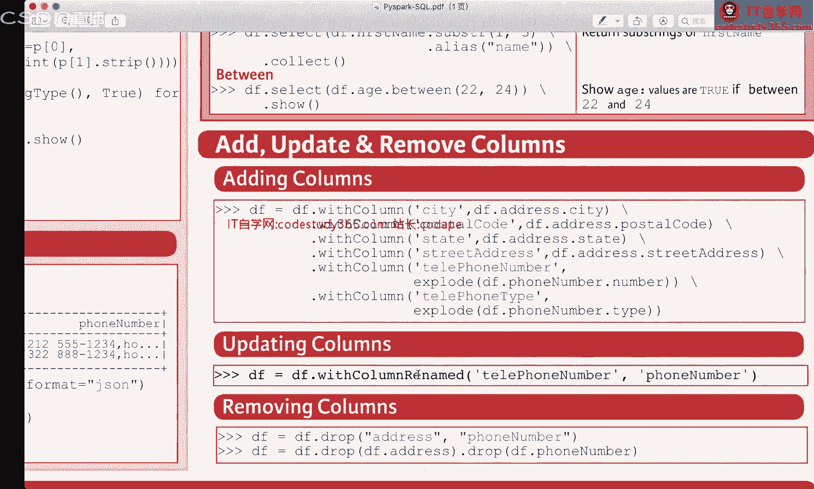

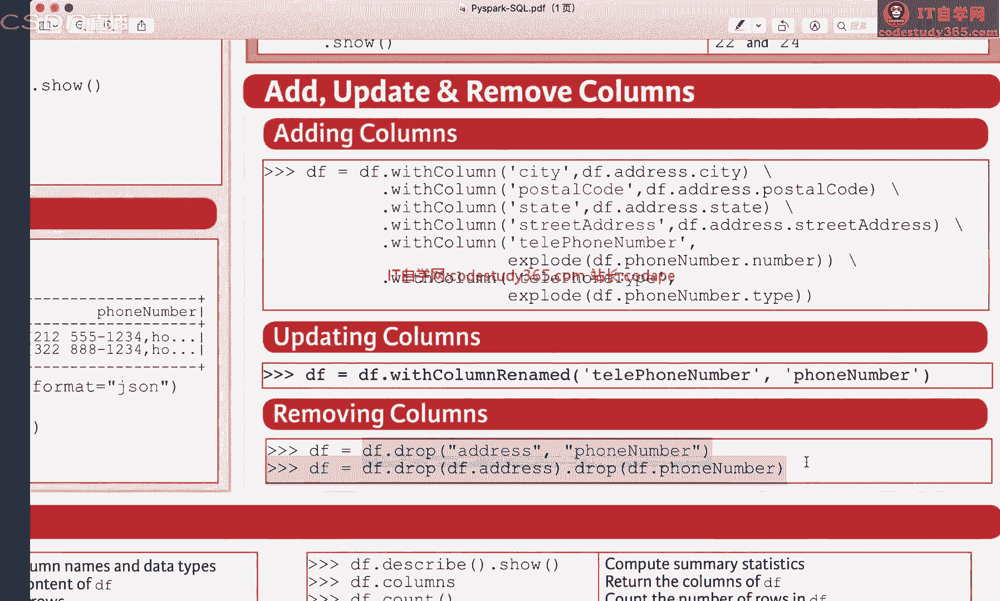

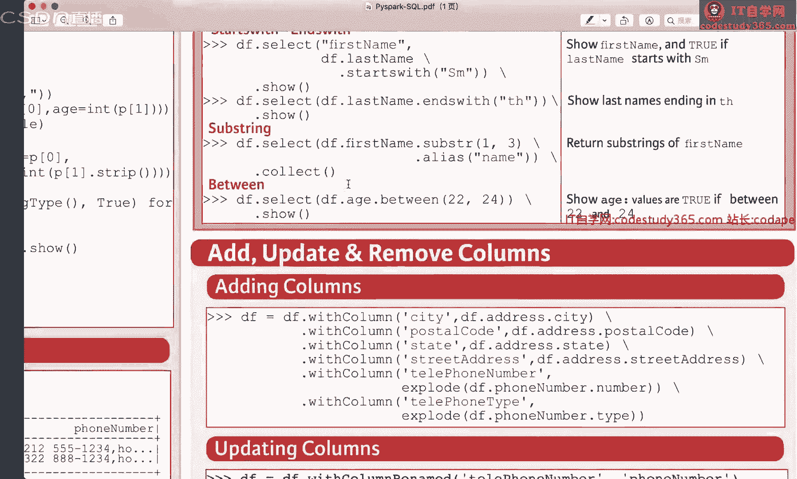

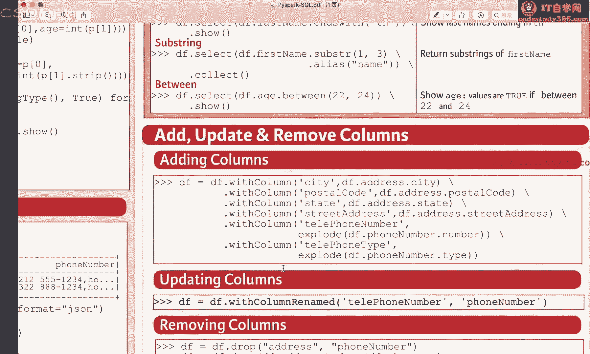

**管道优势：**
使用`Pipeline`可以将数据预处理和模型训练等多个步骤封装成一个工作流，代码更简洁，且便于Spark进行整体优化。

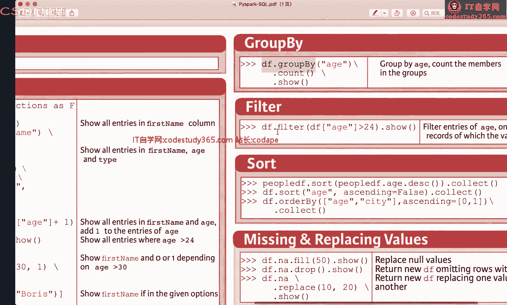

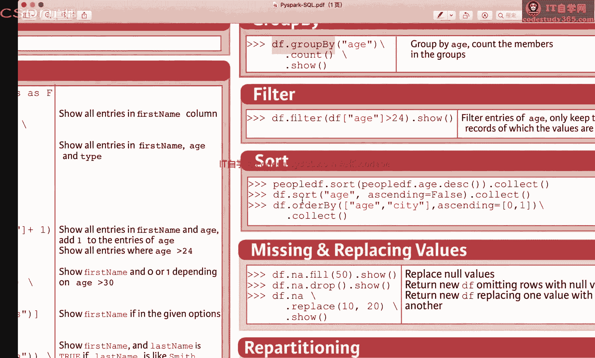

### 机器学习案例二：泰坦尼克号生存预测

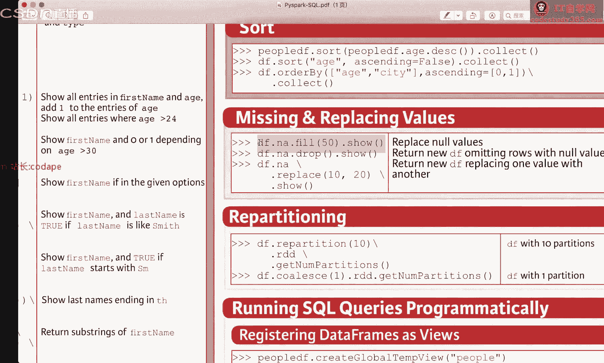

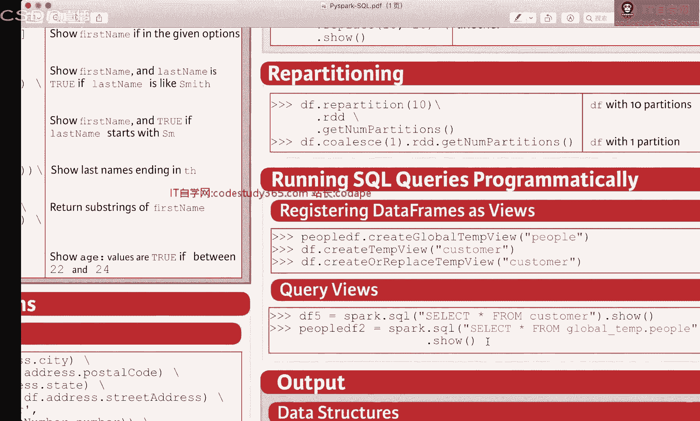

本案例使用Spark处理结构化数据，并训练随机森林模型预测乘客生存情况。

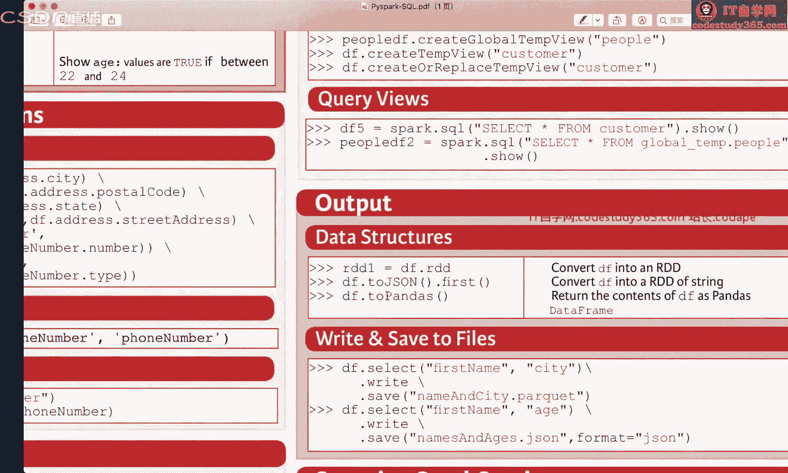

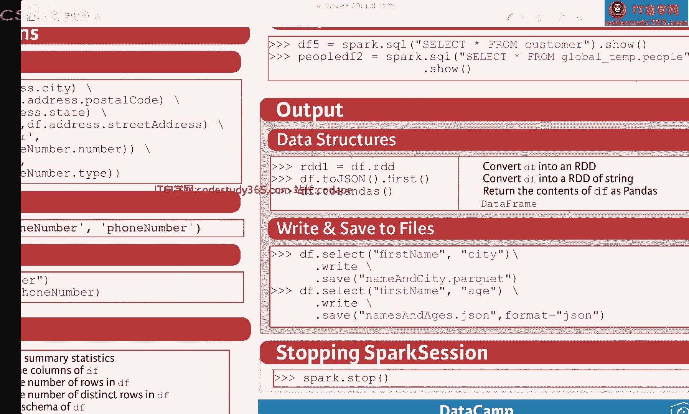

**流程概述：**
1.  **数据读取与清洗：** 处理缺失值，进行特征选择。
2.  **特征工程：** 对类别型特征（如性别）进行标签编码或独热编码。
3.  **数据集划分。**
4.  **模型训练与评估：** 使用随机森林算法。

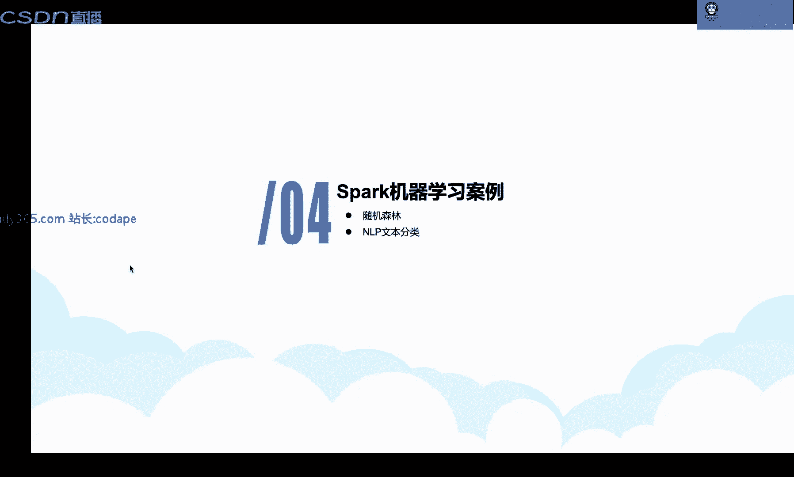


**核心代码片段：**
```python
from pyspark.ml.feature import VectorAssembler, StringIndexer
from pyspark.ml.classification import RandomForestClassifier

# 1. 读取数据，选择特征列
df = spark.read.csv("titanic.csv", header=True, inferSchema=True)
selected_df = df.select("Survived", "Pclass", "Sex", "Age", "Fare").na.drop()

# 2. 特征工程：将性别字符串转换为数值
indexer = StringIndexer(inputCol="Sex", outputCol="SexIndex")
df_indexed = indexer.fit(selected_df).transform(selected_df)

# 3. 将特征列组合成特征向量
assembler = VectorAssembler(
    inputCols=["Pclass", "SexIndex", "Age", "Fare"],
    outputCol="features"
)
df_assembled = assembler.transform(df_indexed).select("Survived", "features")

# 4. 拆分与训练
train_df, test_df = df_assembled.randomSplit([0.7, 0.3])
rf = RandomForestClassifier(labelCol="Survived", featuresCol="features", numTrees=100)
model = rf.fit(train_df)

# 5. 预测与评估
predictions = model.transform(test_df)
# ... 使用评估器计算准确率、AUC等指标
```

---

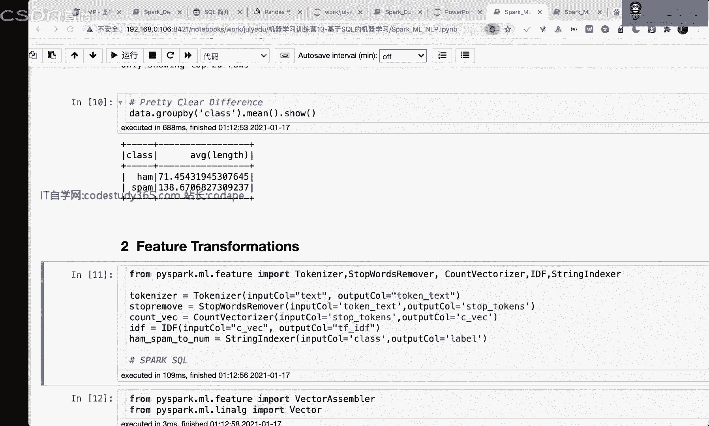


## 总结与建议 📝

本节课我们一起学习了基于SQL和Spark的机器学习流程。我们从SQL的基础知识及其在大数据开发中的重要性讲起，对比了Pandas与SQL的操作。接着，我们深入介绍了Spark框架，包括其核心概念RDD和DataFrame，并通过代码演示了基本操作。最后，我们完成了两个使用Spark MLlib进行机器学习的实战案例。

**核心要点总结：**
1.  **SQL是基础：** 无论是数据库管理还是大数据查询（Hive SQL），SQL都是必须掌握的技能。
2.  **工具语法相通：** Pandas、SQL和Spark对数据的操作（筛选、聚合、连接）在逻辑上高度相似，主要区别在于语法形式。
3.  **Spark是重要框架：** Spark是一个成熟的大数据处理和机器学习框架，对于从事ETL、数据开发或希望进入大公司从事算法工作的同学，掌握Spark非常有价值。

**学习建议：**
*   本节课只是一个入门引导，要熟练掌握Spark还需要大量的练习和实践。
*   建议按照课程提供的Notebook和速查表，亲自运行和修改代码，加深理解。
*   关注Spark的官方文档和社区资源，如Spark官方教程，以深入学习RDD优化、性能调优等高级主题。

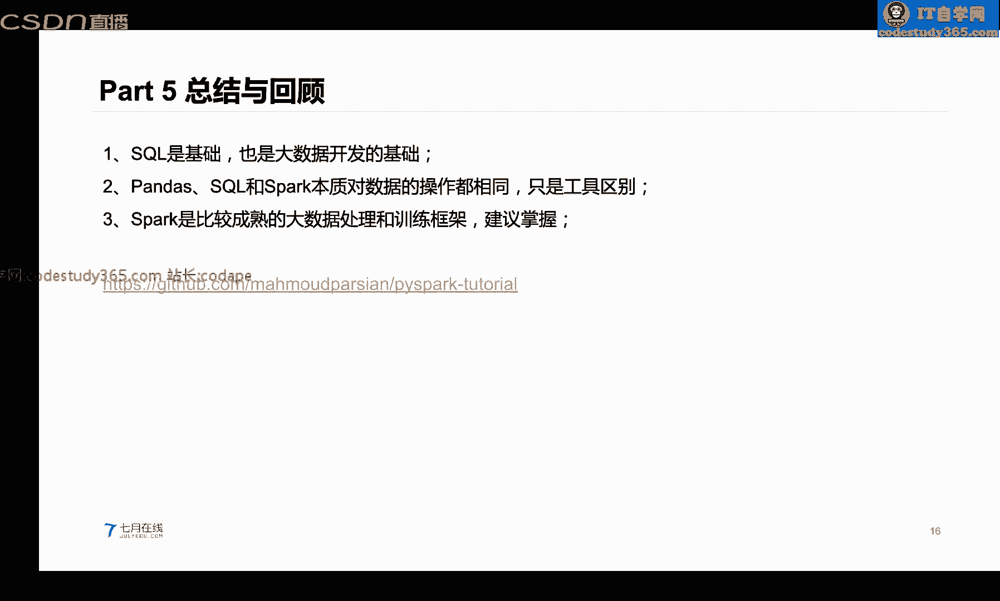


对于有志于在大数据领域发展的同学，扎实的SQL功底和Spark实践能力将成为你求职和工作中强有力的武器。