# 机器学习高阶实践教程：可视化、特征工程与案例解析 📊


## 课程概述

在本节课中，我们将深入学习机器学习的高阶实践内容。我们将重点探讨如何通过深入的数据分析（EDA）来理解数据，掌握多种特征筛选方法，并通过具体的金融风控和文本匹配案例，学习如何将理论知识应用于解决实际问题。课程旨在帮助初学者建立从数据理解到模型构建的完整工作流程。

---

## 第一部分：探索性数据分析（EDA）🔍

在之前的课程中，我们已经学习了许多机器学习算法和基础实践。然而，要真正解决一个实际问题，我们还需要对数据有更深入的理解。本节课程将重点展开高级实践中的关键步骤：深入的可视化分析与特征筛选。

探索性数据分析（EDA）是数据挖掘和建模过程中持续进行的重要环节。它是理解数据的最佳形式。在许多互联网公司，算法工程师的大量工作并非直接建模，而是构建和准备数据。数据可能原始、非规整或散布在多个表格中。建模前，我们需要将这些数据汇总、构建成规整的表格，这个过程需要业务知识的指导。

数据分析帮助我们理解数据内部的分布规律，从而辅助建模。在具体实践中，数据清洗、处理和探索性分析占据了算法工程师70%以上的工作时间，是建模中最耗费精力也最能挖掘关键信息的环节。不同的人在相同数据和模型下得到不同精度的关键，就在于对数据集的有效理解和处理。

### EDA的核心步骤

以下是进行探索性数据分析的标准流程：

1.  **读取数据并分析数据质量**：检查数据集是否规整（如二维表格），是否存在噪音。
2.  **深入分析每个变量**：从整体表格分析转向对每一列（变量）的深入分析。
3.  **分析变量关键属性**：
    *   **类型**：变量的数据类型会影响编码方式。
    *   **缺失值**：检查是否存在缺失值，这在现实中很常见。
    *   **异常值**：对于数值型变量，可通过箱线图等方法找出；对于类别型变量，可检查出现次数过少的类别。
    *   **重复值**：检查列向量中的取值是否完全唯一。
    *   **分布**：分析变量的整体分布情况（是否均匀等）。
4.  **分析变量与标签的关系**：对于一个包含标签的数据集，需要分析每个变量与目标标签之间是否存在逻辑关系或相关性。
5.  **得出分析结论**：基于以上分析，决定变量是否需要转换、筛选或清洗，以及如何编码。

### 变量与标签的关系分析

在分析变量与标签的关系时，如果从相关性系数发现它们强相关，可以进一步通过统计或可视化进行深入分析。

例如，假设变量X1是类别型（取值为0,1,2），标签Y是数值型（0-100）。若计算发现两者强相关，可以进行分组统计：按X1取值分组，计算每组下标签Y的均值，并进行可视化。这样可以清晰看到X1的不同取值如何影响Y的分布。

类似地，也可以分析变量与变量之间的关系，例如连续型与连续型变量、离散型与离散型变量之间的关系，以及变量分布的正态性等。

### EDA的产出与价值

通过完整的EDA，我们可以得出以下关键结论，指导后续建模：

*   **模型选择**：根据数据特征选择模型。例如，数据中类别型特征多时，树模型较好；数值型特征多时，线性模型或神经网络可能更合适。
*   **数据处理策略**：确定如何对数据集进行编码、转换和清洗。
*   **新特征构建**：基于业务逻辑和数据分析，从原始特征中构建新的特征。例如，在房价预测案例中，可以构建“房屋价格与同小区均价差值”等特征。
*   **特征有效性验证**：通过可视化或统计方法验证新构建的特征与标签的关系，从而确认特征构建思路的有效性。

**核心思想**：EDA的本质是挖掘数据字段内在的规律和含义。我们需要对单个变量、变量与标签、以及变量之间的关系进行分析，从而将“不会说话”的数据转化为可指导建模的洞察。

### 数据可视化方法

进行数据分析时，有多种可视化方法可供选择，不同的图表用于体现不同的信息：

*   **折线图**：用于展示随时间变化的趋势（X轴为时间）。
*   **柱状图**：用于比较不同类别的数据（X轴为类别）。
*   **其他类型**：还包括比较分析、分布分析、构成分析、联系分析等图表。

在Python环境中，常用的可视化工具包括Matplotlib、Seaborn，以及支持交互的高阶库如Plotly、Bokeh等。

---

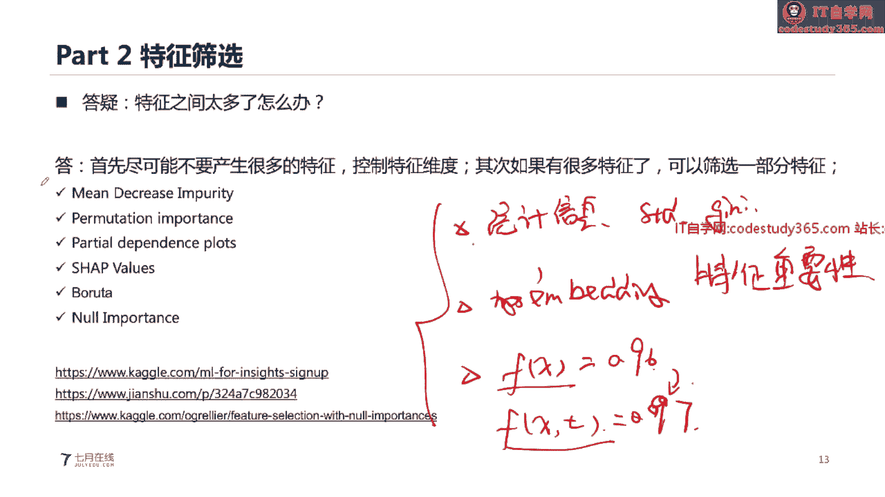

## 第二部分：特征筛选方法 🎯


上一节我们介绍了如何通过EDA理解数据，本节我们来看看如何从理解后的数据中筛选出最有效的特征。特征筛选是机器学习中非常关键的环节，对于初学者可能有一定难度。

特征筛选是指从原始特征集中选择一部分特征参与模型训练。例如，从20个特征中只选择10个。筛选后的特征集可能会影响模型精度，这种影响可能是正向的，也可能是负向的。

### 特征筛选的必要性

在构建特征时，我们可能会衍生出大量新特征（例如通过分组聚合）。然而，特征数量增加并不总能提升模型精度，有时反而会导致精度下降或训练速度变慢。由于计算资源有限，我们需要用有限的特征进行高效训练。

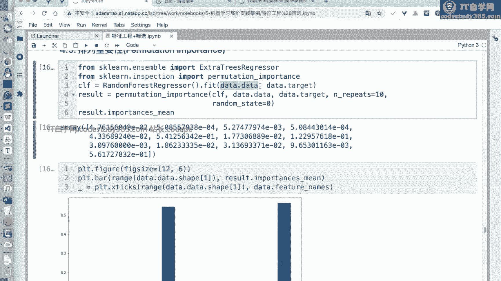


因此，我们需要：1）在构建特征时控制维度；2）如果已有大量特征，则通过筛选方法选择有效子集。从20个特征中选16个，其组合数量（搜索空间）非常大（C(20,16)），因此特征筛选本身是一个具有挑战性的优化问题。

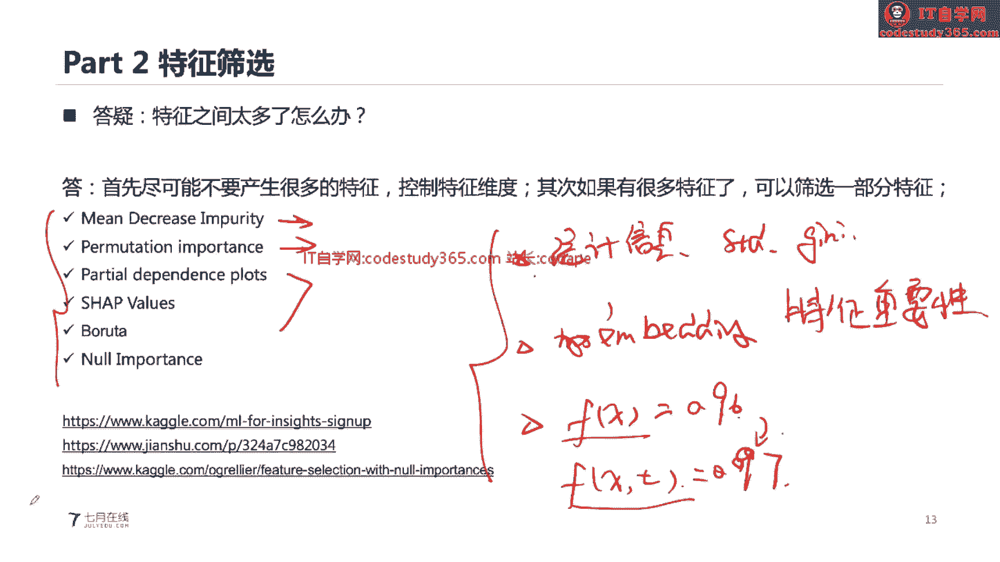

### 特征筛选的三大类方法

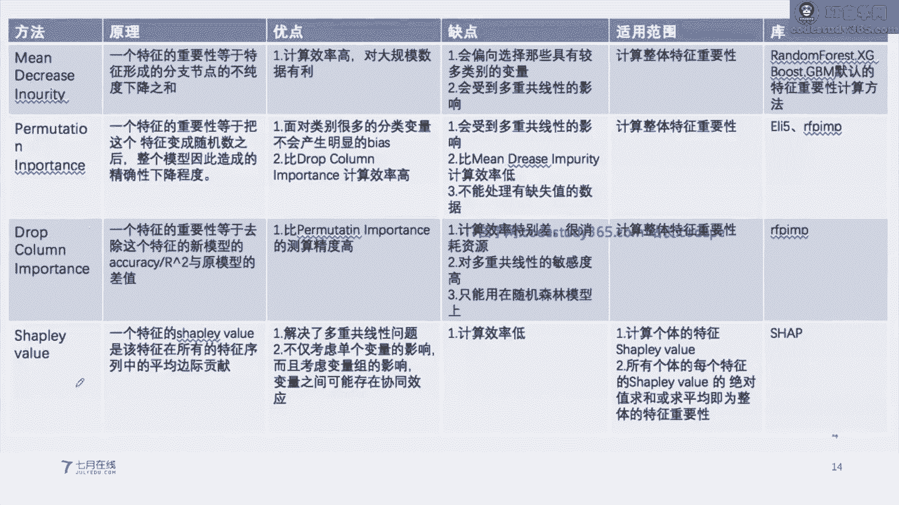

在机器学习教材中，特征筛选方法通常分为三类：

1.  **过滤式**：基于统计信息进行筛选，例如基于方差、信息熵、基尼指数等。
2.  **嵌入式**：基于模型嵌入进行筛选，利用模型训练后输出的特征重要性进行选择。
3.  **包裹式**：通过迭代方法进行筛选，通过判断添加或删除某个特征后模型精度的变化来决定特征去留。

### 具体的特征筛选技术

在实践中，我们可以使用多种技术来评估特征重要性并进行筛选：

*   **基于方差筛选**：移除方差过小的特征，因为它们包含的信息量少。
    ```python
    from sklearn.feature_selection import VarianceThreshold
    selector = VarianceThreshold(threshold=0.01) # 移除方差小于0.01的特征
    X_new = selector.fit_transform(X)
    ```
*   **基于相关性筛选**：计算特征与标签的相关性（如皮尔逊系数、互信息），保留相关性强的特征。
*   **基于模型系数**：对于线性模型，特征的权重（系数）大小可以反映其重要性。
*   **排列重要性**：通过打乱某一特征的值，观察模型精度下降的程度来评估该特征的重要性。下降越多，特征越重要。
*   **SHAP重要性**：一种基于博弈论的特征重要性计算方法，能更精确地反映每个特征对模型输出的贡献。

### 实战代码示例：特征重要性分析

在Python的`scikit-learn`库中，可以方便地进行特征筛选。例如，树模型（如随机森林）自带`feature_importances_`属性来衡量特征重要性。

```python
from sklearn.ensemble import RandomForestClassifier
import numpy as np

# 假设 X_train, y_train 是训练数据和标签
model = RandomForestClassifier()
model.fit(X_train, y_train)

# 获取特征重要性
importances = model.feature_importances_
indices = np.argsort(importances)[::-1] # 按重要性降序排列

# 打印最重要的特征
print("Feature ranking:")
for f in range(X_train.shape[1]):
    print(f"{f + 1}. feature {indices[f]} ({importances[indices[f]]})")
```

通过上述方法，我们可以筛选出重要性最高的特征，移除重要性低的特征，从而简化模型并可能提升性能。

---

## 第三部分：机器学习案例实战流程 🚀

前面两节我们分别学习了数据探索和特征筛选，本节我们将这些知识整合到一个完整的机器学习项目流程中。虽然不同数据的建模流程有所差异，但整体可以概括为以下几个步骤：

1.  **理解任务与背景**：明确具体任务、评分标准和时间限制。
2.  **数据理解与探索**：对数据集进行初步分析和EDA，理解数据是否需要处理。
3.  **特征工程**：对数据进行转换、构建新特征，并进行特征筛选。
4.  **模型构建**：选择模型、训练模型、验证模型并进行超参数调优。
5.  **预测与提交**：在测试集上进行预测并输出结果。

结构化数据挖掘（如表格数据）有许多公开比赛案例可供学习。接下来，我们将通过一个具体的金融风控案例来详细讲解。

---

## 第四部分：金融风控案例实战 💳

本节我们将通过一个真实的金融风控比赛案例，演示如何将前述流程应用于结构化数据。案例背景是基于消费金融场景，构建风险控制模型来预测用户贷款后是否会违约。这是一个二分类问题，通常使用AUC值进行评估。

### 数据特点与挑战

该案例数据具有以下难点：
*   **高维度**：原始特征有几百维。
*   **类型混合**：包含类别型和数值型特征，量纲不统一。
*   **匿名性**：字段含义未知，增加了特征构建和验证的难度。

因此，建模的核心在于通过人工特征工程，从数据中找到有效的特征，剔除无效特征，并将数据转换为最有效的表现形式。

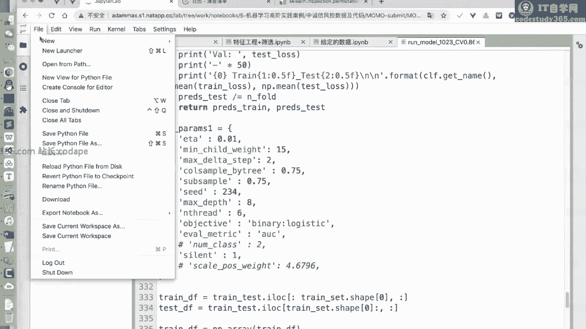

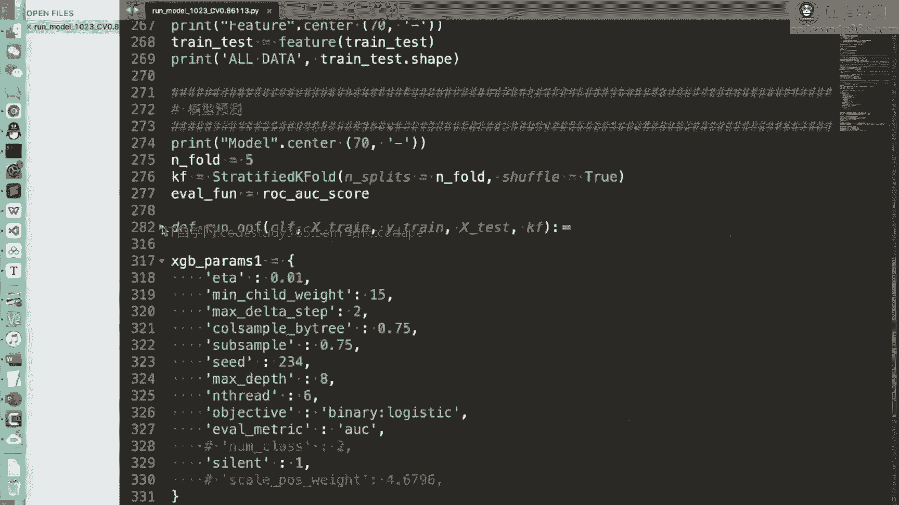

### 实战步骤分解

**第一步：缺失值分析**
通过可视化训练集和测试集的缺失值比例，可以发现：
1.  训练集和测试集缺失情况分布一致，表明数据同分布，这对建模有利。
2.  部分特征（尤其是第三方征信特征）缺失严重（比例接近1），可考虑剔除。

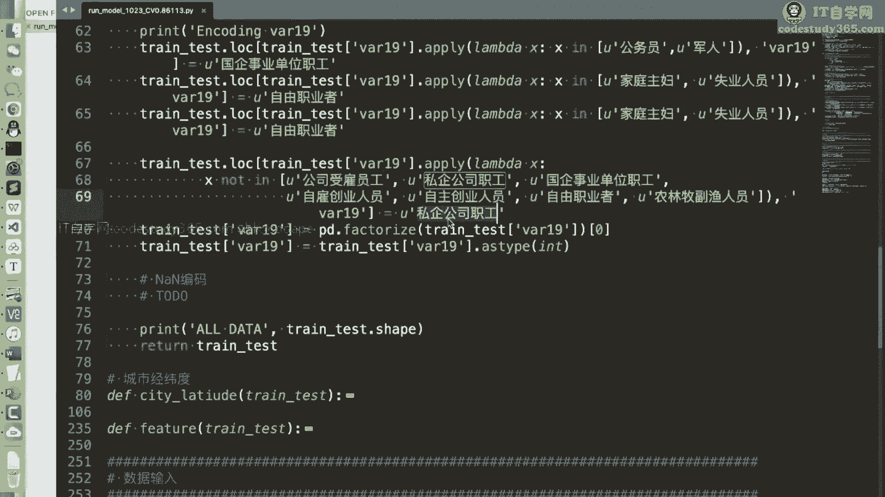

**第二步：特征相关性分析**
将特征按基础信息、通话信息、第三方征信分组，绘制特征间相关性热力图。可以发现：
1.  同类特征内部存在强相关性。
2.  不同类特征之间相关性较弱。
3.  部分特征几乎完全重复。

**第三步：特征清洗与筛选**
基于以上分析，进行数据清洗：
1.  **剔除缺失严重的列**：缺失比例大于97%的列。
2.  **剔除低方差列**：信息量小的特征。
3.  **剔除分布不一致的列**：在训练集和测试集上取值分布差异过大的特征。

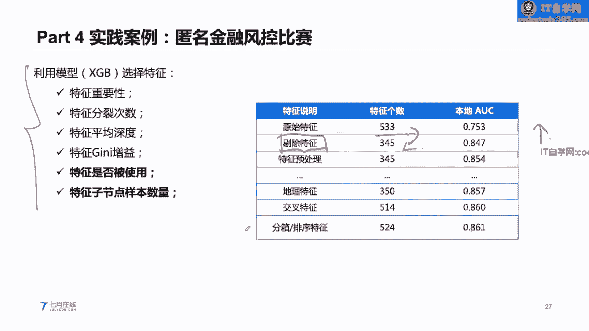

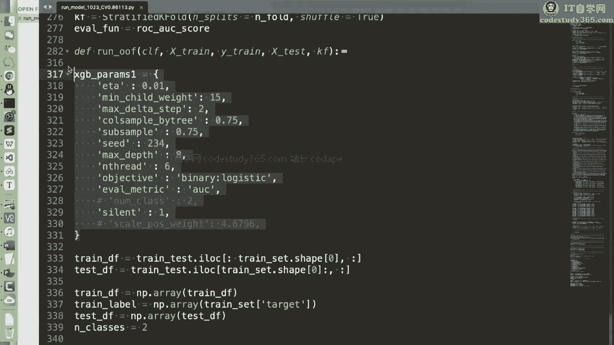

**第四步：特征构建与编码**
1.  **地理位置信息提取**：从匿名字段中推断并提取省份、城市等信息，进行`Target Encoding`（按省份分组计算违约率均值）。
2.  **连续特征离散化**：通过可视化发现某些连续特征可明显分层，将其转换为离散值。
3.  **构建交叉特征**：通过散点图分析，发现某些特征组合能更好区分违约用户。例如，构建特征A与特征B的比值或差值作为新特征。

**第五步：迭代优化与结果**
通过以上步骤，模型精度得到显著提升：
*   原始533维特征 -> 筛选后300+维特征：AUC从0.75提升至0.847。
*   加入特征预处理和编码：AUC继续提升。
*   加入地理位置和交叉特征：AUC进一步提升。

**代码结构建议**：
将数据处理步骤封装成函数，使代码模块化、清晰易读。主要函数包括：数据读取、预处理（处理缺失、方差、分布）、特征工程（地理位置编码、交叉特征、Target Encoding）、模型训练与验证。

```python
# 示例：数据预处理函数框架
def preprocess_data(train_df, test_df):
    # 1. 合并数据，统一处理
    combined = pd.concat([train_df, test_df])
    # 2. 剔除高缺失率列
    combined = drop_high_missing_cols(combined, threshold=0.97)
    # 3. 剔除低方差列
    combined = drop_low_variance_cols(combined)
    # 4. 剔除分布不一致列
    combined = drop_inconsistent_cols(combined, train_len=len(train_df))
    # 5. 返回处理后的训练集和测试集
    return combined.iloc[:len(train_df)], combined.iloc[len(train_df):]
```

---

## 第五部分：文本匹配案例实战 📝

除了结构化数据，我们也简要介绍一个非结构化的文本案例：Quora重复问题检测。任务是判断两个句子是否表达相同含义。

### 方法一：传统机器学习方法（特征工程 + 树模型）
1.  **人工特征提取**：
    *   统计特征：两个句子的共有单词比例、句子长度、单词个数等。
    *   文本特征：是否包含问号、特殊符号、数字、大写字母比例等。
    *   相似度特征：计算两个句子的TF-IDF向量余弦相似度。
2.  **建模**：将上述特征作为输入，使用XGBoost等树模型进行分类。

### 方法二：深度学习方法（词向量 + 神经网络）
1.  **文本预处理**：将句子分词，转换为数值序列，并进行填充/截断到相同长度。
2.  **词向量表示**：使用预训练词向量（如GloVe）将每个单词转换为稠密向量。
3.  **构建神经网络模型**：
    *   输入：两个句子的词向量序列。
    *   特征提取：通过LSTM/GRU层获取句子表示。
    *   交互与匹配：计算两个句子表示的差值、点积等，拼接后输入全连接层。
    *   输出：通过Sigmoid层进行二分类。
4.  **优点**：深度学习模型能自动学习更复杂的语义特征，通常在此类任务上获得比传统方法更高的精度。

**核心对比**：
*   **方法一**：依赖人工特征工程，可解释性强，计算效率高。
*   **方法二**：依赖数据驱动，自动学习特征，能捕捉复杂模式，精度通常更高。

---

## 课程总结 🎓

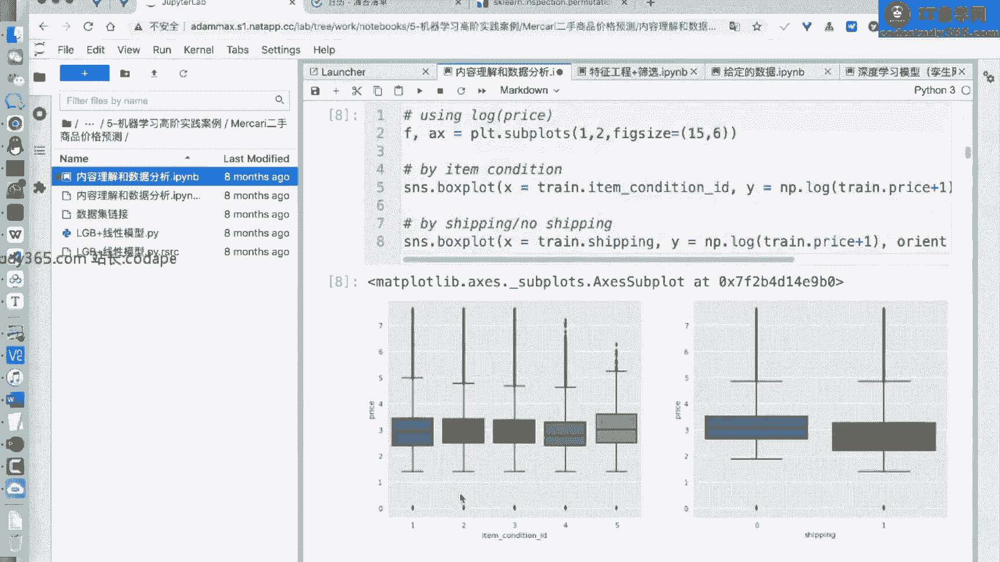

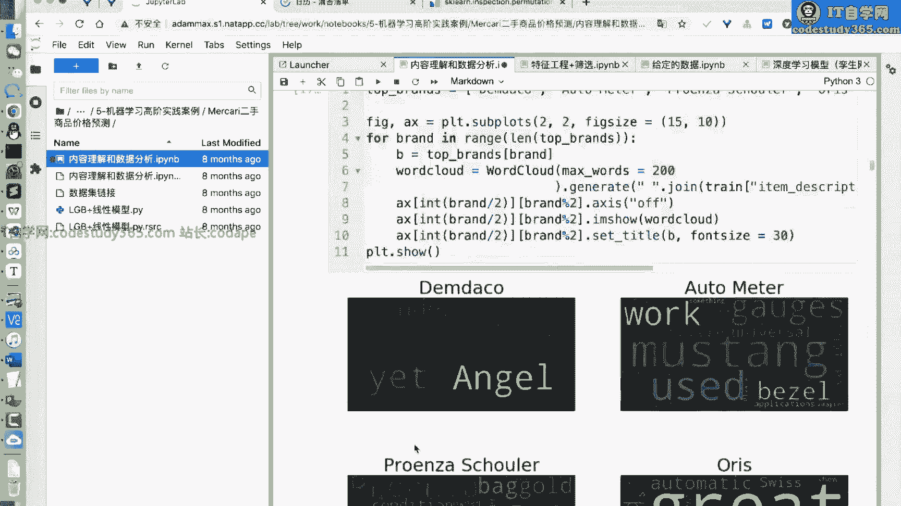

本节课我们一起学习了机器学习的高阶实践内容：

1.  **探索性数据分析**：我们深入理解了EDA在建模中的核心地位，学习了如何通过质量检查、单变量分析、变量与标签关系分析来挖掘数据洞察，并指导特征工程和模型选择。
2.  **特征筛选方法**：我们掌握了过滤式、嵌入式、包裹式三大类特征筛选方法，并学习了基于方差、相关性、模型重要性、排列重要性等具体技术来优化特征集。
3.  **完整项目流程**：我们梳理了从任务理解、数据探索、特征工程、模型构建到预测的标准化机器学习流程。
4.  **实战案例解析**：
    *   通过**金融风控案例**，我们演练了如何处理高维、匿名表格数据，包括缺失值分析、相关性分析、特征清洗、构建与编码，并看到了每一步对模型精度的提升。
    *   通过**文本匹配案例**，我们对比了基于特征工程的传统方法和基于深度学习的端到端方法，理解了不同数据形态下的建模策略。

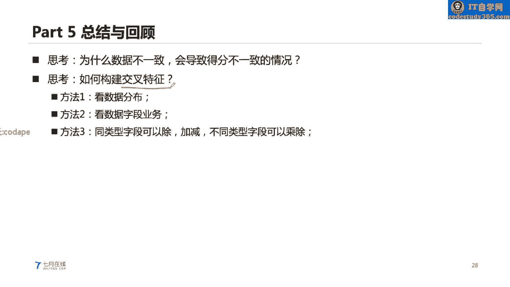

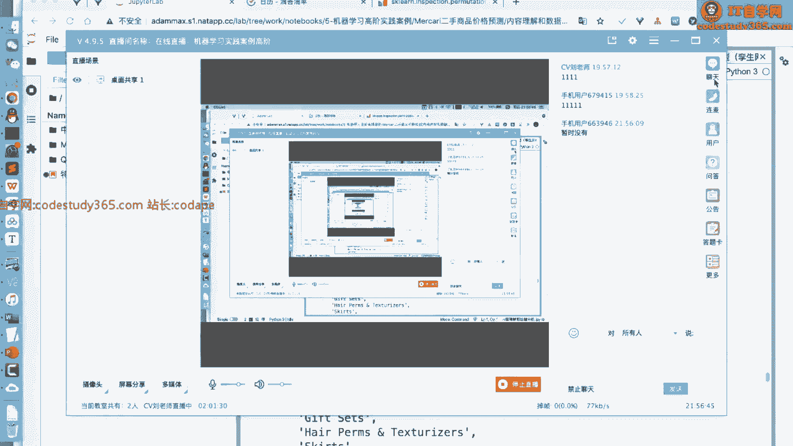

希望各位同学结合课后提供的代码，进一步巩固和实践这些内容。机器学习实践能力的提升离不开对数据的深刻理解和反复的动手实验。