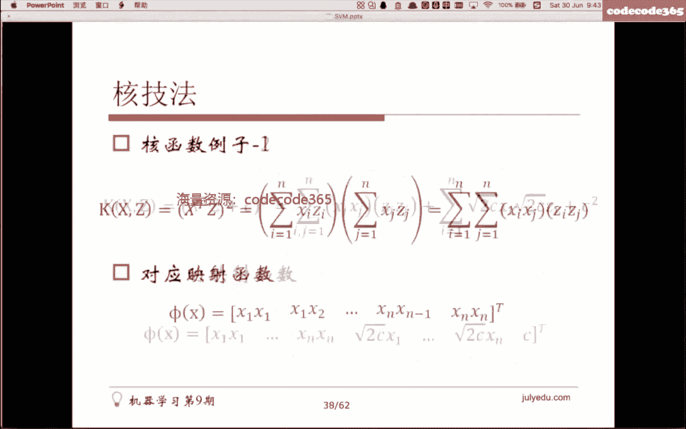
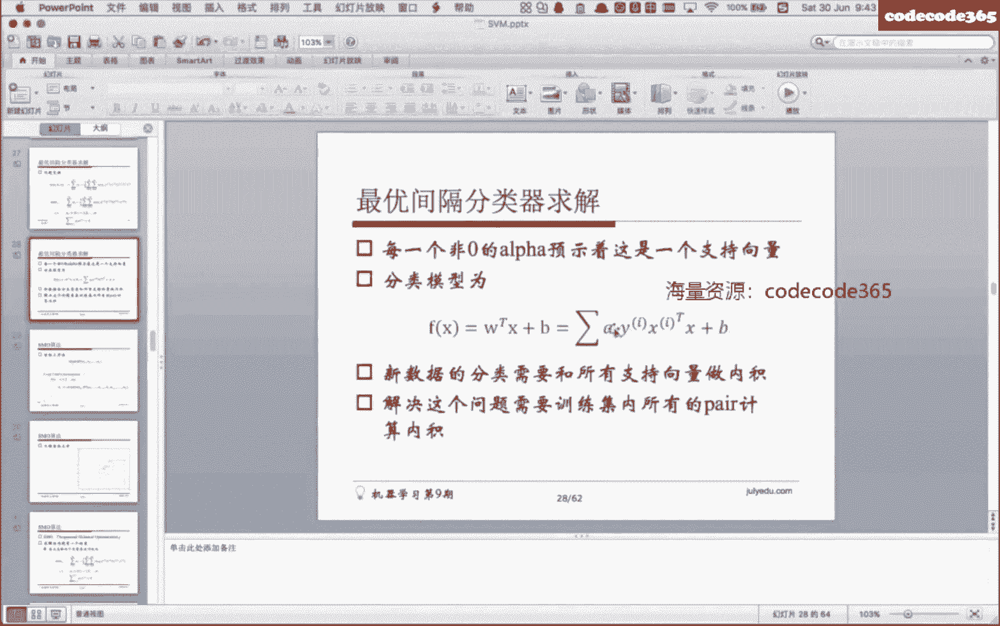
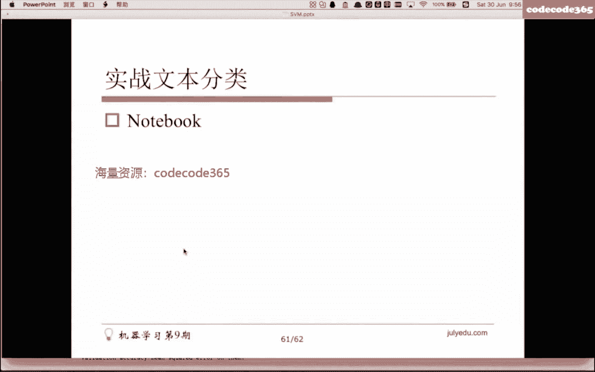
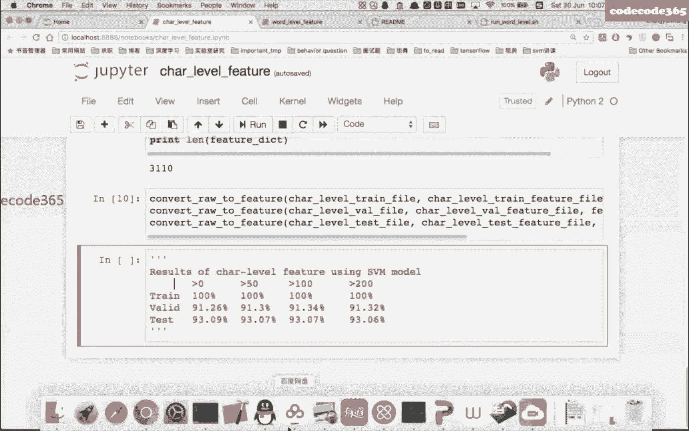
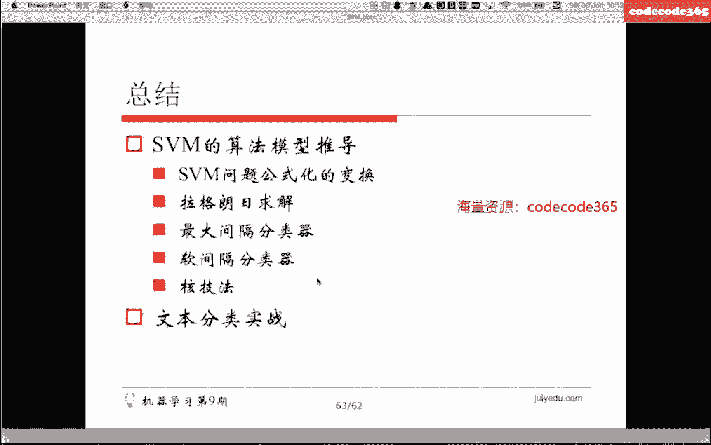
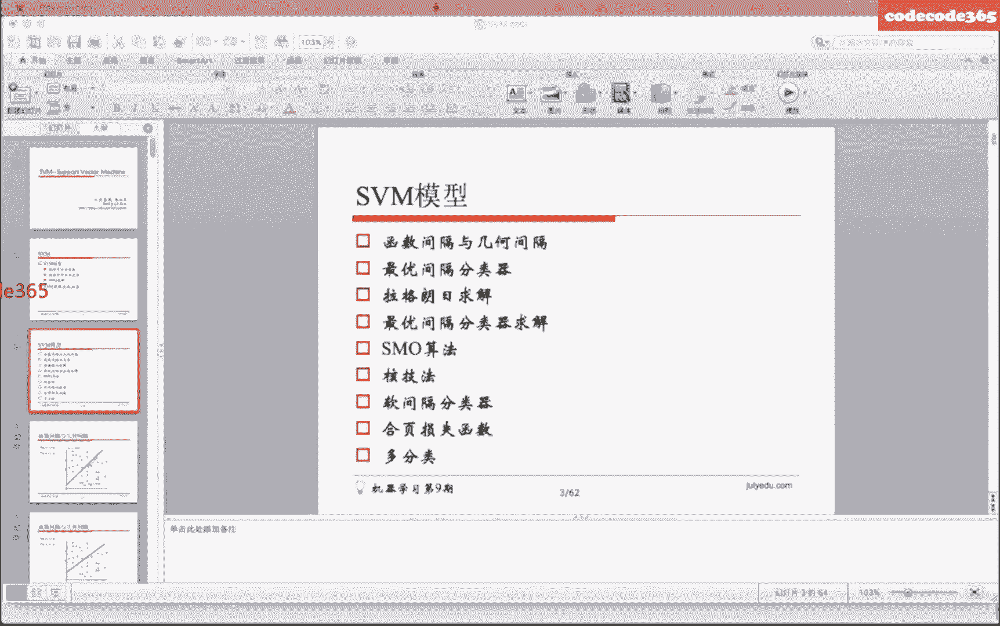

# 🧠 机器学习就业训练营 - 课程3：支持向量机（SVM）与数据分类

在本节课中，我们将要学习支持向量机（SVM）的核心原理、数学推导及其在数据分类，特别是文本分类中的应用。SVM是一种强大的监督学习算法，尤其擅长处理高维数据和寻找最优分类边界。

---

## 📚 课程概述

本节课的主要内容是讲解SVM模型的基本推导和实战应用。我们将从线性可分的数据集入手，逐步深入到线性不可分的情况，并介绍SVM的求解算法。课程将涵盖以下核心知识点：
*   函数间隔与几何间隔
*   最大间隔分类器
*   拉格朗日乘子法与对偶问题
*   SMO求解算法
*   核函数与软间隔分类器
*   SVM的损失函数视角与多分类扩展
*   文本分类实战

---

## 1️⃣ 函数间隔与几何间隔

上一节我们介绍了课程的整体框架，本节中我们来看看SVM最基础的两个概念：函数间隔和几何间隔。

假设我们有一个线性可分的二维数据集，黑点代表正类（+1），空心点代表负类（-1）。我们可以画出无数条直线（超平面） `W·X + b = 0` 将两类数据分开。在这些线中，哪一条是最好的呢？

**函数间隔** 衡量了数据点距离分类超平面的“确信度”。对于一个数据点 `(X_i, y_i)`，其函数间隔定义为：
`γ̂_i = y_i (W·X_i + b)`
其中 `y_i ∈ {+1, -1}`。引入 `y_i` 是为了保证间隔始终为非负值（对于正确分类的点）。

然而，函数间隔有一个问题：如果我们成比例地缩放 `W` 和 `b`，函数间隔会随之同比例变化，但这并没有改变超平面本身。因此，函数间隔不能绝对地衡量距离。

为此，我们引入 **几何间隔**，它表示数据点到超平面的真实欧氏距离。几何间隔在函数间隔的基础上，对法向量 `W` 进行了归一化：
`γ_i = y_i ( (W / ||W||)·X_i + b / ||W|| ) = γ̂_i / ||W||`
其中 `||W||` 是 `W` 的 L2 范数。几何间隔不会随 `W` 和 `b` 的缩放而改变，是一个绝对的距离度量。

对于一个超平面，我们定义其 **最小几何间隔** 为所有样本点几何间隔中的最小值。SVM的核心思想就是：**寻找那个能使最小几何间隔最大的超平面**，即“最大间隔”分类器。

---

## 2️⃣ 最大间隔分类器的形式化

上一节我们定义了衡量标准，本节中我们来看看如何将“寻找最大间隔超平面”转化为一个数学优化问题。

我们的目标是：
`max_{W, b} γ`
`subject to y_i (W·X_i + b) ≥ γ, i = 1,..., m`
`||W|| = 1`

这里 `γ` 是最小几何间隔。约束条件 `||W|| = 1` 使得目标函数中的 `γ` 就是几何间隔。但这个约束条件（等式）使得问题非凸，难以求解。

我们可以通过两步变换来简化问题：
1.  **用函数间隔表示几何间隔**：令 `γ = γ̂ / ||W||`，并将约束条件两边同除以 `||W||`，从而将 `||W|| = 1` 的约束融入到不等式约束中。
2.  **固定函数间隔**：函数间隔 `γ̂` 的缩放不影响解。为了简化，我们可以令 `γ̂ = 1`。此时，最大化 `γ = 1 / ||W||` 等价于最小化 `||W||`。为了后续求导方便，我们最小化 `(1/2)||W||^2`。

经过上述变换，原始的“最大间隔”问题等价于以下 **凸二次规划问题**：
`min_{W, b} (1/2) ||W||^2`
`subject to y_i (W·X_i + b) ≥ 1, i = 1,..., m`

这就是 **支持向量机（SVM）的基本型**。

---

## 3️⃣ 拉格朗日乘子法与对偶问题

上一节我们得到了一个带约束的优化问题，本节中我们引入拉格朗日乘子法来求解它。

对于含有等式约束 `h_i(W)=0` 的优化问题 `min f(W)`，我们引入拉格朗日函数：
`L(W, β) = f(W) + Σ β_i h_i(W)`
通过令 `∂L/∂W = 0` 和 `∂L/∂β = 0` 来求解。

对于SVM，我们有不**等式**约束 `g_i(W) = 1 - y_i(W·X_i + b) ≤ 0`。我们需要引入 **广义拉格朗日函数**：
`L(W, b, α) = (1/2)||W||^2 + Σ_{i=1}^m α_i [1 - y_i(W·X_i + b)]`
其中 `α_i ≥ 0` 是拉格朗日乘子。

根据拉格朗日对偶性，原始问题 `min_{W,b} max_{α≥0} L(W, b, α)` 可以转化为其对偶问题 `max_{α≥0} min_{W,b} L(W, b, α)`，这往往更易求解。当满足 **KKT条件** 时，对偶问题的最优解即是原始问题的最优解。

KKT条件包括：
*   `∂L/∂W = 0`, `∂L/∂b = 0`
*   `α_i ≥ 0`
*   `1 - y_i(W·X_i + b) ≤ 0`
*   `α_i [1 - y_i(W·X_i + b)] = 0` （**互补松弛条件**）

最后一个条件至关重要：它意味着对于大多数样本，`α_i = 0`；只有当样本点满足 `y_i(W·X_i + b) = 1`，即恰好位于间隔边界上时，`α_i` 才可能大于0。这些点就是 **支持向量**，它们决定了最终的分类超平面。

---

## 4️⃣ SVM对偶问题的求解

上一节我们得到了对偶问题，本节中我们具体求解它，并得到SVM的最终形式。

首先，固定 `α`，对 `L(W, b, α)` 关于 `W` 和 `b` 求偏导并令其为零：
`∂L/∂W = 0 ⇒ W = Σ_{i=1}^m α_i y_i X_i`
`∂L/∂b = 0 ⇒ Σ_{i=1}^m α_i y_i = 0`

将这两个结果代回拉格朗日函数，消去 `W` 和 `b`，得到 **只关于 α 的对偶问题**：
`max_α Σ_{i=1}^m α_i - (1/2) Σ_{i=1}^m Σ_{j=1}^m α_i α_j y_i y_j X_i·X_j`
`subject to Σ_{i=1}^m α_i y_i = 0, α_i ≥ 0, i=1,...,m`

求解出 `α` 后，我们可以得到模型参数：
`W* = Σ_{i=1}^m α_i y_i X_i`
`b*` 可以通过任意一个支持向量 `(X_s, y_s)` 计算：`b* = y_s - W*·X_s`

最终的决策函数为：
`f(X) = sign(W*·X + b*) = sign( Σ_{i=1}^m α_i y_i X_i·X + b* )`

**重要观察**：
1.  模型参数 `W` 和 `b` 仅由支持向量（`α_i > 0` 的样本）决定。
2.  决策函数依赖于支持向量与输入样本的内积 `X_i·X`。

---

## 5️⃣ SMO算法简介

上一节我们得到了对偶问题的形式，本节中我们简要介绍求解该问题的SMO算法。

对偶问题是一个二次规划问题。当样本量很大时，通用的QP求解器效率低下。**序列最小最优化（SMO）** 算法是一种高效的启发式算法。

SMO算法的基本思想源自 **坐标上升法**：每次只优化一个变量，固定其他变量。但由于对偶问题中有约束 `Σ α_i y_i = 0`，单独更新一个 `α_i` 会破坏约束。

因此，SMO算法每次选择两个变量 `α_i` 和 `α_j` 进行优化，固定其他变量。这样，由约束 `α_i y_i + α_j y_j = constant`，我们可以用 `α_i` 表示 `α_j`，从而将问题转化为单变量优化问题，该问题有解析解。迭代重复以下步骤直至收敛：

以下是SMO算法的主要步骤：
1.  启发式选择一对需要更新的拉格朗日乘子 `α_i` 和 `α_j`。
2.  固定其他乘子，解析求解关于这两个乘子的二次规划子问题，更新 `α_i` 和 `α_j`。
3.  根据更新后的 `α` 更新模型参数 `b` 和误差缓存。
4.  检查是否满足收敛条件（如KKT条件在容忍度内），若不满足则返回步骤1。

---

## 6️⃣ 核函数：处理线性不可分数据

上一节我们讨论了线性可分情况，本节中我们来看看SVM如何处理线性不可分的数据。

对于在原始特征空间中线性不可分的数据，我们可以将其映射到一个更高维的特征空间，使其在新空间中线性可分。设映射函数为 `φ(X)`，则决策函数变为：
`f(X) = sign( Σ α_i y_i φ(X_i)·φ(X) + b )`

直接计算高维空间的内积 `φ(X_i)·φ(X)` 可能非常困难（维度灾难）。**核函数** 技巧巧妙地解决了这个问题。我们定义一个核函数 `K(X_i, X_j) = φ(X_i)·φ(X_j)`，它直接在原始空间计算，结果等于映射后空间的内积。这样，我们无需显式地定义映射 `φ`，也无需计算高维向量。

决策函数可重写为：
`f(X) = sign( Σ α_i y_i K(X_i, X) + b )`

常用的核函数包括：
*   **线性核**：`K(X_i, X_j) = X_i·X_j`
*   **多项式核**：`K(X_i, X_j) = (X_i·X_j + c)^d`
*   **高斯核（RBF核）**：`K(X_i, X_j) = exp(-γ ||X_i - X_j||^2)`
*   **Sigmoid核**：`K(X_i, X_j) = tanh(β X_i·X_j + θ)`

---

## 7️⃣ 软间隔分类器：容忍噪声与异常点

上一节我们通过升维解决不可分问题，本节中我们介绍另一种更常用的方法——软间隔，它允许一些样本点不满足约束。

即使使用了核函数，数据中也可能存在噪声或特异点，导致严格线性不可分。**软间隔SVM** 通过引入 **松弛变量** `ξ_i ≥ 0` 来允许一些样本点犯错（位于间隔之内甚至被误分类）。优化目标变为：
`min_{W,b,ξ} (1/2)||W||^2 + C Σ_{i=1}^m ξ_i`
`subject to y_i(W·X_i + b) ≥ 1 - ξ_i, ξ_i ≥ 0, i=1,...,m`

其中 `C > 0` 是一个惩罚参数，控制对误分类的惩罚力度。`C` 越大，对误分类的容忍度越低，模型越倾向于过拟合；`C` 越小，则容忍度越高，模型越简单，可能欠拟合。

同样地，可以推导出其拉格朗日对偶形式，与硬间隔SVM的对偶形式非常相似，只是约束条件变为 `0 ≤ α_i ≤ C`。KKT条件中的互补松弛条件也相应变化。

---

## 8️⃣ 合页损失函数视角

上一节我们从优化角度定义了软间隔，本节中我们从损失函数的角度重新理解SVM。

SVM的优化目标 `(1/2)||W||^2 + C Σ ξ_i` 可以等价地写为经验风险最小化的形式：
`min_{W,b} Σ_{i=1}^m [1 - y_i(W·X_i + b)]_+ + λ ||W||^2`
其中 `[z]_+ = max(0, z)` 称为 **合页损失（Hinge Loss）**，`λ` 是正则化系数。

合页损失函数的特点是：当样本被正确分类且函数间隔大于1时，损失为0；否则，损失线性增长。这与逻辑回归的交叉熵损失、感知机的0-1损失都不同。0-1损失难以优化，合页损失是其一个凸上界，且比交叉熵损失更关注于那些“难分”的样本（即间隔边界附近的样本）。

---

## 9️⃣ SVM的多分类扩展

上一节我们讨论的都是二分类SVM，本节中我们简要介绍如何将其扩展到多分类问题。

SVM本质上是二分类器。处理多分类（K类）问题常用以下策略：
*   **一对一（One-vs-One）**：为每两个类别训练一个SVM分类器，共需 `K(K-1)/2` 个分类器。预测时采用投票法。
*   **一对多（One-vs-Rest）**：为每个类别训练一个SVM，将其与其他所有类别区分开，共需 `K` 个分类器。预测时选择决策函数值最大的类别。
*   **层次SVM**：通过构建一个二叉树结构，将多分类问题分解为一系列二分类问题。

在实际应用中，一对一和一对多策略最为常用，许多SVM库（如LIBSVM）都直接提供了多分类的实现。

---

## 🔟 实战：SVM用于文本分类

前面我们完成了SVM的理论学习，本节中我们进行实战，将SVM应用于文本分类任务。

文本分类是SVM的传统优势领域。基本流程如下：

以下是文本分类的主要步骤：
1.  **分词**：对于中文文本，首先需要使用分词工具（如结巴分词）将句子切分成词语序列。
2.  **特征提取与选择**：
    *   去除停用词（如“的”、“了”等无实义词）。
    *   构建词表，将每个词映射为一个ID。
    *   将每篇文档表示为向量，常用 **词袋模型（Bag-of-Words）** 或 **TF-IDF** 加权。
    *   可以进行特征选择（如卡方检验、信息增益）以降低维度。
3.  **模型训练与评估**：使用SVM库（如Python的`sklearn.svm`或专业的`LIBSVM`）在向量化后的数据上训练模型，并进行交叉验证评估。

**实战经验分享**：在一个33类的新闻文本分类比赛中，通过以下调优提升了效果：
*   使用更细粒度的分词。
*   将词频特征替换为TF-IDF权重。
*   精心调整SVM的核函数、惩罚参数C等。
*   对不平衡类别采用分层采样或调整类别权重。
*   最终，特征工程的精细程度（如引入n-gram特征）对结果影响巨大。

**作业**：使用LIBSVM或scikit-learn的SVM模块，完成提供的新闻文本数据集的分类任务，并尝试调整参数以达到最佳性能。

---

## 📝 课程总结

本节课中我们一起学习了支持向量机（SVM）的完整知识体系：

1.  **核心思想**：寻找最大几何间隔的分类超平面，以获得强泛化能力。
2.  **数学推导**：从函数间隔、几何间隔出发，形式化为凸二次规划问题，并通过拉格朗日对偶性转化为更易求解的对偶问题。理解 **支持向量** 和 **KKT条件** 是关键。
3.  **求解算法**：了解了高效的SMO算法原理。
4.  **关键扩展**：
    *   **核函数**：通过隐式的高维映射处理线性不可分数据，避免了维度灾难。
    *   **软间隔**：引入松弛变量和惩罚参数C，使模型能容忍噪声和异常点，控制模型复杂度。
5.  **多分类**：掌握了一对一和一对多等扩展策略。
6.  **实战应用**：掌握了将SVM应用于文本分类的完整流程，包括文本预处理、特征工程和模型调优。

SVM以其坚实的数学基础和良好的性能，在机器学习发展史上占有重要地位。虽然深度学习在许多领域取得了领先，但理解SVM的原理对于构建完整的机器学习知识体系至关重要。希望本课程能帮助大家打下坚实的基础。