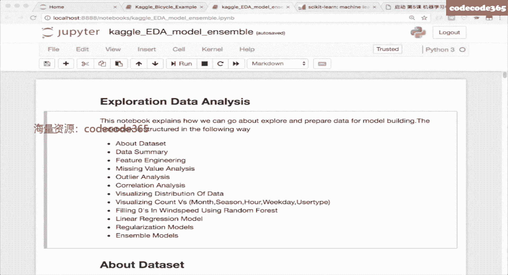

# 机器学习就业训练营 - 课程4：特征工程实战教程 🛠️

在本节课中，我们将要学习机器学习中一个至关重要但常被忽视的环节——特征工程。我们将探讨如何将原始、杂乱的数据，通过一系列处理步骤，转化为机器学习模型能够有效学习的“语言”。特征工程的质量，往往直接决定了模型效果的上限。

## 概述：什么是特征工程？

特征工程，英文称为 Feature Engineering。它指的是从原始数据中抽取对预测结果有用的信息，并将其处理成机器学习算法能更好发挥作用的表达形态。

人工智能远没有想象的那么智能，它需要大量“人工”的环节。你不能简单地将原始数据扔给模型就期望得到好结果。原始数据可能杂乱无章，包含许多计算机无法直接理解的信息（如文本、类别）。特征工程的核心，就是结合计算机知识和领域专业知识，将这些信息转化为有效的数值表达。

一个常见的误解是，模型越复杂、越“高级”，效果就越好。实际上，在工业界，我们更青睐简单、可控、可解释性好的模型（如逻辑回归）。通过精心设计的特征工程，简单模型的效果完全可以媲美甚至超越复杂模型。数据科学家大约60%-70%的时间会花在数据处理和特征工程上，而模型调优只占较少部分，这足以说明其重要性。

上一节我们介绍了特征工程的核心概念与重要性，本节中我们来看看面对原始数据时，我们需要进行哪些准备工作。

## 数据采集与初步考量

在特征工程开始之前，首先需要获取数据。虽然数据采集通常不由机器学习工程师直接完成，但我们需要思考：哪些数据对预测结果有帮助？这些数据能否采集到？

例如，在电商推荐场景中，商品在搜索结果列表中的“位置”是一个强特征。但在构建线上推荐模型时，你无法提前知道一个商品会被排在哪个位置，因此这个特征在训练时可用，在线上实时预测时却不可用。我们必须考虑特征的线上可获取性和计算效率。

以下是在设计特征时可以从几个维度切入思考的例子（以预测用户对课程的兴趣为例）：
*   **机构维度**：课程提供方的口碑、历史表现。
*   **讲师维度**：讲师风格、声音、受欢迎程度。
*   **用户维度**：用户历史学习记录、兴趣偏好。
*   **课程维度**：内容难度、展示形式、开课时间。
*   **环境维度**：同时参与课程的其他学员情况。

数据格式化后，并非所有采集到的数据都有用。原始数据中可能包含噪声或错误信息。机器学习模型没有区分能力，它会学习你提供给它的所有信息，包括噪声，这就是“垃圾进，垃圾出”。因此，数据清洗是特征工程的第一步，目的是剔除不可靠的数据，提升“原材料”的质量。

## 数据清洗与采样处理

数据清洗的目标是识别并处理数据中的噪声、错误和不一致。异常点（脏数据）的处理至关重要，有时仅仅清理掉明显的脏数据就能让模型排名大幅提升。

以下是识别和处理脏数据的一些方法：
*   **业务逻辑判断**：识别明显不符合常理的数据，例如身高超过3米的人，或单月消费额异常高的用户。
*   **统计方法**：对于连续值，可以使用分位数进行“掐头去尾”。例如，剔除99%分位数以上和1%分位数以下的极端值。

除了清洗，另一项关键处理是针对样本不均衡问题的**数据采样**。在许多分类问题中（如疾病诊断、电商购买），正负样本数量可能相差悬殊。如果直接用不均衡数据训练，模型可能会偏向多数类。

以下是解决样本不均衡的几种方法：
*   **欠采样**：从多数类中随机抽取一部分样本，使其数量与少数类接近。
*   **过采样**：增加少数类样本的数量。除了简单复制，还可以使用如SMOTE算法，通过在特征空间中对少数类样本进行插值来生成新样本。
*   **分层采样**：在划分训练集/测试集时，保持每个数据子集中不同类别（或重要维度，如性别）的比例与原始数据集一致。
*   **修改损失函数**：在模型训练时，为不同类别的样本损失赋予不同的权重，降低多数类的影响。

上一节我们处理了数据层面的问题，本节中我们来看看如何针对不同类型的数据进行特征转换和抽取。

## 特征处理：数值型数据

数值型数据指年龄、价格等连续值。对它们的处理旨在让模型更高效地学习。

### 幅度缩放
当不同特征的数值范围差异巨大时（如“房间数”范围0-5，“均价”范围0-50000），某些模型（如逻辑回归、神经网络）的学习过程会变得困难。缩放可以将不同特征调整到相近的幅度范围内。

**常用方法**：
*   **标准化**：对每一列特征进行处理。`新值 = (原值 - 该列均值) / 该列标准差`。此方法使数据符合标准正态分布。
*   **最大最小值缩放**：`新值 = (原值 - 该列最小值) / (该列最大值 - 该列最小值)`。此方法将数据缩放到[0, 1]区间。

### 统计特征
除了原始值，还可以基于统计信息构造新特征。例如，在房价预测中，可以构造“该地区房价均价”、“该地区房价最高/最低价”、“该地区房价的25%/75%分位数”等特征。

### 离散化
离散化，也称分箱或分桶，是将连续值划分为多个区间段，并将每个区间作为一个新的类别特征。

**为什么需要离散化？**
考虑“是否让座”的场景，影响因素“年龄”与结果并非单调关系（需要照顾老人和小孩）。如果直接将年龄作为连续特征送入逻辑回归，模型无法同时捕捉两头的趋势。将年龄离散化为`[儿童, 青年, 老年]`几个区间后，模型可以为每个区间学习独立的权重，从而灵活建模。

**如何确定分箱边界？**
*   **等距切分**：按数值范围均匀划分。例如，价格每50元一段。缺点：可能无法适应数据的不均匀分布。
*   **等频切分**：按样本数量均匀划分，使得每个箱内的样本数大致相同。通常使用分位数来确定边界。

上一节我们处理了数值型数据，本节中我们来看看计算机更难以理解的类别型和时间型数据。

## 特征处理：类别型与时间型数据

### 类别型数据
类别型数据如口红色号、衣服尺码、星期几，计算机无法直接理解，必须转换为数值。

**1. 独热编码**
这是最常用的方法。为每个类别取值创建一个新的二值特征列。

*   **原始数据**：颜色 [红， 绿， 蓝， 黄]
*   **独热编码后**：
    *   红 -> [1, 0, 0, 0]
    *   绿 -> [0, 1, 0, 0]
    *   蓝 -> [0, 0, 1, 0]
    *   黄 -> [0, 0, 0, 1]

**为什么不直接用1,2,3,4标签编码？** 因为标签编码会引入不应存在的大小顺序关系（例如，模型可能错误地认为“黄色(4)”比“红色(1)”更重要）。

**2. 哈希技巧**
当类别取值极多（如词表）时，独热编码维度会爆炸。哈希技巧可以将高维稀疏表示压缩到低维。例如，在文本分类中，可以统计一篇文章的词落在预定义的“财经”、“体育”、“政治”等词表中的数量，用这个计数向量作为特征。

**3. 基于统计的映射**
通过统计类别与其他特征的关联来构造新特征。例如，统计“性别”分组下，“爱好”为足球、散步、看电视剧的占比。然后将这个占比向量（如男性：[0.67, 0.33, 0.0]）作为新特征附加到对应性别的样本上。

### 时间型数据
时间戳是宝贵的信息源，既可以作为连续值，也可以离散化后作为类别值。

**可抽取的特征包括**：
*   **离散特征**：小时、星期几、月份、季度、是否节假日、距离特定节日（如双十一）的天数。
*   **连续特征**：页面浏览时长、两次行为的时间间隔、用户连续登录天数。
*   **历史统计特征**：过去7天的平均活跃度、上周同一时间的销量。

在电商比赛中，经常需要结合日历，挖掘节假日、促销周期与用户行为的关系，这些时间特征往往非常有效。

## 特征处理：文本型数据与特征构造

### 文本型数据
计算机无法理解文本，必须将其向量化。

**1. 词袋模型**
构建一个词表，文本用一个大向量表示，向量每一维对应一个词，出现则为1（或词频），否则为0。
*   **缺点**：完全丢失了词序信息。“李雷喜欢韩梅梅”和“韩梅梅喜欢李雷”的表示相同。

**2. N-gram模型**
为了捕捉词序，可以同时考虑相邻词的组合。例如，2-gram会提取“李雷 喜欢”、“喜欢 韩梅梅”作为特征。这在一定程度上保留了局部词序信息。

**3. TF-IDF**
这是一种加权统计特征，用于评估一个词对于一份文档的重要程度。
*   **公式**：`TF-IDF(t, d) = TF(t, d) * IDF(t)`
*   **词频**：`TF(t, d) = (词t在文档d中出现的次数) / (文档d中所有词的总数)`
*   **逆文档频率**：`IDF(t) = log(总文档数 / (包含词t的文档数 + 1))`
*   **核心思想**：一个词在当前文档中出现次数越多（TF高），且在全体文档中出现越少（IDF高），则它对当前文档越重要。

### 特征构造：统计与组合
除了转换现有特征，还可以基于业务理解构造全新的特征。

**统计特征**：
*   **比值型**：商品的好/中/差评比例，用户消费超过品类平均水平的百分比。
*   **排名型**：商品销量在同类中的排名，学生成绩在班级的百分位。
*   **趋势型**：商品昨日销量与前日销量的涨幅。

**特征组合**：
*   **人工组合**：将两个或多个特征交互，生成新的特征。例如，“用户ID” + “商品类别”组合成一个新特征，只有当特定用户浏览特定类别时，该特征才为1。
*   **基于模型组合**：利用树模型（如GBDT）来发现有效的特征组合。树模型分裂节点时使用的条件（如“性别=男”且“城市=上海”），本身就是特征的组合，可以将这些组合路径作为新的特征使用。

通过以上方法，我们可以从原始数据中构造出大量特征。但特征并非越多越好，接下来我们需要进行特征选择。

## 特征选择

当特征维度很高时，会消耗大量计算资源，且可能包含冗余或无关特征，甚至对模型产生负面影响。特征选择的目标是筛选出最重要的特征子集。

**特征选择 vs. 降维**：
*   **特征选择**：从原始特征中挑选子集，特征含义保持不变。
*   **降维**：通过变换将高维特征映射到低维空间（如PCA），新特征失去了原始含义。

**特征选择方法**：

**1. 过滤法**
单独评估每个特征与目标变量的相关性（如计算相关系数），选择相关性最高的特征。
*   **优点**：计算快。
*   **缺点**：未考虑特征间的相互作用。

**2. 包裹法**
将特征选择看作一个特征子集搜索问题。常用**递归特征消除**：
    *   用全部特征训练一个能提供特征重要度的模型（如随机森林）。
    *   剔除最不重要的特征。
    *   用剩余特征重新训练模型，评估性能。
    *   重复上述过程，直到性能显著下降。

**3. 嵌入法**
利用模型训练过程本身来进行特征选择。最典型的是使用**L1正则化**的线性模型（如Lasso回归、线性SVM）。
*   **原理**：L1正则化具有稀疏化效应，会使许多不重要的特征的权重变为零。训练完成后，权重非零的特征即被选中。
*   **适用场景**：特别适用于高维稀疏特征（如经过独热编码后的特征）。

## 实战案例与总结

本节课中我们一起学习了特征工程的完整流程：从数据采集清洗，到针对数值、类别、时间、文本等各类数据的处理方法，再到特征构造与选择。

我们通过两个案例加深理解：
1.  **共享单车需求预测**：演示了如何从日期时间戳中提取小时、星期几、月份等特征，并进行初步分析。
2.  **探索性数据分析**：展示了一个完整的EDA流程，包括数据概览、缺失值和异常值分析、特征分布可视化、特征工程、以及初步建模。这强调了基于数据洞察来指导特征工程的重要性。

特征工程是连接数据和模型的桥梁，是机器学习项目成败的关键。它没有固定公式，依赖于对数据的深刻理解、业务知识的积累以及不断的实验和迭代。掌握好特征工程，你就能让简单的模型发挥出强大的力量。




**核心公式与代码片段回顾**：
*   **标准化公式**：`X_scaled = (X - mean(X)) / std(X)`
*   **离散化（等频分箱）代码示意**：
    ```python
    import pandas as pd
    # 使用qcut进行等频分箱
    data['age_bin'] = pd.qcut(data['age'], q=5, labels=False)
    ```
*   **独热编码代码示意**：
    ```python
    import pandas as pd
    # 使用get_dummies进行独热编码
    encoded_df = pd.get_dummies(data, columns=['color'])
    ```
*   **TF-IDF公式**：`TF-IDF(t, d) = (count(t in d) / len(d)) * log(N / (df(t) + 1))`
*   **基于L1正则化的特征选择代码示意**：
    ```python
    from sklearn.svm import LinearSVC
    from sklearn.feature_selection import SelectFromModel
    lsvc = LinearSVC(C=0.01, penalty="l1", dual=False).fit(X, y)
    model = SelectFromModel(lsvc, prefit=True)
    X_new = model.transform(X)
    ```