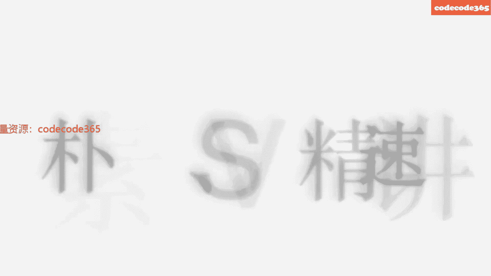
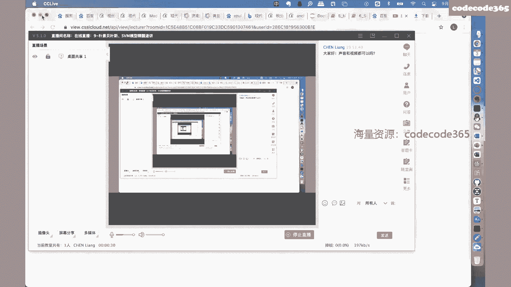
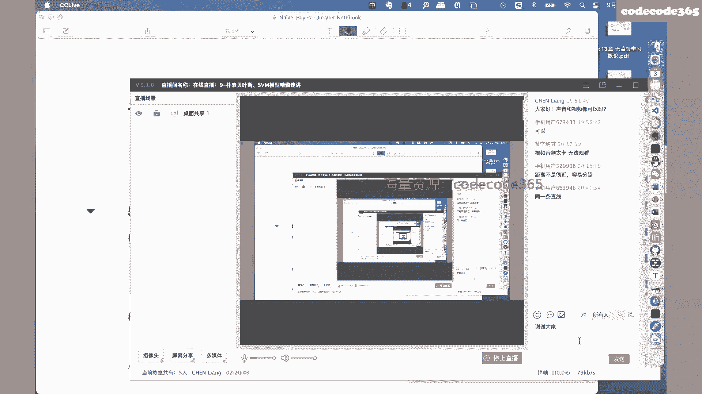

# 【七月在线】机器学习就业训练营16期 - P7：朴素贝叶斯与SVM模型精髓速讲 📚

在本节课中，我们将要学习两个在机器学习中至关重要的模型：支持向量机（SVM）和朴素贝叶斯。我们将从SVM的硬间隔、软间隔、核技巧到其优化算法SMO，系统地理解其原理。随后，我们将探讨朴素贝叶斯模型，学习其基于概率的分类思想以及相关的核心数学规则。课程内容旨在为初学者构建清晰的知识框架。

## 第一部分：支持向量机（SVM）模型精髓 🧠

上一节我们介绍了机器学习模型的基本分类，本节中我们来看看一个经典且强大的分类模型——支持向量机。

### 1. 硬间隔支持向量机（线性可分）

支持向量机最初要解决的是线性可分的二分类问题。其核心思想是找到一个最优的分离超平面，使得两类样本点距离该平面的“间隔”最大化。

#### 问题定义与数据集

我们拥有的数据集是典型的监督学习数据集：
*   **输入**：`T = {(x1, y1), (x2, y2), ..., (xn, yn)}`
*   **特征向量**：`xi ∈ R^n`，是一个n维向量。
*   **标签**：`yi ∈ {+1, -1}`，代表两个类别（注意，SVM中通常使用+1和-1，而非0和1）。

#### 分离超平面与决策函数

目标是学到一个分类超平面：
`w* · x + b* = 0`
以及相应的分类决策函数：
`f(x) = sign(w* · x + b*)`
其中，`w*`是权重向量，`b*`是偏置，`sign(·)`是符号函数。

#### 函数间隔与几何间隔

为了量化“间隔”，我们引入两个核心概念：

以下是关于样本点的间隔定义：
*   **函数间隔**：`γ̂_i = yi (w · xi + b)`
*   **几何间隔**：`γ_i = yi (w · xi + b) / ||w||`，其物理意义是样本点到超平面的几何距离。

对于整个训练集，我们关心的是所有样本点中间隔最小的那个：
*   **数据集函数间隔**：`γ̂ = min_i γ̂_i`
*   **数据集几何间隔**：`γ = min_i γ_i`

两者关系为：`γ = γ̂ / ||w||`

#### 间隔最大化

SVM的核心目标是**最大化几何间隔γ**。这意味着我们要让离超平面最近的那些样本点（即支持向量）尽可能远离它。这等价于求解以下带约束的最优化问题：
`max γ`
`subject to: yi (w · xi + b) / ||w|| >= γ, i=1,2,...,n`

#### 问题转化与求解

通过一系列数学转化（包括利用函数间隔的相对性，将其固定为1），上述问题可以等价为更易求解的凸二次规划问题：
`min (1/2) ||w||^2`
`subject to: yi (w · xi + b) >= 1, i=1,2,...,n`

我们使用**拉格朗日乘子法**求解此约束优化问题：
1.  **构建拉格朗日函数**：引入拉格朗日乘子αi >= 0。
    `L(w, b, α) = (1/2)||w||^2 - Σ α_i [y_i (w·x_i + b) - 1]`
2.  **求极小值**：分别对`w`和`b`求偏导并令其为零。
    *   `∂L/∂w = 0 => w = Σ α_i y_i x_i`
    *   `∂L/∂b = 0 => Σ α_i y_i = 0`
3.  **求极大值**：将上述结果代回拉格朗日函数，问题转化为关于α的对偶问题：
    `max Σ α_i - (1/2) Σ Σ α_i α_j y_i y_j (x_i · x_j)`
    `subject to: Σ α_i y_i = 0, α_i >= 0`

最终，最优超平面参数为：
*   `w* = Σ α_i* y_i x_i`
*   `b*` 可通过支持向量（对应α_i* > 0的样本）计算得到。

### 2. 软间隔支持向量机（线性不可分）

硬间隔要求数据严格线性可分，这在实际中往往不成立。软间隔SVM通过引入**松弛变量ξ_i**，允许一些样本点被错误分类或落入间隔带内，从而处理近似线性可分的数据。

其优化问题变为：
`min (1/2) ||w||^2 + C Σ ξ_i`
`subject to: y_i (w · x_i + b) >= 1 - ξ_i, ξ_i >= 0`
其中，`C > 0`是惩罚参数，控制对误分类的惩罚力度。求解过程与硬间隔类似，同样会转化为对偶问题求解。

### 3. 非线性支持向量机与核技巧 🌀

上一节我们介绍了处理近似线性问题的软间隔，本节中我们来看看如何处理完全非线性可分的问题。

对于在原始特征空间中线性不可分的数据，我们可以将其映射到一个更高维的特征空间，使其在新空间中线性可分。核技巧的精妙之处在于，我们不需要显式地定义这个映射函数`Φ(x)`，只需要一个**核函数K(x, z)**。

核函数定义了原始空间中两个向量的某种相似度，它等价于它们在映射后空间中的内积：
`K(x_i, x_j) = Φ(x_i) · Φ(x_j)`

这样，在对偶问题的目标函数中，我们只需要将内积`(x_i · x_j)`替换为核函数`K(x_i, x_j)`即可：
`max Σ α_i - (1/2) Σ Σ α_i α_j y_i y_j K(x_i, x_j)`

常用的核函数包括：
*   **多项式核函数**：`K(x, z) = (x · z + 1)^p`
*   **高斯核函数（RBF核）**：`K(x, z) = exp(-γ ||x - z||^2)`

### 4. 序列最小最优化算法（SMO）

求解SVM最终的对偶问题是一个二次规划问题。当样本量很大时，通用求解器效率低下。SMO算法是一种高效的启发式算法，其基本思想是：
*   每次只选择两个拉格朗日乘子`α_i`和`α_j`进行优化，固定其他乘子。
*   由于存在约束`Σ α_i y_i = 0`，两个变量之间存在线性关系，因此二次规划问题可以解析求解。
*   不断选择新的乘子对进行优化，直至收敛。

## 第二部分：朴素贝叶斯模型 🎲

上一节我们学习了基于间隔最大化的SVM，本节中我们来看看一个基于概率统计的经典分类模型——朴素贝叶斯。

### 1. 基本概率规则

在深入模型前，需要掌握两个贯穿概率图模型的基础规则：

以下是两条核心的概率运算规则：
*   **加和（边际化）规则**：`P(X) = Σ_Y P(X, Y)`
    *   用于从联合概率中消除变量，得到边际概率。
*   **乘积（链式）规则**：`P(X, Y) = P(X|Y) P(Y)`
    *   用于将联合概率分解为条件概率和边际概率的乘积。

**贝叶斯定理**是乘积规则的一个直接推论：
`P(Y|X) = P(X|Y) P(Y) / P(X)`
其中，`P(Y|X)`称为后验概率，`P(X|Y)`称为似然，`P(Y)`称为先验概率。

### 2. 朴素贝叶斯模型原理

朴素贝叶斯模型基于贝叶斯定理，并做了一个强大的**条件独立性假设**：在给定类别标签Y的条件下，所有特征`X1, X2, ..., Xn`之间相互独立。

这意味着：
`P(X1, X2, ..., Xn | Y=ck) = Π_j P(Xj | Y=ck)`

对于一个分类问题，给定输入x，我们计算它属于每个类别ck的后验概率：
`P(Y=ck | X=x) = [P(Y=ck) Π_j P(Xj=xj | Y=ck)] / P(X=x)`

由于对于所有类别，分母`P(X=x)`相同，因此我们只需比较分子的大小。决策规则就是选择使分子最大的那个类别：
`y = argmax_{ck} P(Y=ck) Π_j P(Xj=xj | Y=ck)`

### 3. 参数估计

模型中的参数（先验概率`P(Y=ck)`和条件概率`P(Xj=ajl | Y=ck)`）需要通过训练数据来估计。

以下是两种常用的参数估计方法：
*   **极大似然估计**：直接用训练数据中的频率来估计概率。
    *   `P(Y=ck) = (Σ_i I(yi=ck)) / N`
    *   `P(Xj=ajl | Y=ck) = (Σ_i I(xi_j=ajl, yi=ck)) / (Σ_i I(yi=ck))`
    *   其中`I(·)`是指示函数。
*   **贝叶斯估计（拉普拉斯平滑）**：为了解决极大似然估计中可能出现的概率为0的情况（当某个特征值在某个类别下未出现时），在分子分母上加上平滑项。
    *   `P_λ(Xj=ajl | Y=ck) = (Σ_i I(xi_j=ajl, yi=ck) + λ) / (Σ_i I(yi=ck) + Sj λ)`
    *   当λ=1时，称为拉普拉斯平滑。

## 总结 📝

本节课中我们一起学习了支持向量机和朴素贝叶斯两个核心模型。

对于**支持向量机**，我们理解了其追求**最大间隔**的核心思想，掌握了从**硬间隔**（线性可分）到**软间隔**（引入松弛变量处理噪声）再到**非线性**（通过核技巧映射到高维空间）的演进逻辑。我们也了解了其求解最终依赖于求解一个凸二次规划问题，并知道了SMO这一高效算法。

对于**朴素贝叶斯**，我们学习了其基于**贝叶斯定理**和**条件独立性假设**的概率框架。它通过计算后验概率进行分类，模型参数可以通过极大似然估计或贝叶斯估计从数据中学习。其模型简单，计算高效，常作为文本分类等任务的基线模型。

理解这两个模型，不仅掌握了两种重要的机器学习范式（几何间隔最大化与概率生成模型），也为后续学习更复杂的模型（如基于概率图模型的HMM、CRF）打下了坚实的基础。