# 🎓 课程1447-P1：行人重识别（ReID）背景与基线方法

在本节课中，我们将要学习行人重识别（ReID）项目的基础知识。我们将从项目背景、核心概念讲起，并初步搭建一个用于ReID任务的基线模型框架。

## 📖 概述：什么是行人重识别？

行人重识别，简称ReID，全称为Re-identification。本质上，它是一种目标重识别技术。该技术主要分为两类：行人重识别和车辆重识别。本课程将以行人重识别作为主要讲解对象，其涉及的技术框架和代码逻辑同样适用于车辆重识别。

这项技术出现的背景是智慧城市、智慧交通和智慧安防的发展需求。传统的基于高清“枪机”的人脸识别技术存在局限性，例如对拍摄角度（如正脸）要求严格，一旦无法捕捉清晰人脸，识别就会失效。而ReID技术则通过识别行人的整体外观（如穿着、体型）来进行身份辨别，与人脸识别技术形成互补，共同构建更完善的监控识别系统。

**ReID的核心问题定义**：给定一个查询图像（Query），以及一个包含大量带身份标签图像的大型数据库（Gallery），目标是找到查询图像在数据库中的匹配项，从而确定查询图像中行人的身份。

**核心思路**：ReID本质上是一个识别问题。但由于直接进行分类识别存在困难，我们转而采用**图像检索**的技术手段来达到**身份识别**的目的。即，通过计算查询图像与图库中所有图像的相似度，按相似度排序，最相似的图像即被认为是同一个人。

## 🎯 ReID的价值与应用场景

ReID技术的主要价值在于能够进行**轨迹的追踪和串联**。

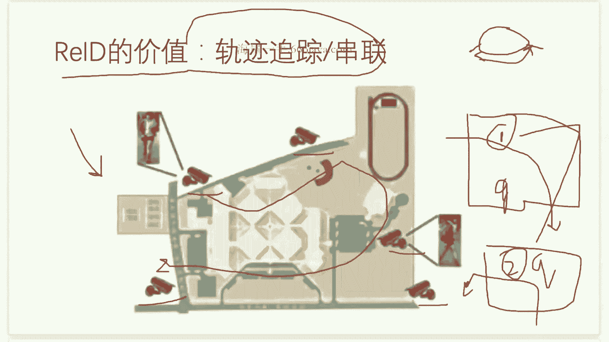

在大型商场（Shopping Mall）等场景中，通常会部署多个摄像头。每个摄像头下的检测追踪算法会给经过的行人分配一个临时ID。然而，同一个人在不同摄像头下会被赋予不同的ID，这就无法形成完整的行动轨迹。ReID的作用就是将不同摄像头下属于同一个人的所有临时ID关联起来，合并为同一个身份。

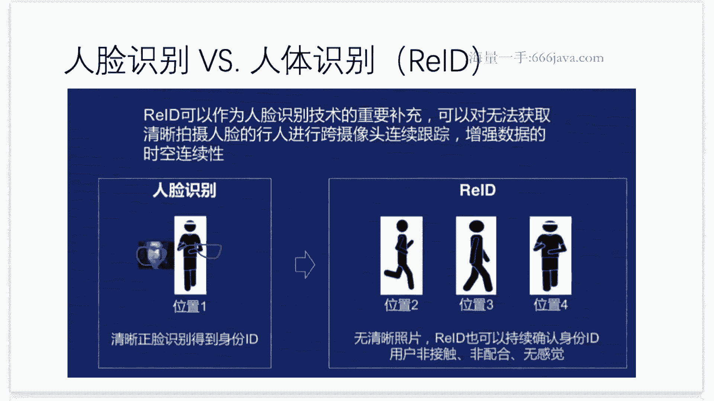

这种轨迹串联能力具有巨大的商业价值。例如，在智慧商场中，通过分析顾客的逛店轨迹、停留时长，可以构建精准的用户画像，实现个性化推荐和营销。在安防领域，公安部门可以借助ReID技术，结合“技战法”（总结的破案规律），高效追踪嫌疑人轨迹，即使其进行了伪装（如遮挡面部）。

## ⚙️ ReID的技术挑战与数据准备

ReID在实际应用中面临诸多挑战，包括行人姿态变化、遮挡（背包、打伞）、衣着变化（季节、款式）、光照条件差异等。这些因素都增加了图像匹配的难度。

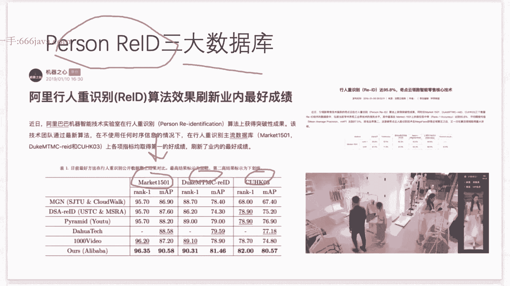

为了研究和评估ReID算法，业界有公认的基准数据集。对于行人ReID，有三大经典数据集：Market1501、DukeMTMC-reID和CUHK03。本课程将重点使用 **Market1501** 数据集。对于车辆ReID，则有 **VeRi-776** 等数据集。这些数据集通常已对车牌等隐私信息进行了处理。

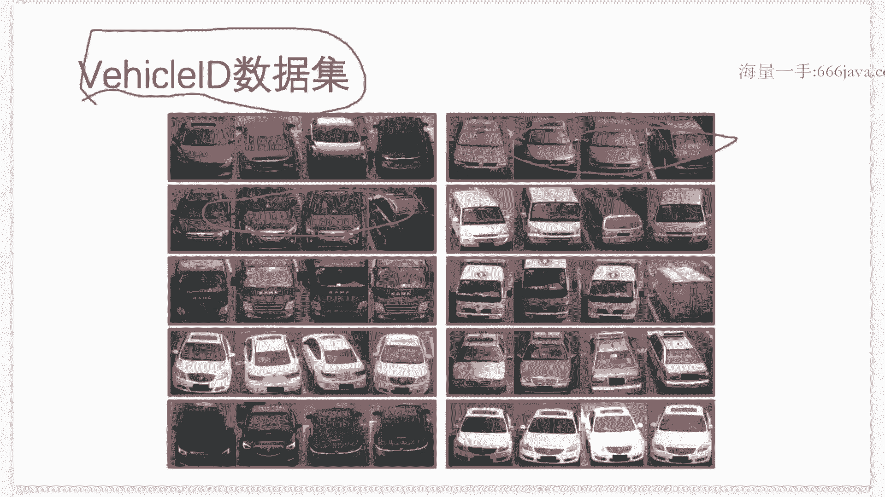

## 🧠 ReID系统的基本框架

一个典型的ReID系统框架包含以下步骤：
1.  **检测与追踪**：在每个摄像头视频流中，运行目标检测（如YOLO）与多目标追踪算法，获取行人的边界框和临时ID轨迹片段。
2.  **特征提取**：对检测到的每个行人图像，使用深度学习模型（如CNN）提取一个固定维度的特征向量。这个向量应能表征行人的外观信息。
3.  **特征匹配/检索**：当有一个查询图像（Query）时，同样提取其特征向量，然后计算它与图库（Gallery）中所有特征向量的相似度（如余弦相似度）。
4.  **身份关联**：根据相似度排序，返回最匹配的结果，从而将查询图像的身份与图库中已知身份关联起来。

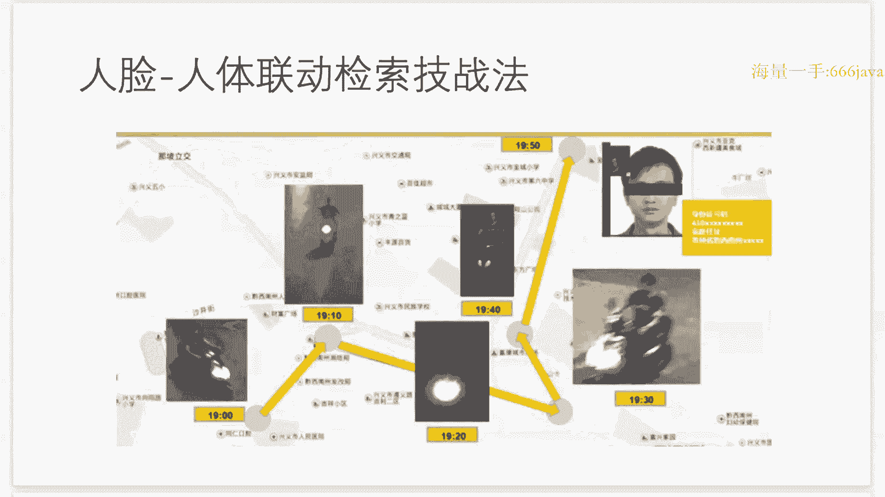

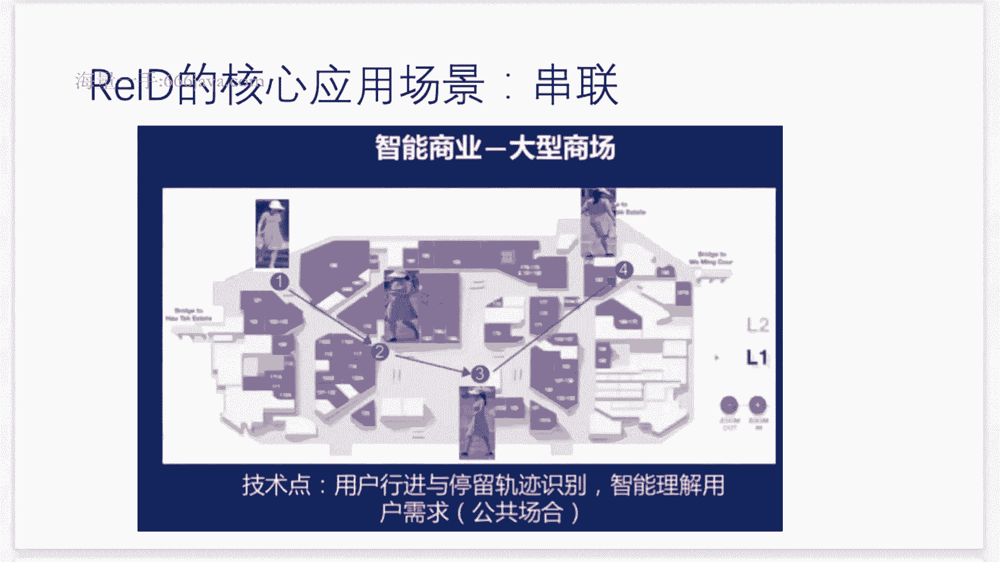

**核心公式**：相似度计算可表示为 `sim(Q, G_i) = f(Q) · f(G_i)`，其中 `f(·)` 是特征提取函数，`·` 表示向量点积。我们的目标就是训练一个好的特征提取模型 `f`。

## 💻 动手实践：搭建ReID基线模型

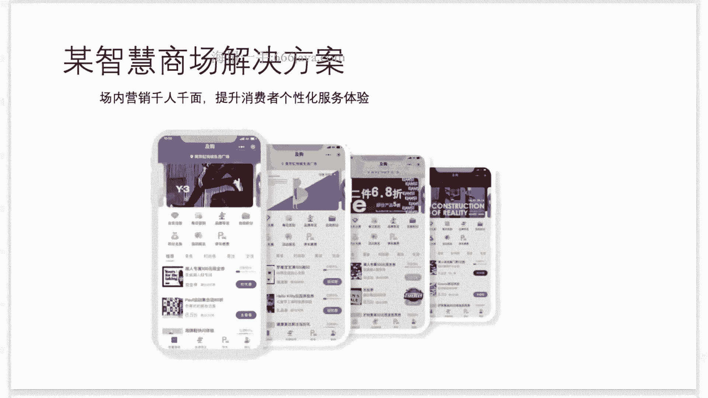

上一节我们介绍了ReID的系统框架，本节中我们来看看如何用代码实现一个最基础的基线模型。我们将使用Market1501数据集和MobileNet网络。

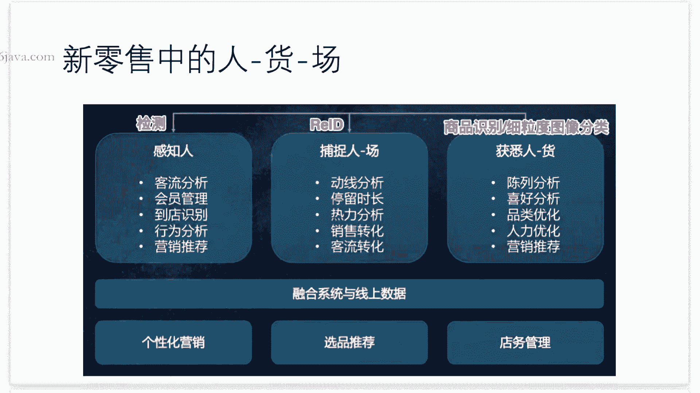

首先，我们需要准备数据和环境。

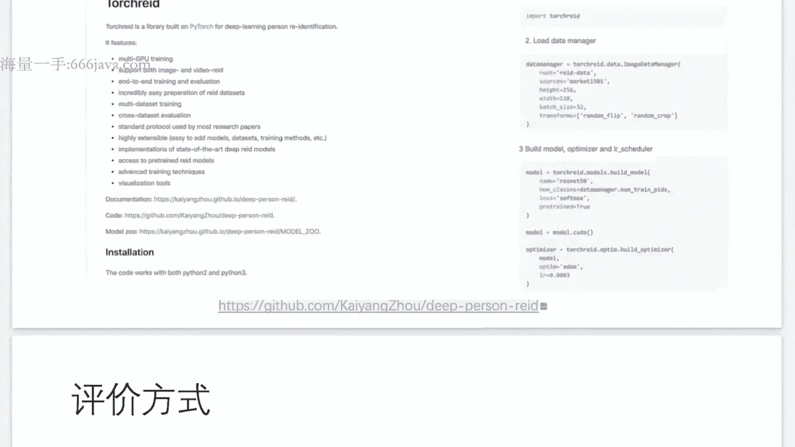

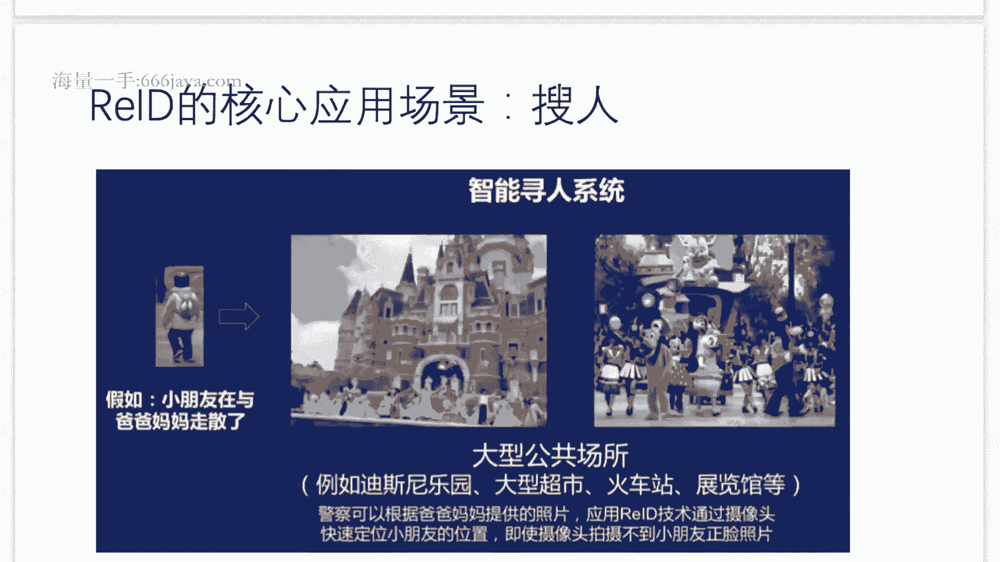

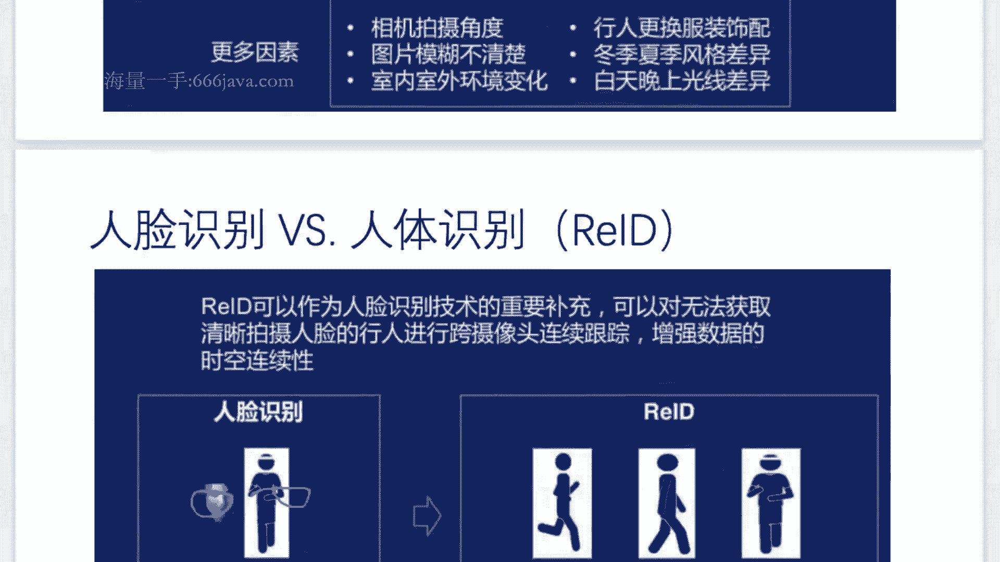

```python
import os
import numpy as np
from sklearn.preprocessing import LabelEncoder
from sklearn.model_selection import train_test_split
import tensorflow as tf
from tensorflow.keras import layers, models
from tensorflow.keras.applications import MobileNet

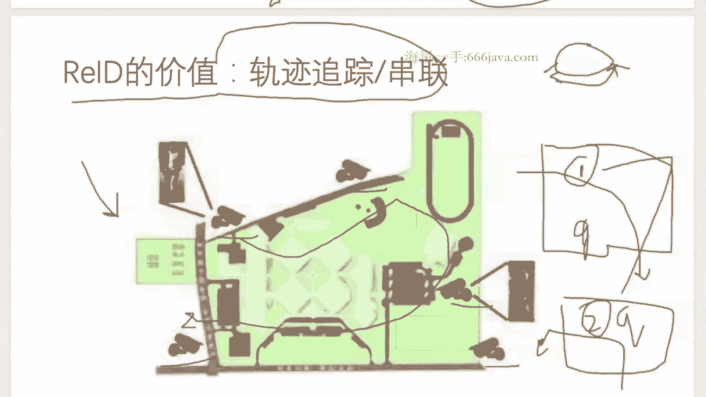

# 配置参数
IMG_HEIGHT, IMG_WIDTH = 64, 64
BATCH_SIZE = 128
EPOCHS = 100
LEARNING_RATE = 0.01
DATA_ROOT = ‘./datasets/market1501/bounding_box_train‘ # 请根据实际路径修改

# 1. 加载并解析图像路径与标签
image_paths = []
person_ids = []

for img_name in os.listdir(DATA_ROOT):
    if img_name.endswith(‘.jpg‘):
        img_path = os.path.join(DATA_ROOT, img_name)
        # 从文件名解析身份ID，例如 “0002_C1S1_000451_03.jpg” 中的 ‘0002‘
        pid = img_name.split(‘_‘)[0]
        image_paths.append(img_path)
        person_ids.append(pid)

# 2. 将字符串ID编码为整数
le = LabelEncoder()
person_ids_encoded = le.fit_transform(person_ids)
num_classes = len(le.classes_)
print(f“Number of person IDs: {num_classes}“)
print(f“Total images: {len(image_paths)}“)

# 3. 划分训练集和验证集
X_train, X_val, y_train, y_val = train_test_split(
    image_paths, person_ids_encoded,
    test_size=0.2, random_state=42, shuffle=True
)
print(f“Training samples: {len(X_train)}, Validation samples: {len(X_val)}“)
```

接下来，我们构建模型。我们将使用在ImageNet上预训练的MobileNet作为特征提取器，并在其顶部添加一个全连接层用于分类。

```python
# 4. 构建模型
def create_model(num_classes):
    # 加载预训练的MobileNet，不包括顶部分类层
    base_model = MobileNet(
        include_top=False,
        weights=‘imagenet‘,
        input_shape=(IMG_HEIGHT, IMG_WIDTH, 3),
        pooling=‘avg‘ # 全局平均池化，将特征图转换为特征向量
    )
    # 冻结基座模型的前面一些层（可选，用于微调）
    # base_model.trainable = False

    # 在基础模型上添加新的分类头
    x = base_model.output
    x = layers.Dense(512, activation=‘relu‘)(x)
    x = layers.Dropout(0.5)(x)
    predictions = layers.Dense(num_classes, activation=‘softmax‘)(x)

    # 构建完整模型
    model = models.Model(inputs=base_model.input, outputs=predictions)
    return model

model = create_model(num_classes)
model.summary() # 打印模型结构

# 5. 编译模型
model.compile(
    optimizer=tf.keras.optimizers.SGD(learning_rate=LEARNING_RATE, momentum=0.9),
    loss=‘sparse_categorical_crossentropy‘,
    metrics=[‘accuracy‘]
)
```

以上代码搭建了一个ReID基线模型的核心结构。我们使用了预训练的MobileNet来提取具有判别性的特征，并通过一个全连接层学习如何根据这些特征区分不同身份的行人。在模型训练时，我们使用交叉熵损失函数来优化分类任务。

需要注意的是，这是一个非常基础的**分类范式**的ReID模型。在实际推理时，我们会丢弃最后的分类层，仅使用MobileNet提取的特征向量进行相似度匹配。更先进的ReID方法会使用度量学习（如三元组损失）、局部特征对齐等策略。

## 📝 总结

本节课中我们一起学习了行人重识别（ReID）的基础知识。

我们首先了解了ReID技术的产生背景及其在智慧安防、商业分析中的核心价值——轨迹追踪与串联。然后，我们明确了ReID的核心思路：**通过图像检索的技术手段，解决行人身份识别的问题**。

接着，我们探讨了ReID面临的技术挑战，并介绍了常用的基准数据集（如Market1501）。最后，我们进入实践环节，使用TensorFlow/Keras搭建了一个基于MobileNet和分类损失的基础ReID模型框架。这个框架包括了数据加载、标签编码、模型构建和编译等关键步骤。

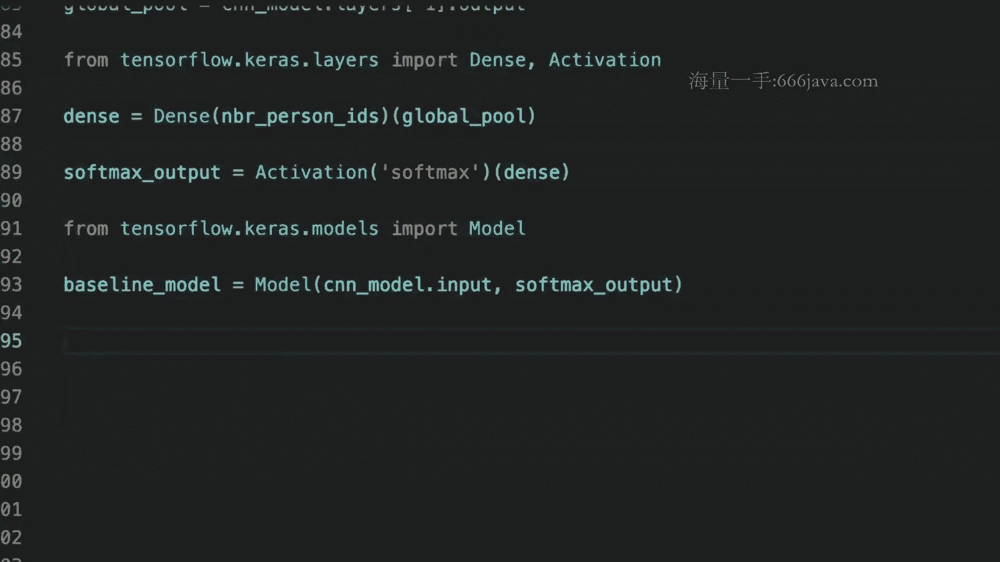


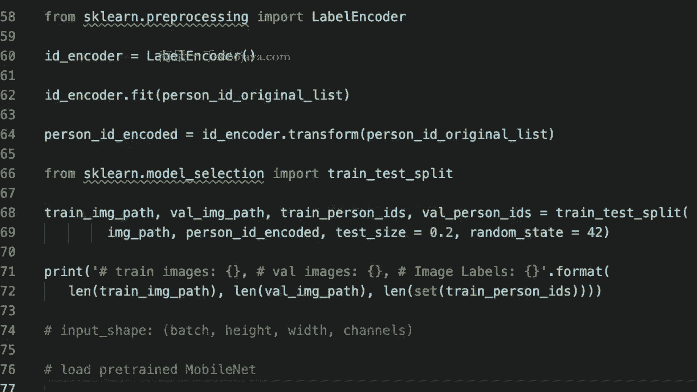


在接下来的课程中，我们将进一步完善这个流程，实现数据加载器、模型训练与评估，并最终完成一个可以提取特征并进行图像检索的完整ReID系统。