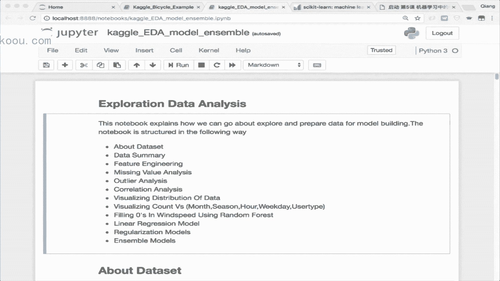

# 机器学习集训营第15期 - P10：特征工程实战指南 🛠️

在本节课中，我们将深入学习机器学习中至关重要的一环——特征工程。我们将探讨如何从原始数据中提取、清洗、构造和选择对模型预测最有用的信息，从而显著提升模型性能。

## 概述：为什么特征工程如此重要？🤔

从本次课开始，大家会陆续接触到更贴近实际算法应用的内容。在未来的面试或工作中，除了模型理论，面试官同样会非常关注你处理实际数据的感知和应用能力。这种能力并非简单的参数调整，而是对整个数据驱动方案效果的深刻影响。

我的同事在校招面试中最爱问的一个问题就是：“你知道哪些数据处理和特征工程的方法？” 这几乎是面试中的必问题目。今天，我将为大家讲解其中的核心操作，并引导大家思考：为什么需要这些处理？哪些模型需要它们？以及它们会带来什么样的影响？

特征工程，即 Feature Engineering，在市面上很少有专门的书籍讲解，但它却是实战中的核心。大家需要更多地关注“为什么要做这个处理”以及“处理后的数据会呈现什么形态”。

---

## 一、 特征工程的定义与意义 🎯

**特征**指的是从原始数据中抽取出来的、对预测结果有用的信息。人工智能远没有想象中那么智能，它需要大量的人工环节。原始数据往往杂乱无章，且包含许多计算机无法直接理解的形式（如文本、类别）。

**特征工程**就是结合计算机知识和特定领域的专业知识，将原始数据处理成能让机器学习算法发挥更好作用的数据表达形态。它是一个偏工程和实践的过程，核心在于对数据的理解和思考。

在工业界，我们更青睐**简单但效果好的模型**。这类模型可控性高、线上复杂度低、可解释性强。如果我们能抽取足够好的特征，简单的模型（如逻辑回归）效果不一定比复杂的深度学习模型差。

一个优秀的数据驱动方案需要三部分技能：
1.  **开发技能**：能够写代码实现想法和分析数据。
2.  **机器学习理论技能**：理解模型原理，指导调参。
3.  **领域知识**：对业务场景的深刻理解，这是特征工程的基础。

**核心公式**：`最终模型效果 = 数据质量(特征工程) + 模型选择 + 调优`

---

## 二、 特征工程的工作量占比 ⏳

在互联网公司或数据科学比赛中，大约 **60%到70%** 的时间会花在数据处理和特征工程上，只有约30%的时间花在模型上。因为模型的套路相对固定，而前期对数据的理解程度和特征表达的有效性，将极大程度地决定最终结果的排名上限。

一个有效的特征抽取可能带来**百分位级别的提升**，而单个模型的调参优化通常只在千分位波动。因此，当你的排名还在几百名时，应重点关注数据和场景；当进入前20名冲刺冠军时，才需要深入研究模型融合等技巧。

---

## 三、 数据采集与清洗 🧹

### 数据采集
虽然数据采集通常不由算法工程师直接完成，但我们需要思考：**哪些数据对结果预估有帮助？这些数据能否采集到？**

例如，在电商推荐场景中，商品在搜索结果中的“位置”特征对点击率预估非常有效。但在线上实时预估时，我们无法提前知道商品会被排在哪个位置，因此这个特征在模型训练时可用，上线时却无法获取。我们需要考虑特征的**线上可获取性**和**计算效率**。

### 数据清洗：垃圾进，垃圾出 🗑️
机器学习模型无法区分数据的好坏，它会学习你给它的所有信息，包括噪声和错误。因此，数据清洗至关重要，它基本决定了模型效果的上限。

**脏数据示例**：
*   身高超过3米的人。
*   一个月购买生活用品花费10万元的用户。

**处理方法**：
1.  **基于业务常识的直接过滤**：剔除明显不可能的数据。
2.  **基于统计值的过滤（如分位数）**：例如，剔除年龄在99%分位数以上或1%分位数以下的极端值。在Pandas中，可以使用 `DataFrame.quantile()` 函数计算分位数。

**代码示例：基于分位数去除异常值**
```python
import pandas as pd
# 假设 df 是包含‘age’列的DataFrame
q_low = df[“age”].quantile(0.01)  # 1%分位数
q_high = df[“age”].quantile(0.99) # 99%分位数
df_filtered = df[(df[“age”] >= q_low) & (df[“age”] <= q_high)]
```

---

## 四、 处理不均衡数据 ⚖️

在分类问题中，正负样本数量可能严重不均衡（如疾病患者 vs 健康人、购买用户 vs 浏览用户）。如果直接使用原始数据，模型可能会偏向多数类。

**常用处理方法**：
以下是几种解决样本不均衡的策略：

1.  **采样法**
    *   **欠采样**：从多数类中随机抽取一部分样本，使其与少数类数量接近。
    *   **过采样**：对少数类样本进行复制或生成新样本。对于图像数据，可以通过旋转、平移等方式生成新样本；对于一般数据，可以使用 **SMOTE** 算法在特征空间内生成合成样本。
2.  **修改损失函数**：在计算损失时，给少数类样本更高的权重，让模型更关注它们。例如，在逻辑回归的对数损失函数中为不同类别添加权重系数。
3.  **采集更多数据**：尽可能获取更多的少数类样本数据。

---

## 五、 数值型特征处理 🔢

数值型特征是连续的，如年龄、价格、房龄。

### 1. 幅度缩放
当不同特征的数值范围差异巨大时（如房间数量：0-5，房屋均价：0-50000），对于逻辑回归、神经网络等模型，这会导致优化困难（损失函数等高线图变得又尖又窄）。我们需要将特征缩放到相似的幅度范围内。

*   **归一化**：对**行**进行处理，将样本向量转化为“单位向量”。
    `x_normalized = x / sqrt(x1^2 + x2^2 + ... + xn^2)`
*   **标准化**：对**列**进行处理，使其均值为0，标准差为1。
    `x_standardized = (x - mean(column)) / std(column)`
    在 Scikit-learn 中，使用 `StandardScaler`。

### 2. 统计值特征
除了原始值，还可以生成统计特征，如：均价、最高价、最低价、25%/75%分位数价格等。可以使用 Pandas 的 `describe()` 或 `quantile()` 函数。

### 3. 离散化（分箱/分桶）📦
将连续值分段，每段作为一个新的特征。这是特征工程中极其重要的操作，尤其在面试中常被问到。

**为什么需要离散化？**
考虑“是否让座”的场景，影响因素“年龄”与结果并非单调关系（需要照顾老人和小孩）。如果直接用连续年龄送入逻辑回归，模型权重`W`只能是正或负，无法同时照顾两头。
**解决方法**：将年龄离散化为三列：“年龄<6岁”、“6岁≤年龄≤60岁”、“年龄>60岁”。这样模型可以为不同年龄段学习独立的权重，解决了非单调性问题。

**离散化方法**：
*   **等距切分**：按值域均匀分段。问题：数据分布可能不均匀，导致某些桶内数据很少。
*   **等频切分**：按样本数量均匀分段，使每个桶内样本数大致相同。更常用。
在 Pandas 中，等距切分用 `pd.cut()`，等频切分用 `pd.qcut()`。

**核心要点**：需要离散化的是**逻辑回归、神经网络**这类模型。**树模型（如决策树、随机森林）天生就能处理连续值并产生分裂规则，因此不需要提前做离散化**。

---

## 六、 类别型特征处理 🏷️

类别型特征是离散的，计算机无法理解，如口红色号、衣服尺码、星期几。

### 1. 标签编码
用数字直接映射类别，如{红:1， 绿:2， 蓝:3}。
**问题**：引入了不应存在的顺序关系（如蓝色“大于”绿色），可能误导模型。

### 2. 独热向量编码
为每个类别创建一个新的二值特征列。例如，颜色有红、绿、蓝、黄四种，就创建四列：`is_red`, `is_green`, `is_blue`, `is_yellow`。样本属于哪个颜色，对应列即为1，其余为0。
这种方法消除了顺序性，使每个类别平等。在 Pandas 中，使用 `pd.get_dummies()`。

### 3. 哈希技巧与统计编码
*   **文本的词袋模型**：将文本表示为一个大向量，每个维度对应一个词，出现则为1，否则为0。这丢失了词序信息。
*   **N-Gram**：为了捕捉词序，可以同时记录单个词和连续出现的词对（bigram）、三元组（trigram）等。
*   **TF-IDF**：更高级的文本特征，不仅考虑词频，还考虑词的逆文档频率，以衡量词对文档的重要性。
*   **基于统计的编码**：例如，统计“男性”和“女性”用户中“爱好”的分布比例（如：男性中2/3爱足球，1/3爱散步，0爱看剧），然后将这个分布向量作为新的特征拼接到对应性别的样本上。

---

## 七、 时间型特征处理 ⏰

时间可以当作连续值（如浏览时长、距离上次购买的天数），也可以离散化。

**离散化思路**：
*   一天中的时间段（如上班高峰、午休、夜晚）。
*   一周中的星期几（工作日 vs 周末）。
*   一年中的第几周（可能与特定节日相关）。
*   是否节假日，距离大型促销日（如双十一）的天数。
时间戳可以通过编程提取出年、月、日、小时、星期几等组件，这些组件通常需要作为类别型特征进一步处理（如独热编码或离散化）。

---

## 八、 特征组合与交互 🤝

单一特征可能不够，组合特征能捕捉更复杂的模式。

1.  **简单组合**：例如，将“用户ID”和“商品类别ID”组合成一个新特征，只有当该用户浏览该类别商品时，此特征才为1。
2.  **基于模型组合**：使用**决策树、GBDT、随机森林**等模型先对数据训练。树模型产生的每一条从根到叶子的路径，本质上就是一系列特征的组合条件。我们可以将这些路径或子路径作为新的组合特征。这种方法比人工拍脑袋组合更有效。

---

## 九、 特征选择 🎯

当特征维度非常高时（例如通过特征工程产出数千维），需要选择最重要的特征，以降低计算成本、防止过拟合、去除冗余。

特征选择与降维不同：**特征选择是剔除不相关的特征列；降维是将高维特征映射到低维空间，试图保留大部分信息**。

### 1. 过滤式
独立评估每个特征与目标变量的相关性（如皮尔逊相关系数），选择相关性最高的特征。
**缺点**：未考虑特征之间的相互作用。
**Scikit-learn工具**：`SelectKBest`, `SelectPercentile`

### 2. 包裹式
将特征选择看作一个特征子集搜索问题。典型方法是**递归特征消除**。
**步骤**：
    1.  用全部特征训练一个能提供特征重要度的模型（如逻辑回归、随机森林）。
    2.  剔除最不重要的特征（如后5%）。
    3.  用剩下的特征重新训练模型，评估性能。
    4.  重复2-3步，直到性能显著下降。
**Scikit-learn工具**：`RFE` (Recursive Feature Elimination)

### 3. 嵌入式
利用模型训练过程本身进行特征选择。最典型的是使用**线性模型（逻辑回归、线性SVM）结合L1正则化**。
**原理**：L1正则化具有稀疏化效应，会使许多不重要的特征的权重直接变为0。训练完成后，权重非零的特征即被选中。
**适用场景**：特别适用于**高维稀疏特征**（如经过独热编码后的特征）。对于稠密特征效果一般。
**Scikit-learn工具**：使用带 `penalty=‘l1’` 的 `LogisticRegression` 或 `LinearSVC`，并结合 `SelectFromModel`。

---

## 十、 实战案例与数据分析流程 📊

特征工程离不开**探索性数据分析**。通过可视化（如箱线图发现异常值、折线图观察时间趋势、热力图查看特征相关性）和统计分析，我们能深刻理解数据分布，从而指导特征构造、清洗和选择。

一个完整的流程通常包括：
1.  数据加载与概览。
2.  缺失值分析与处理。
3.  异常值检测与处理。
4.  单变量与多变量分析（分布、相关性）。
5.  特征构造与变换。
6.  特征选择。
7.  模型训练与评估。

---

## 总结 📝

本节课我们一起深入学习了机器学习的核心实战环节——特征工程。我们明确了它的定义与重要性，了解了数据清洗和样本均衡处理的必要性，并系统性地掌握了针对**数值型**、**类别型**、**时间型**特征的各种处理方法，如离散化、独热编码、TF-IDF等。我们还学习了如何通过**特征组合**创造更强大的特征，以及如何利用**过滤式、包裹式、嵌入式**三种方法进行特征选择，以优化模型效率与性能。




记住，好的特征工程能让简单的模型发挥出强大的威力。它需要你对数据充满好奇，对业务深入理解，并熟练运用各种数据处理工具。希望大家能将今天所学应用到实际项目和比赛中，不断积累经验。