# 课程 1447-七月在线-机器学习集训营15期 - P15：08-NLP-4-智能问答机器人项目的部署、总结 📚🤖


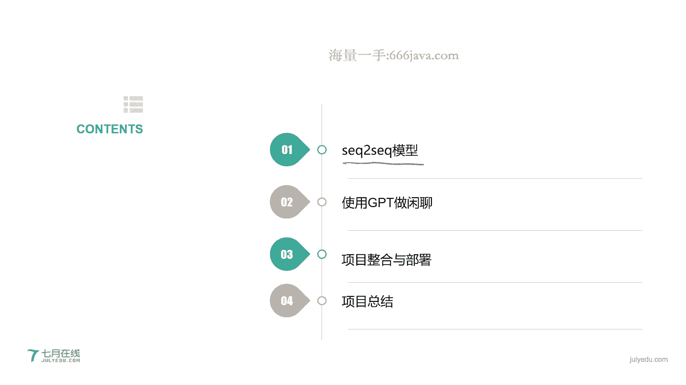


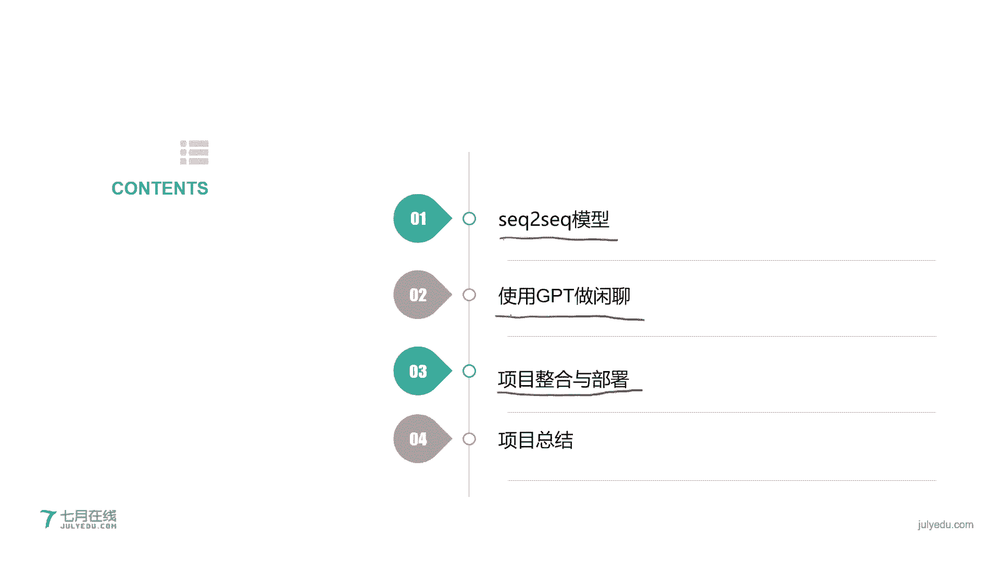


在本节课中，我们将学习智能问答机器人项目的最后一部分，包括生成式闲聊模型的核心原理、项目整合与部署方法，并对整个项目进行总结。

## 第一部分：Sequence-to-Sequence 模型详解 🧠

上一节我们介绍了检索式问答模型。本节中，我们来看看用于生成式闲聊的 Sequence-to-Sequence 模型。

Sequence-to-Sequence 模型用于对序列的 item 进行建模。例如，文本数据由一个个词或字组成，这些词或字被称为 item。模型接收一个输入序列，并输出一个目标序列。

该模型的核心结构分为两个部分：编码器（Encoder）和解码器（Decoder）。

*   **编码器**：处理输入序列。它将输入值经过一系列特征提取，得到一个上下文向量（context vector）。
*   **解码器**：接收编码器输出的上下文向量，并逐个生成新的输出序列。

上下文向量的维度取决于编码器的输出。如果编码器使用 RNN 结构，其隐藏状态（hidden state）的维度就是上下文向量的维度。

Sequence-to-Sequence 模型属于多模态模型，可以处理不同类型的数据转换，例如：
*   文本到文本：机器翻译
*   图片到文本：看图说话
*   音频到文本：语音识别
*   文本到图片：根据描述生成图片

### 训练过程与预测过程的区别

我们以中英翻译为例，说明训练和预测的区别。

**训练过程**：
模型已知输入（如中文句子）和输出（如英文句子）。在训练时，解码器的输入会在目标句子前添加一个起始符（如 `<S>`），并让输出与输入错开一个位置。模型的目标是预测出偏移后的序列，包括最后的结束符（如 `</S>`）。

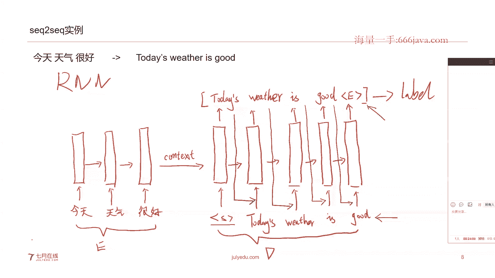


**预测过程**：
模型只有编码器的输入。解码器首先接收一个起始符和上下文向量，预测出第一个词。然后，将这个预测出的词作为下一个时间步的输入，依次循环，直到模型预测出结束符，整个过程结束。

**核心公式**：
在训练阶段，我们希望最大化目标序列的条件概率：
`P(y1, y2, ..., yT | x1, x2, ..., xS)`
其中 `x` 是输入序列，`y` 是目标序列。模型通过编码器-解码器结构来学习这个分布。

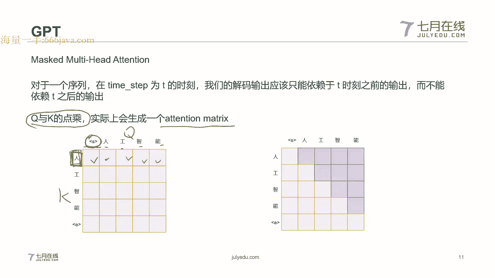


**关键点**：必须区分训练和预测过程。训练时解码器有完整的输入（起始符+目标序列），而预测时解码器只能依赖已生成的词和起始符进行自回归生成。

## 第二部分：基于 GPT 的闲聊模型 🤖💬

理解了基础的 Seq2Seq 模型后，本节我们来看看基于 Transformer 解码器的 GPT 模型如何用于闲聊。

GPT 模型与之前介绍的 BERT 模型（属于 Transformer 编码器）不同。GPT 的核心是使用了 **Masked Multi-Head Attention** 的 Transformer 解码器。

### Masked Multi-Head Attention 的作用

在标准的 Attention 中，每个词可以关注到序列中所有词的信息。但在文本生成任务中，当前时刻的预测只能依赖于已生成的上文，不能“偷看”未来的词，否则会造成标签泄漏。

Masked Multi-Head Attention 通过一个掩码矩阵来解决这个问题。该矩阵将当前词之后所有位置的注意力权重设置为零，从而确保模型在生成每个词时，只关注它前面的词。

**实现思路**：
生成一个下三角矩阵（对角线及左侧为1，右侧为0），与计算出的注意力权重矩阵进行对位相乘，将“未来”位置的权重归零。

### GPT 与 BERT 的区别

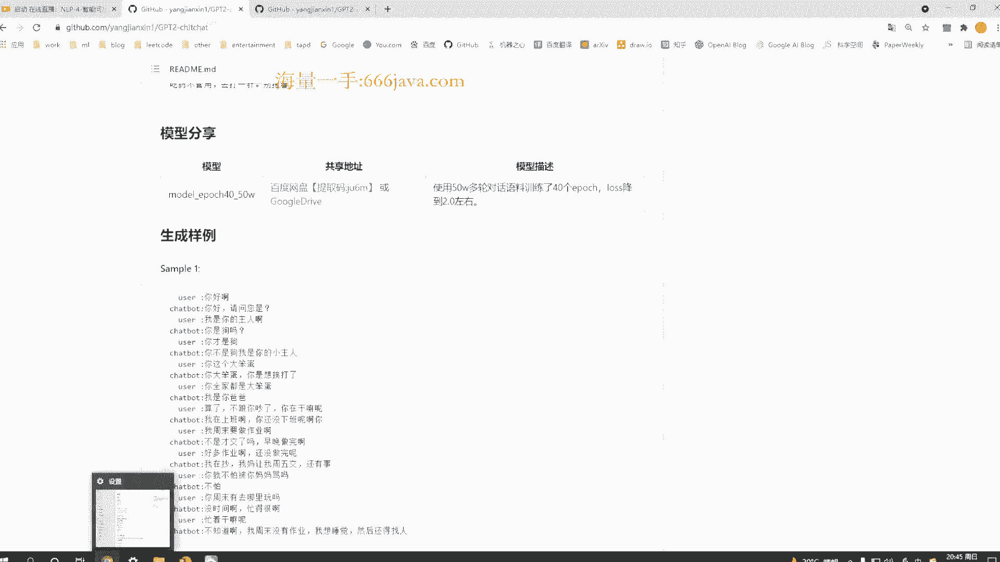

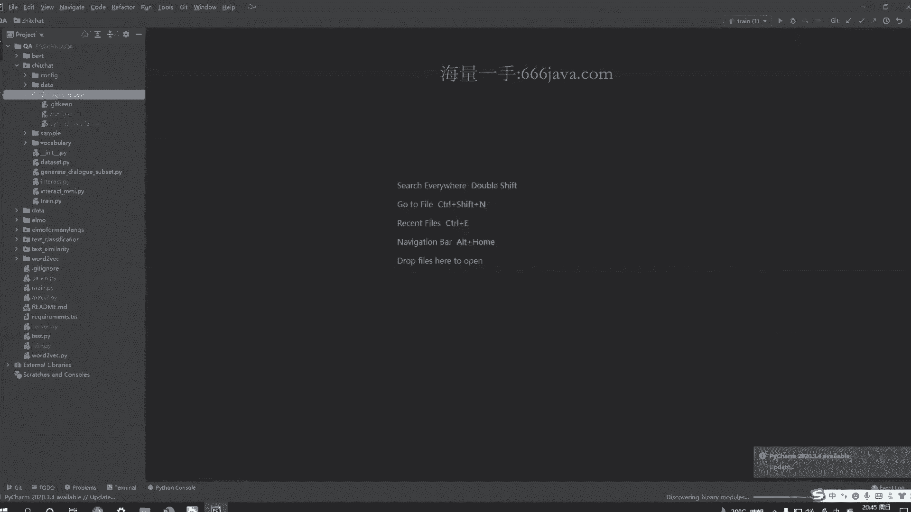

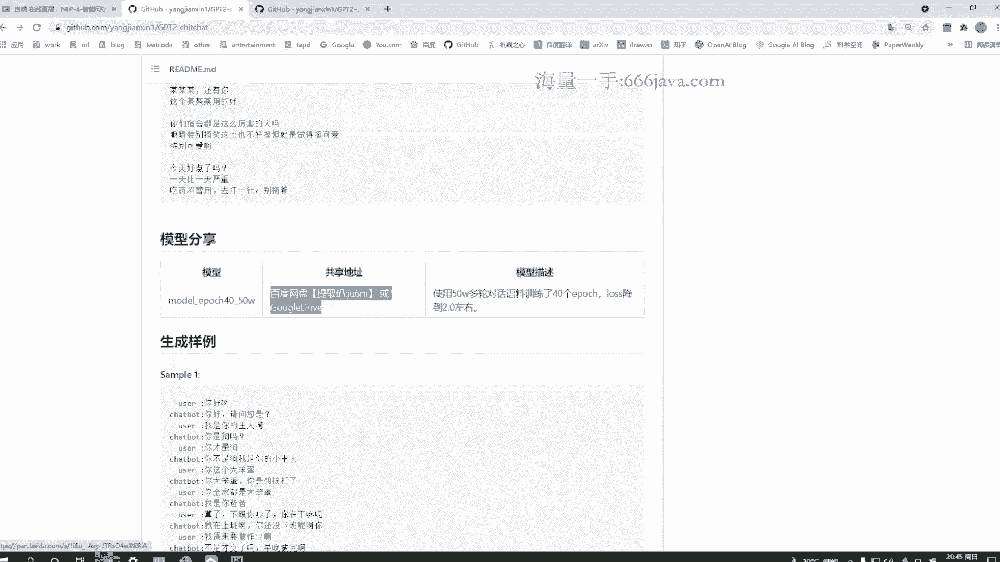


*   **BERT**：使用 Transformer 编码器，通过掩码随机单词进行训练，旨在理解上下文。
*   **GPT**：使用 Masked Transformer 解码器，通过给定上文预测下一个词进行训练，旨在生成文本。

GPT 是一个自回归语言模型，给定一个起始符，它可以续写出一段文本。

### DialogGPT：用于对话的 GPT

DialogGPT 的思路是将多轮历史对话拼接起来，作为模型的输入，让模型生成下一句回复。

**训练**：使用大量的对话数据，将历史对话和回复拼接后输入 GPT 模型进行训练。
**预测**：将当前对话历史输入模型，模型会生成一个回复。然后将这个回复加入历史，继续下一轮生成。

对于资源有限的开发者，可以使用开源的预训练 DialogGPT 模型，无需从头训练。

### 文本生成的解码策略

模型输出时，会对词典做 softmax 得到每个词的概率。如何根据概率选择输出的词，有不同的解码策略。

**1. Greedy Search（贪心搜索）**
每次选择当前概率最高的词。
*   **缺点**：可能不是全局最优解，容易生成重复、枯燥的文本。

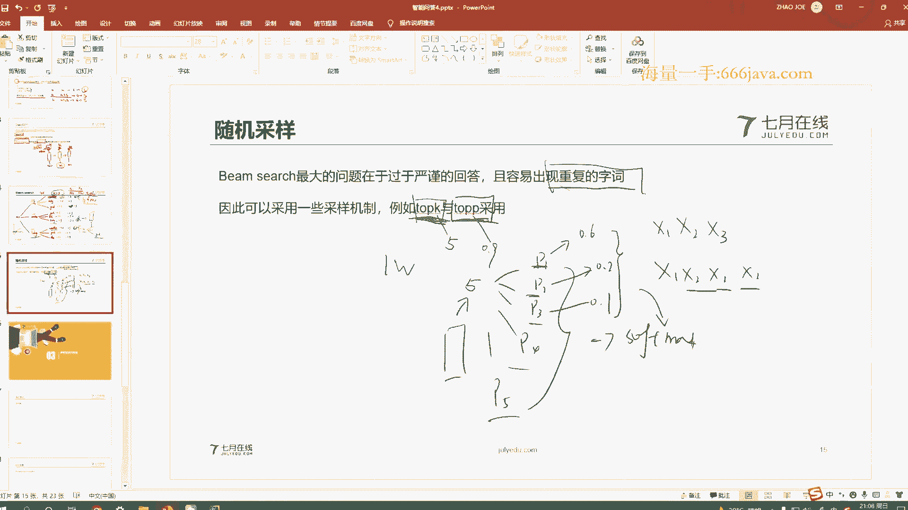

**2. Beam Search（束搜索）**
每次保留概率最高的 top-k 个候选序列（k 为束宽），在下一步中为这些候选序列分别扩展，始终保留整体概率最高的 k 个序列。
*   **优点**：比贪心搜索更可能找到全局更优解。
*   **缺点**：计算量更大；在闲聊等任务中可能过于刻板，缺乏多样性。

**3. 采样（Sampling）**
为了增加生成文本的多样性，可以采用基于概率的采样。
*   **Top-k Sampling**：从概率最高的 k 个词中，根据其概率分布进行采样。
*   **Top-p Sampling (Nucleus Sampling)**：从累积概率达到 p 的最小词集合中，根据其概率分布进行采样。

在闲聊任务中，通常使用采样策略来获得更有趣、更多样的回复。

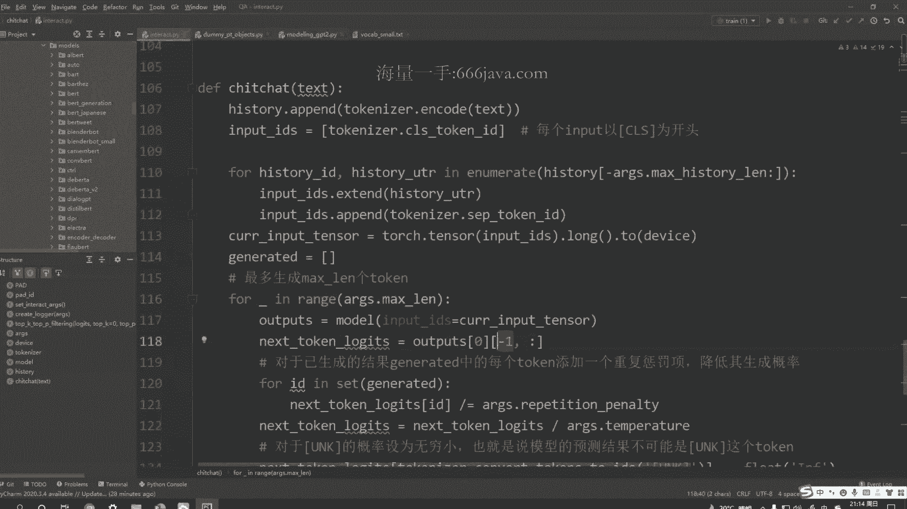

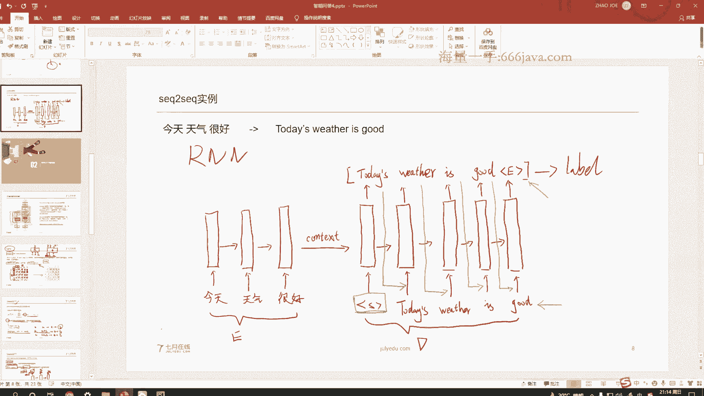

## 第三部分：项目整合与部署 🚀

前面我们分别完成了分类、检索和闲聊模块。本节中，我们来看看如何将它们整合成一个完整的流程，并进行简单的部署。

### 项目流程整合

完整的智能问答流程如下：
1.  **意图识别**：用户问题输入后，首先用分类模型判断是“闲聊”还是“专业问题”。
2.  **闲聊处理**：若为闲聊，则调用 DialogGPT 模型生成回复。
3.  **专业问题处理**：若为专业问题，进入检索式流程：
    a.  **召回**：使用词向量计算余弦相似度，从问答库中召回最相似的 Top-K 个问题。
    b.  **精排**：将召回的 K 个问题与用户问题配对，输入 ESIM 等深度匹配模型进行精细排序，选出最相似的问题。
    c.  **返回答案**：返回精排后最相似问题对应的答案。

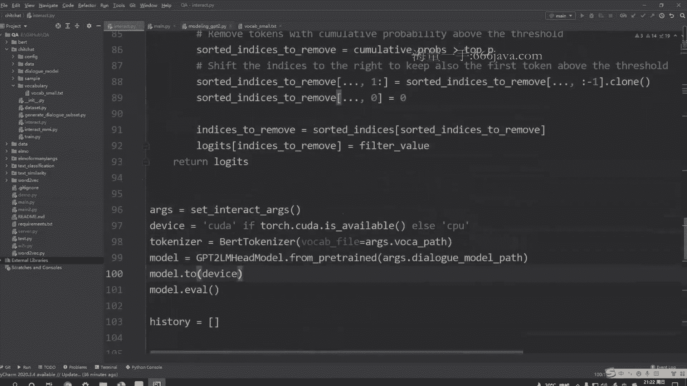

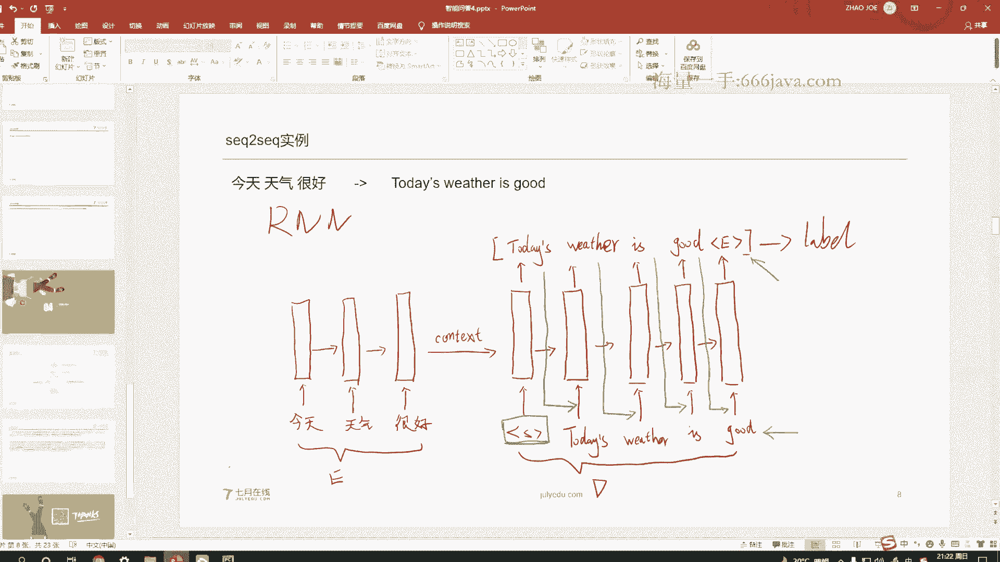


以下是核心代码逻辑的示意：

```python
# 伪代码示意
user_input = get_user_input()
intent = intent_classifier.predict(user_input)

if intent == "闲聊":
    response = dialog_gpt.chat(user_input, history)
else:
    # 检索式问答
    recalled_questions = retrieve_topk_with_word2vec(user_input, k=10)
    best_match_index = esim_model.rank(user_input, recalled_questions)
    response = answer_library[best_match_index]

return response
```

### 项目部署简介

一个简单的服务化部署方案是：**Flask + Gunicorn + Docker**。

*   **Flask**：一个轻量级 Python Web 框架，用于快速构建提供问答接口的 API 服务。
*   **Gunicorn**：一个 Python WSGI HTTP 服务器。使用多进程/多 worker 模式，可以提高服务的并发处理能力，避免请求排队。
*   **Docker**：容器化技术。将应用程序及其所有依赖项打包成一个镜像，可以在任何支持 Docker 的环境中一键部署和运行，保证了环境的一致性，极大简化了多服务器部署的流程。

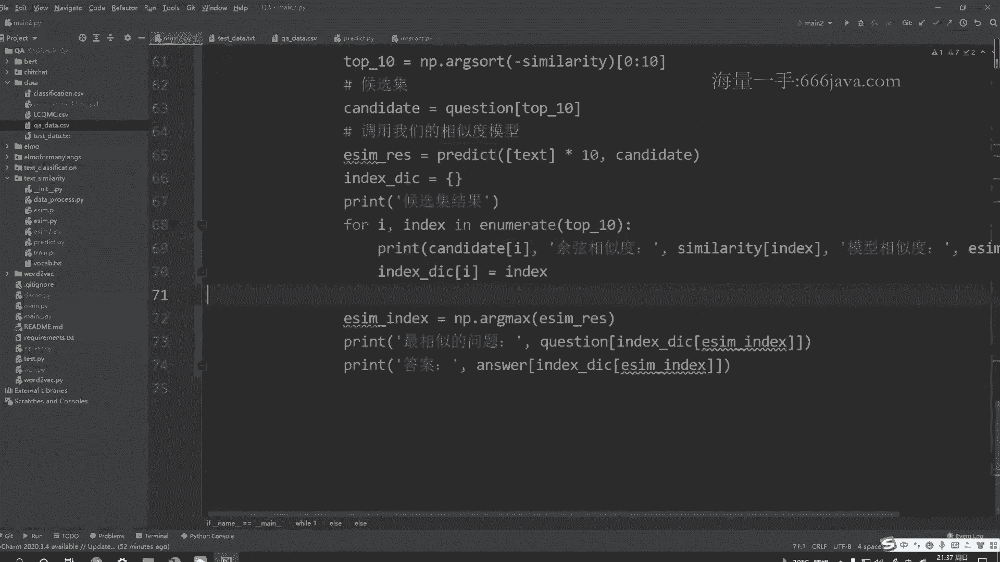

**Flask API 示例**：
```python
from flask import Flask, request
from your_qa_pipeline import qa_pipeline

app = Flask(__name__)

@app.route('/qa', methods=['GET'])
def answer_question():
    user_text = request.args.get('text', '')
    answer = qa_pipeline(user_text) # 调用整合好的问答流程
    return answer

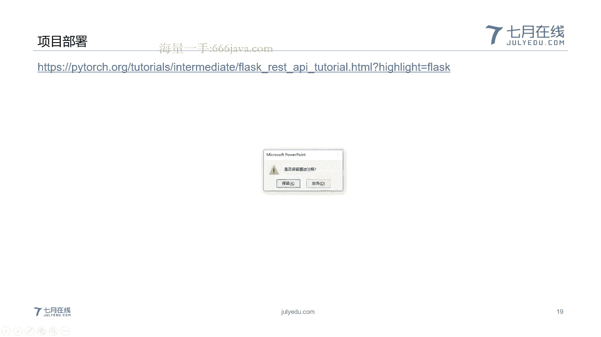

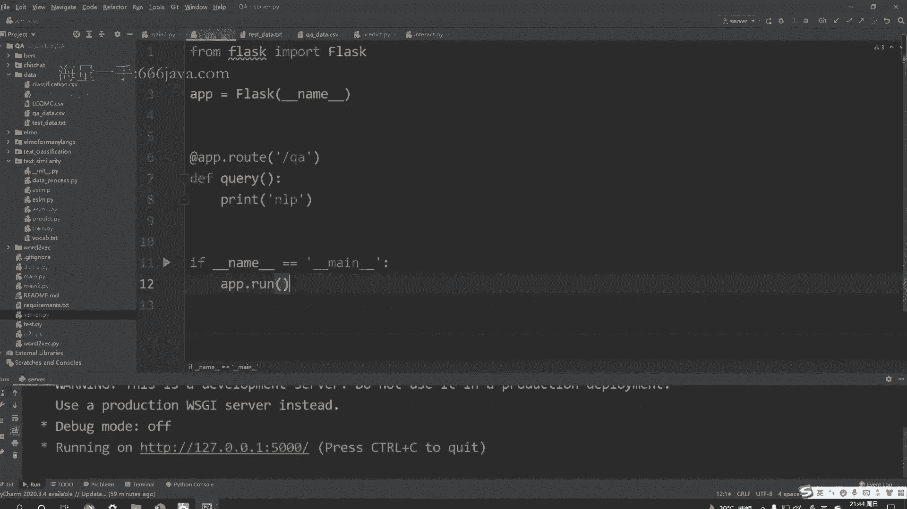

if __name__ == '__main__':
    app.run(host='0.0.0.0', port=5000)
```
运行后，可通过访问 `http://服务器IP:5000/qa?text=你的问题` 来获取答案。


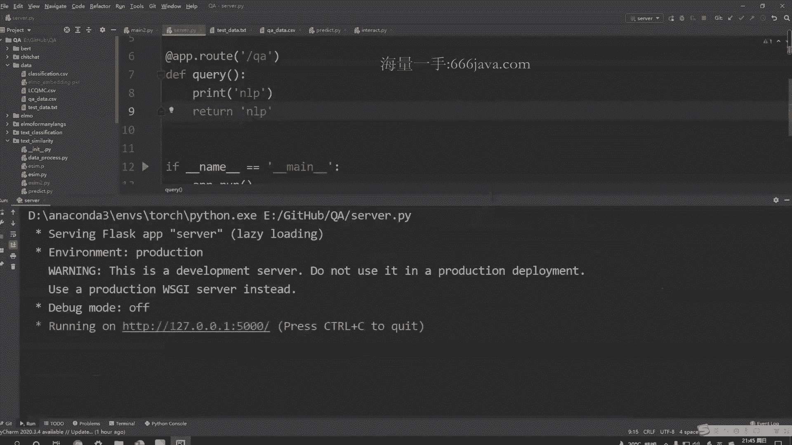


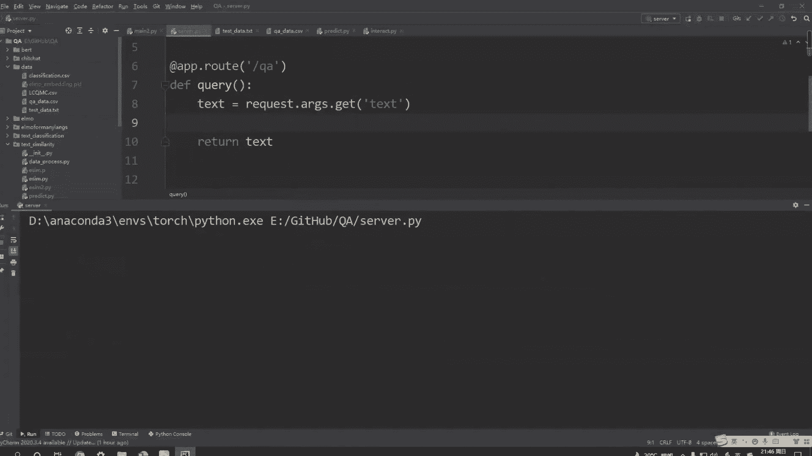

## 第四部分：项目总结与展望 🎯


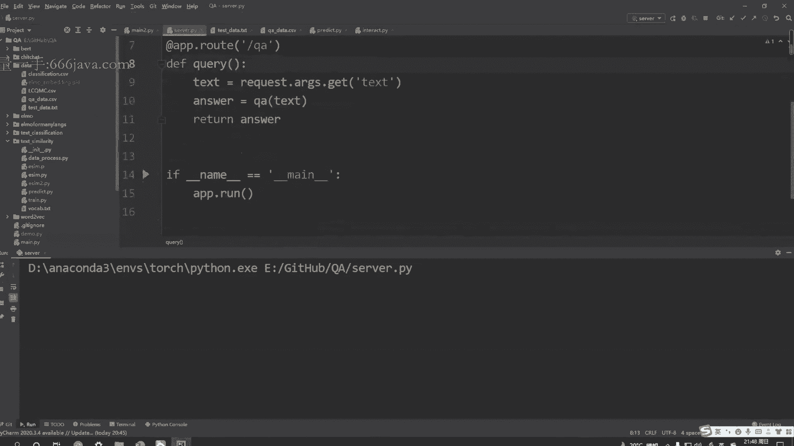

本节课中我们一起学习了智能问答机器人项目的收官部分。


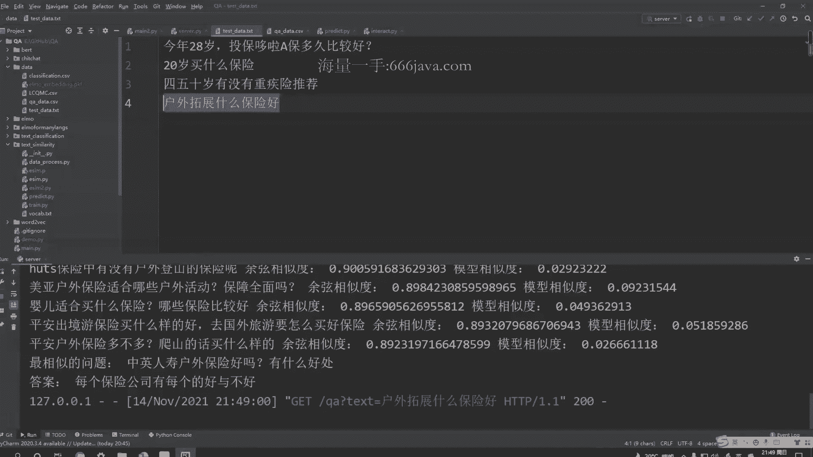


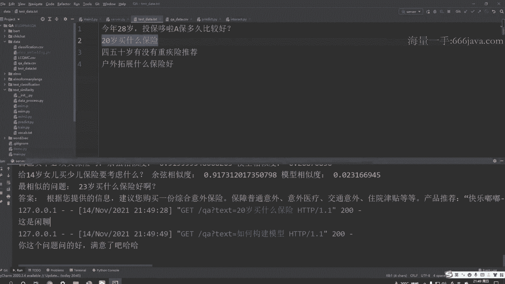


我们回顾了整个项目的架构：通过意图识别分流，闲聊场景使用生成式模型（如 GPT），专业问答场景使用检索式模型（召回+精排）。我们深入探讨了 Seq2Seq 和 GPT 模型的原理，以及文本生成的解码策略。最后，我们将所有模块整合，并介绍了使用 Flask 进行服务化部署的基本方法。

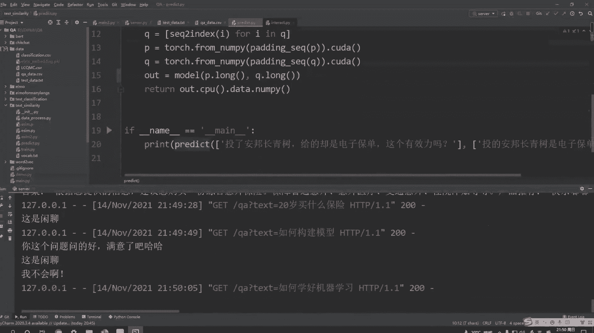


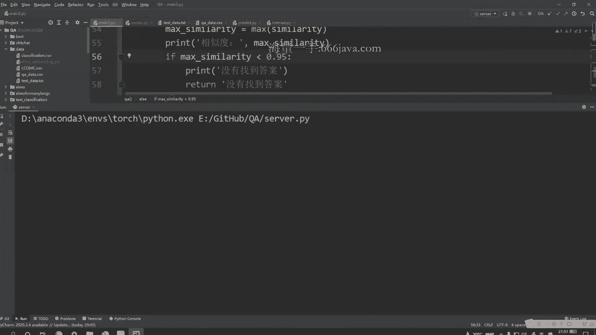

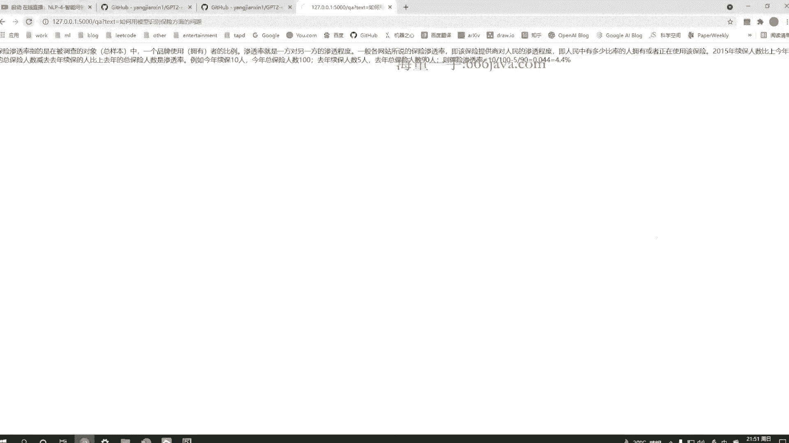

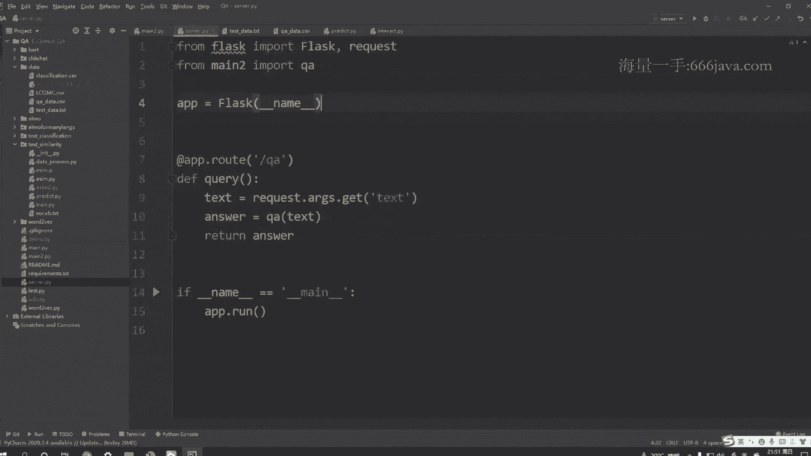

### 项目优化方向


这个项目提供了一个完整的基线系统，在实际应用中还有许多优化空间：

1.  **意图识别**：可以识别更多意图（如问候、查询、投诉等），并可尝试 BERT、TextCNN 等更强大的分类模型。
2.  **检索模块**：
    *   **召回**：将简单的词向量替换为 Sentence-BERT 等句子向量模型，召回效果会更好。
    *   **精排**：可以尝试 BERT Cross-Encoder、SimCSE 等更先进的语义匹配模型。
3.  **生成模块**：可以尝试 T5、BART 等其他先进的生成模型，或在自己的领域数据上对 DialogGPT 进行微调。
4.  **部署**：考虑性能、监控、日志、负载均衡等生产级需求。

### 给算法工程师的建议

*   **复现能力**：能够阅读并复现论文是核心能力。可以从阅读开源代码开始，结合论文理解原理。
*   **持续学习**：AI 领域发展迅速，需要持续关注前沿技术（如大模型、提示工程等），并思考如何应用于业务。
*   **业务结合**：理解业务需求比单纯追求模型复杂度更重要。最好的模型不一定是最复杂的，而是最适合当前业务场景和数据条件的。

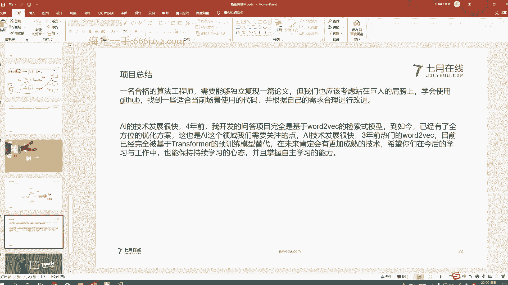


希望本课程能帮助你建立起构建一个完整 AI 项目的思维框架和实践能力。祝你在学习和工作的道路上不断进步！