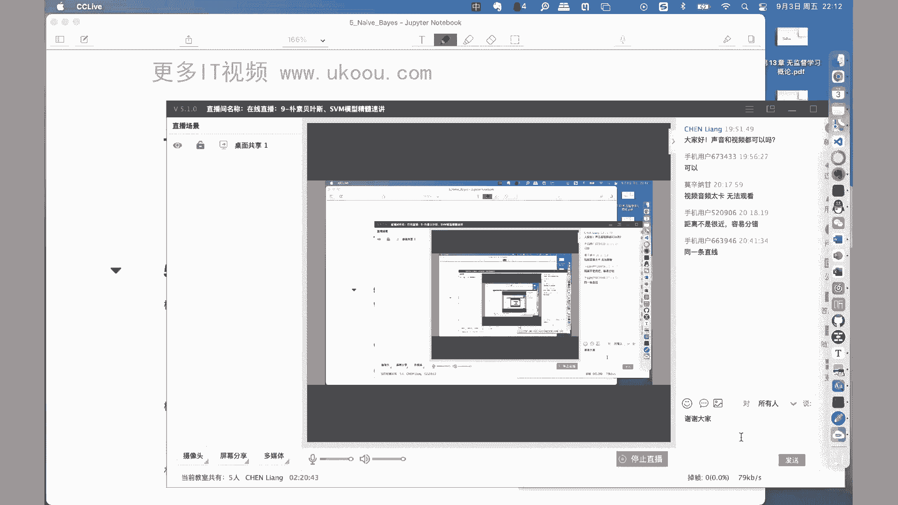

# 机器学习集训营第15期 - P17：朴素贝叶斯与SVM模型精髓速讲 📚


在本节课中，我们将学习两个在机器学习领域至关重要的模型：支持向量机（SVM）和朴素贝叶斯。我们将从SVM的硬间隔、软间隔、核技巧等核心概念讲起，然后探讨朴素贝叶斯模型的基本原理、条件独立性假设及其应用。课程内容力求简单直白，让初学者能够轻松理解。

---

## 概述 📖

本节课我们将深入探讨支持向量机（SVM）和朴素贝叶斯模型。SVM是一种强大的分类模型，尤其擅长处理高维数据和非线性问题。朴素贝叶斯则是一种基于概率论的分类方法，简单高效，常用于文本分类等场景。我们将从基本原理出发，逐步讲解它们的核心思想、数学推导以及实际应用。

---

## 第一部分：支持向量机（SVM）模型精髓 🧠

上一节我们介绍了决策树模型，本节中我们来看看支持向量机（SVM）。SVM在深度学习兴起之前，是机器学习领域最重要的模型之一。它不仅在理论上具有重要意义，在实际工作中也常作为性能评估的基准线。

### 1. 硬间隔支持向量机（线性可分）

首先，我们需要明确SVM要解决的问题。给定一个线性可分的数据集 `T = {(x1, y1), (x2, y2), ..., (xn, yn)}`，其中 `xi ∈ R^n` 是特征向量，`yi ∈ {+1, -1}` 是类别标签。SVM的目标是找到一个最优的超平面 `w·x + b = 0`，将两类样本分开，并且使得两类样本到该超平面的**间隔**最大化。

**核心概念：函数间隔与几何间隔**
*   **函数间隔**：对于样本点 `(xi, yi)`，其函数间隔定义为 `γ̂_i = yi(w·xi + b)`。它表示分类预测的确信度。
*   **几何间隔**：对于样本点 `(xi, yi)`，其几何间隔定义为 `γ_i = yi(w·xi + b) / ||w||`。它表示该点到超平面的实际欧氏距离。

**优化目标**
SVM的核心思想是**间隔最大化**，即找到使所有样本点中**最小的几何间隔**尽可能大的超平面。这可以转化为以下凸二次规划问题：
```
min_(w,b) (1/2) * ||w||^2
s.t. yi(w·xi + b) >= 1, i = 1, 2, ..., n
```
这里，`||w||^2` 的最小化等价于几何间隔 `(1/||w||)` 的最大化。约束条件 `yi(w·xi + b) >= 1` 确保了所有样本点的函数间隔至少为1（通过缩放 `w` 和 `b` 总可以做到）。

**求解方法：拉格朗日乘子法**
为了求解上述带约束的优化问题，我们引入拉格朗日乘子 `αi >= 0`，构建拉格朗日函数：
```
L(w, b, α) = (1/2)||w||^2 - Σ_{i=1}^{n} αi [yi(w·xi + b) - 1]
```
通过求解其对 `w` 和 `b` 的偏导并令其为零，我们可以将原问题转化为其对偶问题：
```
max_α Σ_{i=1}^{n} αi - (1/2) Σ_{i=1}^{n} Σ_{j=1}^{n} αi αj yi yj (xi·xj)
s.t. Σ_{i=1}^{n} αi yi = 0, αi >= 0
```
求解这个对偶问题（通常使用SMO算法）得到最优的 `α*`，进而可以计算出最优的超平面参数：
```
w* = Σ_{i=1}^{n} αi* yi xi
b* = yj - Σ_{i=1}^{n} αi* yi (xi·xj) （对于任意支持向量 `xj`）
```
最终的分类决策函数为：
```
f(x) = sign(w*·x + b*)
```

### 2. 软间隔支持向量机（线性不可分）

在实际问题中，数据往往不是严格线性可分的，或者存在噪声。硬间隔SVM会因此失效。为此，我们引入**软间隔**概念，允许一些样本点不满足严格的间隔约束。

**核心修改：引入松弛变量**
我们为每个样本点引入一个松弛变量 `ξi >= 0`，并修改优化问题：
```
min_(w,b,ξ) (1/2) * ||w||^2 + C * Σ_{i=1}^{n} ξi
s.t. yi(w·xi + b) >= 1 - ξi, i = 1, 2, ..., n
       ξi >= 0
```
其中，`C > 0` 是一个惩罚参数，用于控制对误分类的惩罚力度。`C` 越大，对误分类的容忍度越低，模型越倾向于将所有样本正确分类（可能过拟合）；`C` 越小，则允许更多的误分类（可能欠拟合）。

**求解思路**
软间隔SVM的求解过程与硬间隔类似，同样使用拉格朗日乘子法转化为对偶问题求解，只是拉格朗日乘子 `αi` 多了一个上界约束 `αi <= C`。

### 3. 非线性支持向量机与核技巧 🌀

上一节我们介绍了如何处理近似线性可分的数据，本节中我们来看看如何用SVM处理完全非线性可分的数据。核技巧是SVM处理非线性问题的关键。

**核心思想：映射到高维空间**
对于在原始特征空间中线性不可分的数据，我们可以通过一个映射函数 `φ(x)` 将其映射到一个更高维（甚至是无穷维）的特征空间。在这个新空间中，数据可能变得线性可分。然后，我们在高维空间中应用线性SVM。

**核技巧的妙处**
直接计算高维空间中的内积 `φ(xi)·φ(xj)` 可能非常复杂甚至不可行。核技巧指出，存在一个**核函数** `K(xi, xj)`，它能在原始空间中直接计算，其结果等于映射后高维空间中的内积，即：
```
K(xi, xj) = φ(xi)·φ(xj)
```
这样，我们无需知道映射函数 `φ(x)` 的具体形式，也无需在高维空间中进行复杂计算，只需在原始空间中计算核函数即可。SVM的对偶问题中只涉及样本间的内积 `(xi·xj)`，因此只需将其替换为核函数 `K(xi, xj)`：
```
max_α Σ_{i=1}^{n} αi - (1/2) Σ_{i=1}^{n} Σ_{j=1}^{n} αi αj yi yj K(xi, xj)
s.t. Σ_{i=1}^{n} αi yi = 0, 0 <= αi <= C
```
最终的决策函数变为：
```
f(x) = sign( Σ_{i=1}^{n} αi* yi K(xi, x) + b* )
```

**常用核函数**
以下是两种最常用的核函数：
1.  **多项式核函数**：`K(x, z) = (x·z + c)^d`，其中 `d` 为多项式次数。
2.  **高斯核函数（RBF核）**：`K(x, z) = exp(-γ * ||x - z||^2)`，其中 `γ` 为参数，控制高斯函数的宽度。

### 4. 序列最小优化（SMO）算法 ⚙️

SMO算法是用于高效求解SVM对偶问题的一种常用方法。其基本思想是：每次只选择两个拉格朗日乘子 `αi` 和 `αj` 进行优化，固定其他所有乘子。由于存在约束 `Σ αi yi = 0`，两个变量之间具有线性关系，因此每次优化实际上是一个单变量的二次规划问题，可以解析求解。通过反复选择并优化变量对，直至满足收敛条件。

---

## 第二部分：朴素贝叶斯模型精髓 📊

在了解了基于间隔最大化的SVM后，我们转向另一种基于概率论的经典分类模型——朴素贝叶斯。它的核心是贝叶斯定理和特征条件独立性假设。

### 1. 概率基础：加法规则与乘法规则

在深入朴素贝叶斯之前，需要回顾两个基本的概率规则，它们贯穿于所有概率图模型的推导。

以下是两个核心规则：
*   **加法（求和）规则**：`P(X) = Σ_Y P(X, Y)`。边缘概率可以通过对联合概率求和得到。
*   **乘法（乘积）规则**：`P(X, Y) = P(X|Y) * P(Y) = P(Y|X) * P(X)`。联合概率可以分解为条件概率和边缘概率的乘积。

### 2. 朴素贝叶斯原理

朴素贝叶斯模型用于解决分类问题。给定训练数据集 `T = {(x1, y1), ..., (xn, yn)}`，其中 `xi` 是n维特征向量，`yi ∈ {c1, c2, ..., cK}` 是类别标签。

**核心假设：条件独立性**
这是“朴素”一词的由来。该假设认为，在给定类别 `Y = ck` 的条件下，所有特征 `X1, X2, ..., Xn` 是相互独立的。即：
```
P(X1=x1, X2=x2, ..., Xn=xn | Y=ck) = Π_{j=1}^{n} P(Xj=xj | Y=ck)
```
这个假设极大地简化了计算，但现实中特征之间往往存在关联，这也是模型性能可能受限的原因。

**模型推导：基于贝叶斯定理**
我们的目标是计算给定特征 `x` 后，它属于各个类别 `ck` 的后验概率 `P(Y=ck | X=x)`，并选择概率最大的类别作为预测结果。
根据贝叶斯定理和乘法规则：
```
P(Y=ck | X=x) = P(X=x | Y=ck) * P(Y=ck) / P(X=x)
```
利用条件独立性假设：
```
P(Y=ck | X=x) = [ Π_{j=1}^{n} P(Xj=xj | Y=ck) ] * P(Y=ck) / P(X=x)
```
对于同一个输入 `x`，分母 `P(X=x)` 是相同的，因此比较后验概率时只需比较分子部分。朴素贝叶斯分类器表示为：
```
y = argmax_{ck} [ P(Y=ck) * Π_{j=1}^{n} P(Xj=xj | Y=ck) ]
```

### 3. 参数估计：极大似然估计

在训练阶段，我们需要从数据中估计先验概率 `P(Y=ck)` 和条件概率 `P(Xj=ajl | Y=ck)`（其中 `ajl` 是第 `j` 个特征的第 `l` 个可能取值）。

以下是参数估计的方法：
*   **先验概率**：`P(Y=ck) = (Σ_{i=1}^{N} I(yi = ck)) / N`，即数据集中类别为 `ck` 的样本所占比例。
*   **条件概率（离散特征）**：`P(Xj=ajl | Y=ck) = (Σ_{i=1}^{N} I(xi_j = ajl, yi = ck)) / (Σ_{i=1}^{N} I(yi = ck))`，即在类别为 `ck` 的样本中，第 `j` 个特征取值为 `ajl` 的样本所占比例。

### 4. 贝叶斯估计与拉普拉斯平滑

当使用极大似然估计时，如果某个特征值在某个类别下从未出现，会导致其条件概率为0，进而使得整个后验概率为0（无论其他特征多么明显）。为了克服这个问题，我们采用**贝叶斯估计**（拉普拉斯平滑）。

具体做法是在计数时加上一个平滑项 `λ`（通常 `λ=1`）：
```
P_λ(Xj=ajl | Y=ck) = (Σ_{i=1}^{N} I(xi_j = ajl, yi = ck) + λ) / (Σ_{i=1}^{N} I(yi = ck) + Sj * λ)
```
其中 `Sj` 是第 `j` 个特征可能取值的个数。同样，先验概率也可以进行平滑：
```
P_λ(Y=ck) = (Σ_{i=1}^{N} I(yi = ck) + λ) / (N + K * λ)
```
当 `λ=0` 时，即为极大似然估计；`λ=1` 时，称为拉普拉斯平滑，可以有效避免概率为0的情况。

---

## 总结 🎯

本节课中我们一起学习了支持向量机（SVM）和朴素贝叶斯两个核心的机器学习模型。

对于SVM，我们掌握了其从**硬间隔**（处理线性可分数据）到**软间隔**（引入松弛变量处理近似线性可分和噪声）再到**非线性**（通过核技巧映射到高维空间）的完整演进思路。理解了其**间隔最大化**的核心思想，以及通过**拉格朗日乘子法**转化为对偶问题求解的数学框架。

对于朴素贝叶斯，我们理解了其基于**贝叶斯定理**和**特征条件独立性假设**的基本原理。掌握了如何使用**极大似然估计**进行参数学习，以及通过**拉普拉斯平滑**来避免零概率问题。




这两个模型分别代表了判别式模型（SVM，直接学习决策边界）和生成式模型（朴素贝叶斯，学习数据生成机制）的重要思想，是机器学习知识体系中的基石。理解它们，将为后续学习更复杂的模型（如HMM、CRF等）打下坚实的基础。