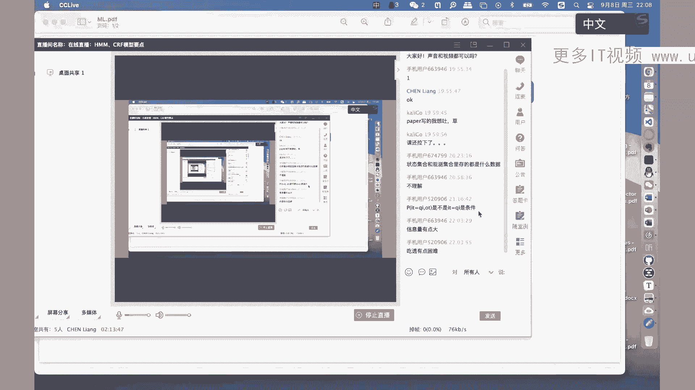

# 机器学习课程 P19：隐马尔可夫模型（HMM）详解 🧠

在本节课中，我们将系统性地学习概率图模型中的核心模型之一——隐马尔可夫模型（HMM）。我们将从模型定义出发，逐步深入到其解决的三大核心问题：概率计算、学习算法和预测算法。课程内容力求简单直白，并辅以公式和图示，帮助初学者建立清晰的理解。

---

## 概述 📋

隐马尔可夫模型（HMM）是一种用于处理序列到序列映射任务的概率图模型，尤其在自然语言处理（如词性标注）中应用广泛。本节课我们将学习HMM的完整知识体系，包括其数学定义、核心假设以及解决实际问题的算法流程。

---

## 一、模型定义与基本概念 🏗️

上一节我们概述了HMM的应用场景。本节中，我们来看看HMM的严格数学定义和构成要素。

HMM旨在描述由隐藏的状态序列生成可观测的观测序列的过程。为了形式化地定义它，我们首先需要明确两个集合和两个序列。

### 两个核心集合

以下是定义HMM所需的基础集合：

*   **状态集合 Q**：包含所有可能的隐藏状态。`Q = {q1, q2, ..., qN}`，共有N种状态。
*   **观测集合 V**：包含所有可能的观测值。`V = {v1, v2, ..., vM}`，共有M种观测。

> **注意**：集合内的元素是无序的，它们仅表示所有可能的取值。

### 两个关键序列

基于上述集合，我们可以定义两个在时间上有序的序列：

*   **状态序列 I**：由状态集合中的元素按时间顺序构成。`I = (i1, i2, ..., iT)`，其中T为序列长度，每个 `it` ∈ Q。
*   **观测序列 O**：由观测集合中的元素按时间顺序构成。`O = (o1, o2, ..., oT)`，每个 `ot` ∈ V。

> **核心关系**：在HMM中，**观测序列由状态序列决定**。每个时刻t的观测值 `ot` 只由该时刻的状态 `it` 生成。

### 模型的概率参数

HMM的概率生成过程由以下三个参数决定：

1.  **初始状态概率向量 π**：
    *   **定义**：`πi = P(i1 = qi)`，表示初始时刻（t=1）处于状态qi的概率。
    *   **形式**：`π = (π1, π2, ..., πN)`，满足 `Σπi = 1`。

2.  **状态转移概率矩阵 A**：
    *   **定义**：`A = [aij]N×N`，其中 `aij = P(it+1 = qj | it = qi)`。
    *   **含义**：表示在时刻t处于状态qi的条件下，下一时刻t+1转移到状态qj的概率。

3.  **观测概率矩阵 B**：
    *   **定义**：`B = [bj(k)]N×M`，其中 `bj(k) = P(ot = vk | it = qj)`。
    *   **含义**：表示在时刻t处于状态qj的条件下，生成观测值vk的概率。

### 模型的形式化定义

一个隐马尔可夫模型λ由上述三元组完全确定：
`λ = (A, B, π)`

### 模型图示与生成过程

根据以上定义，HMM的生成过程可以图示如下，这有助于直观理解：

```
i1 -> i2 -> i3 -> ... -> iT
 ↓     ↓     ↓           ↓
 o1    o2    o3   ...    oT
```

**生成算法**：
1.  根据初始概率向量π生成初始状态i1。
2.  根据观测概率矩阵B，由状态i1生成观测o1。
3.  根据状态转移矩阵A，由状态i1生成下一个状态i2。
4.  重复步骤2-3，依次生成(o2, i3), (o3, i4), ..., (oT, iT+1)，直到生成长度为T的观测序列。

---

## 二、两个基本假设 🔧

为了简化模型的计算，HMM建立在两个重要的假设之上。

### 1. 齐次马尔可夫性假设

该假设规定了**状态序列内部**的依赖关系。
*   **内容**：任意时刻t的状态 `it` 只依赖于其前一时刻的状态 `it-1`，而与更早的状态及所有观测无关。
*   **公式**：`P(it | i1, o1, ..., it-1, ot-1) = P(it | it-1)`

### 2. 观测独立性假设

该假设规定了**状态与观测之间**的依赖关系。
*   **内容**：任意时刻t的观测 `ot` 只依赖于该时刻的状态 `it`，而与其他时刻的状态及观测无关。
*   **公式**：`P(ot | i1, o1, ..., it, ..., iT, oT) = P(ot | it)`

这两个假设极大地降低了模型的复杂度，是后续所有推导和计算的基础。

---

## 三、HMM解决的三大问题 ⚙️

在定义了模型之后，HMM主要被用来解决三类问题。

### 问题1：概率计算问题（Evaluation）

*   **已知**：模型参数 `λ = (A, B, π)` 和观测序列 `O = (o1, o2, ..., oT)`。
*   **求解**：计算在该模型下，观测序列O出现的概率 `P(O | λ)`。
*   **意义**：评估模型与观测数据的匹配程度。例如，给定多个模型，选择 `P(O | λ)` 最大的那个。
*   **算法**：**前向算法**或后向算法。这里我们重点介绍前向算法。

#### 前向算法详解

前向算法通过引入“前向概率”来高效计算 `P(O | λ)`。

*   **定义前向概率 αt(i)**：
    `αt(i) = P(o1, o2, ..., ot, it = qi | λ)`
    它表示在模型λ下，**到时刻t为止的观测序列为(o1,...,ot)，且时刻t的状态为qi**的联合概率。

*   **递推计算**：
    1.  **初始化**（t=1）：
        `α1(i) = πi * bi(o1)`, `i = 1, 2, ..., N`
        即用初始概率和第一个观测的生成概率计算。
    2.  **递推**（对 t = 1, 2, ..., T-1）：
        `αt+1(j) = [Σ αt(i) * aij] * bj(ot+1)`, `j = 1, 2, ..., N`
        解释：时刻t+1处于状态j的前向概率 = 【所有可能从t时刻状态i转移到j的概率之和】 × 【在状态j下生成观测ot+1的概率】。
    3.  **终止**：
        `P(O | λ) = Σ αT(i)`, `i = 1, 2, ..., N`
        因为αT(i)已包含了整个观测序列O和最终状态为qi的概率，对所有最终状态求和即得整个序列的概率。

前向算法将直接计算的指数级复杂度降低到了 `O(N²T)` 级别。

---

### 问题2：学习问题（Learning）

*   **已知**：观测序列 `O = (o1, o2, ..., oT)`。
*   **求解**：估计模型参数 `λ = (A, B, π)`，使得该模型下观测序列O的概率 `P(O | λ)` **最大**。
*   **意义**：从数据中自动学习模型参数，是一个无监督学习过程。
*   **挑战**：状态序列I是未知的（隐变量），使得问题变得复杂。
*   **算法**：**Baum-Welch算法**，它是期望最大化算法在HMM中的具体应用。

#### EM算法与Baum-Welch算法

由于状态序列I是隐变量，我们需要使用EM算法来求解。

*   **E步（求期望）**：基于当前参数估计λ，计算完全数据（O, I）的对数似然函数 `log P(O, I | λ)` 关于隐变量I的条件期望，即Q函数：
    `Q(λ, λ’) = Σ_I P(I | O, λ’) * log P(O, I | λ)`
    其中λ’是上一轮迭代的参数。
*   **M步（最大化）**：最大化Q函数，得到新的参数估计λ：
    `λ = argmax_λ Q(λ, λ’)`

在HMM的特定形式下，通过推导，M步的参数更新有闭式解：

*   **初始概率**：`πi* = γ1(i)`，即初始时刻处于状态i的期望概率。
*   **转移概率**：`aij* = Σ ξt(i, j) / Σ γt(i)`。分子是从i转移到j的期望次数，分母是处于状态i的期望次数。
*   **观测概率**：`bj(k)* = Σ γt(j) / Σ γt(j)`。分子是在状态j下观测到vk的期望次数，分母是处于状态j的期望次数。

其中，`γt(i) = P(it = qi | O, λ)`（给定观测下t时刻状态为i的概率）和 `ξt(i, j) = P(it = qi, it+1 = qj | O, λ)` 是可以通过前向-后向算法计算得到的中间量。

Baum-Welch算法就是不断迭代E步和M步，直至参数收敛。

---

### 问题3：预测问题（Decoding）

*   **已知**：模型参数 `λ = (A, B, π)` 和观测序列 `O = (o1, o2, ..., oT)`。
*   **求解**：寻找一个**最优的状态序列 I* = (i1*, i2*, ..., iT*) **，使得条件概率 `P(I | O, λ)` 最大。
*   **意义**：揭示最可能产生观测序列的隐藏状态路径。例如，在词性标注中，根据句子（观测）推测每个词的词性（状态）。
*   **算法**：**维特比算法**，一种基于动态规划的最大化路径搜索算法。

#### 维特比算法详解

维特比算法定义了两个变量：

*   **路径概率 δt(i)**：在时刻t，**所有以状态qi结尾的局部路径(i1, i2, ..., it=qi)中，概率最大的那条路径的概率值**。
    `δt(i) = max_{i1, i2, ..., it-1} P(i1, i2, ..., it=qi, o1, o2, ..., ot | λ)`
*   **路径回溯 ψt(i)**：记录使δt(i)达到最大的时刻t-1的状态编号。

**算法步骤**：
1.  **初始化**：
    `δ1(i) = πi * bi(o1)`, `ψ1(i) = 0`, `i = 1, 2, ..., N`
2.  **递推**（对 t = 2, 3, ..., T）：
    `δt(j) = max_{1≤i≤N} [δt-1(i) * aij] * bj(ot)`
    `ψt(j) = argmax_{1≤i≤N} [δt-1(i) * aij]`
3.  **终止**：
    `P* = max_{1≤i≤N} δT(i)` （最大路径概率）
    `iT* = argmax_{1≤i≤N} δT(i)` （最优路径终点）
4.  **路径回溯**（对 t = T-1, T-2, ..., 1）：
    `it* = ψt+1(it+1*)`
    通过ψ数组从终点反向回溯，即可得到完整的最优状态序列 `I*`。

维特比算法与前向算法结构相似，但将求和`Σ`换为取最大值`max`，并增加了记录回溯指针的步骤。

---

## 四、EM算法补充说明 🔄

在学习问题中，我们提到了EM算法。这里对其核心思想做简要补充。

EM算法用于解决含有隐变量的概率模型参数估计问题。其核心思想是：由于直接最大化观测数据的似然 `P(O | λ)` 困难，转而构建一个易于优化的“下界”函数（Q函数），并通过迭代不断抬高这个下界，从而间接使原似然函数增大。

*   **E步（Expectation）**：基于当前参数λ’，计算隐变量的后验分布 `P(I | O, λ’)`，进而计算完全数据的对数似然 `log P(O, I | λ)` 在该后验分布下的期望，即Q函数。
*   **M步（Maximization）**：寻找使Q函数最大化的新参数λ。

对于HMM，E步需要计算 `γt(i)` 和 `ξt(i, j)`，这由前向-后向算法完成；M步则根据前面给出的公式更新A, B, π。

---

## 总结 🎯

本节课中，我们一起学习了隐马尔可夫模型（HMM）的核心内容：

1.  **模型定义**：HMM是一个三元组 `λ = (A, B, π)`，描述了隐藏状态序列生成观测序列的概率过程。
2.  **基本假设**：齐次马尔可夫性假设和观测独立性假设是模型简化的基石。
3.  **三大问题与算法**：
    *   **概率计算**：使用**前向算法**高效计算 `P(O | λ)`。
    *   **参数学习**：在状态序列未知时，使用基于EM算法的**Baum-Welch算法**从观测数据中学习模型参数。
    *   **序列预测**：使用**维特比算法**动态规划求解最可能的状态序列。
4.  **关键思想**：HMM通过引入隐藏状态来建模序列数据的内部结构，其相关算法（前向、维特比、EM）是动态规划和迭代优化思想的经典体现。




HMM作为概率图模型的基础，其思想和算法在语音识别、自然语言处理、生物信息学等领域仍有重要应用，也是理解更复杂模型（如条件随机场CRF）的坚实基础。