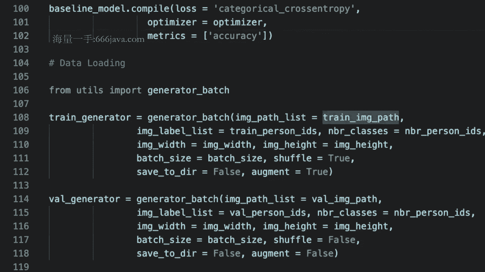

# 课程 1447-P3：行人重识别（ReID）项目实战：训练与评测流程 🚶‍♂️🔍


## 概述

在本节课中，我们将学习如何构建并运行一个完整的行人重识别（ReID）项目。我们将从回顾ReID任务的核心概念开始，然后一步步实现一个用于特征提取的卷积神经网络（CNN）的训练流程，包括数据加载、模型构建、训练循环以及数据增强等关键环节。

---

## 回顾：ReID任务的核心本质

上一节我们介绍了行人重识别（ReID）任务的主要背景和应用场景。本节中，我们来深入理解其技术本质。

ReID任务看似是一个识别问题，但其本质是通过**图像检索**的技术手段来实现识别目的。具体来说，给定一张查询（query）图片，系统需要在数据库（gallery）中搜索并返回相关的图片样本。

为了实现检索，核心在于获取图像的**特征表达**。我们将每张图片通过一个特征提取模块（如CNN）转换为一个特征向量。之后，识别问题就转化为了计算查询图片特征向量与数据库图片特征向量之间的**相似度**。相似度计算通常使用向量内积等度量方式。

**公式：相似度计算**
`相似度 = query特征向量 · gallery特征向量`

因此，我们的核心目标就变成了：**训练一个能够提取高质量特征向量的CNN模型**。

---

## 从分类到特征提取：模型构建思路

既然目标是训练一个特征提取器，一个直观的思路是利用分类任务进行训练。在ReID数据集中，每个行人的ID可以视为一个独立的类别。通过训练一个CNN分类器（例如，预测图片属于哪个ID），我们可以让模型学会区分不同行人的视觉特征。

训练完成后，移除模型最后的分类层（softmax层），保留下来的网络部分（如最后的全连接层或全局池化层输出）就可以作为输入图片的**特征向量**。

这里有一个至关重要的概念：**测试集中的ID不需要出现在训练集中**。这是因为我们的模型是一个通用的特征提取器，而不是一个封闭集的分类器。模型在训练时学习了如何提取有区分度的特征，在遇到新的ID时，它依然能提取出有效的特征向量，然后通过特征比对（检索）的方式在底库中找到最相似的样本，从而完成识别。这保证了模型的泛化能力。

---

## 项目代码结构梳理

以下是实现训练流程的核心步骤，我们将逐一构建：

1.  **数据准备与加载**：解析图像路径和ID标签，并划分为训练集和验证集。
2.  **模型定义**：选择一个CNN骨干网络（如MobileNetV2），并修改其输出层以适应我们的ID分类任务。
3.  **生成器（Generator）编写**：实现一个数据生成器，用于批量从硬盘加载图像数据到内存/显存，并支持数据增强。
4.  **训练循环配置**：设置优化器、损失函数、回调函数（如模型检查点），并启动训练过程。

---

## 核心模块实现详解

### 1. 数据加载与预处理

首先，我们需要加载数据。数据通常以图像文件列表和对应的标签列表形式组织。

**代码：数据路径与标签解析示例**
```python
# image_path_list 示例
# [‘/home/data/person_001_001.jpg‘, ‘/home/data/person_001_002.jpg‘, ...]
# image_label_list 示例 (原始ID，如字符串)
# [‘person_001‘, ‘person_001‘, ...]

from sklearn.preprocessing import LabelEncoder
# 使用LabelEncoder将字符串ID转换为连续的整数标签，例如 0, 1, 2, ...
label_encoder = LabelEncoder()
encoded_labels = label_encoder.fit_transform(original_id_list)
```

接下来，使用 `train_test_split` 将数据划分为训练集和验证集，注意设置 `random_state` 以确保结果可复现。

### 2. 模型构建

我们以MobileNetV2为例，利用其在ImageNet上的预训练权重，并替换最后的分类层。

**代码：构建ReID特征提取模型**
```python
from tensorflow.keras.applications import MobileNetV2
from tensorflow.keras.layers import Dense, GlobalMaxPooling2D
from tensorflow.keras.models import Model

# 加载预训练骨干网络，不包括顶部分类层
base_model = MobileNetV2(weights=‘imagenet‘, include_top=False, pooling=‘max‘)
# 添加新的分类层，num_classes 是训练集中行人ID的总数
x = base_model.output
predictions = Dense(num_classes, activation=‘softmax‘)(x)
model = Model(inputs=base_model.input, outputs=predictions)
```

### 3. 实现数据生成器 (Generator)

由于数据量可能很大，我们需要一个生成器来逐批加载数据。这个生成器需要兼容训练（需要标签）和推理/评估（仅需图像）两种模式。

以下是生成器函数的核心逻辑介绍：

**关键参数**：
- `image_path_list`: 图像路径列表。
- `image_label_list`: 对应的标签列表（评估时可设为None）。
- `batch_size`: 批大小。
- `augment`: 是否进行数据增强。
- `target_size`: 图像统一调整的尺寸。

**内部流程**：
1.  如果 `shuffle` 为真，则同步打乱路径和标签列表。
2.  使用 `while True` 循环持续产出数据批次。
3.  在循环内，计算当前批次的起始和结束索引。
4.  调用 `load_image_batch` 函数加载一个批次的图像和标签。
5.  如果 `augment` 为真，对该批次图像应用数据增强变换（如使用 `albumentations` 库）。
6.  对图像进行归一化处理（如除以255，并减去ImageNet均值除以标准差）。
7.  使用 `yield` 返回处理后的批次数据 (`x_batch`, `y_batch`) 或仅 `x_batch`。

**代码：load_image_batch 函数核心片段**
```python
def load_image_batch(path_list, label_list, target_size):
    batch_size = len(path_list)
    # 初始化图像批次数组
    x_batch = np.zeros((batch_size, *target_size, 3))
    # 初始化标签批次数组 (one-hot编码)
    if label_list is not None:
        y_batch = np.zeros((batch_size, num_classes))

    for i in range(batch_size):
        img_path = path_list[i]
        # 使用OpenCV读取图像
        img = cv2.imread(img_path)
        img = cv2.cvtColor(img, cv2.COLOR_BGR2RGB) # 转换通道顺序
        img = cv2.resize(img, target_size)
        x_batch[i] = img

        if label_list is not None:
            label = label_list[i]
            y_batch[i, label] = 1 # one-hot编码
    if label_list is not None:
        return x_batch, y_batch
    else:
        return x_batch
```

### 4. 配置与启动训练

准备好生成器和模型后，我们需要编译模型，并配置训练参数。

**代码：模型编译与训练配置**
```python
from tensorflow.keras.callbacks import ModelCheckpoint

# 编译模型，指定损失函数和评估指标
model.compile(optimizer=‘adam‘,
              loss=‘categorical_crossentropy‘,
              metrics=[‘accuracy‘])

# 设置模型检查点回调，仅保存验证集上性能最好的模型
checkpoint_callback = ModelCheckpoint(
    filepath=‘best_model.h5‘,
    monitor=‘val_accuracy‘,
    verbose=1,
    save_best_only=True,
    mode=‘max‘
)

# 计算每轮的步数 (steps_per_epoch)
train_steps = len(train_image_paths) // batch_size
val_steps = len(val_image_paths) // batch_size

# 启动训练
history = model.fit(
    train_generator,
    steps_per_epoch=train_steps,
    validation_data=val_generator,
    validation_steps=val_steps,
    epochs=100,
    callbacks=[checkpoint_callback],
    shuffle=True
)
```

---

## 总结

本节课中，我们一起学习了行人重识别（ReID）项目训练流程的完整实现。我们从理解ReID作为图像检索任务的本质出发，明确了训练一个通用特征提取器的目标。随后，我们详细拆解了代码实现的关键部分：

1.  **数据准备**：解析ID标签并编码，划分数据集。
2.  **模型构建**：基于预训练CNN骨干网络，改造为适用于ReID分类任务的模型。
3.  **数据流水线**：实现了支持批量加载、数据增强和归一化的数据生成器，这是处理大规模数据集的关键。
4.  **训练流程**：配置了损失函数、优化器以及模型保存回调，启动了模型的训练过程。




通过本课的学习，你已经掌握了搭建一个ReID模型训练框架的核心技能。下节课，我们将重点学习如何使用训练好的模型进行特征提取，并完成对模型性能的评测。