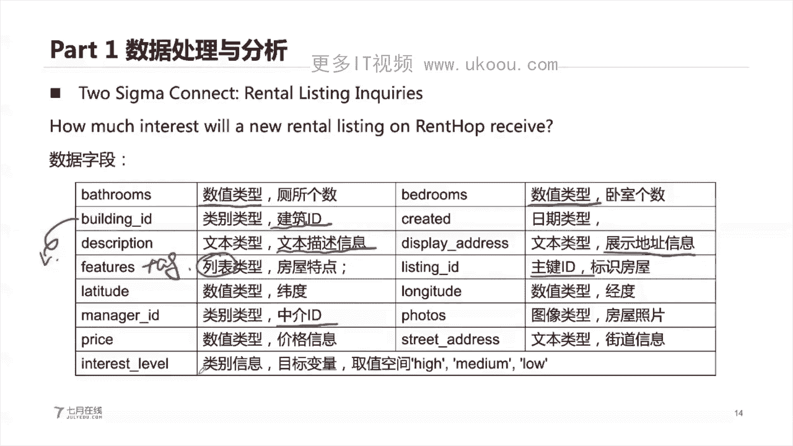
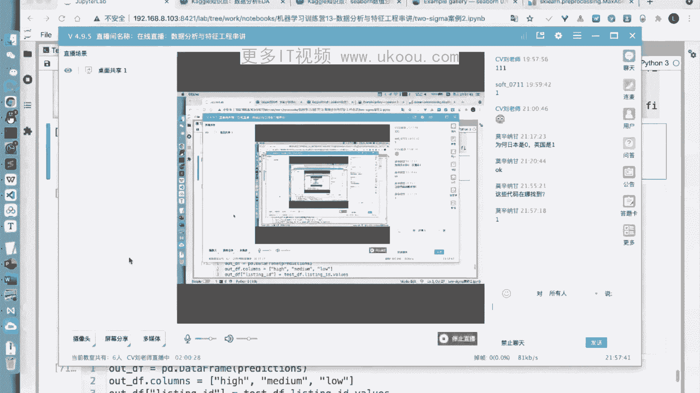

# 📊 课程1447-P4：数据分析与特征工程串讲


在本节课中，我们将要学习数据分析与特征工程的核心概念与实践方法。我们将从理解问题与数据开始，逐步深入到数据清洗、特征构建、模型训练与验证的全过程，并通过一个具体的租房热度预测案例来巩固所学知识。

---

## 🎯 第一部分：问题识别与数据理解

在开始数据分析之前，我们首先需要对问题进行抽象和建模。这决定了我们最终的解题方法和流程。

机器学习任务可以根据场景进行划分，例如分类、回归、排序或无监督学习。划分的依据通常是数据中是否存在标签（label），以及标签的类型。

*   **有监督学习**：数据带有标签。
    *   **分类问题**：标签是离散的类别（例如：预测用户是否违约）。
    *   **回归问题**：标签是连续的数值（例如：预测房屋价格）。
    *   **排序问题**：标签是次序关系。
*   **无监督学习**：数据没有标签。
    *   典型任务包括降维（如PCA）和聚类（如K-Means）。

此外，数据的类型也决定了适用的算法。

*   **结构化数据**：以表格形式存储，适合使用XGBoost、LightGBM等树模型。
*   **非结构化数据**：如图片、文本、语音，适合使用深度学习模型。

在实际项目中，解决问题的流程并非线性的“瀑布式”开发，而是一个需要不断迭代和回溯的循环过程。我们可能在数据清洗、特征工程、模型训练等任何环节发现问题，并返回之前的步骤进行调整。

**核心公式**：机器学习流程 ≈ 70% 数据处理 + 10% 模型训练 + 20% 迭代调优

---

## 🔍 第二部分：数据处理与分析实践

上一节我们介绍了如何从宏观上理解问题和数据，本节中我们来看看如何对具体的数据集进行探索性分析。

算法工程师70%以上的时间都花在与数据处理相关的工作上，例如数据清洗、查询和分析。模型训练本身所占时间相对较少。

我们将以“Two Sigma Connect: 租房热度预测”比赛数据集为例。该任务是根据房屋信息（如价格、地理位置、描述等）预测其受欢迎程度（热度），属于一个多分类问题（热度分为高、中、低三类）。

以下是该数据集包含的部分字段及其类型：

*   `bathrooms`: 数值型，卫生间数量。
*   `bedrooms`: 数值型，卧室数量。
*   `building_id`: 类别型，建筑物ID。
*   `created`: 日期型，信息发布时间。
*   `description`: 文本型，房屋描述。
*   `features`: 列表型，房屋特点标签（如“可养宠物”、“有电梯”）。
*   `latitude`/`longitude`: 数值型，经纬度。
*   `price`: 数值型，价格。
*   `interest_level`: 类别型，标签（高/中/低）。

在进行数据分析时，我们通常从整体分布和统计量入手。

### 数值型字段分析

对于数值型字段（如`price`, `bathrooms`），我们可以：

1.  **计算描述性统计**：使用`pandas.DataFrame.describe()`获取最小值、最大值、均值、分位数等。
2.  **绘制分布图**：使用直方图（Histogram）或核密度估计图（KDE）观察数据分布形态。例如，价格数据通常呈现严重的左偏分布。
3.  **识别异常值**：使用箱线图（Box Plot）。箱线图基于分位数（Q1, Q3）和四分位距（IQR）来定义数据的合理范围，超出上下界的数据点可被视为异常值。

**代码示例：绘制价格分布与箱线图**
```python
import pandas as pd
import seaborn as sns
import matplotlib.pyplot as plt

# 加载数据
df = pd.read_json('train.json')
# 价格分布
sns.histplot(df['price'], kde=True)
plt.title('Price Distribution')
plt.show()
# 价格箱线图
sns.boxplot(x=df['price'])
plt.title('Price Boxplot')
plt.show()
```

### 类别型与文本型字段分析

对于类别型字段（如`building_id`, `manager_id`）或文本型字段（如`description`）：

1.  **统计频次**：使用`pandas.Series.value_counts()`统计每个取值出现的次数。
2.  **可视化**：
    *   对于取值空间不大的类别字段，可使用柱状图。
    *   对于文本字段，可以生成词云（Word Cloud）来展示高频词汇。

### 日期型字段分析

对于日期型字段（如`created`），可以提取年、月、日、星期几等信息，并绘制时间序列图，观察发布数量的周期性规律。



通过以上分析，我们可以对数据有直观的理解，并初步判断哪些字段可能与目标变量（房屋热度）强相关，例如价格、位置、中介ID等。

---

## 🛠️ 第三部分：特征工程原理与实践

在完成初步的数据分析后，我们需要将原始数据转化为机器学习模型能够更好理解的特征。这个过程就是特征工程。

### 类别特征编码

类别特征（如国家、城市）是字符串类型，必须转换为数值才能被模型处理。以下是几种常见的编码方式：

**1. 独热编码 (One-Hot Encoding)**
*   **方法**：为每个类别创建一个新的二进制列。
*   **公式**：如果类别有K种取值，则生成一个K维向量，对应类别的位置为1，其余为0。
*   **优点**：编码简单，适用于无序类别。
*   **缺点**：当类别取值很多时，会导致特征维度爆炸，数据变得非常稀疏。
*   **适用模型**：线性模型。

**2. 标签编码 (Label Encoding)**
*   **方法**：为每个类别分配一个唯一的整数ID（如0,1,2,...）。
*   **优点**：不增加特征维度。
*   **缺点**：会引入人为的次序关系，可能误导模型。更适合树模型。
*   **适用模型**：树模型（如决策树、随机森林）。

**3. 频次编码 (Count / Frequency Encoding)**
*   **方法**：用该类别在训练集中出现的次数（或频率）来代替类别本身。
*   **优点**：简单，包含了类别流行度信息。
*   **缺点**：如果训练集和测试集分布不一致，编码可能失效。

**4. 目标编码 (Target Encoding)**
*   **方法**：用该类别下目标变量的均值（或其他统计量）来编码。
*   **公式**：`编码值 = mean(目标变量 | 类别)`
*   **优点**：编码值具有明确的统计意义，模型容易学习。
*   **缺点**：极易造成标签信息泄露（Data Leakage），必须谨慎使用，通常需配合交叉验证。

**代码示例：几种编码的实现**
```python
import pandas as pd
from sklearn.preprocessing import LabelEncoder, OneHotEncoder

# 示例数据
data = {'country': ['China', 'USA', 'UK', 'China', 'Japan']}
df = pd.DataFrame(data)

# 1. Label Encoding
le = LabelEncoder()
df['country_label'] = le.fit_transform(df['country'])

# 2. One-Hot Encoding
df_onehot = pd.get_dummies(df['country'], prefix='country')
# 或者使用 sklearn
# ohe = OneHotEncoder(sparse=False)
# encoded = ohe.fit_transform(df[['country']])
```

### 数值特征处理

数值特征（如年龄、收入）也需要处理，以提升模型性能。

1.  **缩放与归一化**：
    *   **最大最小值归一化 (MinMaxScaler)**：将数据缩放到[0, 1]区间。`x_scaled = (x - min) / (max - min)`
    *   **标准化 (StandardScaler)**：将数据转换为均值为0，标准差为1。`x_scaled = (x - mean) / std`
    *   **适用场景**：归一化适用于分布范围有限的数据；标准化适用于近似正态分布的数据。

2.  **离散化 (Binning)**：将连续值分段，转化为有序的类别。例如，将年龄分为“少年”、“青年”、“中年”、“老年”。这需要人工根据业务知识来定义分箱边界。

3.  **交叉特征**：通过已有特征进行组合生成新特征。
    *   **加减**：`总房间数 = 卧室数 + 卫生间数`
    *   **乘除**：`房间均价 = 总价 / 总房间数`
    *   **聚合特征**：例如，统计同一卧室数量下的平均价格，然后计算当前价格与该平均价格的比值。

### 日期与文本特征提取

*   **日期特征**：从日期字段中提取年、月、日、星期几、是否节假日、是否工作日等。
*   **文本特征**：可以从描述文本中提取长度、单词数、情感倾向等。更复杂的方法如TF-IDF将在后续课程介绍。

### 需要警惕的特征：数据泄露 (Data Leakage)

数据泄露特征是指那些在训练时包含未来或目标信息，但在实际预测时无法获取的特征。例如，在按时间排序的数据中，如果用“记录创建时间”来预测“热度”，而数据恰好是按热度高低顺序录入的，那么“创建时间”就成为了一个泄露特征。这类特征必须被识别并移除。

---

## ⚙️ 第四部分：模型训练、验证与代码实践

特征工程完成后，我们就可以进入模型训练阶段。本节中我们来看看如何划分数据、训练模型并防止过拟合。

### 数据集划分与交叉验证

为了客观评估模型性能，我们需要将数据划分为三部分：
*   **训练集 (Training Set)**：用于训练模型参数。
*   **验证集 (Validation Set)**：用于在训练过程中调整超参数、选择模型，监控是否过拟合。
*   **测试集 (Test Set)**：用于最终评估模型的泛化能力，在全部调优完成后只使用一次。

**K折交叉验证 (K-Fold Cross Validation)** 是一种更充分利用数据、稳定评估模型的方法。它将训练集均匀分成K份，每次用其中K-1份训练，用剩下的1份验证，重复K次，最后取K次验证结果的平均值作为模型性能的估计。

### 过拟合与欠拟合

*   **欠拟合**：模型在训练集和验证集上表现都差。解决方法：增加模型复杂度、增加特征。
*   **过拟合**：模型在训练集上表现很好，但在验证集上表现差。解决方法：获取更多数据、降低模型复杂度、正则化、早停（Early Stopping）。

**早停法**：在训练迭代过程中（如深度学习或梯度提升树），持续监控模型在验证集上的性能。当验证集性能不再提升甚至开始下降时，停止训练。这是防止过拟合的有效手段。

### 案例实践：租房热度预测流程

以下结合“Two Sigma”案例，简述特征工程与建模流程：

1.  **数据读取与探索**：使用Pandas读取JSON数据，进行初步的统计分析。
2.  **特征构建**：
    *   **统计特征**：从`photos`, `features`列表字段中提取长度（照片数量、标签数量）。
    *   **文本特征**：计算`description`字段的单词数量。
    *   **日期特征**：从`created`中提取年、月、日、小时等。
    *   **交叉特征**：创建`房间总数`、`每间房均价`等。
    *   **目标编码**：对`manager_id`、`building_id`等高频类别字段，采用**五折交叉验证下的目标编码**，防止数据泄露。
3.  **编码与归一化**：对剩余的类别特征进行标签编码，对数值特征进行标准化。
4.  **模型训练与验证**：
    *   使用`KFold`进行五折交叉验证。
    *   在每一折中，用训练部分拟合模型（如XGBoost），在验证部分评估。
    *   五折训练完成后，得到五个模型，对测试集的预测结果取平均，作为最终预测。
5.  **模型集成（进阶）**：可以采用**堆叠法**。即用多个不同的基模型（如随机森林、XGBoost）进行第一层预测，然后将它们的预测结果作为新特征，训练一个第二层的“元模型”来融合结果，往往能提升性能。

**核心思想**：特征工程与模型选择紧密相关。树模型对数值缩放不敏感，能较好处理类别特征；而线性模型则对归一化和独热编码依赖更强。

---

## 📝 总结与回顾

本节课中我们一起学习了数据分析与特征工程的完整链路：

1.  **问题抽象**：首先明确任务是分类、回归还是其他类型，并理解数据是结构化还是非结构化。
2.  **数据分析**：通过统计描述和可视化（直方图、箱线图、词云等）理解每个字段的分布、识别异常值、探索字段与标签的潜在关系。
3.  **特征工程**：这是提升模型性能的关键。我们学习了针对类别特征（独热、标签、目标编码）、数值特征（缩放、离散化、交叉）以及日期文本特征的处理方法，并强调了警惕数据泄露的重要性。
4.  **模型训练与验证**：介绍了数据集划分、交叉验证、过拟合/欠拟合的概念及应对策略（如早停法），并通过案例简述了从特征构建到模型集成的实践流程。




记住，**没有放之四海而皆准的特征工程方法**。最佳实践来源于对业务问题的深刻理解、对数据分布的细致分析，以及通过实验不断迭代优化。希望本教程能帮助你建立起数据分析与特征工程的系统性思维。