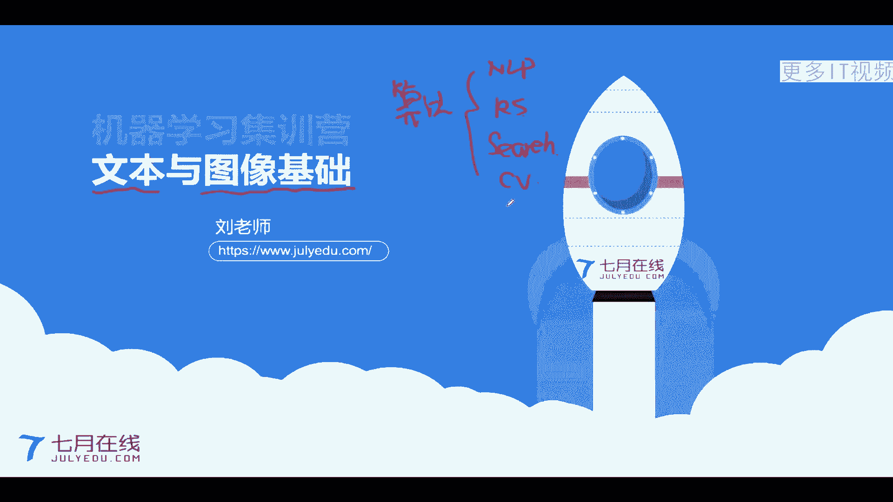
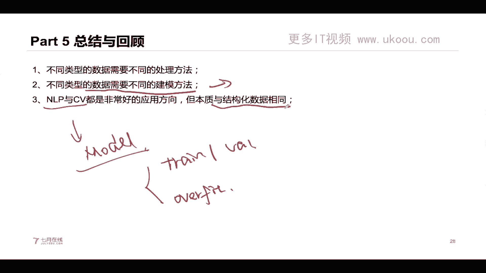
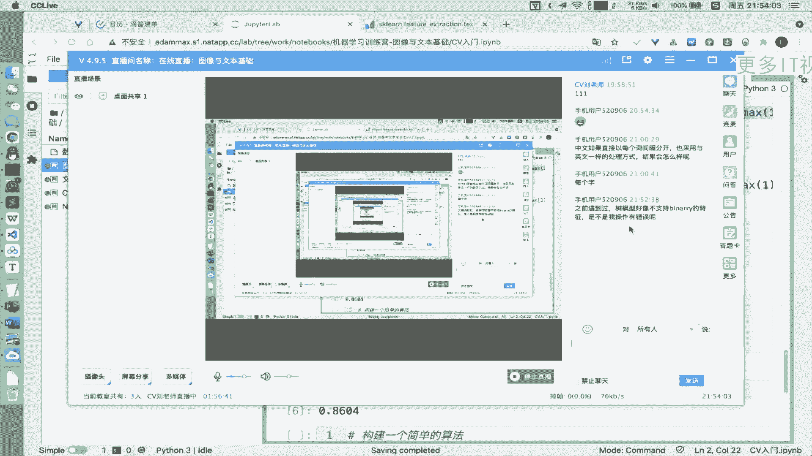

# 机器学习集训营第15期 - P6：图像与文本基础教程 📚




## 概述
在本节课中，我们将学习机器学习中处理非结构化数据的两大核心领域：文本和图像的基础知识。我们将了解它们的数据特点、常见的处理方法、特征提取技术，并通过实践案例加深理解。

---

## 第一部分：数据类型介绍 📊

在上一节课程中，我们介绍了结构化数据。本节中，我们来看看非结构化数据。

算法工程师的岗位通常与特定任务方向相关，例如推荐系统、计算机视觉（CV）或自然语言处理（NLP）。不同类型的数据需要不同的技能和方法来解决。

数据主要分为结构化数据和非结构化数据。
*   **结构化数据**：指表格类型的数据，可以使用Pandas等库方便地读取和处理。
*   **非结构化的数据**：指不适合用表格形式表示的数据，主要包括文本、图像和视频。

视频可以看作是图像帧与音频的组合。理解不同数据类型的差异是选择正确解决方法的第一步。例如，虽然图片分类和文本分类都是分类任务，但由于数据类型不同，其模型和侧重点也不同。

---

## 第二部分：文本数据处理基础 📝

上一部分我们区分了数据类型，本节中我们来看看如何处理文本数据。

自然语言处理（NLP）旨在让机器理解人类的自然语言。互联网上超过80%的信息以文本形式存在。NLP主要分为两大方向：
*   **自然语言理解（NLU）**：理解给定文本的核心含义。
*   **自然语言生成（NLG）**：根据理解的含义组织语言生成新的文本。

NLP任务非常复杂，因为语言是开放、多变且依赖上下文的。

以下是NLP中常见的任务类型：
*   **NLU任务**：垃圾邮件识别、情感分析、意图识别（本质是文本分类）。
*   **NLG任务**：聊天机器人、机器翻译。

处理文本时，一个核心挑战是文本本质上是**不定长的单词列表**，而机器学习模型通常需要固定长度的数值输入。

### 文本特征提取：从词频到TF-IDF

以下是两种基础的文本特征提取方法。

**1. 词频向量化（CountVectorizer）**
该方法统计每个单词在文档中出现的次数，将文本转换为一个固定长度的向量。向量的每个位置对应一个单词，值表示该单词在文档中出现的频率。
```python
from sklearn.feature_extraction.text import CountVectorizer
vectorizer = CountVectorizer()
X = vectorizer.fit_transform(corpus)
```

**2. TF-IDF向量化**
TF-IDF 衡量一个单词在文档中的重要程度，由两部分组成：
*   **词频（TF）**：单词在当前文档中出现的频率。
*   **逆文档频率（IDF）**：单词在所有文档中出现的频率的倒数，用于降低常见词的重要性。
`TF-IDF = TF * IDF`

在`scikit-learn`中，可以方便地使用`TfidfVectorizer`。
```python
from sklearn.feature_extraction.text import TfidfVectorizer
vectorizer = TfidfVectorizer()
X = vectorizer.fit_transform(corpus)
```

**注意**：中文文本需要先进行分词，再用空格连接，才能使用上述基于空格分隔的方法。

### 实践：文本分类流程
一个完整的文本分类流程通常包括以下步骤：
1.  **文本预处理**：统一大小写、去除噪声、分词、去除停用词等。
2.  **特征提取与表示**：使用如`CountVectorizer`或`TfidfVectorizer`将文本转换为数值特征。
3.  **分类器训练**：使用逻辑回归、朴素贝叶斯或XGBoost等模型进行分类。

不同的模型对数据有不同的偏好。例如，树模型（如XGBoost）在处理数值型特征（如TF-IDF）时可能不如线性模型（如逻辑回归）或朴素贝叶斯表现好。

---

## 第三部分：图像数据处理基础 🖼️

上一节我们介绍了文本处理，本节中我们来看看图像处理。

计算机视觉（CV）的目标是让机器理解和处理图像与视频。图像在计算机中本质上是一个三维矩阵（高度 × 宽度 × 通道数）。

### 图像特征提取方法
图像特征提取旨在从高维的像素矩阵中提取有意义的、低维度的信息。

以下是几种常见的图像特征提取方法：
*   **图像哈希**：将图片内容缩放到小尺寸（如8x8），根据像素值与均值的比较生成二进制序列，再转换为哈希字符串。适用于图片去重。
*   **颜色直方图**：统计图像中各颜色（或灰度）强度值的像素数量。这是一种全局特征，用于衡量图像在颜色空间上的整体相似性。
*   **关键点检测（如SIFT）**：检测图像中梯度变化明显的局部特征点（如角点、边缘），并生成描述该点周围区域的特征向量。SIFT特征具有尺度不变性和旋转不变性。
*   **卷积神经网络（CNN）特征**：使用预训练的深度学习模型（如ResNet）提取图像的深层特征。这些特征通常具有强大的表征能力。

### 实践：图像分类案例
我们以手写数字识别（MNIST数据集）为例，展示两种方法：

**1. 使用深度学习框架（Keras）搭建CNN模型**
```python
# 示例代码结构
model = Sequential([
    Conv2D(32, (3,3), activation='relu', input_shape=(28,28,1)),
    MaxPooling2D((2,2)),
    Conv2D(64, (3,3), activation='relu'),
    MaxPooling2D((2,2)),
    Flatten(),
    Dense(64, activation='relu'),
    Dense(10, activation='softmax')
])
model.compile(...)
model.fit(...)
```

**2. 使用Scikit-learn的MLP分类器**
```python
from sklearn.neural_network import MLPClassifier
mlp = MLPClassifier()
mlp.fit(X_train, y_train)
score = mlp.score(X_test, y_test)
```

通常情况下，精心设计的CNN模型在图像分类任务上的准确率会高于传统的全连接网络（MLP）或线性模型。

---

## 第四部分：核心要点总结 🎯

本节课中我们一起学习了图像与文本处理的基础知识。

1.  **数据驱动方法选择**：没有放之四海而皆准的“银弹”。处理不同类型的数据（结构化/非结构化，文本/图像）需要选择不同的预处理方法和模型。
2.  **模型与数据的匹配**：算法工程师的核心能力之一是针对具体数据构建合适的模型。不同模型对数据特征有不同的偏好。
3.  **基础相通性**：尽管NLP和CV的模型和技术细节不同，但机器学习的核心基础是相通的，例如数据集划分、过拟合判断、模型评估等。
4.  **学习路径建议**：对于初学者，建议从基础任务入手，如文本分类或图像分类，并熟练掌握`scikit-learn`、`Keras`/`PyTorch`等核心工具库的使用。






希望本教程能帮助你建立起对非结构化数据处理的基本认识，为后续深入学习NLP和CV打下坚实的基础。