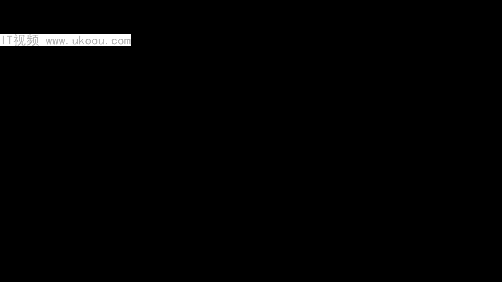
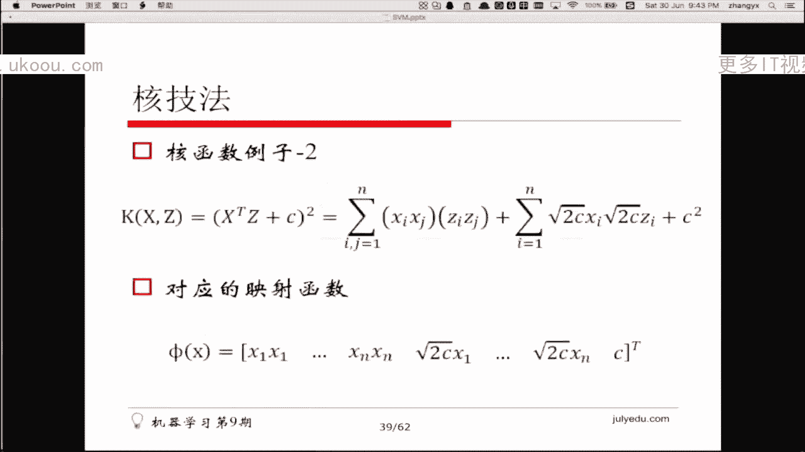
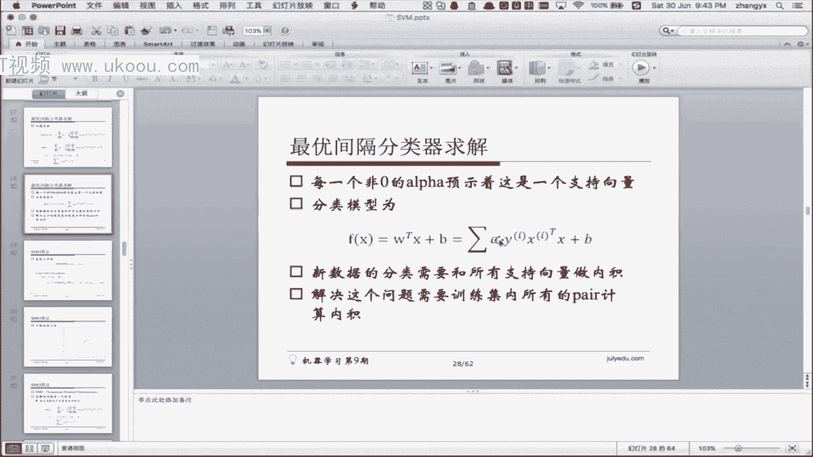
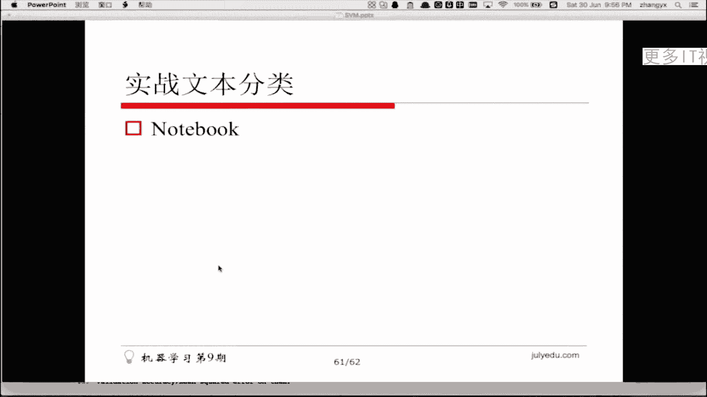
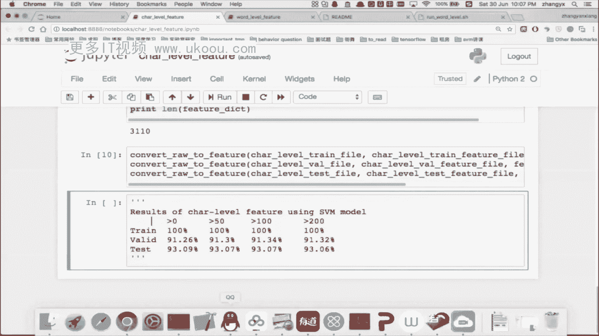
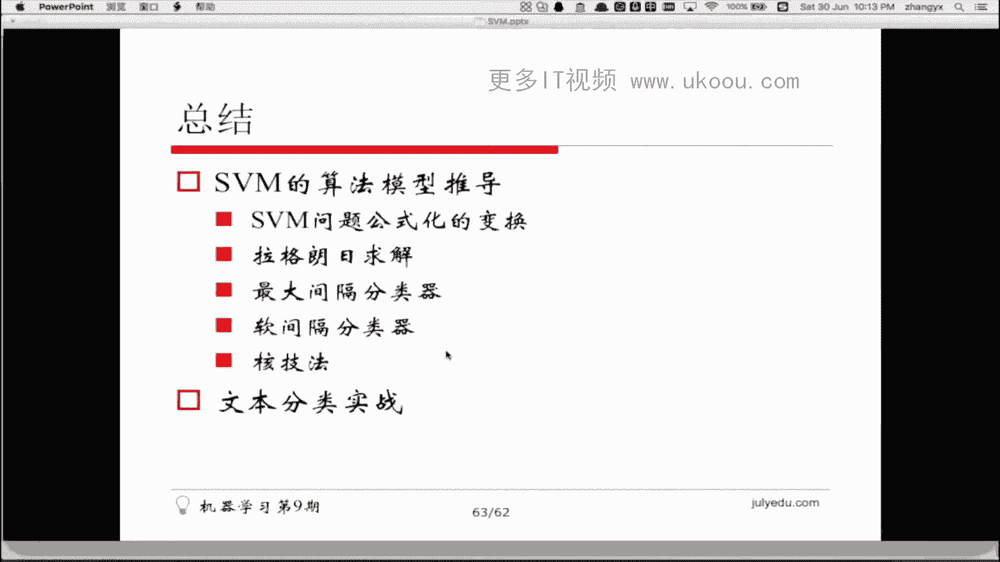
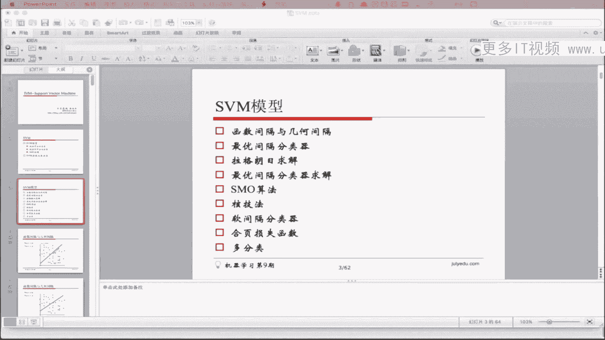

# 📚 课程名称：1447-七月在线-机器学习集训营15期 - P7：3-SVM与数据分类




## 🎯 概述
在本节课中，我们将要学习支持向量机（SVM）模型。主要内容包括SVM模型的基本推导、在文本分类上的实战应用。在模型推导过程中，我们将讲解线性可分分类器、线性不可分数据的处理、SVM的求解算法（如SMO算法），并串联相关的数学知识。

---

## 📖 1. 函数间隔与几何间隔

首先，我们介绍函数间隔和几何间隔的概念。假设有一个二维数据集，黑点代表正类，空心点代表负类。该数据集是线性可分的，因为可以画一条直线将两类完全分开。

这条直线的方程是 **W·X + B = 0**。在直线上的点代入方程后结果为0，直线下方的点结果小于0，直线上方的点结果大于0。

对于一个线性可分的数据集，可以画出无数条直线将其分开，但哪一条是最好的呢？我们需要一个衡量标准。

### 1.1 函数间隔
对于一个数据点，其函数间隔定义为：
\[
\hat{\gamma}_i = y_i (W \cdot x_i + B)
\]
其中，\( y_i \) 是类别标签（+1 或 -1）。函数间隔的几何意义是该点到直线的带符号距离。

### 1.2 几何间隔
函数间隔会随着 \( W \) 和 \( B \) 的等比例缩放而改变，不是一个绝对的度量。因此，我们引入几何间隔：
\[
\gamma_i = \frac{y_i (W \cdot x_i + B)}{||W||}
\]
几何间隔代表了点到直线的垂直距离，是一个绝对度量。

---

## 🧮 2. 最大间隔分类器

上一节我们介绍了间隔的概念，本节中我们来看看如何找到“最好”的分类直线。

最好的分类直线是使所有数据点的最小几何间隔最大的那条直线。这被称为**最大间隔分类器**。

我们的优化目标可以形式化为：
\[
\max_{W, B} \gamma
\]
\[
\text{s.t. } y_i (W \cdot x_i + B) \geq \gamma, \quad i = 1, \ldots, m
\]
\[
||W|| = 1
\]

为了简化问题，我们可以进行如下变换：
1.  令函数间隔 \(\hat{\gamma} = 1\)。因为 \( W \) 和 \( B \) 可以等比例缩放，这总是可以做到的。
2.  最大化 \( 1 / ||W|| \) 等价于最小化 \( \frac{1}{2} ||W||^2 \)。加上 \( \frac{1}{2} \) 是为了后续求导方便。

最终，问题转化为一个带约束的优化问题：
\[
\min_{W, B} \frac{1}{2} ||W||^2
\]
\[
\text{s.t. } y_i (W \cdot x_i + B) \geq 1, \quad i = 1, \ldots, m
\]

---

## 🧠 3. 拉格朗日乘子法与对偶问题

上一节我们将问题转化为一个带不等式约束的优化问题。本节中，我们引入拉格朗日乘子法来求解它。

### 3.1 拉格朗日函数
对于优化问题：
\[
\min f(w) \quad \text{s.t. } g_i(w) \leq 0, \quad h_j(w) = 0
\]
我们构造拉格朗日函数：
\[
L(w, \alpha, \beta) = f(w) + \sum_i \alpha_i g_i(w) + \sum_j \beta_j h_j(w)
\]
其中，\( \alpha_i \geq 0 \)。

### 3.2 原始问题与对偶问题
原始问题可以表述为极小极大问题：
\[
p^* = \min_w \max_{\alpha \geq 0, \beta} L(w, \alpha, \beta)
\]
其对偶问题是极大极小问题：
\[
d^* = \max_{\alpha \geq 0, \beta} \min_w L(w, \alpha, \beta)
\]
通常，\( d^* \leq p^* \)。在满足一定条件（如Slater条件）时，强对偶成立，即 \( d^* = p^* \)。

### 3.3 KKT条件
当强对偶成立时，最优解必须满足KKT条件（Karush-Kuhn-Tucker条件）：
1.  稳定性条件：\( \nabla_w L = 0 \)
2.  原始可行性：\( g_i(w) \leq 0, \quad h_j(w) = 0 \)
3.  对偶可行性：\( \alpha_i \geq 0 \)
4.  互补松弛条件：\( \alpha_i g_i(w) = 0 \)

---

## ⚙️ 4. SVM的求解：SMO算法

上一节我们通过拉格朗日法得到了SVM的对偶问题。本节中，我们来看如何求解这个对偶问题。

将最大间隔分类器的原始问题代入拉格朗日函数，得到其对偶形式：
\[
\max_{\alpha} \sum_{i=1}^m \alpha_i - \frac{1}{2} \sum_{i=1}^m \sum_{j=1}^m \alpha_i \alpha_j y_i y_j (x_i \cdot x_j)
\]
\[
\text{s.t. } \sum_{i=1}^m \alpha_i y_i = 0, \quad \alpha_i \geq 0, \quad i = 1, \ldots, m
\]

这是一个二次规划问题。由于约束条件 \( \sum \alpha_i y_i = 0 \) 的存在，不能单独优化每个 \( \alpha_i \)。

### 4.1 SMO算法思想
SMO（Sequential Minimal Optimization）算法的核心思想是：每次只选择两个变量 \( \alpha_i, \alpha_j \) 进行优化，固定其他变量。由于存在线性约束 \( \sum \alpha_i y_i = 0 \)，优化两个变量可以保持约束成立。

以下是SMO算法的简化流程：
1.  选择一对需要更新的变量 \( \alpha_i \) 和 \( \alpha_j \)。
2.  固定其他 \( \alpha \)，仅对 \( \alpha_i \) 和 \( \alpha_j \) 进行优化，求解使目标函数最大化的值。
3.  重复以上步骤，直到收敛。

---

## 🔄 5. 处理线性不可分：核技巧

前面我们假设数据是线性可分的。本节中，我们来看看当数据线性不可分时，SVM如何处理。

基本思想是：将数据从原始空间映射到一个更高维的特征空间，使其在新空间中线性可分。

设映射函数为 \( \phi(x) \)，则在新空间中的分类模型为：
\[
f(x) = W \cdot \phi(x) + B
\]
对应的对偶问题中，内积 \( x_i \cdot x_j \) 被替换为 \( \phi(x_i) \cdot \phi(x_j) \)。

### 5.1 核函数
直接计算高维空间的内积 \( \phi(x_i) \cdot \phi(x_j) \) 可能计算量很大。核函数 \( K(x_i, x_j) \) 定义了在原始空间中直接计算这个内积的方法：
\[
K(x_i, x_j) = \phi(x_i) \cdot \phi(x_j)
\]
这样，我们无需显式地计算映射 \( \phi \)，也无需知道 \( \phi \) 的具体形式。

### 5.2 常用核函数
以下是几种常用的核函数：
*   **线性核**：\( K(x, z) = x \cdot z \)
*   **多项式核**：\( K(x, z) = (x \cdot z + c)^d \)
*   **高斯核（RBF核）**：\( K(x, z) = \exp(-\frac{||x - z||^2}{2\sigma^2}) \)
*   **Sigmoid核**：\( K(x, z) = \tanh(\beta x \cdot z + \theta) \)

---

## 🛡️ 6. 处理线性不可分：软间隔分类器

即使使用了核技巧映射到高维空间，数据中仍可能存在噪声或异常点，导致严格线性可分不可行。本节介绍软间隔分类器。

软间隔分类器允许一些样本不满足约束条件 \( y_i (W \cdot x_i + B) \geq 1 \），但对这些“违规”的样本施加惩罚。

优化目标修改为：
\[
\min_{W, B, \xi} \frac{1}{2} ||W||^2 + C \sum_{i=1}^m \xi_i
\]
\[
\text{s.t. } y_i (W \cdot x_i + B) \geq 1 - \xi_i, \quad \xi_i \geq 0, \quad i = 1, \ldots, m
\]
其中，\( \xi_i \) 是松弛变量，衡量第 \( i \) 个样本违反间隔的程度；\( C > 0 \) 是惩罚参数，控制对误分类的惩罚力度。

引入拉格朗日乘子后，其对偶问题与硬间隔形式类似，只是约束变为 \( 0 \leq \alpha_i \leq C \)。

---

## 📉 7. 合页损失函数视角

除了间隔最大化的视角，SVM还可以从损失函数最小化的角度来理解。





SVM的优化目标等价于最小化以下合页损失函数（Hinge Loss）：
\[
\min_{W, B} \sum_{i=1}^m \max(0, 1 - y_i (W \cdot x_i + B)) + \lambda ||W||^2
\]
其中，\( \lambda \) 是正则化参数。

合页损失函数的特点是：当样本被正确分类且函数间隔大于1时，损失为0；否则，损失线性增长。

---

## 🏷️ 8. SVM与多分类问题

标准的SVM是二分类器。本节中，我们看看如何将其扩展到多分类问题。主要有三种策略：

1.  **一对多（One-vs-Rest, OvR）**：为每个类别训练一个二分类器，将该类与其他所有类区分。需要训练 \( K \) 个分类器。
2.  **一对一（One-vs-One, OvO）**：为每两个类别训练一个二分类器。需要训练 \( \frac{K(K-1)}{2} \) 个分类器，预测时通过投票决定最终类别。
3.  **层次SVM**：构建一个二叉树结构，每个节点是一个二分类SVM，将类别集不断二分。



---

## 💻 9. 实战：SVM用于文本分类

理论部分已经讲解完毕，本节我们将进行实战，使用SVM解决一个文本分类问题。

我们将使用一个新闻分类数据集，包含10个类别（如体育、政治等）。基本流程如下：

### 9.1 文本处理流程
以下是文本分类的主要步骤：
1.  **分词**：将中文文本切分成词语序列（使用结巴分词等工具）。
2.  **特征筛选**：
    *   去除停用词（如“的”、“了”等无实义词）。
    *   根据词频等信息筛选重要特征。
3.  **文本向量化**：将分词后的文本表示为数值向量。常用方法有：
    *   **词袋模型（Bag-of-Words）**：统计每个词出现的次数。
    *   **TF-IDF**：衡量词语的重要性。
4.  **训练SVM模型**：将向量化后的数据输入SVM进行训练。
5.  **预测与评估**：使用训练好的模型对新文本进行分类，并评估准确率。

### 9.2 代码实现要点
我们将使用 `libsvm` 库来实现SVM。以下是一些关键步骤的伪代码示意：



```python
# 1. 读取数据，分词
import jieba
def segment_text(input_file, output_file):
    with open(input_file, 'r', encoding='utf-8') as fin, \
         open(output_file, 'w', encoding='utf-8') as fout:
        for line in fin:
            label, text = line.strip().split('\t', 1)
            words = ' '.join(jieba.cut(text))  # 分词并用空格连接
            fout.write(f"{label}\t{words}\n")

# 2. 构建词表，并将文本转化为特征向量（如TF-IDF）
from sklearn.feature_extraction.text import TfidfVectorizer
vectorizer = TfidfVectorizer(max_features=5000)  # 选择最重要的5000个特征
X_train = vectorizer.fit_transform(train_texts)  # 训练集文本列表
X_test = vectorizer.transform(test_texts)        # 测试集文本列表

# 3. 使用SVM训练
from sklearn.svm import SVC
svm_model = SVC(kernel='linear', C=1.0)  # 线性核，惩罚参数C=1
svm_model.fit(X_train, y_train)



# 4. 预测与评估
from sklearn.metrics import accuracy_score
y_pred = svm_model.predict(X_test)
accuracy = accuracy_score(y_test, y_pred)
print(f"测试集准确率： {accuracy:.4f}")
```

**作业**：请使用Python代码，基于提供的数据集，实现完整的SVM文本分类流程，并尝试调整参数（如核函数、惩罚系数C）以达到92%-94%的分类准确率。

---

## 📝 总结

本节课中，我们一起学习了支持向量机（SVM）的核心内容：

1.  **核心思想**：寻找最大几何间隔的超平面来进行分类。
2.  **数学推导**：从函数间隔、几何间隔出发，通过拉格朗日乘子法将原始问题转化为对偶问题求解。
3.  **求解算法**：介绍了用于高效求解SVM对偶问题的SMO算法。
4.  **关键扩展**：
    *   **核技巧**：通过核函数隐式地将数据映射到高维空间，以处理线性不可分数据。
    *   **软间隔**：引入松弛变量和惩罚项，允许存在误分类，增强模型鲁棒性。
5.  **多分类策略**：了解了一对多、一对一等多分类方法。
6.  **实战应用**：完成了SVM在文本分类任务上的完整流程，包括分词、特征提取、模型训练与评估。




SVM是一个理论优美、应用广泛的经典机器学习算法。虽然深度学习如今盛行，但理解SVM的数学原理和思想，对于构建坚实的机器学习基础至关重要。