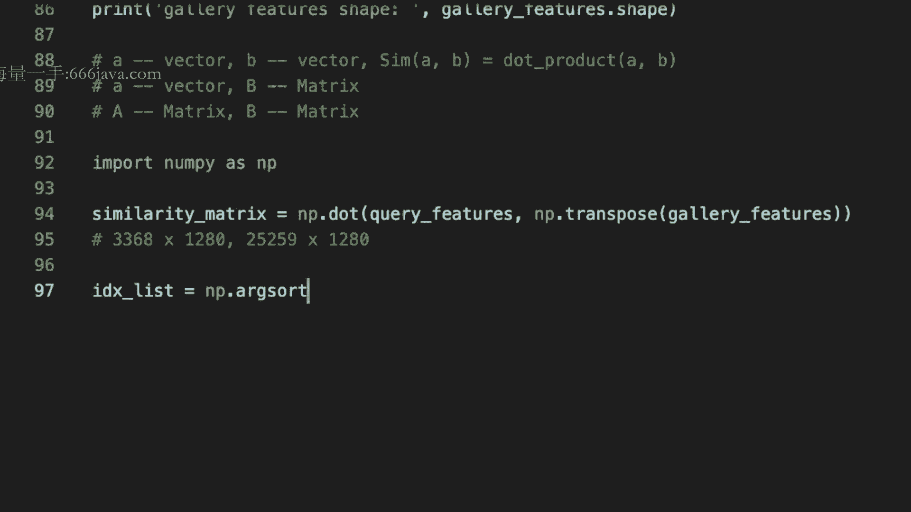
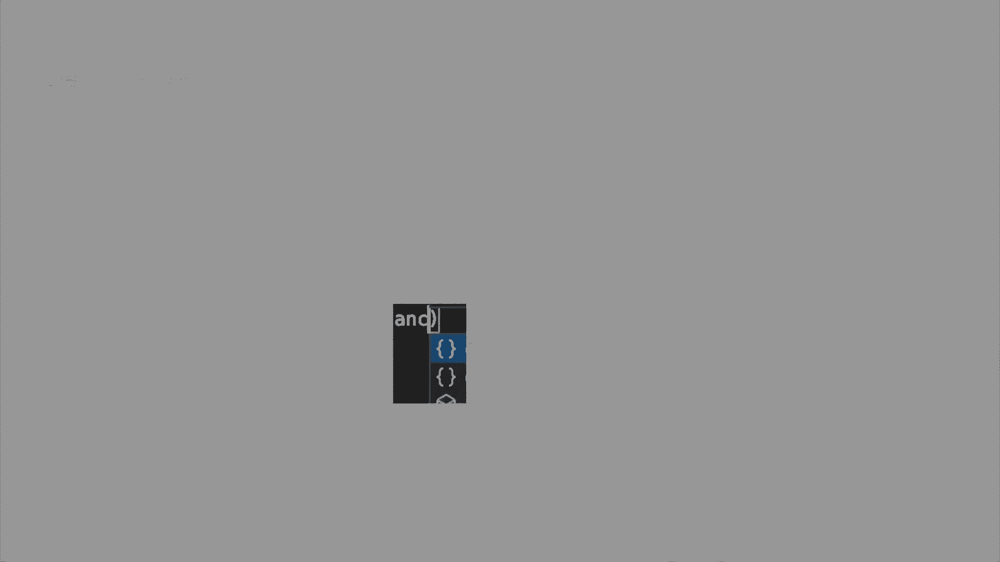
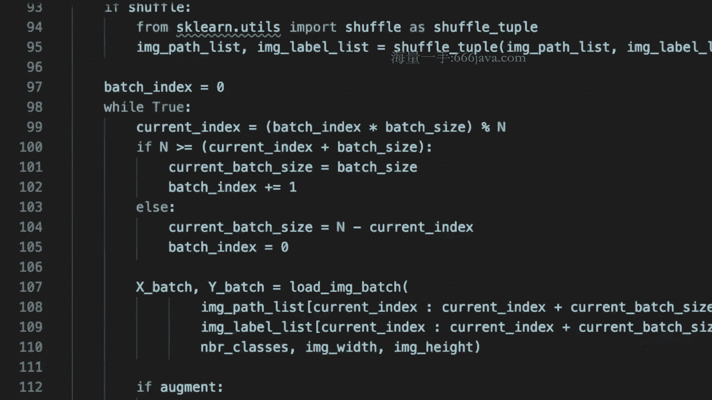
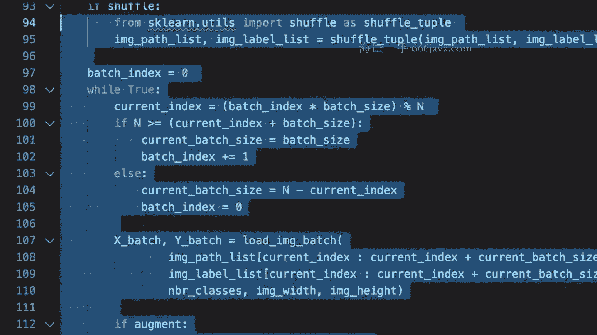
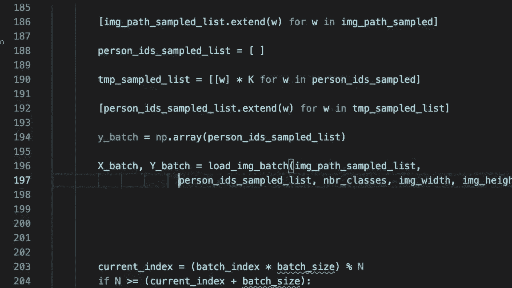
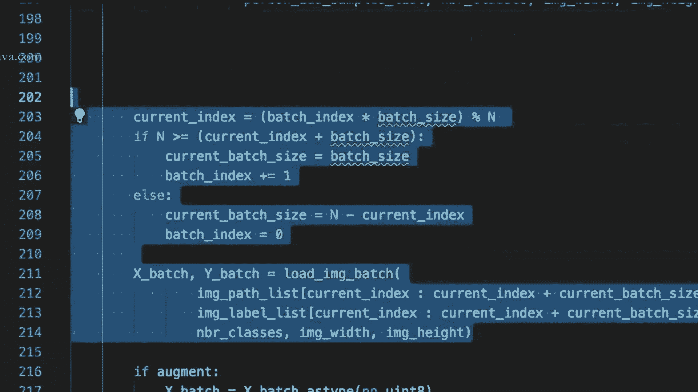
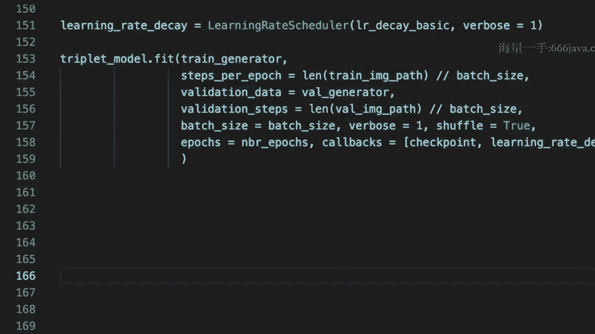

# 课程 1447-七月在线-机器学习集训营15期 - P8：04-CV-4-行人重识别项目（ReID）模型优化迭代及总结 🚶‍♂️➡️🚶‍♀️


在本节课中，我们将学习如何对行人重识别（ReID）模型进行评估，并引入一种强大的优化技术——三元组损失（Triplet Loss）来提升模型性能。我们将从评估流程的代码实现开始，逐步深入到Triplet Loss的原理、实现及其在ReID任务中的应用。

## 模型评估流程回顾

上一节我们完成了模型训练，本节中我们来看看如何对训练好的模型进行评估。评估的核心目标是：给定一个查询图像（query），从图库（gallery）中检索出属于同一行人的图像。

评估流程的代码逻辑如下：

1.  **加载模型与数据**：加载训练好的模型，并读取测试集的query和gallery图像。注意，测试集的图像ID与训练集不重合。
2.  **构建特征提取模型**：原始模型输出是分类概率。为了进行图像检索，我们需要一个输出为特征向量（feature）的模型。可以通过`model.get_layer`方法获取中间层的输出，并以此构建新的特征提取模型。
3.  **生成特征向量**：使用构建好的特征提取模型，分别对query和gallery图像进行预测，得到两组特征向量。通常会对这些特征进行归一化（L2 Normalize）处理。
4.  **计算相似度矩阵**：通过矩阵乘法计算query特征与gallery特征之间的相似度矩阵。
    ```python
    similarity_matrix = np.dot(query_features, gallery_features.T)
    ```
5.  **排序与匹配**：对相似度矩阵的每一行（对应一个query）进行排序，取相似度最高的gallery图像ID作为预测结果。
6.  **计算准确率**：将预测的ID与query图像的真实ID进行比对，计算Top-1准确率等指标。

以下是评估流程中几个关键步骤的代码片段：





```python
# 构建特征提取模型
feature_extractor = Model(inputs=model.input, outputs=model.get_layer('target_layer_name').output)
feature_extractor.compile(optimizer='adam', loss='categorical_crossentropy') # optimizer仅用于编译，实际不使用

# 预测特征
query_features = feature_extractor.predict(query_generator)
query_features = normalize(query_features, axis=1) # L2归一化

# 计算相似度并排序
similarity_matrix = np.dot(query_features, gallery_features.T)
# 按相似度从大到小排序，获取索引
sorted_indices = np.argsort(-similarity_matrix, axis=1)
# 取每个query最相似的gallery索引（即第一列）
top1_pred_indices = sorted_indices[:, 0]
```

## 模型优化：引入三元组损失（Triplet Loss）

评估完成后，我们思考如何提升模型性能。本节将介绍一种常用于图像检索任务的损失函数——三元组损失（Triplet Loss）。

### 三元组损失的核心思想

三元组损失旨在学习一个特征嵌入空间（Embedding Space），使得在这个空间中：
*   相同类别的样本（正样本对）距离更近。
*   不同类别的样本（负样本对）距离更远。

具体而言，它每次处理一个**三元组（Triplet）** 样本：
*   **Anchor（锚点）**：作为参照的样本。
*   **Positive（正样本）**：与Anchor属于**同一类别**的样本。
*   **Negative（负样本）**：与Anchor属于**不同类别**的样本。

**目标**是让Anchor与Positive之间的距离，小于Anchor与Negative之间的距离，并且要至少小于一个边界值（margin）。

用公式表示如下：
```
Loss = max( d(A, P) - d(A, N) + margin, 0 )
```
其中，`d()` 表示距离函数（如欧氏距离），`margin` 是一个大于0的常数。

### 困难样本挖掘（Hard Triplet Mining）

简单地随机采样三元组效率可能不高。**困难样本挖掘**是指有选择地构建更有挑战性的三元组，以促使模型学习到更具判别力的特征。

在ReID任务中：
*   **Anchor** 和 **Positive**：选择**同一行人ID**的不同图像。
*   **Negative**：选择**不同行人ID**的图像。而“困难”的负样本，是指那些与Anchor在特征空间上**容易混淆**的不同ID样本（例如，穿着颜色、款式相似但ID不同的行人图像）。

### 三元组损失的代码实现

以下是三元组损失函数的一个基本实现示例：

```python
import tensorflow as tf
from tensorflow.keras import backend as K

def triplet_loss(y_true, y_pred, margin=0.3):
    """
    y_pred: 模型输出的特征向量，形状为 (batch_size * 3, embedding_dim)。
            每连续三个样本依次为：Anchor, Positive, Negative。
    """
    embedding_size = K.int_shape(y_pred)[-1]
    # 将预测值重塑为 (batch_size, 3, embedding_dim)
    y_pred = K.reshape(y_pred, (-1, 3, embedding_size))
    # L2归一化
    y_pred = K.l2_normalize(y_pred, axis=-1)
    
    # 分割出A, P, N
    anchor = y_pred[:, 0, :]
    positive = y_pred[:, 1, :]
    negative = y_pred[:, 2, :]
    
    # 计算距离
    pos_dist = K.sum(K.square(anchor - positive), axis=-1)
    neg_dist = K.sum(K.square(anchor - negative), axis=-1)
    
    # 计算损失
    basic_loss = pos_dist - neg_dist + margin
    loss = K.maximum(basic_loss, 0.0)
    return K.mean(loss)
```

### 在模型中使用三元组损失

为了结合分类损失和三元组损失，我们采用**多任务学习（Multi-task Learning）** 框架。模型将有两个输出分支：

1.  一个分支输出特征向量，用于计算三元组损失。
2.  另一个分支输出分类概率，用于计算传统的交叉熵损失。

模型结构代码示例如下：

```python
from tensorflow.keras.layers import Input, Dense, Lambda, GlobalAveragePooling2D
from tensorflow.keras.models import Model

# ... 假设 base_model 是特征提取骨干网络 ...
x = base_model.output
x = GlobalAveragePooling2D()(x)

# 分支1：用于Triplet Loss的特征输出（L2归一化）
triplet_feature = Lambda(lambda v: tf.math.l2_normalize(v, axis=1), name='triplet_feature')(x)

# 分支2：用于分类的输出
classification_output = Dense(num_classes, activation='softmax', name='classification')(x)

# 定义多输出模型
model = Model(inputs=base_model.input, outputs=[triplet_feature, classification_output])
```

相应地，在编译模型时，需要为两个输出指定各自的损失函数：

```python
# 可以使用现成的Triplet Loss实现，例如 `tensorflow_addons.losses.TripletSemiHardLoss`
import tensorflow_addons as tfa

model.compile(
    optimizer='adam',
    loss={
        'triplet_feature': tfa.losses.TripletSemiHardLoss(), # 三元组损失
        'classification': 'categorical_crossentropy' # 分类损失
    },
    loss_weights={'triplet_feature': 0.5, 'classification': 0.5} # 可为不同损失设置权重
)
```

### 适配数据生成器（Data Generator）

由于模型现在需要两种监督信号（用于Triplet Loss的三元组和用于分类的标签），我们必须修改数据生成器。

新的生成器需要按批次生成三元组数据 `(anchor, positive, negative)` 及其对应的分类标签。一种常见的采样策略是 **PK采样**：
*   **P**：每个批次采样P个不同的行人ID。
*   **K**：对每个ID，随机采样K张图像。
*   批次大小则为 `P * K`。然后在这个批次内构造三元组。

数据生成器的输出需要与模型定义的两个输出严格对应。





## 学习率调度策略

最后，我们介绍一个训练技巧：学习率调度（Learning Rate Schedule）。它可以自动在训练到特定轮次时降低学习率，而无需手动干预。

以下是使用Keras回调函数实现学习率调度的示例：

```python
from tensorflow.keras.callbacks import LearningRateScheduler, ModelCheckpoint

def lr_schedule(epoch):
    """在第40轮和70轮将学习率乘以0.1"""
    initial_lr = 0.001
    if epoch < 40:
        return initial_lr
    elif epoch < 70:
        return initial_lr * 0.1
    else:
        return initial_lr * 0.01





lr_scheduler = LearningRateScheduler(lr_schedule)
checkpoint = ModelCheckpoint('best_model.h5', monitor='val_loss', save_best_only=True)

# 在 model.fit 的 callbacks 中同时加入
model.fit(..., callbacks=[checkpoint, lr_scheduler])
```

## 课程总结

本节课中我们一起学习了行人重识别（ReID）项目的两个关键部分：

1.  **模型评估**：我们梳理了从加载模型、提取特征、计算相似度到最终匹配评估的完整流程，并理解了其背后的检索逻辑。
2.  **模型优化**：我们深入探讨了**三元组损失（Triplet Loss）** 的原理，它通过拉近正样本对、推远负样本对的方式来学习更好的特征表示。我们介绍了**困难样本挖掘**的重要性，并展示了如何通过**多任务学习**将三元组损失与分类损失结合。最后，为了适配新的模型和损失函数，我们讲解了如何修改**数据生成器**，并介绍了**学习率自动调度**的技巧。




通过本课的学习，你不仅掌握了ReID项目的评估方法，还获得了提升模型性能的重要工具和思路。理解数据、模型与损失函数之间的协同设计，是解决复杂计算机视觉任务的关键。