# 📚 Lookalike相似人群拓展项目实战 - P1


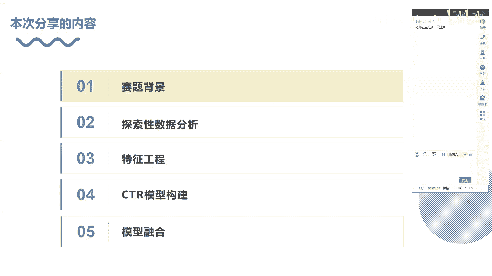

在本节课中，我们将学习推荐广告领域中的一个经典业务——Lookalike相似人群拓展。我们将从赛题背景出发，逐步了解数据、构建特征、选择模型，并最终完成模型融合。本教程旨在让初学者能够清晰理解整个流程。

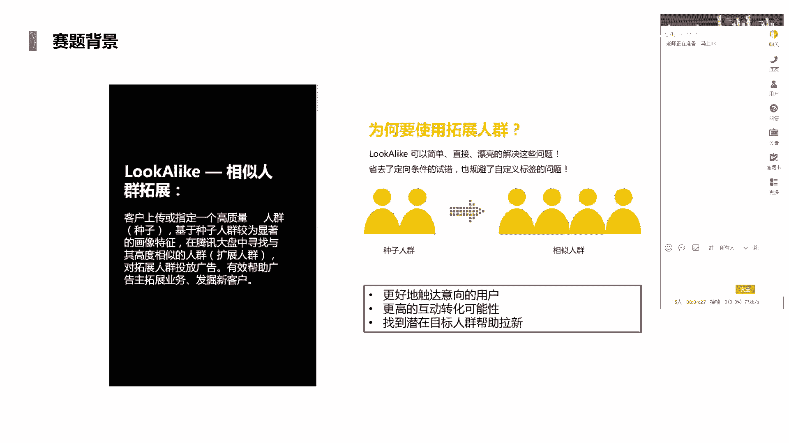

## 🎯 赛题背景与业务理解

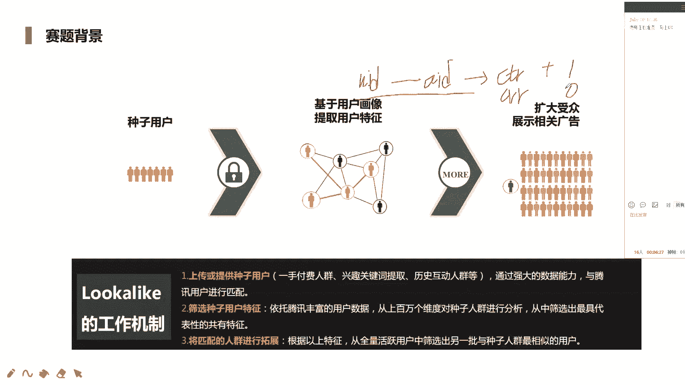

Lookalike相似人群拓展业务源于2018年的腾讯广告算法大赛。该赛题非常贴合真实业务，是推荐广告系统中的经典问题。其核心目标是：基于客户提供的一小部分高质量“种子人群”，通过建模方式，在全量用户中寻找与种子人群高度相似的“扩展人群”。

上一节我们介绍了课程概述，本节中我们来看看具体的业务场景。

**业务场景流程如下：**
1.  **种子人群**：客户上传指定高质量人群包。
2.  **特征提取**：从种子人群中挖掘显著的画像特征（如兴趣、行为）。
3.  **人群匹配**：基于提取的特征，从全量活跃用户中寻找相似人群。
4.  **广告投放**：向扩展人群展示相关广告，观察其点击或转化行为。

**业务价值体现在：**
*   更好触达意向用户。
*   获得更高的互动转化可能性。
*   找到潜在目标人群，助力用户增长（拉新）。

本次赛题对真实业务进行了简化。我们无需从全量库中召回用户，数据已直接提供了用户（UID）和广告（AID）的配对关系。我们的任务是预测给定的“用户-广告”对是否会发生点击（或转化），这本质上可以转化为一个**点击率（CTR）预估问题**。

## 📊 探索性数据分析

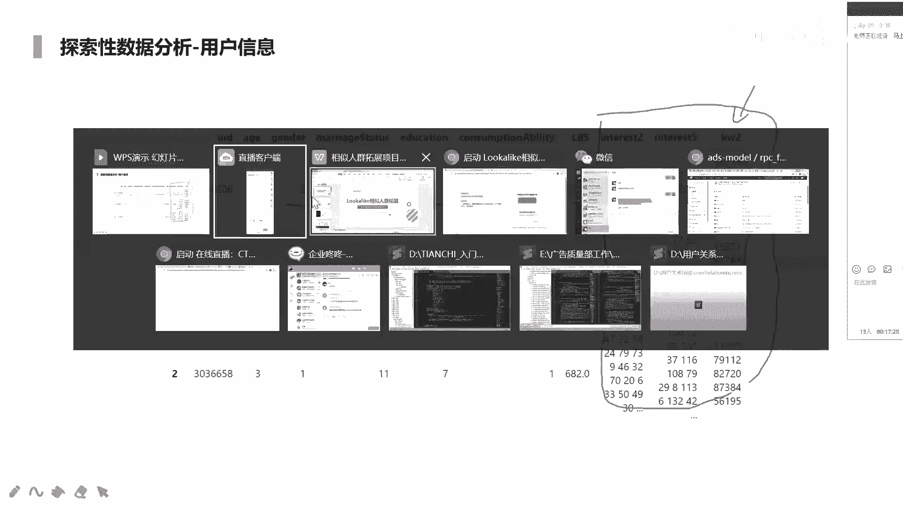

在开始建模前，我们必须先理解数据。探索性数据分析帮助我们了解数据的结构、规模和分布。

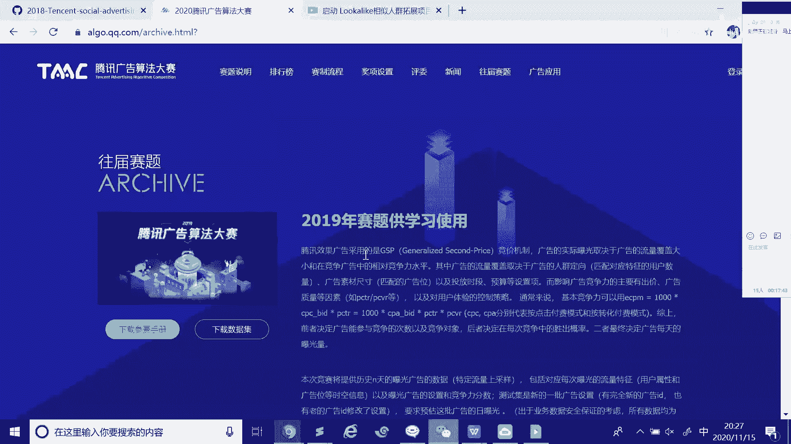

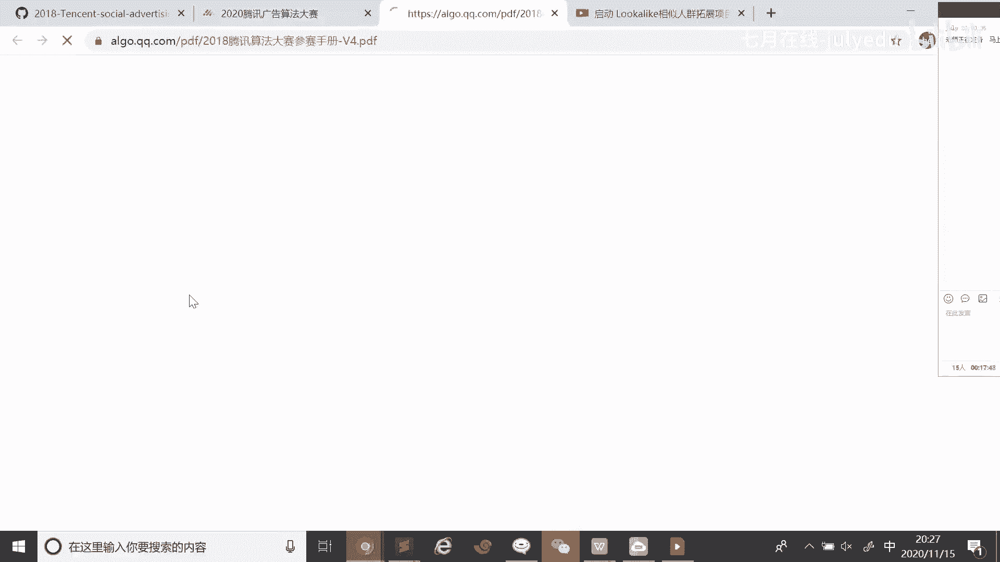

本次竞赛数据均为脱敏处理，时间范围为30天（但不包含具体时间戳）。数据分为四个部分：
1.  **训练集**：包含 `UID`（用户ID）、`AID`（广告ID）和 `label`（是否点击/转化）。
2.  **测试集**：包含 `UID` 和 `AID`，需要预测其 `label` 的概率。
3.  **用户特征**：包含用户的基础属性（如年龄、性别）以及多值兴趣特征（如 `interest1, interest2`）。
4.  **广告特征**：包含广告的相关属性（如广告主ID、素材ID、广告类别等）。

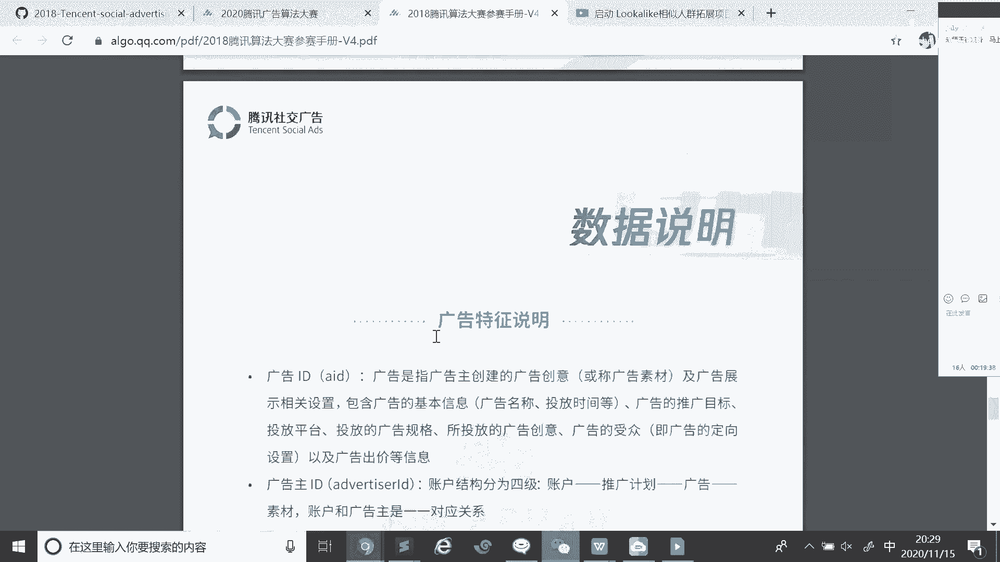

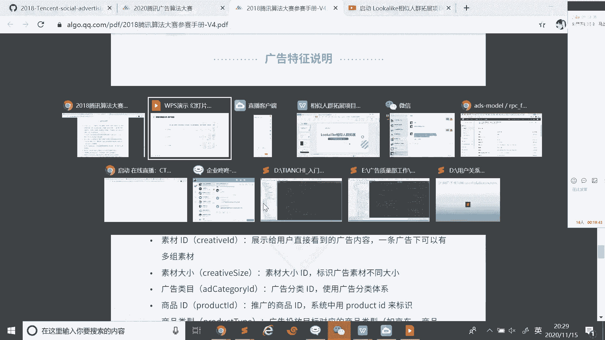

**关键发现：**
*   训练集中用户ID（UID）的重复度很低，因此**UID本身不能直接作为特征**使用，否则会导致严重的过拟合和冷启动问题。但可以围绕UID构造统计特征。
*   测试集与训练集中的广告ID（AID）集合完全一致。
*   用户特征中的兴趣字段（如 `interest1`）是**多值特征**，即一个字段内包含多个用逗号分隔的ID，需要特殊处理。

## 🔧 特征工程

特征工程是提升模型性能的关键。我们将围绕 `UID` 和 `AID` 构造丰富的特征。

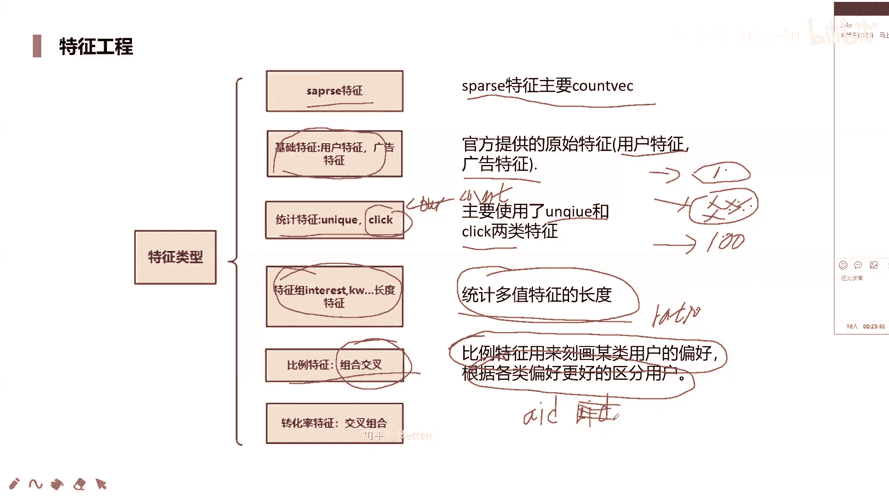

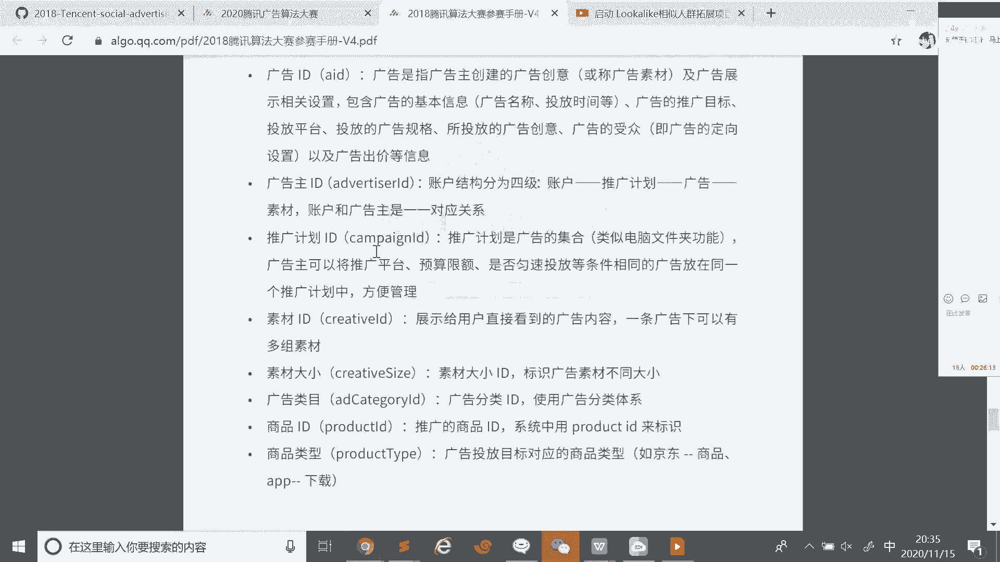

以下是构造特征的主要方法：

**1. 多值特征处理**
对于 `interest1` 这类多值特征，常用处理方法有：
*   **展开为稀疏向量**：使用 `CountVectorizer` 或 `TfidfVectorizer`。例如，`interest1` 中的不同ID可以视为“词”，整个字段视为“文档”，进行词频或TF-IDF统计。
    ```python
    # 示例：使用 CountVectorizer
    from sklearn.feature_extraction.text import CountVectorizer
    vectorizer = CountVectorizer(tokenizer=lambda x: x.split(','))
    interest_features = vectorizer.fit_transform(user_df['interest1'])
    ```
*   **降维**：由于展开后维度可能极高，可以使用 `PCA`、`NMF` 或 `SVD` 进行降维。

**2. 基础特征**
直接使用原始特征，如用户的年龄、性别，广告的素材大小、类别ID等，作为类别型或数值型特征。

**3. 统计特征**
*   **计数特征**：例如，统计每个 `AID` 被点击的总次数 (`count`)。
*   **唯一值计数**：例如，统计每个用户 `UID` 有多少个不同的兴趣ID (`nunique`)，反映兴趣广度。
*   **点击统计**：例如，统计每个用户的历史总点击次数，反映活跃度。

**4. 比例特征**
*   **目标编码**：计算某个类别（如 `AID`）下 `label` 的平均值（转化率）。这是强特征，但需注意**数据泄露**问题。
    *   **解决方法**：使用**五折交叉验证**的方式在训练集上构造，即用其他四折的数据统计当前折的转化率。对于测试集，则用全部训练数据统计。
    *   **平滑处理**：对于出现次数少的类别，其统计值不可靠，需引入平滑（如贝叶斯平滑），公式可参考：
        ```
        平滑后的转化率 = (点击次数 + α) / (展示次数 + α + β)
        ```
        其中 α 和 β 为超参数。

**5. 交叉组合特征**
*   **类别特征交叉**：将两个或多个类别特征组合，形成更细粒度的特征，如“性别_年龄段”。
*   **转化率交叉特征**：将不同维度统计的转化率进行组合或比较。

## 🤖 CTR模型建模

我们将问题定义为CTR预估，因此可以使用经典的CTR模型。

**1. 树模型**
*   **LightGBM / XGBoost**：处理结构化数据的利器，性能稳定且高效。
    *   **LightGBM优势**：采用直方图算法和叶子节点分裂策略，训练速度更快，内存消耗更低。
    *   **XGBoost优势**：采用预排序算法，精度可能略高，但效率较低。

**2. 因子分解机及其变种**
*   **FM**：通过隐向量内积建模二阶特征交叉，公式为：
    ```
    ŷ = w0 + Σ wi*xi + Σ Σ <vi, vj> * xi * xj
    ```
    其中 `<vi, vj>` 是特征i和j的隐向量内积。
*   **FFM**：在FM基础上引入“域”的概念，同一特征在与不同域的特征交叉时使用不同的隐向量，能更好地建模特征交叉，但参数更多。
*   **DeepFM / NFM 等**：将FM与深度神经网络结合，能够以端到端的方式同时学习低阶和高阶特征交叉。

## ⚙️ 训练与验证策略

为了保证线上线下的一致性，验证策略至关重要。

**1. 按AID划分验证集**
由于测试集中每个AID是独立的，最合理的验证方式是**按照AID进行分层划分**。例如，随机抽取20%的AID对应的所有样本作为验证集，剩余80%作为训练集。这能最大程度模拟测试集的数据分布。

**2. 五折交叉验证**
在训练阶段，对80%的训练数据再进行五折交叉验证，用于调参和获得稳定的模型输出。五折产生的五个模型可以用于后续的集成。

## 🧩 模型融合

模型融合是提升最终成绩的重要手段，其核心思想是**集成多个差异化的模型**，以降低方差，提高泛化能力。

差异来源主要包括：
*   **模型差异**：使用不同原理的模型，如 LightGBM, FFM, DeepFM。
*   **特征差异**：使用不同的特征子集或特征构造方法。
*   **样本差异**：通过Bagging或交叉验证产生不同的训练子集。

**常用融合方法：**
1.  **加权平均**：对多个模型的预测概率进行加权平均。
2.  **Stacking**：
    *   将第一层多个模型的预测输出（在验证集和测试集上）作为新的特征。
    *   将这些新特征与原始特征拼接，训练第二层模型（通常为简单的线性模型或树模型）。
    *   这是一个强大的集成方法，但需小心过拟合。

**实战技巧**：在比赛中，优胜方案通常构建了复杂的多层级联模型。例如，将LightGBM、FFM等模型的预测结果作为特征，输入到下一阶段的XGBoost或神经网络中，并进行多次堆叠。

## 📝 总结与代码建议

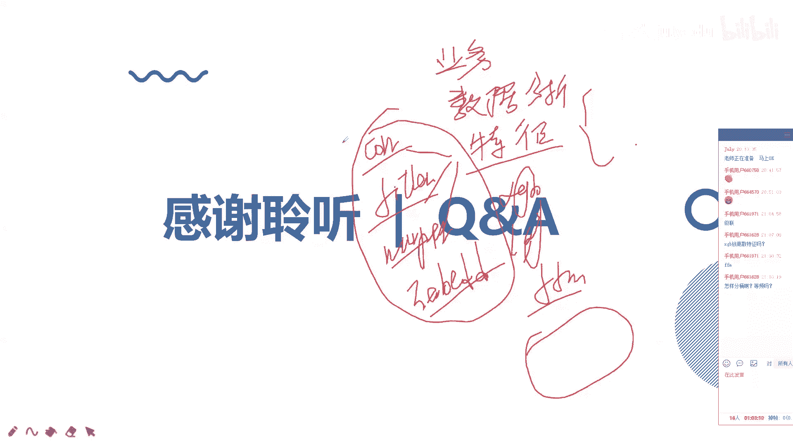

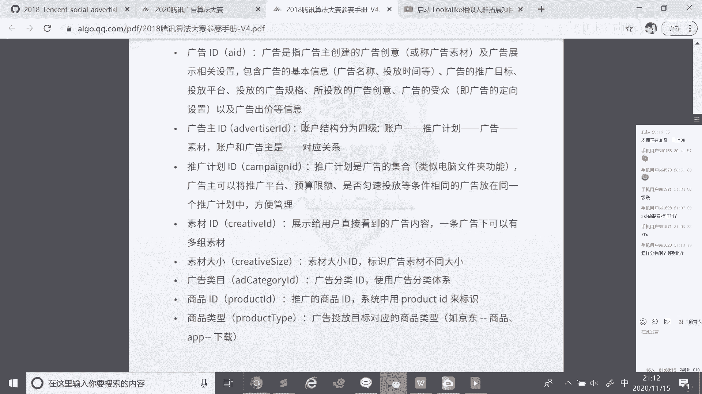

本节课我们一起学习了Lookalike相似人群拓展项目的完整实战流程：

1.  **理解业务**：将人群扩展问题转化为CTR预估问题。
2.  **分析数据**：通过EDA了解数据结构和关键点（如多值特征、UID不可用）。
3.  **构造特征**：重点处理多值特征、构建统计特征、比例特征（目标编码）和交叉特征。
4.  **选择模型**：应用树模型和深度CTR模型进行建模。
5.  **设计验证**：按AID划分验证集，保证线上线下一致性。
6.  **模型融合**：通过加权平均、Stacking等方法集成多个模型，提升最终效果。

**建议**：
*   对于此类经典赛题，强烈建议复现top选手的开源代码，学习他们的特征工程和模型集成技巧。
*   在实践中，特征的有效性需要通过模型线下验证来最终判断，理论上有解释性的特征不一定带来效果提升。
*   本赛题简化了真实业务（如一对多关系、召回阶段），真实场景会更复杂。

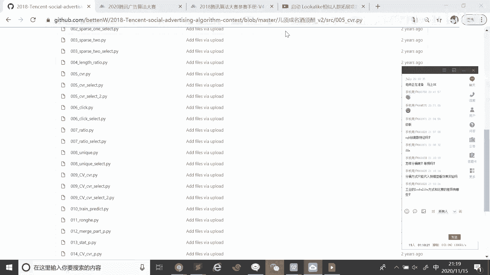


通过本课程的学习，你应该对如何解决一个Lookalike或CTR预估问题有了系统的认识。接下来，可以尝试在具体数据集上实践这些步骤，并深入阅读FM、FFM等模型的原理细节。