# 🧠 深度学习集训营 P1：深入理解CNN、RNN和LSTM

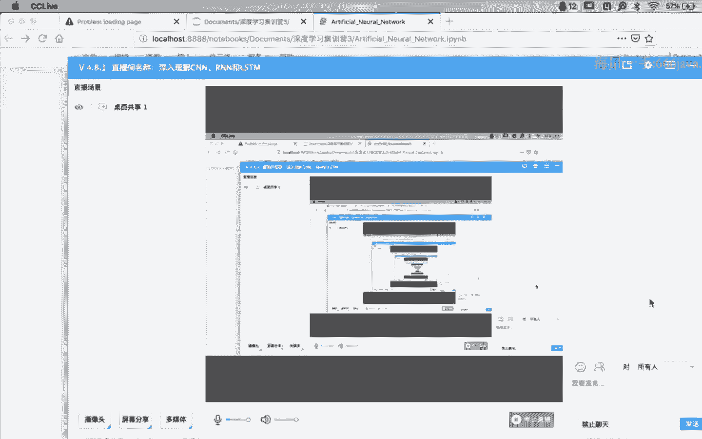

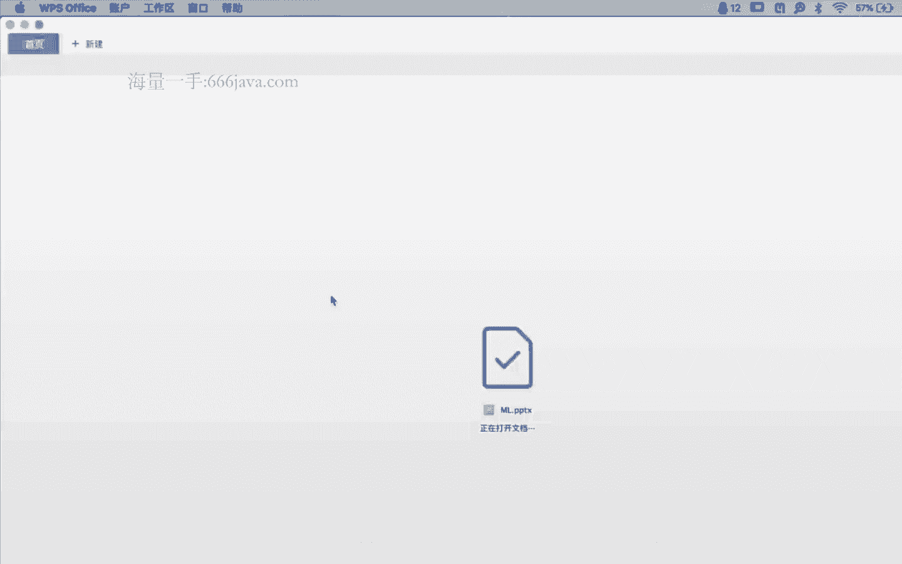

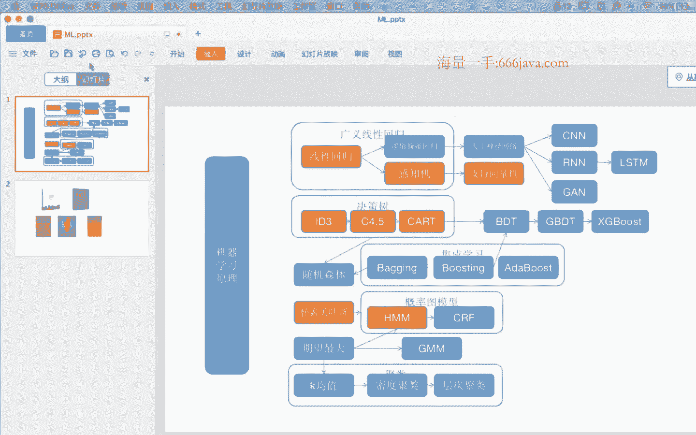

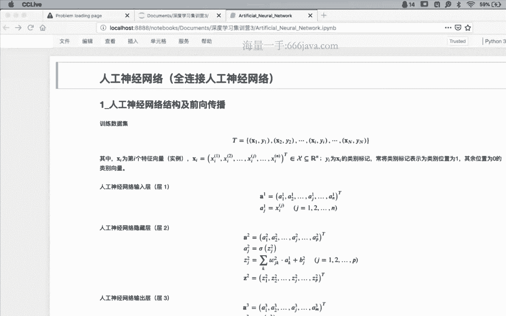

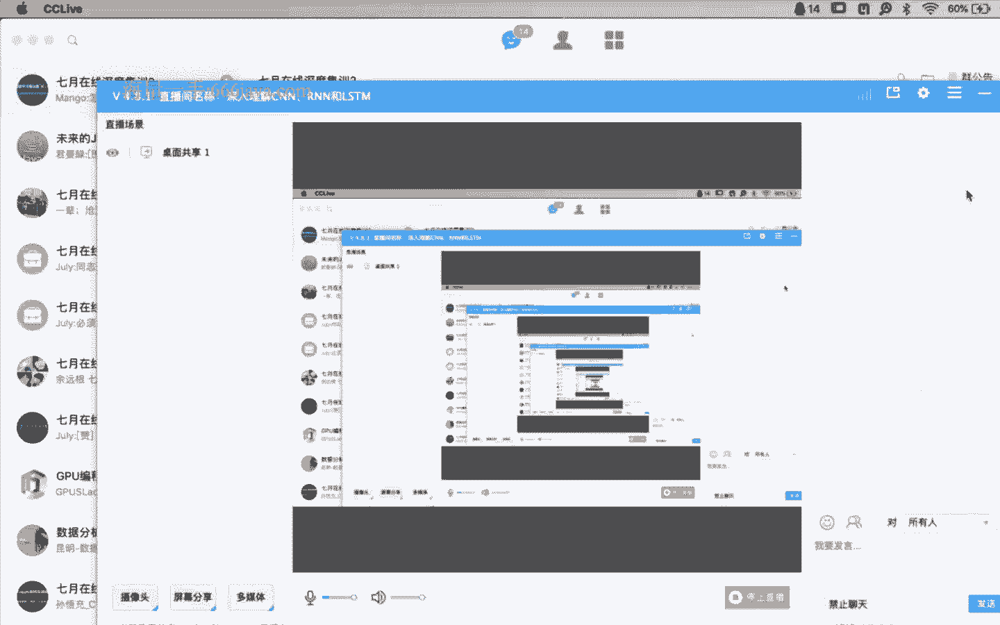

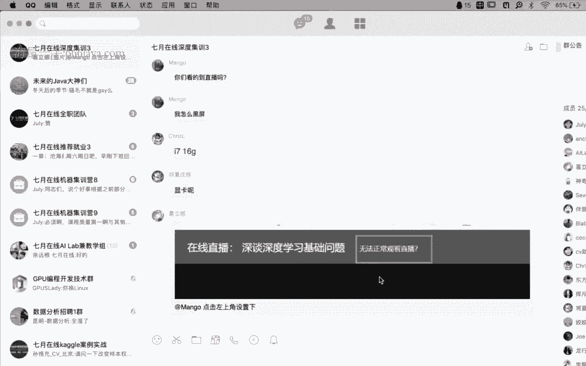

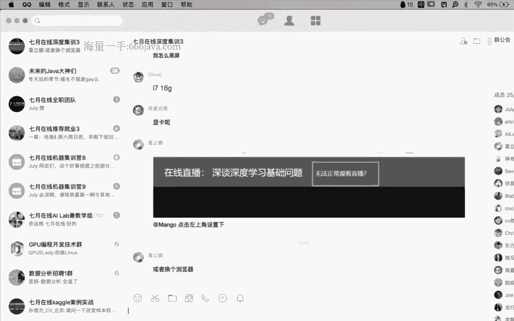

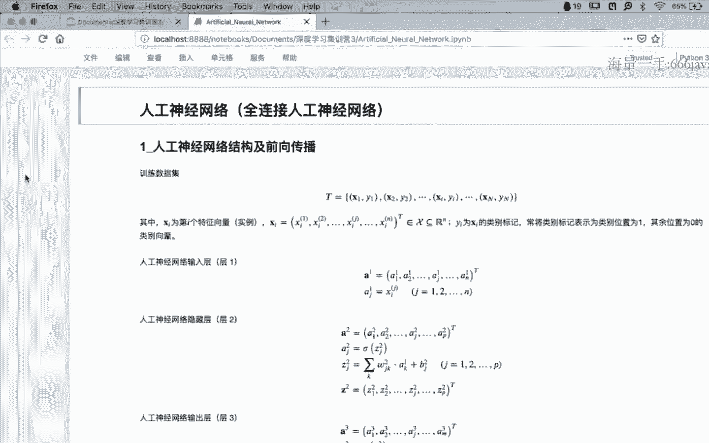

在本节课中，我们将学习如何从数学原理出发，深入理解全连接神经网络（FNN）、循环神经网络（RNN）和长短期记忆网络（LSTM）的核心机制。我们将通过将复杂的数学公式转化为直观的图示，并最终抽象为向量化表示，来掌握这些模型的本质。课程的重点在于掌握一套分析模型的方法论，而不仅仅是记住公式。

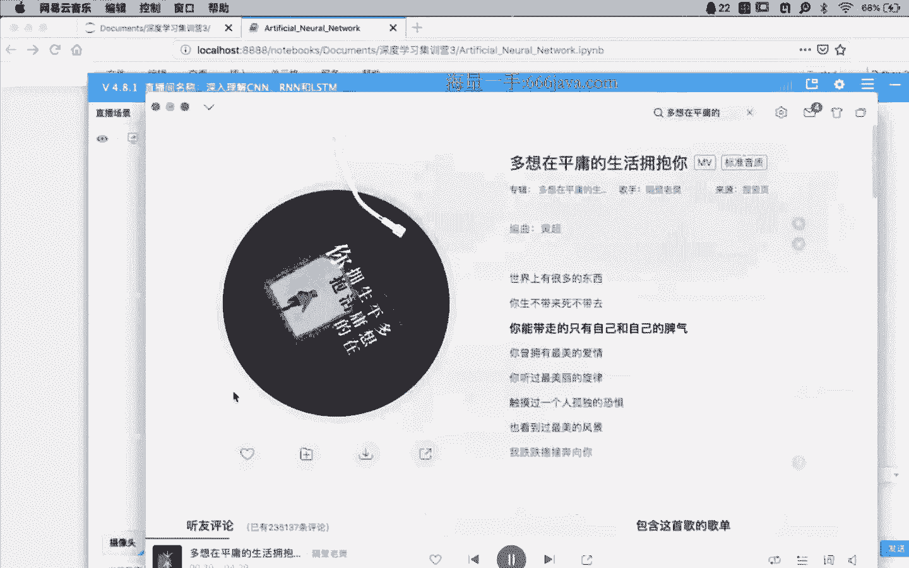

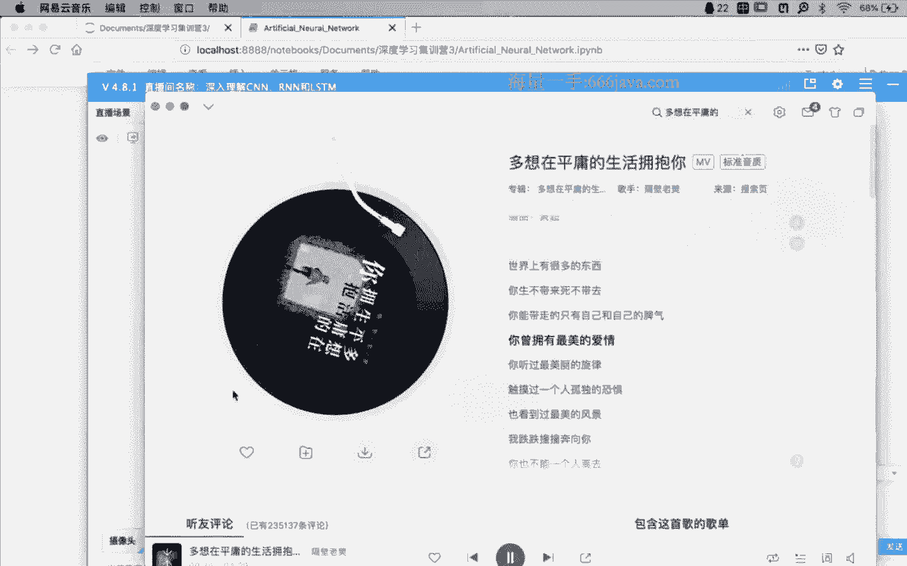

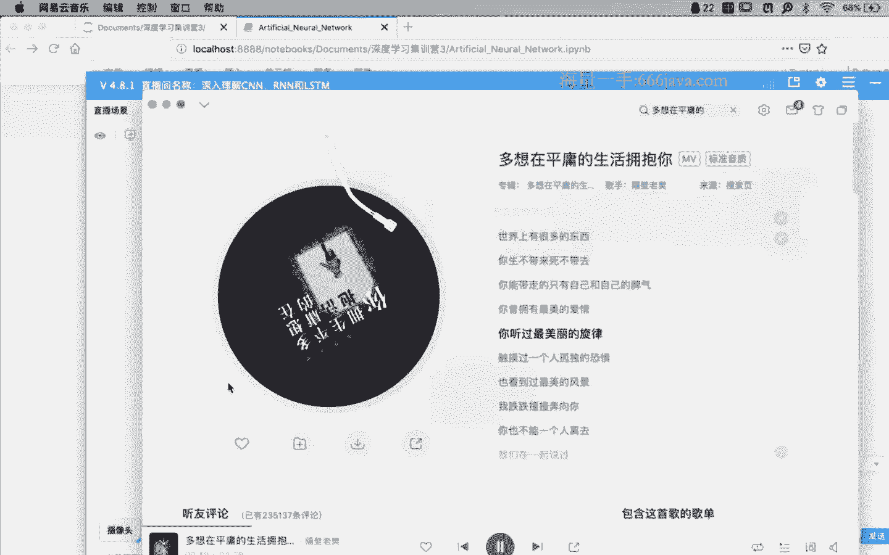

## 📘 概述：从公式到图，再到向量化

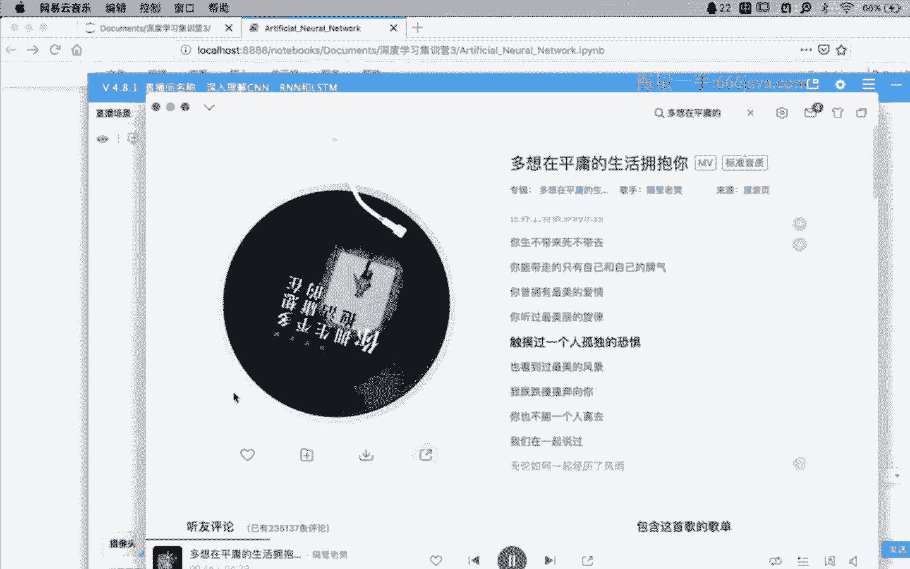

理解深度学习模型的关键在于建立不同抽象层次之间的联系。我们将遵循一个清晰的路径：首先，从最底层的**标量数学公式**开始，理解每一个计算细节；然后，将这些公式**映射为结构化的图示**，使计算流程可视化；最后，将图示**抽象为更高层次的向量/矩阵表示**，这是现代深度学习框架实现的基础。掌握这套方法，你将能剖析任何复杂的神经网络结构。

---

## 第一部分：全连接神经网络（FNN）的深入剖析

上一节概述了我们分析模型的整体思路，本节中我们来看看如何将这套方法应用于最基础的全连接神经网络。

### 1.1 模型输入与数据表示

首先，我们需要明确模型的输入。假设我们有一个分类任务的数据集。

以下是数据集中一个样本的数学表示：

*   **特征向量 `x`**: 这是一个 `n` 维的列向量，属于实数空间 `R^n`。`x = [x1, x2, ..., xn]^T`。在图中，它对应输入层的 `n` 个节点。
*   **标签 `y`**: 这是一个标量，表示类别。在代码实现中，我们通常将其转换为 **`m` 维的 one-hot 编码向量**，其中 `m` 是类别总数。这样，输出层就有 `m` 个节点。

**核心概念**：输入 `x` 是向量，输出 `y` 在计算中也被处理为向量（one-hot 编码）。区分标量和向量是理解后续公式的关键。

### 1.2 前向传播：从标量公式到网络图示

前向传播定义了数据如何从输入层流经网络得到预测输出。我们以一个三层网络（输入、隐藏、输出）为例，将其拆解为线性部分和非线性部分。

#### 第一层（输入层）

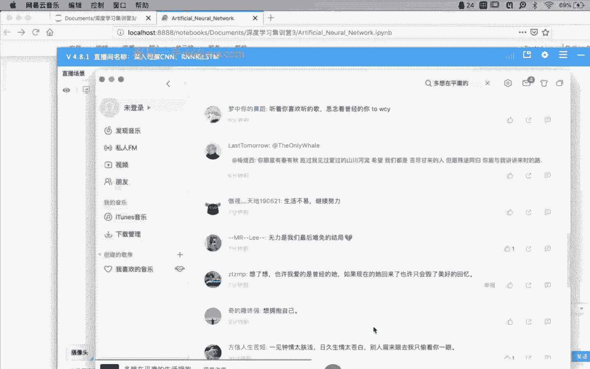

第一层很简单，只是接收输入数据。

**公式表示**:
`a^(1) = x`
这意味着将输入向量 `x` 的值赋给第一层的激活值 `a^(1)`。上标 `(1)` 表示第一层。

**图示映射**:
在图上，这对应于 `n` 个输入节点，每个节点的值就是 `x` 向量的一个分量 `x_i`。

---

上一节我们介绍了输入层的简单映射，本节中我们来看看包含计算的隐藏层。

#### 第二层（隐藏层）

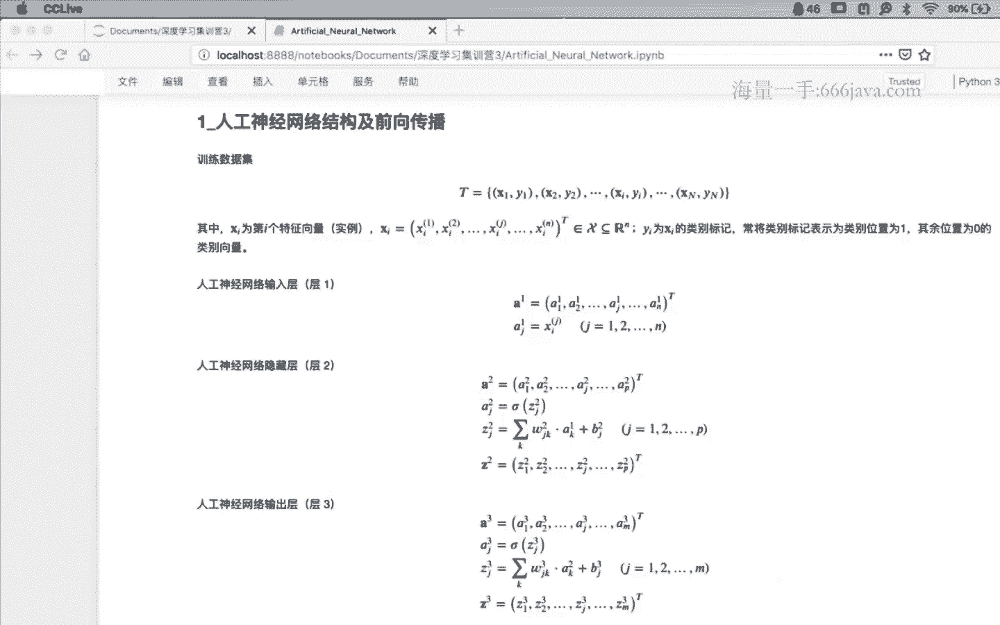

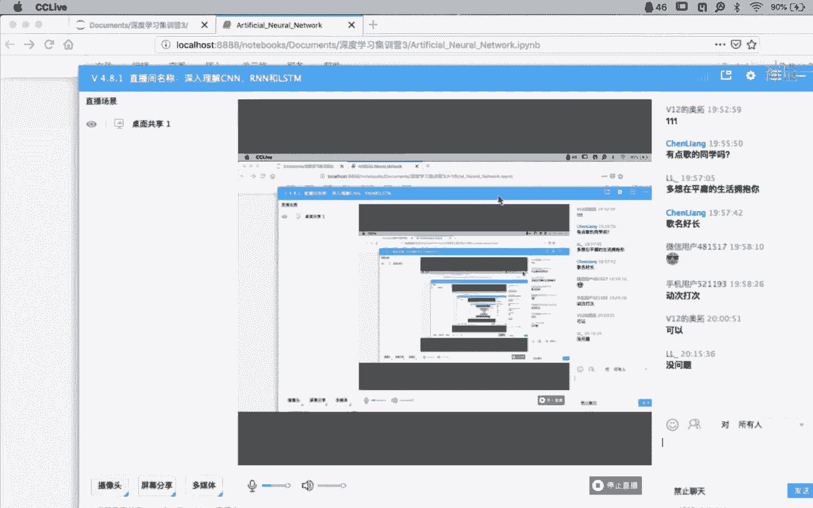

隐藏层开始进行真正的计算，包括线性加权求和与非线性激活。

**线性部分 `z^(2)`**:
`z_j^(2) = Σ_k ( w_(jk)^(2) * a_k^(1) ) + b_j^(2)`
其中，`j` 是隐藏层神经元的索引（`j=1 to p`），`k` 是输入层神经元的索引（`k=1 to n`）。`w_(jk)^(2)` 是连接输入层第 `k` 个神经元和隐藏层第 `j` 个神经元的权重。**注意下标顺序**：`w_(jk)` 表示“目标层`j` <- 来源层`k`”。

**非线性部分 `a^(2)`**:
`a_j^(2) = σ(z_j^(2))`
这里 `σ` 是激活函数，例如 Sigmoid 函数 `σ(z) = 1 / (1 + e^(-z))`。

**图示映射**:
1.  在图上画出 `p` 个代表 `z_j^(2)` 的节点。
2.  对于每个 `z_j^(2)`，画出从所有 `a_k^(1)` 指向它的连接线，线上标注权重 `w_(jk)^(2)`。
3.  为每个 `z_j^(2)` 添加偏置 `b_j^(2)`。
4.  从每个 `z_j^(2)` 画出一个箭头指向 `a_j^(2)`，表示应用激活函数 `σ`。

通过这种方式，我们可以将第二层的两行数学公式完全转化为一张局部的网络图。

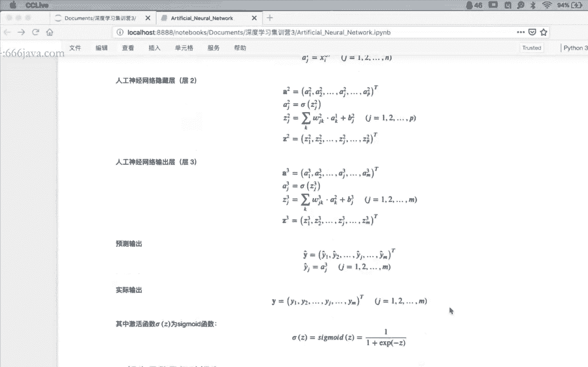

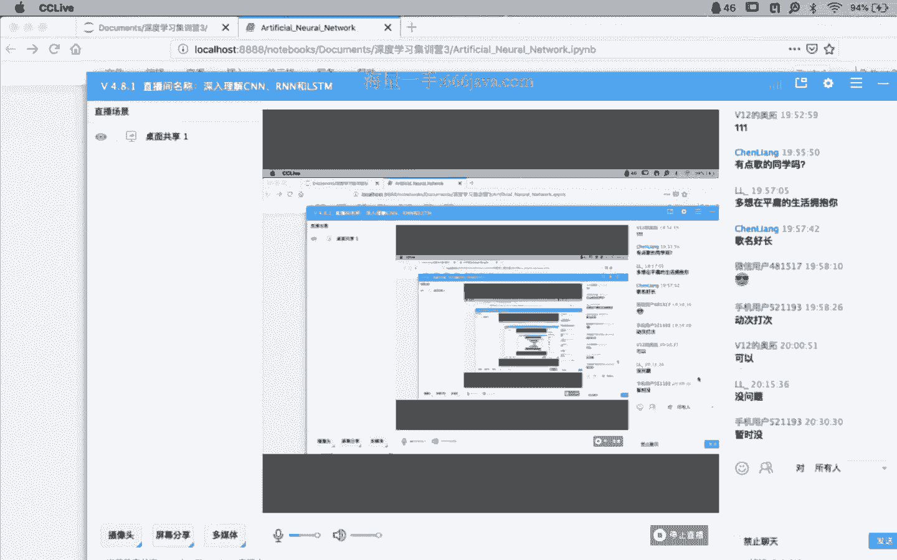

---

理解了隐藏层的图示化方法后，输出层的处理方式是完全类似的。

#### 第三层（输出层）及预测输出

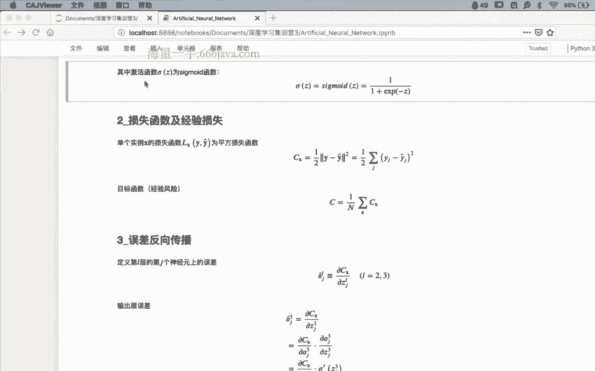

第三层（输出层）的计算逻辑与第二层相同，只是维度变化。

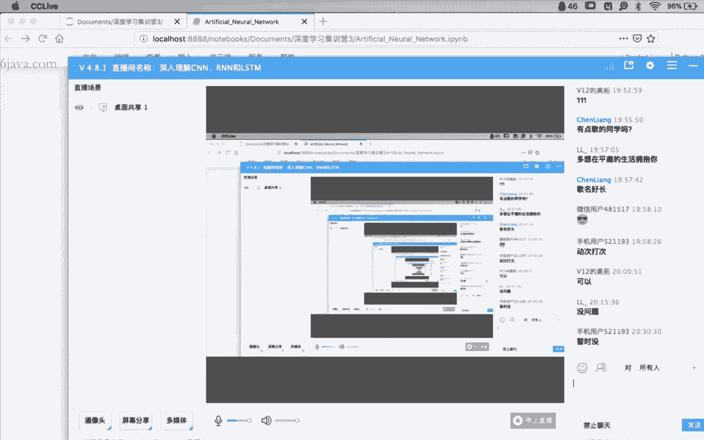

**线性部分 `z^(3)`**:
`z_j^(3) = Σ_k ( w_(jk)^(3) * a_k^(2) ) + b_j^(3)`
`j=1 to m`（输出类别数），`k=1 to p`（隐藏层神经元数）。

**非线性部分 `a^(3)`**:
`a_j^(3) = σ(z_j^(3))`

**预测输出 `ŷ`**:
`ŷ_j = a_j^(3)`
预测输出 `ŷ` 直接等于输出层的激活值 `a^(3)`，它是一个 `m` 维向量，可以解释为属于各个类别的概率。

**图示映射**:
重复第二层的绘图过程，将层标改为 `(3)`，并将 `a_j^(3)` 节点标记为 `ŷ_j`。

至此，我们完成了**从输入 `x` 到预测输出 `ŷ` 的完整前向计算图示**。图中的每一个符号都严格对应数学公式中的一个变量。

### 1.3 损失函数与训练目标

得到预测值后，我们需要衡量它与真实值的差距。

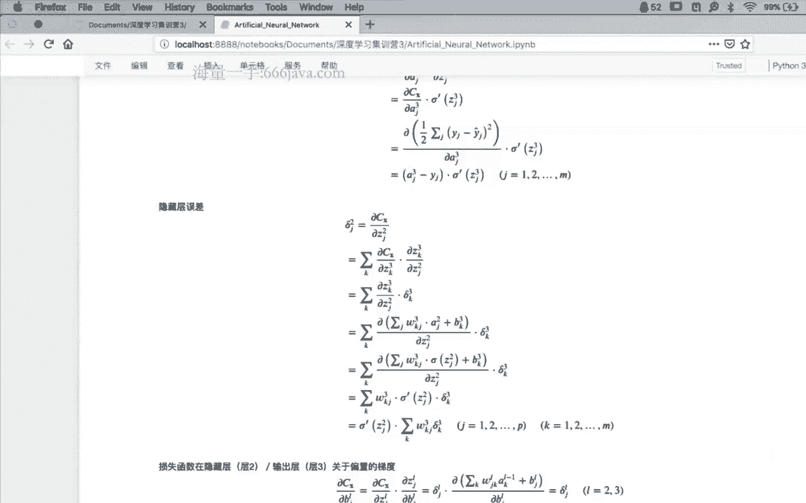

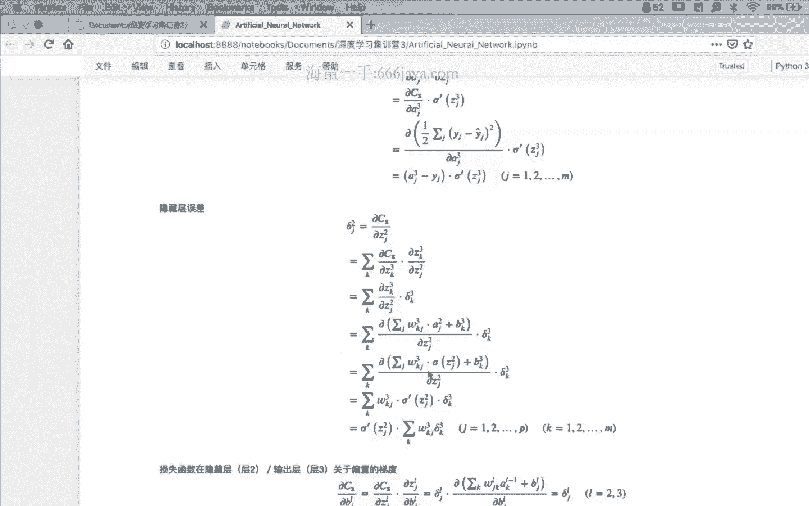

**公式表示（以均方误差为例）**:
`L(x) = 1/2 * Σ_j ( (ŷ_j - y_j)^2 )`
其中 `y_j` 是真实标签的 one-hot 编码向量的第 `j` 个分量。

我们的训练目标就是通过调整网络中的所有权重 `w` 和偏置 `b`，最小化整个训练集上的总损失。

### 1.4 误差反向传播：链式法则的图示化应用

反向传播的目的是计算损失函数对每个参数（`w`, `b`）的梯度，以便用梯度下降法更新它们。其核心数学工具是**链式法则**。

#### 关键中间量：误差 `δ`

为了计算方便，我们定义每一层（第 `l` 层）的误差 `δ^(l)`：
`δ^(l) = ∂L / ∂z^(l)`
即损失对当前层线性部分 `z` 的偏导。它是一个非常有用的中间量。

**为什么需要 `δ`？** 它本身没有直接的物理意义，但作为计算参数梯度的“跳板”，可以简化公式推导和代码实现。

#### 输出层误差 `δ^(3)` 的计算

以第三层（输出层）为例，计算 `δ_j^(3) = ∂L / ∂z_j^(3)`。

根据图示，`L` 到 `z_j^(3)` 不是直接相连，中间经过了 `a_j^(3)`（即 `ŷ_j`）。因此，应用链式法则：
`δ_j^(3) = (∂L / ∂a_j^(3)) * (∂a_j^(3) / ∂z_j^(3))`

1.  **第一项 `∂L / ∂a_j^(3)`**：将均方误差公式和 `ŷ_j = a_j^(3)` 代入，可得 `(a_j^(3) - y_j)`。
2.  **第二项 `∂a_j^(3) / ∂z_j^(3)`**：这就是激活函数 `σ` 在 `z_j^(3)` 处的导数，记作 `σ‘(z_j^(3))`。

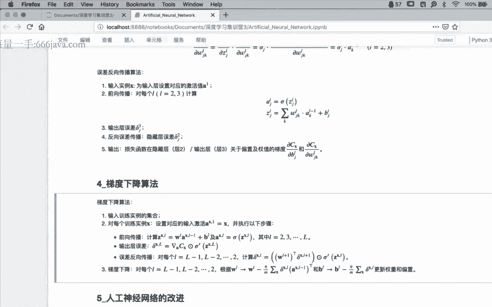

所以，`δ_j^(3) = (a_j^(3) - y_j) * σ‘(z_j^(3))`。
**图示帮助**：在图上，这清晰地对应着从损失 `L` 反向经过 `ŷ_j` 节点，再到达 `z_j^(3)` 节点的路径。

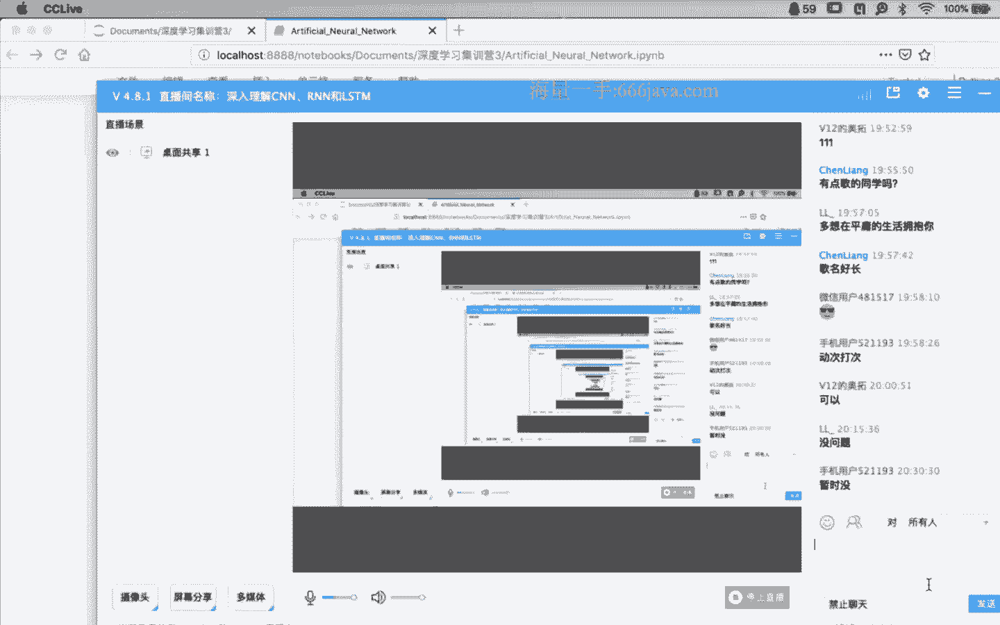

#### 隐藏层误差 `δ^(2)` 的计算

计算第二层的误差 `δ_j^(2) = ∂L / ∂z_j^(2)` 更复杂一些，因为 `L` 到 `z_j^(2)` 的路径更长。

观察图示，从 `z_j^(2)` 到 `L` 的路径有两条主要分支：它先影响本层的 `a_j^(2)`，而 `a_j^(2)` 会影响下一层**所有**的 `z_k^(3)`（`k=1 to m`）。因此，需要用到**全导数公式**：当一个变量影响多个后续变量时，对其求导需将所有路径的导数相加。

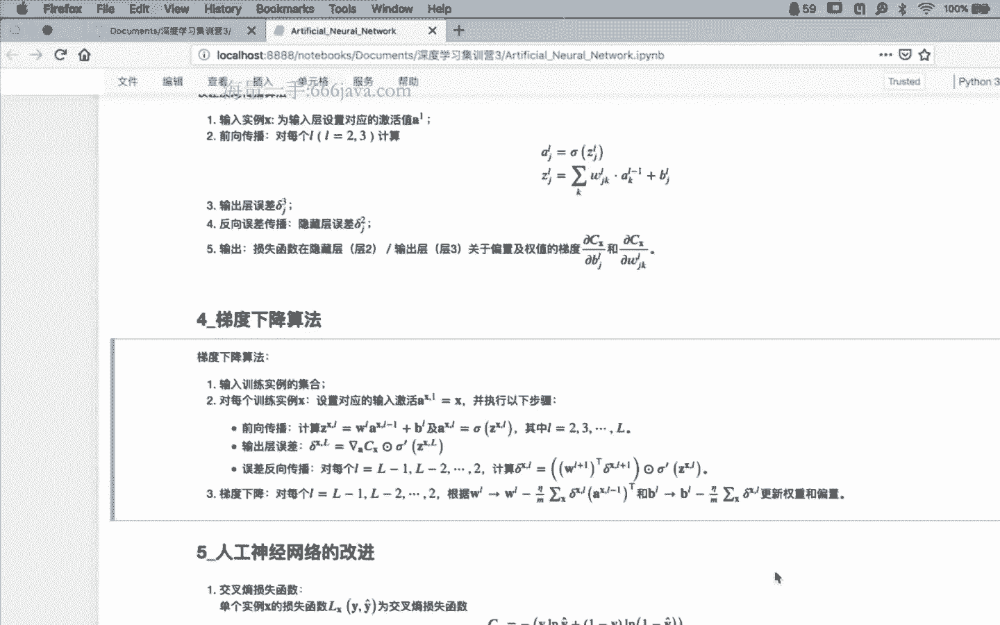

应用链式法则和全导数公式：
`δ_j^(2) = Σ_k [ (∂L / ∂z_k^(3)) * (∂z_k^(3) / ∂a_j^(2)) ] * (∂a_j^(2) / ∂z_j^(2))`

1.  **第一部分 `∂L / ∂z_k^(3)`**：这正是我们刚算出的 `δ_k^(3)`。
2.  **第二部分 `∂z_k^(3) / ∂a_j^(2)`**：根据 `z_k^(3)` 的公式，这项等于权重 `w_(kj)^(3)`。**注意下标**：这里变成了 `w_(kj)`，因为反向传播时，来源层（2）和目标层（3）的下标顺序与正向传播相反。
3.  **第三部分 `∂a_j^(2) / ∂z_j^(2)`**：同样是激活函数的导数 `σ‘(z_j^(2))`。

所以，`δ_j^(2) = σ‘(z_j^(2)) * Σ_k ( δ_k^(3) * w_(kj)^(3) )`。
**图示帮助**：在图上，这对应从 `z_j^(2)` 出发，经过 `a_j^(2)`，然后分散到所有 `z_k^(3)`，最后汇聚到损失 `L` 的所有可能路径的导数之和。

#### 计算参数梯度

有了各层的误差 `δ`，计算权重和偏置的梯度就非常简单了。

**对于偏置 `b`**:
`∂L / ∂b_j^(l) = δ_j^(l)`
因为根据 `z` 的公式，`∂z_j^(l) / ∂b_j^(l) = 1`。

**对于权重 `w`**:
`∂L / ∂w_(jk)^(l) = a_k^(l-1) * δ_j^(l)`
因为 `∂z_j^(l) / ∂w_(jk)^(l) = a_k^(l-1)`。

**算法总结**：
1.  前向传播，计算所有 `a` 和 `z`。
2.  计算输出层误差 `δ^(L)`。
3.  反向逐层计算 `δ^(l)`。
4.  利用 `δ^(l)` 计算各层参数的梯度 `∂L/∂w` 和 `∂L/∂b`。
5.  使用梯度下降更新参数：`w = w - η * ∂L/∂w`，`b = b - η * ∂L/∂b`。

### 1.5 向量化表示：从繁琐到简洁

上述标量形式虽然细致，但过于繁琐。在实际的算法描述和代码实现中，我们使用**向量和矩阵**进行表示，极大提升了简洁性和计算效率。

*   **激活值**：`a^(l)` 表示第 `l` 层所有神经元的激活值向量。
*   **权重**：`W^(l)` 表示连接第 `l-1` 层到第 `l` 层的权重矩阵。`W^(l)` 的第 `j` 行第 `k` 列元素就是 `w_(jk)^(l)`。
*   **线性计算**：`z^(l) = W^(l) * a^(l-1) + b^(l)`。这里 `*` 表示矩阵乘法。
*   **激活函数**：`a^(l) = σ(z^(l))`，这里的 `σ` 是逐元素（element-wise）运算。
*   **误差**：`δ^(l) = ( (W^(l+1))^T * δ^(l+1) ) ⊙ σ‘(z^(l))`。其中 `⊙` 表示逐元素相乘，`^T` 表示矩阵转置。
*   **梯度**：
    *   `∇_(b^(l)) L = δ^(l)`
    *   `∇_(W^(l)) L = δ^(l) * (a^(l-1))^T`

**抽象图示**：在向量化视角下，一个复杂的全连接网络可以简化为：
`x` (输入向量) -> `a` (隐藏向量) -> `ŷ` (输出向量)
其中每个箭头都包含了矩阵乘法、向量加法和非线性激活这一整套计算。这种高度抽象的视图是理解更复杂模型（如RNN）的基础。

---

## 第二部分：从FNN到RNN与LSTM

上一节我们详细拆解了全连接神经网络，并学会了用向量化视角来抽象它。本节中我们来看看如何利用这种抽象，自然地过渡到循环神经网络。

### 2.1 循环神经网络（RNN）的直觉

观察FNN的向量化抽象图：`x -> a -> ŷ`。如果我们让隐藏状态 `a` 不仅依赖于当前输入 `x`，还依赖于**上一时刻的隐藏状态 `a_(t-1)`**，就引入了“记忆”能力，形成了循环。

**核心思想**：在RNN中，网络在处理序列的每个时间步 `t` 时，都会接收当前输入 `x_t` 和上一时刻的隐藏状态 `h_(t-1)`（通常用 `h` 代替 `a` 表示RNN的隐藏状态），并产生当前输出 `y_t` 和传递给下一时刻的隐藏状态 `h_t`。

### 2.2 RNN的数学与向量化表示

**公式表示**：
1.  **隐藏状态更新**：`h_t = σ_h ( W_h * x_t + U_h * h_(t-1) + b_h )`
    *   `W_h`: 输入 `x_t` 的权重矩阵。
    *   `U_h`: 上一时刻隐藏状态 `h_(t-1)` 的权重矩阵。**这就是循环连接的核心**。
    *   `σ_h`: 隐藏层的激活函数（如tanh）。
2.  **输出计算**：`y_t = σ_y ( V * h_t + c )`
    *   `V`: 隐藏状态到输出的权重矩阵。
    *   `σ_y`: 输出层的激活函数（如Softmax用于分类）。

**图示展开**：将循环网络按时间步展开，就得到一个由多个共享参数的FNN模块串联而成的深层网络。这清晰地揭示了RNN如何传递历史信息。

### 2.3 RNN的挑战：梯度消失与爆炸

将RNN沿时间展开后，在反向传播时，梯度需要沿着时间步反向流动。计算损失 `L` 对早期时间步参数（如 `U_h`）的梯度时，会涉及**多次矩阵 `U_h` 的连乘**。

**公式示意**：`∂h_t / ∂h_k ≈ Π_(i=k+1)^t ( ∂h_i / ∂h_(i-1) ) ≈ Π_(i=k+1)^t ( U_h^T * diag(σ_h‘(z_i)) )`

*   如果 `U_h` 的谱范数（主要特征值）**大于1**，连乘会导致梯度呈指数级增长，即**梯度爆炸**，模型无法稳定训练。
*   如果**小于1**，连乘会导致梯度呈指数级衰减到0，即**梯度消失**，模型无法学习到长距离的依赖关系。

### 2.4 长短期记忆网络（LSTM）

为了解决RNN的长期依赖问题，LSTM引入了“门控机制”和“细胞状态” `C_t`。

**核心概念**：
*   **细胞状态 `C_t`**：一条贯穿时间的“高速公路”，用于保存长期记忆。它通过线性操作（主要是逐元素乘加）传递，减轻了梯度消失。
*   **门控**：三个门（遗忘门 `f_t`、输入门 `i_t`、输出门 `o_t`）控制信息的流动。每个门都是一个由Sigmoid激活的神经网络层，输出0到1之间的值，表示“允许通过的比例”。

**LSTM单元的计算步骤（向量化形式）**：
1.  **遗忘门**：决定从细胞状态中丢弃什么信息。`f_t = σ(W_f * [h_(t-1), x_t] + b_f)`
2.  **输入门**：决定哪些新信息存入细胞状态。
    *   `i_t = σ(W_i * [h_(t-1), x_t] + b_i)`
    *   `Ĉ_t = tanh(W_C * [h_(t-1), x_t] + b_C)` （候选值）
3.  **更新细胞状态**：`C_t = f_t ⊙ C_(t-1) + i_t ⊙ Ĉ_t`。这是LSTM的核心，结合了遗忘和新增。
4.  **输出门**：基于更新后的细胞状态，决定输出什么。
    *   `o_t = σ(W_o * [h_(t-1), x_t] + b_o)`
    *   `h_t = o_t ⊙ tanh(C_t)`

通过这种设计，LSTM能够有选择地保留长期信息，并有效地在长序列中传播梯度，从而显著提升了处理长期依赖的能力。

---

## 🎯 总结

本节课中我们一起学习了深度学习中分析模型的系统性方法：

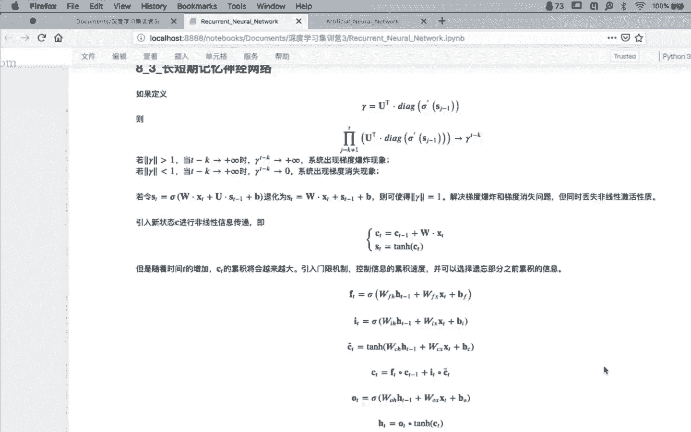

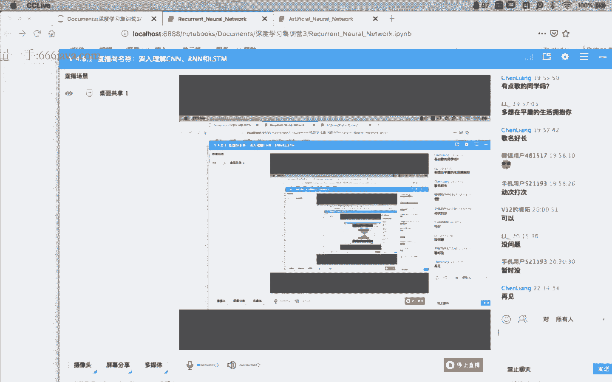

1.  **标量化理解**：从最底层的数学公式出发，明确每一个变量（标量/向量/矩阵）的含义。
2.  **图示化映射**：将公式转化为网络结构图，利用图示直观理解前向计算和反向传播中数据的流动与链式法则的应用。
3.  **向量化抽象**：将繁琐的标量计算提升为简洁的向量/矩阵运算，这是理解现代深度学习模型和框架实现的关键。
4.  **模型演进**：应用这套方法，我们看到了如何从全连接神经网络（FNN）自然地抽象出其核心结构，并通过添加循环连接得到循环神经网络（RN